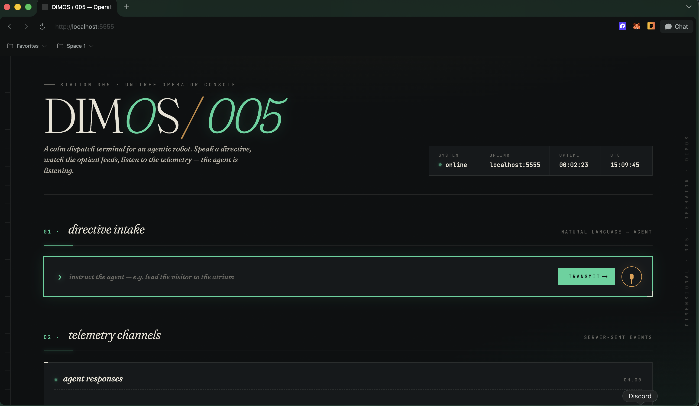

# Drop-in Guide

> **Drop a robot in any building. It learns the space by asking questions. It guides anyone through it — and waits if you fall behind.**

A hackathon project for **muShanghai 2026** (Dimensional Robot Hackathon, May 26–28). Adds the **interaction-intelligence layer** to [dimOS](https://github.com/dimensionalOS/dimos) — turning a Unitree Go2 into a zero-prep guide robot for unfamiliar buildings.

Submitted to the **Agents** track. Strong secondary fit for **Autonomy & Navigation**.

---

## The thesis

Existing embodied-AI guidance systems (AGIBOT's Guidance Assistance pillar, hospital wayfinders, museum guides) require **pre-mapped environments** and **operator-authored knowledge bases**. The deployment model is "send a system integrator, spend a week."

Drop-in Guide inverts that: **the robot authors its own scene memory from a 5-minute walkthrough**, asking the operator to verify proposals it generates from what it sees. Then it guides any visitor through the building using natural-language commands, with every navigation decision **legible and audit-grounded**.

The methodology is a direct port of the *operator-grounded verification* pattern from [Rehnova](#) — instead of the operator authoring 1,646 rows of structured data, the AI proposes them and the operator validates. Same principle in physical space.

---

## The three intelligences

| Layer | Provided by | Role |
|---|---|---|
| **Motion intelligence** | Unitree Go2 hardware + dimOS nav stack (A* + frontier exploration + PGO loop closure) | Locomotion, obstacle avoidance, low-level control |
| **Task intelligence** | dimOS skill runtime + Claude Sonnet 4.6 via MCP | Decides which skill to call when, manages dialogue state |
| **Interaction intelligence** ⭐ | **This project** | Generative priming dialogue + grounded narration + audit trail |

Borrowed framing from AGIBOT's own embodied-AI taxonomy; the interaction layer is where we add value.

---

## What's new vs. shipping dimOS

| Feature | dimOS provides | Drop-in Guide adds |
|---|---|---|
| Scene memory | `SpatialMemory` + `tag_location` + `query_tagged_location` | Generative priming workflow (robot proposes, operator verifies) |
| Nav decisions | `navigate_with_text` with 3-tier resolution | Grounded narration before every action; audit trace stream |
| Vision | Qwen-VL for object detection, `observe` returning raw frames | `describe_scene` — synchronous OpenAI Vision captioning that Claude can use directly |
| Audio | `OpenAITTSNode` + local `sounddevice` | (planned) `UnitreeSpeak` WebRTC bridge for onboard Go2 speaker |

---

## Demo arc (90 seconds)

| Sec | What happens |
|---|---|
| 0–10 | Operator: *"Let's learn this place."* → robot enters priming mode |
| 10–35 | Robot observes scene, proposes labels via `speak` ("I see a black bin to my right — call it a trash bin?"), operator confirms/corrects/skips, `tag_location` fires per confirm |
| 35–55 | Visitor: *"Take me to the trash bin."* → robot speaks grounding info ("Tagged 1 minute ago, confidence 0.91"), navigates |
| 55–75 | Robot pauses + speaks *"I'll wait for you"* if visitor falls behind (via `lead_to` + person tracking) |
| 75–90 | Robot: *"Here's the trash bin. Anything else?"* + Rerun audit panel shows full grounding trace |

---

## Architecture

```
┌─────────────────────────────────────────────────────────────┐
│  Drop-in Guide Blueprint                                    │
│  (forks unitree-go2-agentic, skips CUDA-only SecurityModule)│
└─────────────────────────────────────────────────────────────┘
       │
       ├── Claude Sonnet 4.6  ◀── via langchain-anthropic
       │   (the brain — decides which skill to call)
       │
       ├── MCP Server (19 tools available)
       │   ├── tag_location          ─┐
       │   ├── navigate_with_text     ├── from dimOS
       │   ├── speak, follow_person   │
       │   ├── execute_sport_command ─┘
       │   └── describe_scene  ◀── new (OpenAI Vision wrapper)
       │
       ├── SpatialMemory (ChromaDB + CLIP)
       ├── SceneCaptionSkill (OpenAI gpt-4o-mini Vision)
       └── unitree_go2 (perception + nav + connection)
```

---

## Operator console

Drop-in Guide ships with a dispatch terminal at **http://localhost:5555** the moment the daemon comes up. It's a calm directive-intake UI for the agent — type or speak a natural-language instruction, watch the agent's responses stream back in the telemetry channels.



Two intake modes:

- **Text directives** — type into the `directive intake` bar (e.g. *"lead the visitor to the atrium"*), hit TRANSMIT
- **Voice directives** — press the mic, speak; Whisper transcribes locally and pipes into the same `/human_input` LCM topic the text bar uses. Same agent loop, same skill graph

Telemetry channels stream agent responses, tool calls, and the audit trace as Server-Sent Events. The mic stays available whether or not you're in a directive — say *"wait"* mid-trip and the agent will pause before the next sentence finishes.

> All directives go through the **same Claude system prompt** that the WASD driver uses, so voice, text, and keypress paths produce identical agent behavior — including the calibrated-uncertainty checks and the `[SYSTEM ARRIVAL EVENT]` chain.

---

## Slides

A 6-slide deck for judges + dry-runs ships as a single self-contained HTML file:

**[`assets/drop_in_guide_slides.html`](assets/drop_in_guide_slides.html)**

Open it in any browser. The styling matches the operator-console screenshot above (dark background, mint accents, italic serif + monospace). To export PDF: open in Chrome/Safari, ⌘P → Save as PDF → choose "Default" page size and Background graphics ON.

Deck contents:
| # | Slide |
|---|---|
| 01 | Cover — Drop-in Guide, muShanghai 2026 / Agents track |
| 02 | The thesis — inverting the system-integrator model |
| 03 | The three intelligences — motion / task / interaction |
| 04 | 3-phase runtime — priming → guidance → reactive Q&A |
| 05 | The defining gesture — voice-triggered pause + auto-arrival wave |
| 06 | Submission summary — PR #2289, validated in replay + on Go2 |

---

## Setup

### Prerequisites
- Ubuntu 22.04/24.04 (or UTM VM on Apple Silicon)
- Python 3.10+
- A Unitree Go2 with dimOS-compatible firmware
- Anthropic API key (for Claude)
- OpenAI API key (for TTS + Vision)

### Install
```bash
git clone https://github.com/dimensionalOS/dimos.git
cd dimos
uv sync --extra all
uv pip install langchain-anthropic httpx[socks]
```

### Drop in our files
Copy two files into the dimOS tree:
- `dimos/experimental/scene_caption_skill.py`
- `dimos/experimental/drop_in_guide_speak.py` (optional, Go2-onboard speaker)
- `dimos/robot/unitree/go2/blueprints/agentic/drop_in_guide.py`

Regenerate blueprint registry:
```bash
uv run pytest dimos/robot/test_all_blueprints_generation.py
```

### Configure secrets
```bash
cat >> .env <<EOF
ANTHROPIC_API_KEY=sk-ant-...
OPENAI_API_KEY=sk-proj-...
EOF
```

### Run
```bash
dimos --robot-ip <GO2_IP> --viewer none run drop-in-guide --daemon
dimos agent-send "Let's learn this place."
```

---

## Network setup (venue-specific)

The Go2 hosts its own WiFi AP (e.g., `dimair14`) that **has no internet**. Two-network setup needed:
- **Mac:** dual-homed — WiFi to robot's AP for control, USB tether for Claude/OpenAI API
- **VM (if used):** bridged to robot's AP, with an SSH SOCKS5 tunnel through the Mac for outbound API calls

```bash
# On VM, open SOCKS5 tunnel through Mac:
ssh -D 1080 -fNT <mac-user>@<mac-ip-on-robot-network>
# Then in .env:
HTTPS_PROXY=socks5h://127.0.0.1:1080
```

---

## Known issues

- `tag_location` cold-starts ChromaDB embeddings on first call → 120s timeout under aarch64 emulation (UTM/QEMU). On bare-metal hardware it's <1s.
- `SpeakSkill` from `_common_agentic` plays through local sounddevice (Mac speakers via UTM forwarding). The Go2 onboard speaker requires the unwired `UnitreeSpeak` skill — bridge code at `dimos/experimental/drop_in_guide_speak.py` is written but not yet validated on hardware.
- Default agentic blueprints (`unitree-go2-agentic`, `-temporal-memory`) include `SecurityModule` which requires CUDA — broken on Apple Silicon. Drop-in Guide skips it via direct composition from `unitree_go2` base.

---

## Acknowledgments

- **Dimensional** for [dimOS](https://github.com/dimensionalOS/dimos) — the agentic OS that made this possible
- **AGIBOT** for productizing the embodied-AI categorization (motion/interaction/task) we borrowed
- The Drop-in Guide methodology owes its grounded-verification pattern to Rehnova's operator-priming approach (Cal.com 1,646-row expansion)

---

*Built in 48 hours at muShanghai 2026 by [Abraham Onoja](mailto:legendabrahamonoja@gmail.com) with [Claude Code](https://claude.com/claude-code) Opus 4.7 driving.*
