# Habitat scenes

Context for the 18 furnished environments used by the Habitat suites. Scene
descriptions combine the original asset inspection and the user's visual review.
Executable questions and reference answers live in the adjacent Python suites.

Suite filenames and headings use sequential names within each dataset. Original dataset
handles and stable question IDs are retained internally for loading and review
history. Each suite has a same-named JPEG showing a ceiling-cutaway orthographic
overview from the upper right (45-degree azimuth, 55-degree elevation), fitted
to its full projected footprint. Multi-level HM3D scenes include labeled
elevation slices in the same image; detected elevations are not a floor census.
These previews are capped at 1600 pixels wide and 75 KB each, and stored directly in Git through a scoped
`.gitattributes` exception so GitHub can display them without fetching from the
custom LFS server. Full-resolution PNG originals are retained locally.

### Dataset locations

| Family | Configuration / asset | Location override |
|---|---|---|
| HSSD | `hssd-hab.scene_dataset_config.json`, original `scenes/<id>.scene_instance.json` | `HSSD_DATASET_CONFIG` |
| HM3D examples | `hm3d_example_basis.scene_dataset_config.json` | `HM3D_DATASET_CONFIG` |
| HM3D annotated example | `hm3d_annotated_example_basis.scene_dataset_config.json` | `HM3D_ANNOTATED_DATASET_CONFIG` |
| ReplicaCAD | `replicaCAD.scene_dataset_config.json`, `configs/scenes/<id>.scene_instance.json` | `REPLICACAD_DATASET_CONFIG` |
| Habitat test apartment | `apartment_1.glb` with adjacent `apartment_1.navmesh`, dataset `default` | `HABITAT_TEST_SCENE`, optional `HABITAT_TEST_DATASET_CONFIG` |

The inspected HSSD root is `~/Documents/habitat-sim/data/hssd-hab/`.
ReplicaCAD and the test apartment were inspected under
`~/Documents/habitat-sim/data/versioned_data/{replica_cad_dataset,habitat_test_scenes}/`.
HM3D examples are under
`target/habitat/data/versioned_data/hm3d-0.2/hm3d/example/` in the project checkout.
Suite defaults use `target/habitat/data`; use the overrides for other installations.

### Geometry, navigation and viewing

- Habitat runtime coordinates are meters, Y-up; the horizontal plane is X/Z.
  ROS coordinates are `(-z, -x, y)` for Habitat `(x, y, z)`. Habitat yaw is not
  interchangeable with ROS yaw. HM3D dataset configs supply the source-axis
  transform (source up `[0,0,1]`, front `[0,1,0]`).
- HSSD descriptions refer to the **original furnished** variant. Uncluttered and
  articulated alternatives have different contents. Semantic polygons describe
  annotation zones, which can share one physically enclosed room. Human room
  interpretation takes precedence over raw annotation totals.
- Polygon areas include furniture-occupied floor; they are not navmesh areas.
  Measurements from visual assets include internal GLB node transforms, scene
  rotations and instance scales. Product-name dimensions are not necessarily
  transformed scene dimensions. Generic `foundIn` labels are not scene locations.
- The original HSSD scenes inspected here did not automatically load navmeshes.
  The review viewer rebuilds meshes in memory; a separate eval process still
  needs compatible navmesh preparation. Offline navigation inspection used
  static objects, radius 0.25 m and height 0.60 m. Region transitions are not
  necessarily physical doorways.
- HM3D/test scenes are textured scans: furniture and apparent door states are
  baked into the geometry. Scan holes are not reliable architectural openings.
  Navmesh islands do not establish room/story counts or reachability from a
  single spawn.
- ReplicaCAD layouts share an apartment family and should stay together in
  dataset splits. Their URDF furniture needs articulated-asset loading. Authored
  placements must be distinguished from physics-settled states.
- Initial authoring inspection used Habitat-Sim 0.3.3, a 1.30 m RGB camera and
  90-degree horizontal FOV. The eval robot camera defaults to 0.45 m. Higher
  viewpoints, free camera and cutaway views help human inspection but do not
  demonstrate robot visibility or traversal. Navmesh-derived viewer levels can
  include roof surfaces; treat them as detected elevations rather than a floor census.
- Attached garages belong to the indoor scene. Exterior openings can be viewed
  from indoors; balconies, driveways and other outdoor areas are not required
  exploration space. No complete live-agent coverage has been validated.

## HSSD scene 1

<!-- scene: hssd_102344193 -->

[Suite](hssd/hssd_scene_1.py) · [Open preview](hssd/hssd_scene_1.jpg)

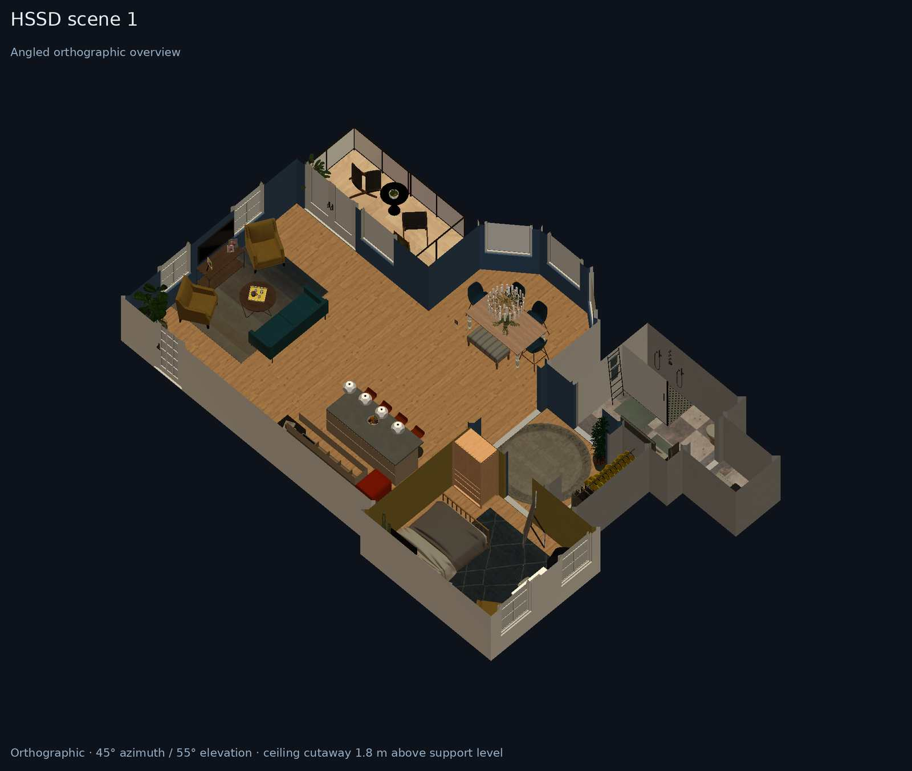

**Layout:** compact furnished home with a large living/dining space, kitchen,
bedroom, bathroom, hallway, closet and small laundry area. The bedroom has a
workstation; the living area includes a TV wall and dining furniture. An exterior
seating area is visible but is outside the interior exploration scope.

**Source:** scene handle `102344193`; stage `stages/102344193.glb` and
`semantics/scenes/102344193.semantic_config.json`. Inspected 95 rigid placements
across 77 templates, with 10 missing condensed-category matches.
Scene JSON SHA-256: `5e0fa388e8319655cea7ca0455ab4a60dfbc804eee9fa00fb39834bc54d54acf`.

**Interpretation:** a washer/dryer category also labels a dishwasher asset, so
product names and room context are needed. The selected interior starting point
is Habitat `(-5.5,0.124386,-3.0)`, or ROS `(3.0,5.5,0.124386)`; its navigability
was checked against an in-memory mesh, not a saved runtime mesh.

## HSSD scene 2

<!-- scene: hssd_102344403 -->

[Suite](hssd/hssd_scene_2.py) · [Open preview](hssd/hssd_scene_2.jpg)

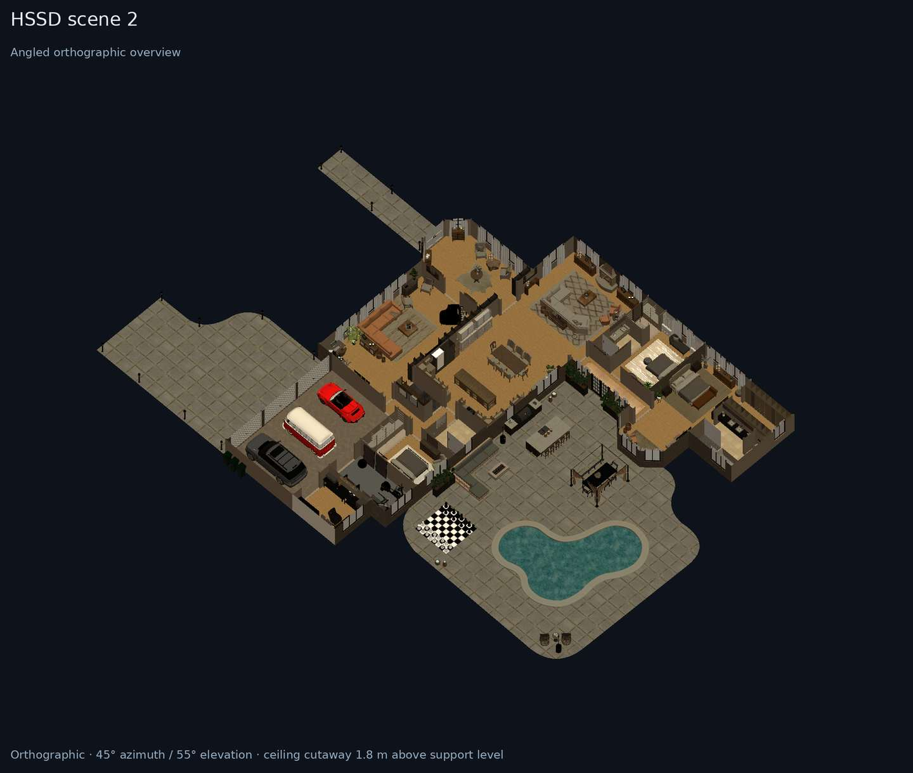

**Layout:** large home with three bedrooms, a lounge, a recreation room with a
grand piano, a living room, kitchen, gym, office, laundry and attached garage.
Other annotations include bathrooms, a separate toilet, halls and closets, plus
outdoor areas and a driveway. The garage contains vehicles; the gym includes
exercise equipment and weights.

**Source:** scene handle `102344403`; 423 static placements, 31 without condensed
category matches. Scene JSON SHA-256:
`bae4755410c665a8ac15ef32d4ef7d0e176b08e3091b9cd536f6be9770b9b2e1`.

**Interpretation:** grouped assets and misleading recreation-equipment labels
require visual interpretation. The lounge entrance facing the living room is
Habitat `(-6.3,0.159347,-3.713)`, equivalent to the selected ROS start
`(3.713,6.3,0.159347)`. Furniture approach regions matter for routes through this
large layout; object centers are generally not walkable goals.

## HSSD scene 3

<!-- scene: hssd_103997424_171030444 -->

[Suite](hssd/hssd_scene_3.py) · [Open preview](hssd/hssd_scene_3.jpg)

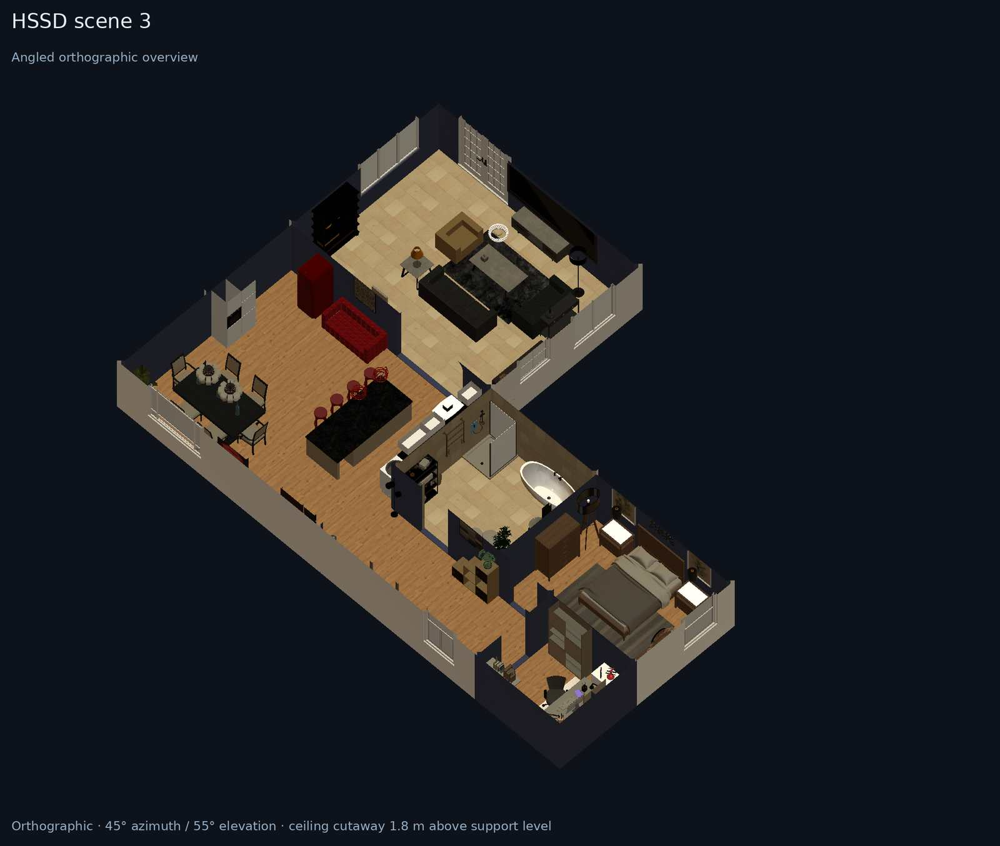

**Layout:** one-bedroom home with living, kitchen, dining, office and bathroom
spaces connected by a hallway. Distinctive features include adjacent red seating
and a refrigerator in the kitchen area, an office computer near the bedroom
wall, and a rectangular dining table.

**Source:** scene handle `103997424_171030444`; 173 static placements, seven
without condensed-category matches. Scene JSON SHA-256:
`d8006bef6224fa0798d832ce94418de8b5fc75c5d11ca20df86cee0c0ee48c7b`.

**Interpretation:** furniture placement in the kitchen is unusual but part of
this authored layout. The office-computer/bed relationship was reviewed visually;
sharing a region alone would not establish a wall relationship. Table dimensions
were measured from the transformed visual mesh, not nominal product labels.

## HSSD scene 4

<!-- scene: hssd_103997970_171031287 -->

[Suite](hssd/hssd_scene_4.py) · [Open preview](hssd/hssd_scene_4.jpg)

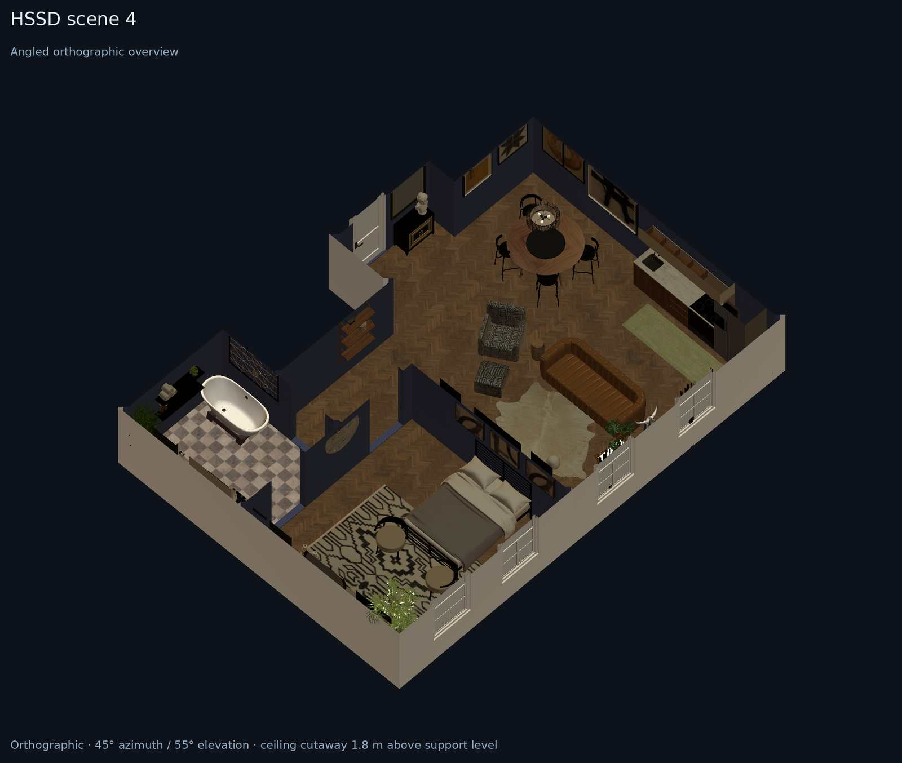

**Layout:** three physical rooms: a combined living/kitchen/dining room, a
bedroom and a bathroom. The open-plan room contains a round dining table and a
living-area television. Plants are distributed through the home.

**Source:** scene handle `103997970_171031287`; 77 static placements, five without
condensed-category matches. Scene JSON SHA-256:
`e62d4695d443bcbeae5e5b2d045b01cbfad2eb9a10f12a08d68018838d2273ec`.

**Interpretation:** five semantic zones are not five enclosed rooms. Kitchen
measurements refer to its zone within the shared space. One asset categorized
as a table is named wall art, illustrating why category totals are not an inventory.
TV room membership was resolved by human inspection rather than an ambiguous anchor.

## HSSD scene 5

<!-- scene: hssd_104348463_171513588 -->

[Suite](hssd/hssd_scene_5.py) · [Open preview](hssd/hssd_scene_5.jpg)

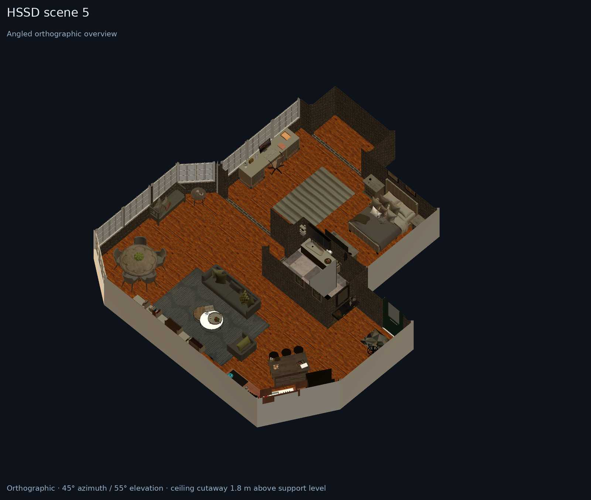

**Layout:** bedroom, bathroom and combined living/dining space, with a kitchen
zone and island seating. The bedroom includes a desktop computer. A round dining
table and kitchen-island chairs distinguish the shared social space.

**Source:** scene handle `104348463_171513588`; 164 static placements, nine without
condensed labels. Scene JSON SHA-256:
`0a57f033d22e6fa2af5ce63814690a035fabeebc2e048882c76349ee18ce674f`.

**Interpretation:** the user identified three physical rooms; the kitchen and
living polygons are zones, while the ambiguous `other room` annotation is not
automatically another enclosed room. Living/dining perimeter measurements exclude
the kitchen zone. A missing fridge category did not imply a missing appliance.

## HSSD scene 6

<!-- scene: hssd_106366410_174226806 -->

[Suite](hssd/hssd_scene_6.py) · [Open preview](hssd/hssd_scene_6.jpg)

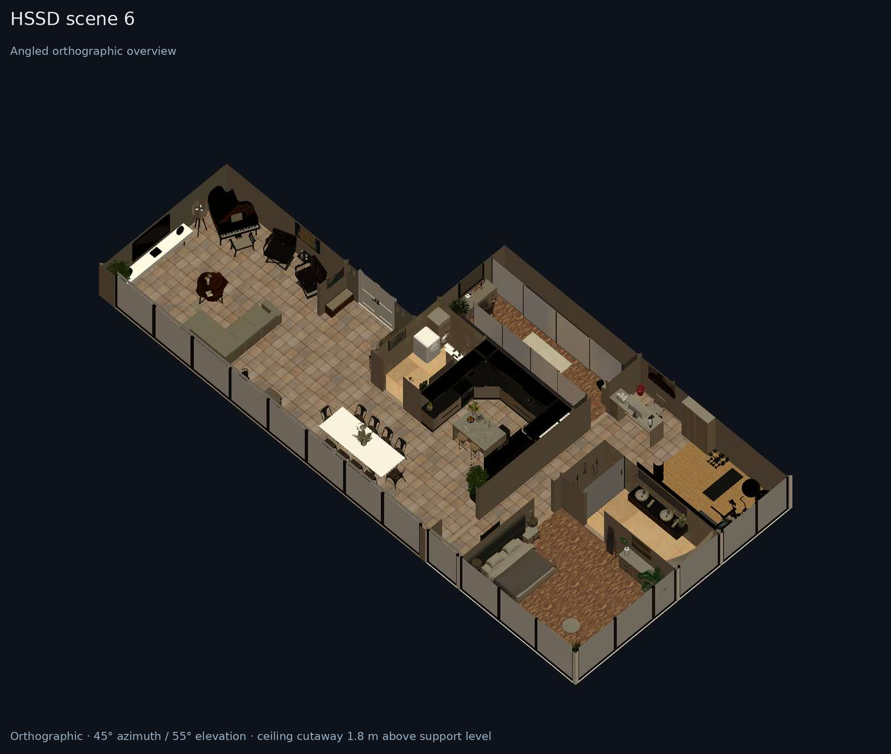

**Layout:** furnished home with a living-room grand piano, a kitchen and dining
space, laundry, bathroom, and a bedroom containing a sofa. The exercise and office
functions share a room in the user's interpretation; the red trash bin and
desktop computer are landmarks in that combined gym/office.

**Source:** scene handle `106366410_174226806`; 279 static placements, 19 without
condensed-category matches. Scene JSON SHA-256:
`c255c67406b6173ad677bc793aa137b142b6dfae61b163f0b3e00fe7e928876d`.

**Interpretation:** semantic `office` and `gym` polygons remain useful zone
references but should not imply separate physical rooms. The treadmill's category
is misleadingly `workstation`. Laundry includes a composite washer/dryer asset.
The bedroom sofa is the Ivy two-seater, anchor `(6.520,0,1.729)` in Habitat meters.
The bedroom's west doorway toward the hall is `(2.494610,0.150866,-1.863723)`;
nearby target-approach conventions can affect small walking-distance differences.

## HSSD scene 7

<!-- scene: hssd_106878858_174886965 -->

[Suite](hssd/hssd_scene_7.py) · [Open preview](hssd/hssd_scene_7.jpg)

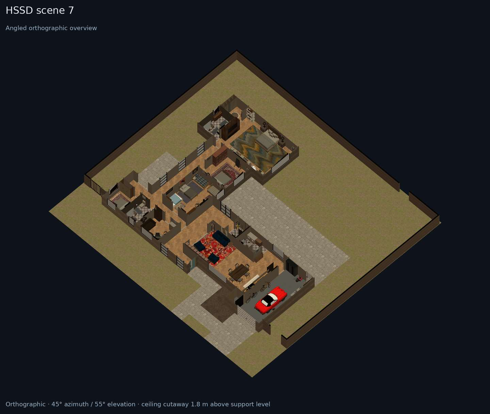

**Layout:** four-bedroom home with bathrooms, an office, living/kitchen/dining
spaces, utility/laundry areas and an attached garage. Distinctive landmarks include
the office laptop, a red garage car, a mower, and matching bathroom floor patterns.
An exterior passage can be observed from inside the home.

**Source:** scene handle `106878858_174886965`; 331 static placements, 19 without
condensed-category matches. Scene JSON SHA-256:
`cfdc40880c12686502e232571976004aea28f285d5625a4dc131b0c6c49b5758`.

**Interpretation:** bed-related category placements include grouped contents;
they do not directly count physical beds. The entrance-hall opening into the
living room is represented by Habitat `(-9.217360,0.158400,-4.237486)`. Dining and
one bedroom annotation are nearly tied in area. Outdoor annotations do not extend
the indoor exploration scope.

## HSSD scene 8

<!-- scene: hssd_107734110_175999914 -->

[Suite](hssd/hssd_scene_8.py) · [Open preview](hssd/hssd_scene_8.jpg)

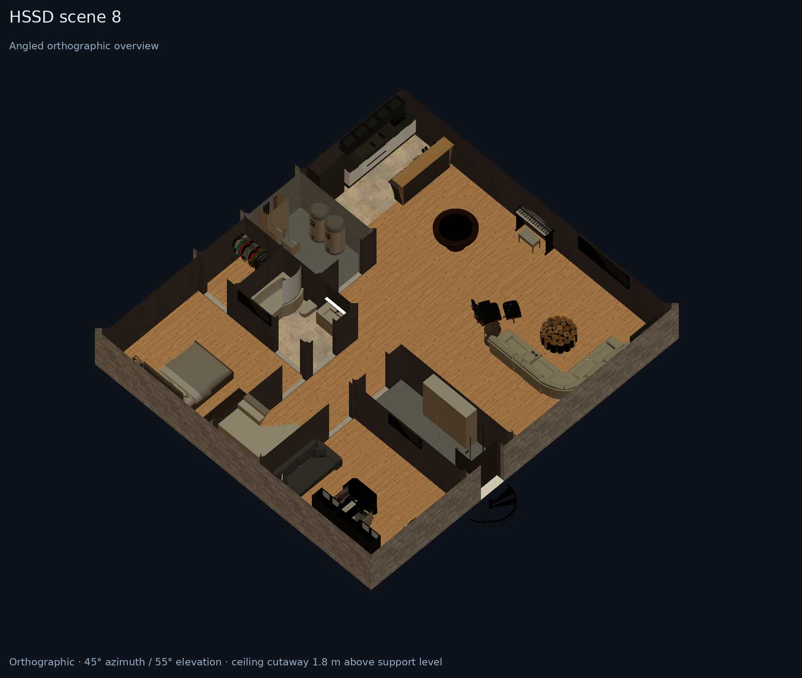

**Layout:** comparatively sparsely populated one-bedroom home with living room,
kitchen, office, utility room, bathroom, hallway and separate closet spaces.
The living room has a digital piano; the office contains a computer and sofa bed.

**Source:** scene handle `107734110_175999914`; 64 static placements, all matched
the condensed category table. Scene JSON SHA-256:
`fb75dfd21b852bc0ddb9751d8b721a36a4774da7187cea769754b1249cb8da0e`.

**Interpretation:** full category matching still does not ensure correct labels;
an actual refrigerator was found under a product name missed by the initial lookup.
Bedroom and office polygon areas are very close. The office's west-wall structural
opening can be measured separately from door leaves and furniture approach clearance.
The utility annotation is `utilityroom/toolroom`.

## HSSD scene 9

<!-- scene: hssd_108736851_177263586 -->

[Suite](hssd/hssd_scene_9.py) · [Open preview](hssd/hssd_scene_9.jpg)

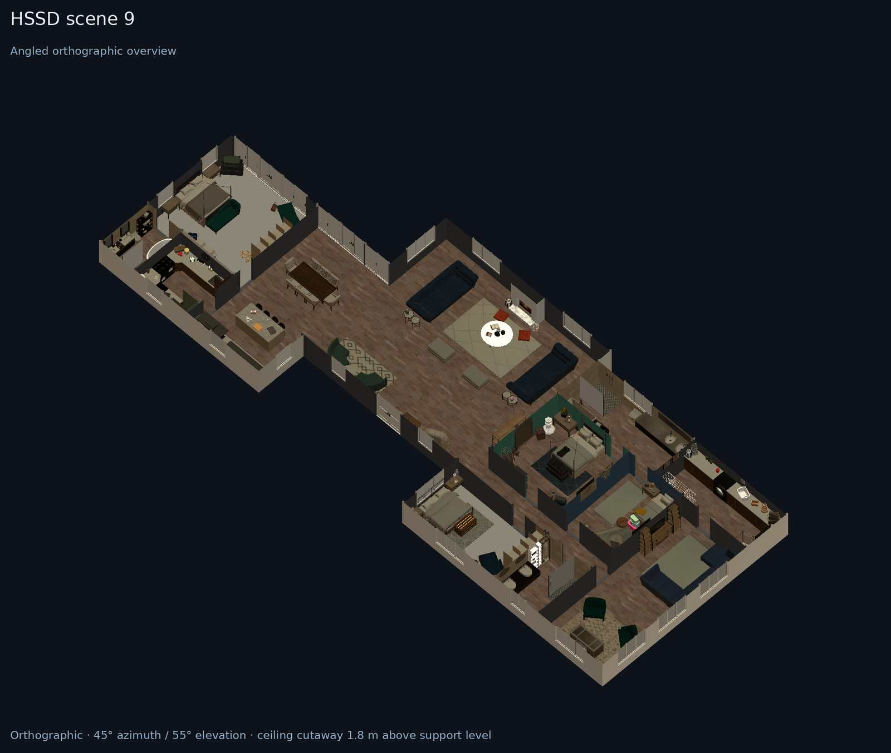

**Layout:** expansive living room, four bedrooms, multiple bathrooms, office,
laundry and dining spaces, and two distinct kitchen areas. The office includes
a television and sectional seating. The living room includes a blue sofa with
polygonal side tables and quarter-circle sofas around a round table.

**Source:** scene handle `108736851_177263586`; 268 static placements, 25 without
condensed categories. Scene JSON SHA-256:
`e4362d767cf866dda648d380331a322fef4363d300ec6581e8e298787e6ec0fe`.

**Interpretation:** distinguish the larger kitchen (`kitchen.001`) from the
smaller `kitchen`; neither is a unique "the kitchen." A chaise has a misleading
bed label. Some assets have substantial non-unit scales. The office hallway-facing
opening is Habitat `(10.973,0.177897,-0.232)`. Dining/larger-kitchen room-entry
distances are close; region-entry routes do not establish physical doorway counts.

## HSSD scene 10

<!-- scene: hssd_108736884_177263634 -->

[Suite](hssd/hssd_scene_10.py) · [Open preview](hssd/hssd_scene_10.jpg)

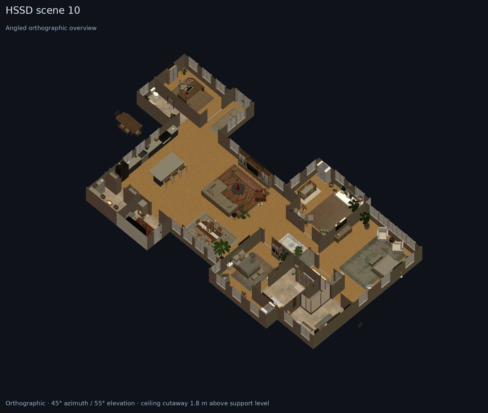

**Layout:** three-bedroom furnished home with an office, separate dining room,
large kitchen and living spaces, laundry, closets, bathrooms and a separate toilet
room. Landmarks include the living-room red potted plant, windows along the kitchen
counter, differently shaped bathtubs and bathroom greenery.

**Source:** scene handle `108736884_177263634`; 264 static placements, 35 without
condensed-category matches. Scene JSON SHA-256:
`2a3c726596c9548d2ff92d770a3dbc53ce03242df525bafeacf37e8b9232ac18`.

**Interpretation:** the living-room and largest-bedroom polygons are nearly equal
in area. A single `Dryer and Washing machine` placement is multi-object; placement
count is not physical-machine count. The office laptop is decomposed into parts.
Static refrigerator appearance and architectural doorway clearance require direct
geometry/visual interpretation, not inference from missing joint values.

## HM3D scene 1

<!-- scene: hm3d_CFVBbU9Rsyb -->

[Suite](hm3d/hm3d_scene_1.py) · [Open preview](hm3d/hm3d_scene_1.jpg)

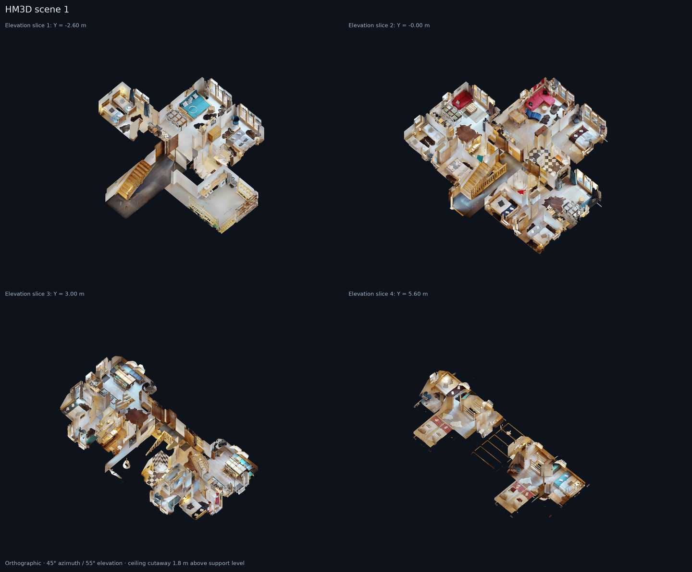

**Layout:** multi-level furnished residential scan, with repeated kitchen/living
areas, bedrooms, pitched wooden ceilings, skylights, stairs, loft-like sleeping
spaces and a utility/storage room. Distinctive landmarks include the red sofa
beneath framed trousers, blue-gray kitchen cabinetry, utility worktop/high chairs,
a stair-landing fire extinguisher and a bedroom with a blue armchair.

**Source:** full handle `00337-CFVBbU9Rsyb`, example dataset config. Its directory
contains `CFVBbU9Rsyb.basis.glb` and `.basis.navmesh`, without semantic sidecars.
Visual GLB SHA-256: `ba375c4ec3112293f93be9ab2560542be068e19a900e6fed30152e33ed40ca12`.
Navmesh SHA-256: `76425c0f86b5e5dc2eb6b2c226168d1d820729338952e1032b9a30817e753027`.

**Interpretation:** 374 mesh chunks are scan fragments, not object instances.
Habitat exposed no semantic objects/regions. The inspected navmesh had five islands
and approximately 186.37 m² navigable area. Authoring used 24 seeded positions
(seed 6), four headings each, at 400×300 resolution. Support elevations near
-2.60, 0 and +3.00 m identified utility, middle living and upper sleeping areas;
these observations are not a complete story census or proof of stair reachability.

## HM3D scene 2

<!-- scene: hm3d_GLAQ4DNUx5U -->

[Suite](hm3d/hm3d_scene_2.py) · [Open preview](hm3d/hm3d_scene_2.jpg)

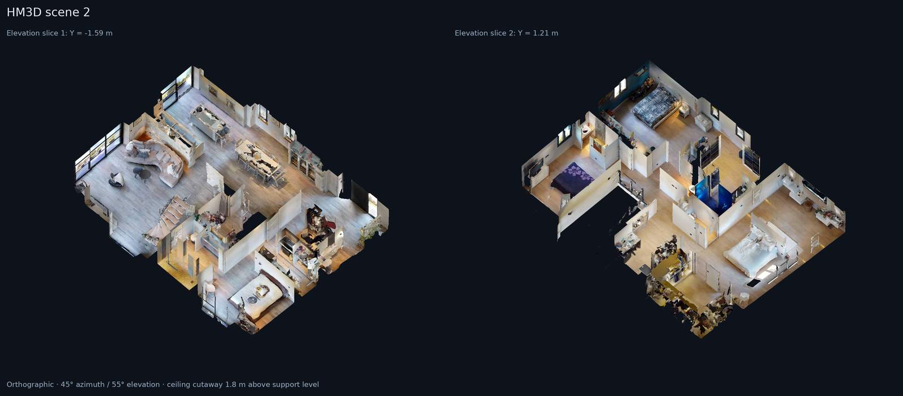

**Layout:** multi-level furnished home with bedrooms, bathrooms, utility/storage
spaces and a kitchen/living level. Landmarks include an exercise bike in a
bed-associated room, laundry equipment and a refrigerator in the utility area,
and a bedroom with a colorful graffiti-style mural. Scan holes occur in the mesh.

**Source:** full handle `00861-GLAQ4DNUx5U`, annotated example dataset config.
The directory contains visual and semantic GLBs, a navmesh and text annotations.
Visual SHA-256: `d2271f8fbf57aad34a2d1e03565d5bb9e85503e05eb5f8b9fd47fa66d8983577`.
Semantic-text SHA-256: `ef072ebe35073f3da4d319837046d76ce7aa7ccedc5aa2de2fd1e4d9c96766d3`.
Navmesh SHA-256: `924b0d1cb33ae5d91b3fab84aa17f43f9293baccd2571b8b840441cd88a4f87f`.

**Interpretation:** 907 semantic records reference region IDs 0–23; the runtime's
908 object slots and 25 region slots are not a physical inventory. Several loaded
semantic AABBs extend implausibly far or to the origin and are unsuitable as
furniture dimensions/centers. The inspected navmesh had five islands and about
125.91 m² navigable area. Supplemental inspection used 12 seeded positions
(seed 8), four headings each, at 400×300. The mural view was near Habitat
`(-8.86,1.21,0.81)`, yaw 180 degrees.

## HM3D scene 3

<!-- scene: hm3d_NBg5UqG3di3 -->

[Suite](hm3d/hm3d_scene_3.py) · [Open preview](hm3d/hm3d_scene_3.jpg)

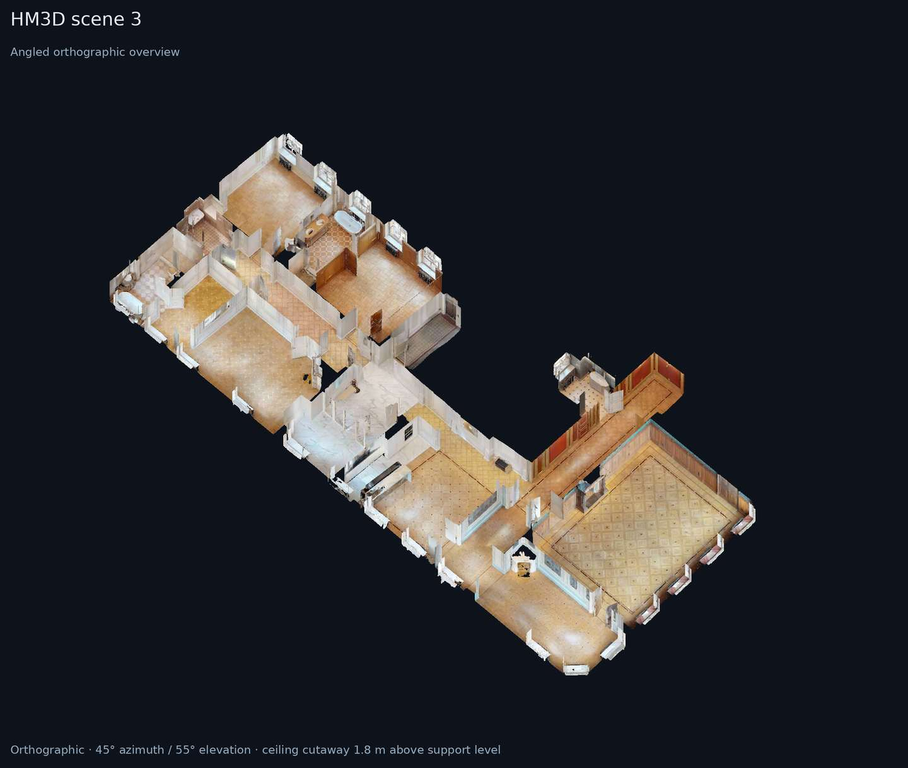

**Layout:** ornate, largely unfurnished interiors rather than a typical apartment:
white-paneled rooms and corridors, a red-and-gold vaulted corridor, a room with
blue patterned upper walls and wooden lower panels, and a pale-blue decorative
room with an arch. The blue-patterned room has a carved fireplace, radiators under
windows, an exposed wooden ceiling and angled parquet flooring.

**Source:** full handle `00770-NBg5UqG3di3`, example dataset config, visual GLB
and navmesh only. Visual SHA-256:
`86ef9e300ae48e67c13899ecb0c6038b6f1addaf282bf9ef22ee34eb36cd49b1`.
Navmesh SHA-256: `622bdeba91d1408b3ea3b70d9d1464d4e18bf5cd61f52f66368de35bdf67b515`.

**Interpretation:** no semantic objects or regions were available; 283 meshes are
scan fragments. The inspected navmesh had two islands and about 299.43 m²
navigable area. Sixteen seeded positions (seed 6), four headings each, were
rendered at 400×300; sampled floor Y was about 0.10685 m. Similar white rooms
need careful visual deduplication, and reflective door panels are ambiguous.

## ReplicaCAD scene 1

<!-- scene: replicacad_apt_1 -->

[Suite](replicacad/replicacad_scene_1.py) · [Open preview](replicacad/replicacad_scene_1.jpg)

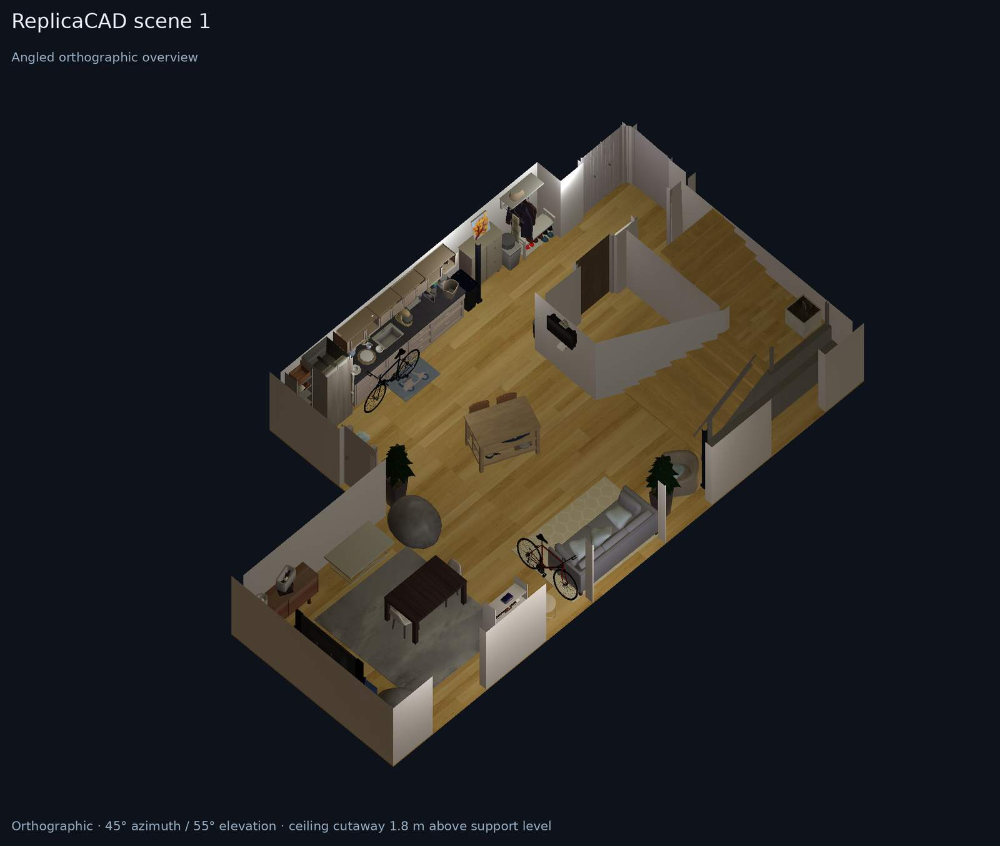

**Layout:** furnished apartment with sofa/TV furniture, bicycles, beanbag seats,
chairs, stools, plants and numerous small household objects. Kitchen/storage
furniture and a door are articulated assets. The sofa and TV stand are well
separated in this layout; do not transfer placements from `apt_5`.

**Source:** handle `apt_1`, stage `frl_apartment_stage`, scene
`configs/scenes/apt_1.scene_instance.json`. Inspected 120 rigid placements across
86 templates and six articulated instances: fridge, kitchen counter, cupboard,
chest of drawers, cabinet and door. Scene JSON SHA-256:
`6d718c52d7cdfc24e5c8ed1325e6633e821eeb33e29ec5fb7408f912347242ea`.

**Interpretation:** rigid placements are authored as dynamic, and initial joint
positions are not explicitly specified. Templates use the
`objects/frl_apartment_` prefix. Measured sofa/stand/bicycle templates have zero
COM offsets and no extra scale. The TV body and screen can represent one physical
TV; small/occluded objects need close views. Template shapes are not room polygons.

## ReplicaCAD scene 2

<!-- scene: replicacad_apt_5 -->

[Suite](replicacad/replicacad_scene_2.py) · [Open preview](replicacad/replicacad_scene_2.jpg)

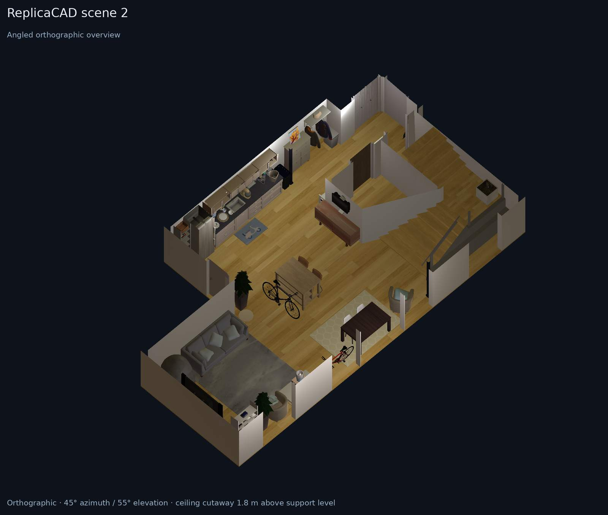

**Layout:** another arrangement of the same apartment family, with sofa/TV
furniture, bicycles, beanbags, seating, plants, bowls, books and an umbrella.
The sofa is substantially closer to the TV stand than in `apt_1`; furniture and
small-object inventories also differ.

**Source:** handle `apt_5`, stage `frl_apartment_stage`, scene
`configs/scenes/apt_5.scene_instance.json`. Inspected 113 rigid placements across
83 templates and six articulated instances. Scene JSON SHA-256:
`1ca21328100b7483098b0476e999915de6c8aa3a06811f1f7e9f563f00b15ca0`.

**Interpretation:** the authored rigid placements are dynamic; missing initial
joint poses do not establish door state. Visual measurements use scene-graph
transforms plus placement quaternion/translation. The two closer-object straight
line distances are similar enough that they should not be treated as an inferred
collision-free route order.

## ReplicaCAD scene 3

<!-- scene: replicacad_v3_sc1_staging_00 -->

[Suite](replicacad/replicacad_scene_3.py) · [Open preview](replicacad/replicacad_scene_3.jpg)

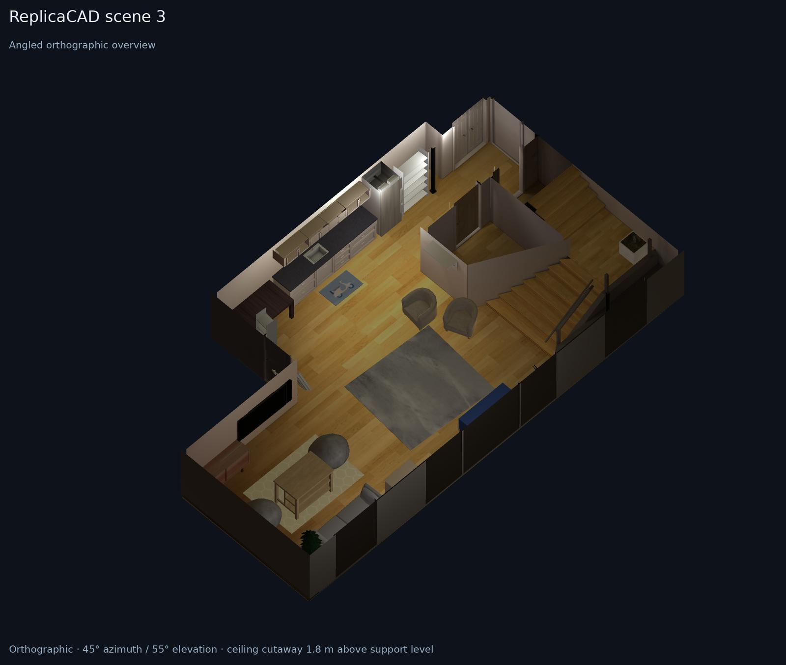

**Layout:** sparse staged apartment with sofa, TV stand, a bicycle, beanbags,
chairs and indoor plants, together with articulated kitchen/storage furniture.
This layout includes beanbags, unlike the selected sc2 arrangement.

**Source:** handle `v3_sc1_staging_00`, stage `Stage_v3_sc1_staging`, scene
`configs/scenes/v3_sc1_staging_00.scene_instance.json`. Inspected 20 rigid
placements across 18 templates and six articulated instances. Scene JSON SHA-256:
`e263378aece74b4dd5f260c4c372f5ad8eb2c5cbef9f8251c920e39c33547b67`.

**Interpretation:** rigid furniture is static, while articulated objects are
fixed-base/dynamic with no scene-specified initial joint positions. Measured
rigid assets use COM zero and no extra scale. Sparse rigid inventories do not by
themselves establish the contents of stage meshes or articulated furniture.

## ReplicaCAD scene 4

<!-- scene: replicacad_v3_sc2_staging_00 -->

[Suite](replicacad/replicacad_scene_4.py) · [Open preview](replicacad/replicacad_scene_4.jpg)

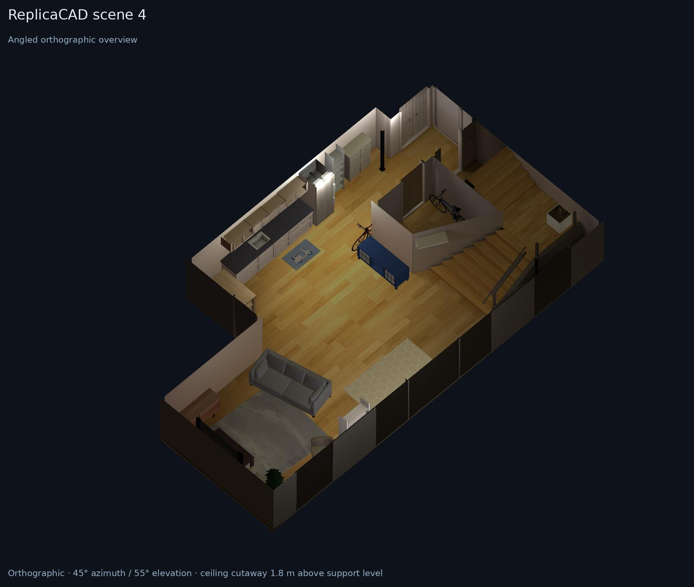

**Layout:** sparse staged apartment with sofa/TV furniture, two bicycles,
chairs and plants. There are no beanbag rigid placements. Furniture locations
and bicycle-to-sofa relationships differ from sc1.

**Source:** handle `v3_sc2_staging_00`, stage `Stage_v3_sc2_staging`, scene
`configs/scenes/v3_sc2_staging_00.scene_instance.json`. Inspected 19 rigid
placements across 18 templates and six articulated instances. Scene JSON SHA-256:
`1bd0f7de57c33dc11f266d9e8e04e168fd53b177232c57f75eaf36af0f20bf62`.

**Interpretation:** rigid furniture is static; fixed-base articulated objects are
dynamic with no explicit scene joint poses. Measured rigid templates have zero
COM offsets and no instance scaling. Scene-template IDs are author-side identifiers,
not visual labels a viewer or evaluated agent can distinguish automatically.

## Habitat test scene 1

<!-- scene: habitat_test_apartment_1 -->

[Suite](test/habitat_test_scene_1.py) · [Open preview](test/habitat_test_scene_1.jpg)

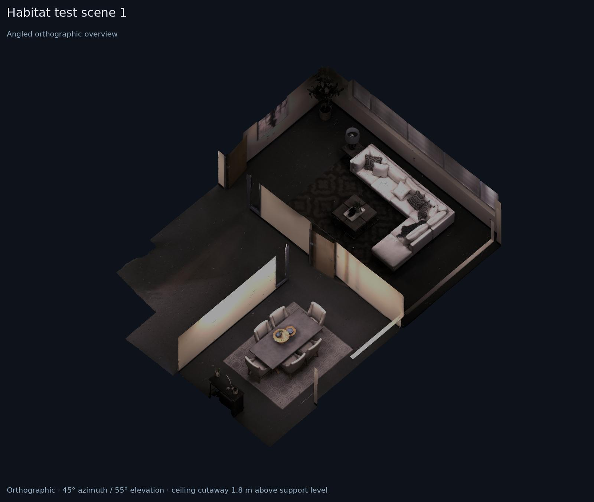

**Layout:** textured apartment scan with a furnished lounge, a separate dining
room and connecting corridor. Landmarks include an L-shaped sofa opposite a
wall-mounted TV and console, coffee table, potted tree, framed art, window blinds,
and a dining-room sideboard beneath a round mirror. The dining table carries a
tiered serving stand; black scan boundaries mark unmodeled space.

**Source:** Habitat Test Scenes `apartment_1.glb` and adjacent `.navmesh`, loaded
directly with dataset `default`. This is neither ReplicaCAD `apt_1` nor DimSim's
apartment. Visual SHA-256:
`c0b1314d1b948170e4110d1cf1a001c54ef02788092d49586ad73591b871785e`.
Navmesh SHA-256: `3694bf3909ca9668e0506b07e20d932c8243adb2654dffb4f27f8fa8bd9b3c4b`.

**Interpretation:** the scan has one textured mesh and two nodes, not an object
inventory. Habitat exposed no semantic objects/regions. The inspected navmesh
had two islands and about 52.88 m² navigable area. Ten seeded positions and four
headings per position were rendered at 480×360 with a 1.30 m camera. Tabletop
details need a higher viewpoint than the default robot camera; scan boundaries
should not be interpreted as extra rooms or universal object absence.
