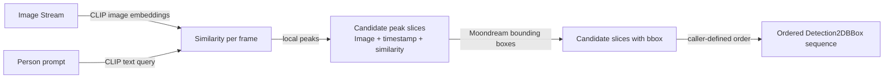
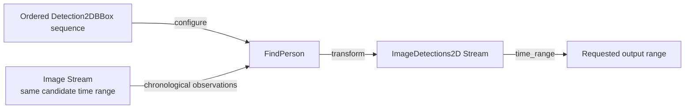
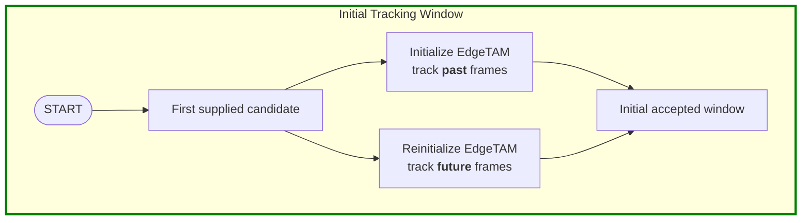
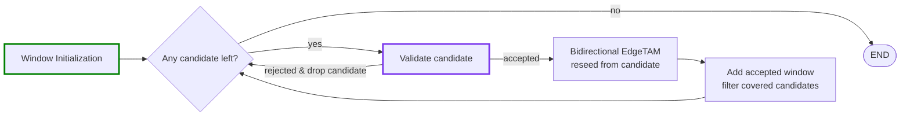
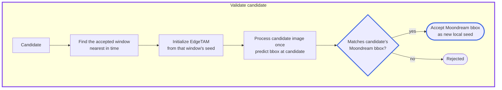

# FindPerson executable demo

This document is an executable `md-babel-py` demo. Edit the recording settings
below, then run the complete pipeline from the repository root:

```sh skip
uv run --extra misc md-babel-py run dimos/memory/find_person.md --no-cache --execution-timeout 600
```

The `misc` extra provides EdgeTAM's `sam2` runtime.

The demo treats the source recording as read-only. Every Stream produced by
`transform()`, `search()`, `order_by()`, or `time_range()` below is ephemeral:
the demo does not call `save()` and therefore creates no persistent intermediate
Stream to clean up.

## Inputs

```python session=find-person no-result
recording_path = "path_to_recording"
person_prompt = "Text prompt of your interest object"
rrd_path = "path_to_rrd"
```

### Initialization and imports

```python session=find-person no-result
from pathlib import Path
from time import perf_counter
from unittest.mock import patch

from dimos.memory.store.sqlite import SqliteStore
from dimos.msgs.geometry_msgs.PoseStamped import PoseStamped
from dimos.msgs.sensor_msgs.Image import Image
from dimos.msgs.sensor_msgs.PointCloud2 import PointCloud2

demo_started = perf_counter()
output_time_range: tuple[float, float] | None = None
rerun_output = Path(rrd_path)

store = SqliteStore(path=recording_path, must_exist=True)
images = store.stream("color_image", Image)
available_streams = set(store.list_streams())
lidar = store.stream("lidar", PointCloud2) if "lidar" in available_streams else None
odometry = store.stream("odom", PoseStamped) if "odom" in available_streams else None
```

## 1. Preparing candidates

Candidate preparation is a one-shot step performed before constructing `FindPerson`.
It converts a finite image stream and a person prompt into a static
`Sequence[Detection2DBBox]`. `FindPerson` preserves this sequence order; the caller
decides whether candidates are ordered by similarity, time, or another priority.



### Candidate preparation code

```python session=find-person no-result
from dimos.memory.embed import EmbedImages
from dimos.memory.transform import peaks
from dimos.models.embedding.clip import CLIPModel
from dimos.models.vl.moondream import MoondreamVlModel

image_count = images.count()

with CLIPModel() as clip:
    similarity_signal = (
        images
        .transform(EmbedImages(clip))  # Every image -> one CLIP embedding.
        .search(
            clip.embed_text(person_prompt),
            k=image_count,
        )  # Text query -> one similarity for every recorded frame.
        .order_by("ts")  # Similarity-ranked observations -> chronological signal.
        .to_list()
    )
    semantic_peaks = sorted(
        peaks(key=lambda obs: obs.similarity, distance=1.0)(iter(similarity_signal)),
        key=lambda obs: obs.similarity,  # Local maxima -> caller-defined inspection priority (obs.ts/obs.similarity).
        reverse=True,
    )
    similarity_samples = tuple(
        (sample.ts, sample.similarity) for sample in similarity_signal
    )  # Lightweight copy for Rerun.
    del similarity_signal

with MoondreamVlModel() as moondream:
    candidates = tuple(
        detection
        for peak in semantic_peaks
        for detection in moondream.query_detections(peak.data, person_prompt).detections
    )

if not candidates:
    raise LookupError("no person boxes found in the selected semantic peaks")
```

## 2. Using FindPerson

`FindPerson` accepts a finite, non-empty `Sequence[Detection2DBBox]`. It transforms
`Stream[Image]` into `Stream[ImageDetections2D]` while preserving each
observation's timestamp, pose, and tags.



### FindPerson execution code

```python session=find-person no-result
import dimos.memory.person_find as person_find_module
from dimos.memory.person_find import FindPerson

find_person = FindPerson(candidates)
```

<details>
<summary>Candidate tracing helpers for Rerun</summary>

```python session=find-person no-result
candidate_trace = []
candidate_rank = {id(candidate): rank for rank, candidate in enumerate(candidates)}
candidate_manager_type = person_find_module._CandidateManager
trace_state = {"current": None}

original_pop_candidate = candidate_manager_type.pop_candidate
original_matches_candidate = candidate_manager_type.matches_candidate
original_drop_by_window = candidate_manager_type.drop_by_window


def remaining_candidate_ranks(manager) -> list[int]:
    return [candidate_rank[id(candidate)] for candidate in manager.candidates]


def trace_pop_candidate(manager):
    candidate = original_pop_candidate(manager)
    trace_state["current"] = candidate_rank[id(candidate)]
    return candidate


def trace_matches_candidate(manager, candidate, prediction):
    matches = original_matches_candidate(manager, candidate, prediction)
    if not matches:
        candidate_trace.append(
            ("rejected", (), {"current": trace_state["current"]})
        )
        trace_state["current"] = None
    return matches


def trace_drop_by_window(manager, start: float, end: float) -> None:
    before = remaining_candidate_ranks(manager)
    current = trace_state["current"]
    original_drop_by_window(manager, start, end)
    remaining = remaining_candidate_ranks(manager)
    candidate_trace.append(
        (
            "window",
            remaining,
            {
                "current": current,
                "covered": [rank for rank in before if rank not in remaining],
                "start": start,
                "end": end,
            },
        )
    )
    trace_state["current"] = None
```

</details>

```python session=find-person no-result
with (
    patch.object(candidate_manager_type, "pop_candidate", trace_pop_candidate),
    patch.object(candidate_manager_type, "matches_candidate", trace_matches_candidate),
    patch.object(candidate_manager_type, "drop_by_window", trace_drop_by_window),
):
    tracked = (
        images
        .transform(find_person)
    )

    if output_time_range is not None:
        tracked = tracked.time_range(*output_time_range)  # Restrict only the returned output.

    results = tracked.to_list()

if not results:
    raise RuntimeError("FindPerson produced no output")
stream_start_ts = results[0].ts  # Shared zero point for Rerun time.
```

## 3. How EdgeTAM works in FindPerson

### 3.1 Bidirectional initialization

`FindPerson` uses the first supplied candidate as the initial seed. The candidate image
and Moondream bounding box initialize EdgeTAM. EdgeTAM first
tracks earlier frames in reverse chronological order, then initializes again from the
same seed and tracks later frames in chronological order. The two passes form the
initial accepted window, and their outputs are returned in chronological order.



> [!WARNING]
> The first candidate is trusted as the initialization seed because no earlier EdgeTAM
> state exists to validate it. If upstream ranking selects a false positive first, the
> initial window and the later validation anchored to it are unreliable.

### 3.2 Candidate filtering and expansion loop

Whenever an accepted window covers part of the recording, candidates within that time
interval are removed from further consideration. From those that remain, `FindPerson`
selects the first candidate in the caller-provided order.

After initialization, `FindPerson` repeatedly validates the next remaining candidate.
A rejected candidate is discarded. An accepted candidate starts another bidirectional
EdgeTAM window; the new window is added to the accepted windows and its covered
candidates are removed before the next iteration.



### 3.3 Candidate validation

The purple validation node above is expanded below. The accepted window nearest in
time provides its original seed. EdgeTAM is initialized from that seed, then receives
only the candidate image as its next frame. No intermediate frames are replayed. The
predicted bounding box is compared with the candidate's Moondream bounding box.

> [!NOTE]
> The nearest window's seed creates a fresh inference state only for candidate
> validation, and its EdgeTAM prediction is used only as IoU evidence. When that
> prediction agrees with the candidate's Moondream box, `FindPerson` reinitializes from
> the candidate image and Moondream box so the new bidirectional window has a local seed.
> Check the <font color="#4169E1">blue node</font> in below graph.



`FindPerson` preserves every input frame in the output stream. Frames where a person is
found contain the accepted detection; frames where no person is found remain present
with an empty `ImageDetections2D`. The output therefore stays aligned with the source
image stream instead of containing only frames with detections.

> [!WARNING]
> Candidates and the input image stream must cover the same recording time range so
> `FindPerson` can reach each candidate frame. Apply `time_range()` after `FindPerson`
> when only part of the output should be returned.

## 4. Rerun output

This final cell writes the `FindPerson` output as a Rerun recording. Rerun time starts
at `0.0s`, relative to the first image passed through `FindPerson`. The cell removes
only the previously configured output file, then replays each result image, EdgeTAM
mask, detected-person point cloud, and nearest robot pose. The complete LiDAR recording
is rendered once as a static world map; only the detected person changes over time.
Missing `odom` or `lidar` Streams are simply omitted.

The `CLIP similarity` view contains the complete similarity signal, the selected
semantic peaks, and every candidate at its own timestamp. Candidate rank is its index
in the caller-provided list, independent of timestamp order. Accepted candidates are
green, validation failures are red, and candidates covered by an accepted window are
yellow. The plot keeps numeric labels hidden to avoid covering the signal; hovering or
selecting a candidate point reveals its `rank: status` series name.

<details>
<summary>Rerun export code</summary>

```python session=find-person no-result
import rerun as rr
import rerun.blueprint as rrb

from dimos.mapping.voxels.module import VoxelMapTransformer
from dimos.msgs.geometry_msgs.Transform import Transform
from dimos.msgs.geometry_msgs.Vector3 import Vector3
from dimos.perception.detection.type.detection3d.pointcloud import Detection3DPC
from dimos.robot.unitree.go2.connection import GO2Connection
from dimos.visualization.rerun.init import rerun_init


# Reconstruct each candidate's final state from the demo-only trace captured above.
candidate_statuses = ["pending"] * len(candidates)
for event, _, details in candidate_trace:
    current_rank = details["current"]
    if event == "rejected":
        candidate_statuses[current_rank] = "rejected"
    elif event == "window":
        candidate_statuses[current_rank] = "accepted"
        for rank in details["covered"]:
            if rank != current_rank:
                candidate_statuses[rank] = "covered"

peak_by_ts = {peak.ts: peak for peak in semantic_peaks}
candidate_colors = {
    "accepted": [0, 200, 0],
    "rejected": [220, 50, 47],
    "covered": [255, 215, 0],
}

rerun_output.unlink(missing_ok=True)  # Do not mix this run with the previous .rrd.
rerun_init("find_person")
rr.save(str(rerun_output))
rr.send_blueprint(
    rrb.Blueprint(
        rrb.Vertical(
            rrb.Horizontal(
                rrb.Spatial2DView(
                    name="Image",
                    origin="find_person/image",
                ),
                rrb.Spatial3DView(
                    name="World",
                    origin="world",
                ),
            ),
            rrb.TimeSeriesView(
                name="CLIP similarity",
                origin="find_person/similarity",
                plot_legend=rrb.PlotLegend(visible=False),
            ),
        ),
        auto_views=False,
    )
)

try:
    rr.log("world", rr.ViewCoordinates.RIGHT_HAND_Z_UP, static=True)
    rr.log(
        "find_person/image",
        rr.AnnotationContext(
            [
                (0, "background", (0, 0, 0, 0)),
                (255, person_prompt, (0, 255, 0, 255)),
            ]
        ),
        static=True,
    )

    rr.log(
        "find_person/similarity/value",
        rr.SeriesLines(colors=[[70, 130, 180]], names=["CLIP similarity"]),
        static=True,
    )
    for sample_ts, similarity in similarity_samples:
        rr.set_time("time", duration=sample_ts - stream_start_ts)
        rr.log("find_person/similarity/value", rr.Scalars(similarity))

    rr.log(
        "find_person/similarity/semantic_peaks",
        rr.SeriesPoints(
            colors=[[160, 160, 160]],
            names=["semantic peak"],
            marker_sizes=[3.0],
        ),
        static=True,
    )
    for peak in semantic_peaks:
        rr.set_time("time", duration=peak.ts - stream_start_ts)
        rr.log("find_person/similarity/semantic_peaks", rr.Scalars(peak.similarity))

    for rank, (candidate, status) in enumerate(zip(candidates, candidate_statuses, strict=True)):
        if status == "pending":
            continue
        entity = f"find_person/similarity/candidates/{status}/{rank:03d}"
        rr.log(
            entity,
            rr.SeriesPoints(
                colors=[candidate_colors[status]],
                names=[f"{rank}: {status}"],
                marker_sizes=[7.0],
            ),
            static=True,
        )
        rr.set_time("time", duration=candidate.ts - stream_start_ts)
        rr.log(entity, rr.Scalars(peak_by_ts[candidate.ts].similarity))

    rr.reset_time()
    mask_visible = False
    target_visible = False
    for result in results:
        detections = result.data
        rr.set_time("time", duration=result.ts - stream_start_ts)
        rr.log("find_person/image", detections.image.to_rerun())

        mask = detections[0].mask if detections else None
        if mask is not None:
            rr.log(
                "find_person/image/mask",
                rr.SegmentationImage(mask, opacity=0.5),
            )
        elif mask_visible:
            rr.log("find_person/image/mask", rr.Clear(recursive=False))
        mask_visible = mask is not None

        image_pose = result.pose_stamped
        scan = (
            min(
                lidar.at(result.ts, tolerance=0.25),
                key=lambda obs: abs(obs.ts - result.ts),
                default=None,
            )
            if detections and lidar is not None and image_pose is not None
            else None
        )
        target = None
        if scan is not None and image_pose is not None:
            target = Detection3DPC.from_2d(
                detections[0],
                scan.data,
                GO2Connection.camera_info_static,
                -Transform(
                    translation=image_pose.position,
                    rotation=image_pose.orientation,
                    frame_id="world",
                    child_frame_id="camera_optical",
                    ts=result.ts,
                ),
            )
        if target is not None:
            rr.log(
                "world/lidar/detected",
                target.pointcloud.to_rerun(
                    mode="spheres", voxel_size=0.24, colors=[255, 255, 0]
                ),
            )
        elif target_visible:
            rr.log("world/lidar/detected", rr.Clear(recursive=True))
        target_visible = target is not None

        pose = (
            min(
                odometry.at(result.ts, tolerance=0.25),
                key=lambda obs: abs(obs.ts - result.ts),
                default=None,
            )
            if odometry is not None
            else None
        )
        if pose is not None:
            # Recorded odometry is the world -> base_link TF; base_link +X is forward.
            direction = pose.data.orientation.rotate_vector(Vector3(0.8, 0, 0))
            rr.log(
                "world/robot",
                rr.Arrows3D(
                    origins=[[pose.data.x, pose.data.y, pose.data.z]],
                    vectors=[direction.to_list()],
                    colors=[[255, 165, 0]],
                    radii=0.08,
                ),
            )

    if lidar is not None:
        lidar_map = lidar.transform(
            VoxelMapTransformer(emit_every=0, carve_columns=False)
        ).last()
        rr.log("world/lidar/history", lidar_map.data.to_rerun(mode="points"), static=True)
finally:
    rr.rerun_shutdown()  # Flush and close the .rrd.
    store.stop()

print(
    f"Wrote {len(results)} frames to {rerun_output} "
    f"in {perf_counter() - demo_started:.3f}s"
)
```

</details>

Open the generated `rerun_output` file in Rerun to inspect the tracked result.
