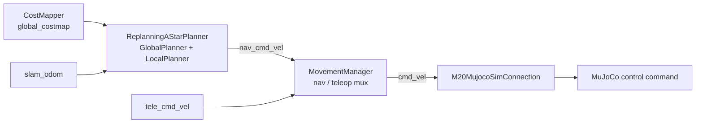
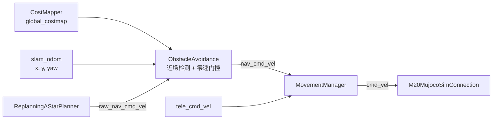
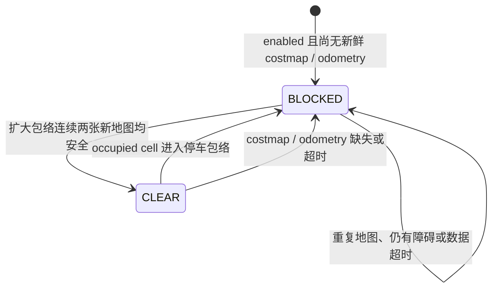

# M20 Simple Nav 独立停障 MVP 设计

**版本：** v1.6（wd/dimos/test 分阶段迁移版）
**日期：** 2026-07-22
**开发目录：** `/home/markus/work/dimos_m20`
**开发分支：** `wd/m20-mujoco-simulation@42e83165`
**迁移目标：** `melolong/wd/dimos/test@011f82ca`
**仿真蓝图：** `m20-simple-nav-sim` / `m20_simple_nav_sim`
**仿真配置：** `dimos/robot/deeprobotics/m20/config/mujoco_sim.yaml`
**实车配置：** `dimos/robot/deeprobotics/m20/config/m20_simple_nav.yaml`
**仓库文档：** `dimos/navigation/obstacle_avoidance/docs/m20_simple_nav_obstacle_avoidance_mvp.md`
**目标：** 暂不实施已冻结的 v2.1 速度规划与行为决策重构，在现有 MuJoCo 规划控制链路上实现一个独立、可开关、容易移除的自主导航近障停车模块，并完成自动化与 MuJoCo 仿真验证。

## 1. 本轮需求与执行约束

用户确认本轮工作按以下要求执行：

- 今晚直接使用 VM 的 `/home/markus/work/dimos_m20`。
- 直接基于当前 `wd/m20-mujoco-simulation` 分支设计、实现和测试。
- 第一版以快速验证为目标，避免复杂行为决策和规划控制重构。
- 先更新本设计文档，再修改运行代码。
- 模块必须在仿真中证明能够把自主导航命令置零，而不是只完成接口或单元测试。
- 保留当前规划、平滑、LocalPlanner、重规划、MovementManager 和 MuJoCo
  连接行为；现有流程能继续工作。
- 本轮不提交、不推送；只有实现和测试结果通过后再讨论 commit/PR。
- 不修改、暂存或删除 VM 中现有未跟踪周报
  `docs/development/m20-simple-nav-weekly-work-output-2026-07-13-to-2026-07-17.md`。

## 2. 结论

该方案合理且可实现，适合作为快速验证版本。

最小改动是在 MuJoCo 蓝图的 `ReplanningAStarPlanner` 与
`MovementManager` 之间增加
`ObstacleAvoidance`。模块只过滤自主导航速度：环境安全时原样透传
`Twist`，近场出现障碍、感知数据超时或输入不合法时输出严格的零
`Twist`。v1.4 不修改 A*、平滑、目标、路径输出或
`M20MujocoSimConnection`，但把 LocalPlanner 固定 3 m 的路径障碍检查升级为
命令速度相关的动态前视距离。

第一版只接入 `m20_simple_nav_sim`。真实 M20 的 `m20_simple_nav` 蓝图保持
不变，避免把仿真距离参数误用于实体机器人。

这个 MVP 是规划控制链路中的附加保护，不是功能安全认证的硬件急停。
真实机器人上线前仍需标定传感延迟、制动距离、机器人包络和误检率。

## 3. 基线核对

`MeloLong/dimos:wd/dimos/test@011f82ca` 仍存在于远端，但没有在 VM 中
单独 checkout。本轮不再以该历史分支作为实际开发目录，只保留其规划控制
职责划分作为参考。

实际基线是 `/home/markus/work/dimos_m20@42e83165`。该提交与
`origin/wd/m20-mujoco-simulation` 一致，并包含
`melolong/wd/m20-mujoco-simulation@1e1b2ea` 之后的 11 个本地/个人远端
提交，当前关系为 ahead 11、behind 0。因此无需先回退或合并 MeloLong
旧提交。

现有自主导航命令链路为：



现有 `LocalPlanner` 每 0.1 s 检查一次活动路径前方约 3 m 的 occupied cell。
发现障碍后会退出本地控制循环，并由 `GlobalPlanner` 立即触发完整重规划。
这一行为在本 MVP 中保持不变。

## 4. MVP 架构



插入位置选择在规划器与 `MovementManager` 之间，原因如下：

- 只保护自主导航，保持现有 teleop 优先级和取消目标行为不变。
- 停车零速位于 PController 最小速度逻辑之后，不会被 `0.2 m/s` 最低速度重新抬升。
- `M20MujocoSimConnection` 会把零 `Twist` 直接传给 MuJoCo 控制接口。
- 模块没有 goal、path 或 replan 输出，不能主动取消目标或触发重规划。

## 5. 模块职责与边界

### 5.1 负责

- 接收规划器原始自主导航速度。
- 使用最新 costmap 与里程计计算机器人坐标系中的近场障碍。
- 对前进和原地旋转命令执行通过或零速覆盖。
- 使用更大的恢复包络和连续新地图确认完成停车恢复滞回。
- 在状态切换时发布诊断状态并记录一次结构化日志。

### 5.2 不负责

- 不降低参考速度，只做原样透传或严格置零。
- 不重新规划，不等待重规划结果，不替换或清空路径。
- 不实现 `WAITING_FOR_CLEARANCE` 行为状态机。
- 不引入单独的计时线程或完整速度 watchdog。
- 不修改 PController 的速度死区、加减速或跟踪算法。
- 不过滤 teleop。需要全命令源保护时，应另行评审将门控器放到
  `MovementManager` 之后的方案。
- 不替代机器人硬件急停、碰撞条或底层安全控制器。

## 6. 接口设计

模块名：`ObstacleAvoidance`。

| 方向 | 端口 | 类型 | 用途 |
|---|---|---|---|
| In | `raw_nav_cmd_vel` | `Twist` | PController 生成的原始自主导航命令 |
| In | `global_costmap` | `OccupancyGrid` | CostMapper 最新二值代价地图 |
| In | `odometry` | `Odometry` | `slam_odom`，使用 `x`、`y`、`yaw` |
| Out | `nav_cmd_vel` | `Twist` | 送入 MovementManager 的安全命令 |
| Out | `obstacle_avoidance_active` | `Bool` | Rerun、日志和测试使用的停车状态 |

只使用已有消息、NumPy 和项目现有模块 API，不增加第三方依赖。

## 7. 检测算法

### 7.1 坐标变换

从 costmap 中选取 `CostValues.OCCUPIED` 的 cell center。设 cell 与机器人
位置之差为 `(dx, dy)`，机器人偏航角为 `yaw`，转换到机器人坐标系：

```text
x_robot =  cos(yaw) * dx + sin(yaw) * dy
y_robot = -sin(yaw) * dx + cos(yaw) * dy
```

实现时先按动态停车边界与机器人包络在机器人周围计算 grid
索引边界，只对这个近场切片执行 occupied 查询和坐标变换，不扫描整张全局
地图。切片边界必须裁剪到合法 grid 范围；空切片按输入无效处理。

当前 MuJoCo point cloud/costmap 的消息 frame 是 `world`，odometry 的消息
frame 是 `map`，但二者数值均直接使用同一套 MuJoCo 世界坐标。MVP 按现有
规划链路约定直接使用其二维坐标，不新增 TF 查询。这个仿真假设也是模块本轮
不得接入真实 M20 蓝图的原因之一。

当前 M20 PController 的自主导航命令只包含前向 `linear.x >= 0` 与
`angular.z`，第一版按这两个运动模式设计。

### 7.2 动态硬停车距离

v1.4 使用当前自主导航命令中的 `linear.x` 作为参考速度。它不是 odometry
实测速度；当前 Replanning A* 链路仍会在将 odometry 转成 `PoseStamped` 时
丢失 twist，闭环速度反馈属于后续架构升级。

```text
d_dynamic = max(
    stop_distance_m,
    abs(v_cmd) * reaction_time_s
    + abs(v_cmd)^2 / (2 * braking_deceleration_m_s2)
    + footprint_radius_m
    + stop_safety_margin_m
)
```

`stop_distance_m` 保留为最低检测边界。停车状态下再增加
`resume_distance_m - stop_distance_m`，保证动态距离也具有空间滞回。

### 7.3 轨迹扫掠包络

当 `linear.x > epsilon` 时，不再使用单个矩形或大圆。模块根据
`curvature = angular.z / linear.x` 采样当前指令对应的中心轨迹，并用机器人
膨胀包络扫掠：

- 直行命令形成胶囊形区域；
- 前进加转向形成沿圆弧弯曲的管状区域；
- 纯前进保持忽略机器人后方障碍；
- 组合转向使用旋转直径覆盖转向扫掠空间。

检测区域是沿轨迹采样点的机器人包络圆并集，不是一个覆盖整个侧后方的大圆。
任一 occupied cell 落入扫掠区域即判定阻断。

### 7.4 原地旋转

当线速度接近零且 `abs(angular.z) > epsilon` 时，检查旋转包络：

```text
distance_to_robot <= robot_rotation_diameter_m / 2 + lateral_margin_m
```

停车后的恢复半径再增加 `resume_distance_m - stop_distance_m`。

### 7.5 LocalPlanner 动态路径前视

LocalPlanner 继续沿最终控制路径使用机器人宽度生成 path mask，但检查距离由
固定 3 m 改为：

```text
lookahead_m = min(
    obstacle_lookahead_max_distance_m,
    max(
        obstacle_lookahead_min_distance_m,
        abs(last_command_linear_x_m_s) * obstacle_lookahead_time_s,
    ),
)
```

M20 MuJoCo 配置使用最短 2 m、3 s 前视和最大 6 m。其他蓝图继续使用
`min=3 m、time=0 s、max=3 m` 的兼容默认值，因此行为保持固定 3 m。

### 7.6 非预期自主运动

历史 PController 不输出后退或横移命令。第一版若收到明显的
`linear.x < 0` 或 `linear.y != 0`，应输出零并只在首次出现时告警，不能在
未经检测模型覆盖的方向盲目放行。teleop 不经过此模块。

## 8. 状态与时序



输出规则：

| 条件 | 输出 |
|---|---|
| 模块关闭 | 原样透传 `raw_nav_cmd_vel` |
| 输入命令本身为零 | 严格输出零 |
| 状态为 `CLEAR` 且数据新鲜 | 原样透传 |
| 状态为 `BLOCKED` | 严格输出 `Twist()` |
| 新 costmap 使状态由 CLEAR 变为 BLOCKED | 立即主动发布一次零命令 |

恢复必须同时满足：

- `clear_costmap_count` 张时间戳不同的新 costmap 在扩大后的恢复包络中均无障碍；
- costmap 与 odometry 仍在有效期内。

重复读取同一 `OccupancyGrid.ts` 不累计恢复次数。数据超时使用接收时记录的
`time.monotonic()`，不直接使用可能来自不同系统时钟的消息时间。

为了保持实现精简，不增加独立 watchdog 线程。规划器运动时约 10 Hz 发布
原始速度，每次命令回调都会检查输入新鲜度；LocalPlanner 正常退出时也会
主动发布零命令。`M20MujocoSimConnection` 本身没有实车连接的 deadman，
因此进程卡死或整条命令流中断不属于本 MVP 的保护范围。

## 9. 初始配置

建议在模块类中默认关闭，在 MuJoCo 验证配置中显式打开：

```yaml
obstacleavoidance:
  enabled: true

  # 均以 base_link / 里程计平面位置为参考，单位为米。
  stop_distance_m: 1.20
  resume_distance_m: 1.40
  reaction_time_s: 0.50
  braking_deceleration_m_s2: 0.60
  stop_safety_margin_m: 0.20
  lateral_margin_m: 0.10

  # 必须由不同时间戳的新 costmap 共同确认恢复。
  clear_costmap_count: 2

  # 超时期间非零自主导航命令一律变为零。
  costmap_timeout_s: 1.50
  odometry_timeout_s: 0.50

replanningastarplanner:
  obstacle_lookahead_min_distance_m: 2.0
  obstacle_lookahead_time_s: 3.0
  obstacle_lookahead_max_distance_m: 6.0
```

`stop_distance_m=1.20` 是仿真首轮值，不是实车定值。按当前
`0.55 m/s` 最大规划速度、约 `0.60 m` 旋转半径、2 Hz 最差地图周期和
`1.0 m/s^2` 假设减速度估算，它保留约 0.45 m 的感知、命令和制动余量。
实车值必须使用实测延迟和制动距离重新计算。

约束：

- `resume_distance_m > stop_distance_m > 0`
- `reaction_time_s >= 0`
- `braking_deceleration_m_s2 > 0`
- `stop_safety_margin_m >= 0`
- `lateral_margin_m >= 0`
- `clear_costmap_count >= 1`
- 两个 timeout 必须大于零
- `obstacle_lookahead_max_distance_m >= obstacle_lookahead_min_distance_m > 0`
- `obstacle_lookahead_time_s >= 0`

未知 cell 第一版不当作 occupied。否则全局地图边缘和未观测区域会造成大量
误停；数据整体陈旧或缺失则按 fail-safe 规则停车。

仿真点云保持 2 Hz，但原配置的 RayTracer `global_emit_every: 10` 只会约每
5 秒产生一张 global map/costmap，不满足停车时效。本轮为仿真蓝图单独设置
`global_emit_every: 1`，使 costmap 约为 2 Hz；真实 M20 蓝图继续使用 `10`。
`costmap_timeout_s: 1.50` 允许最多约三个预期帧间隔，超过后停车。

## 10. 蓝图接线

必须把规划器原输出重命名，避免它绕过停障模块直接连接 MovementManager：

```python
ReplanningAStarPlanner.blueprint(
    robot_width=_go1_sim_clearance * 2,
    robot_rotation_diameter=_go1_sim_clearance * 2,
    **M20_SIM_PLANNER_CONFIG,
).remappings(
    [
        (ReplanningAStarPlanner, "odometry", "dimos/slam_odom"),
        (ReplanningAStarPlanner, "nav_cmd_vel", "raw_nav_cmd_vel"),
    ]
),
ObstacleAvoidance.blueprint(
    **obstacle_avoidance_config,
).remappings(
    [(ObstacleAvoidance, "odometry", "dimos/slam_odom")]
),
MovementManager.blueprint(),
```

`ObstacleAvoidance.raw_nav_cmd_vel` 与重命名后的规划器输出同名；模块的
`nav_cmd_vel` 再连接 MovementManager。蓝图测试必须确认最终只有这一条自主
速度链路。

现有 `mujoco_sim.yaml` 加入 `obstacleavoidance` 段。扩展
`_load_m20_mujoco_sim_config()`，使用 `yaml.safe_load` 读取并通过
`ObstacleAvoidanceConfig` 校验后传给模块。不扩展全局配置加载框架。

只在 `m20_simple_nav_sim` 中加入模块和速度端口重映射。真实机器人
`m20_simple_nav` 的模块列表和 `nav_cmd_vel` 接线本轮不改。

## 11. 与现有重规划的关系

独立停障模块不会触发重规划，但也不能阻止旧 LocalPlanner 触发重规划：

```text
近场 occupied cell
  ├─ ObstacleAvoidance：把自主速度立即置零
  └─ LocalPlanner：按 2-6 m 动态路径前视检查退出，并请求 GlobalPlanner 重规划
```

因此第一版的准确语义是“先确保执行命令为零，再允许旧架构按原逻辑处理”。
它不是“停车等待且永久保留原路径”。后者必须改造 LocalPlanner 的退出逻辑、
增加 `WAITING_FOR_CLEARANCE` 和独立 `replan_requested`，属于已冻结 v2.1
方案的后续工作。

这个限制不会妨碍验证以下关键点：

- 零速门控是否可靠；
- 近场检测与恢复滞回是否稳定；
- 零速是否会被 PController 最低速度覆盖；
- costmap 频率和动态障碍残影对停车行为的影响。

## 12. 实施文件范围

实现时建议只改以下内容：

```text
dimos/navigation/obstacle_avoidance/module.py
dimos/navigation/obstacle_avoidance/test_module.py
dimos/navigation/replanning_a_star/path_clearance.py
dimos/navigation/replanning_a_star/local_planner.py
dimos/navigation/replanning_a_star/global_planner.py
dimos/navigation/replanning_a_star/module.py
dimos/navigation/replanning_a_star/test_path_clearance_dynamic.py
dimos/robot/all_blueprints.py
dimos/robot/deeprobotics/m20/nav/m20_simple_nav.py
dimos/robot/deeprobotics/m20/config/mujoco_sim.yaml
dimos/robot/deeprobotics/m20/nav/test_m20_simple_nav_sim.py
```

不修改：

```text
replanning_a_star/controllers.py
movement_manager/movement_manager.py
m20/connection.py
```

## 13. 验证计划

### 13.1 单元测试

1. 模块关闭时命令逐字段原样透传；新鲜空地图下前向命令正常透传。
2. 前向、旋转以及前进加旋转的组合命令分别使用对应检测包络。
3. 后方障碍、横向走廊外障碍和 CLEAR 状态下超过停车距离的障碍不误停。
4. occupied cell 进入前向或旋转包络后立即输出严格零 `Twist`。
5. UNKNOWN cell 不按 occupied 处理；整体感知缺失或超时仍 fail closed。
6. 停车后在动态停车边界上增加 `0.20 m` 滞回区，区内障碍继续维持 BLOCKED。
7. 恢复必须连续收到两张时间戳不同的新 clear costmap；重复时间戳不计数。
8. costmap 缺失、odometry 缺失、两类输入超时和机器人位于地图外均停车。
9. NaN/Inf、后退和横移自主命令按第一版未支持运动策略停车。
10. 输入零命令在 BLOCKED 状态下仍保持逐字段精确零。
11. `obstacle_avoidance_active` 只在 CLEAR/BLOCKED 状态转换时发布。
12. 机器人 yaw 旋转后的前向包络仍在机器人坐标系中正确检测。
13. 动态停车距离正确包含命令速度、反应时间、制动距离、机器人包络和余量。
14. 弧线上的障碍被扫掠包络命中，弧线外障碍不误停。
15. 路径前视遵守最短距离、3 s 速度前视和最大距离，并在距离变化时重建 mask。

### 13.2 蓝图测试

- 配置段能被 YAML 加载并通过 Pydantic 校验。
- `raw_nav_cmd_vel -> ObstacleAvoidance -> nav_cmd_vel` 连接唯一。
- `tele_cmd_vel -> MovementManager` 链路未改变。
- `ObstacleAvoidance` 只存在于仿真蓝图，不进入真实 M20 蓝图。
- 关闭模块时仿真命令逐字段透传。

### 13.3 MuJoCo 验证

1. 保持当前 `pointcloud_fps: 2.0`，仿真 RayTracer 使用
   `global_emit_every: 1`，在约 2 Hz costmap 下验证。
2. 先执行确定性在环测试：通过实际 `/raw_nav_cmd_vel` 命令链驱动 MuJoCo，
   再向实际 `/global_costmap` 通道注入机器人前方 `0.8 m` 的 occupied cell。
3. 验证 `obstacle_avoidance_active=true`，`nav_cmd_vel` 与 `cmd_vel` 同时变为零。
4. 连续发布 clear costmap，验证两张新地图确认后恢复原始命令并继续移动。
5. 使用现有移动人形障碍补充自然交会测试；路线没有形成近距离交会时，只记录
   场景结果，不把“未触发停车”误判为模块通过或失败。
6. 人为冻结或停止 costmap 输入，验证 1.5 s 超时后非零自主命令不能通过。
7. 关闭模块重复同一场景，确认旧规划、重规划和控制行为未被改变。
8. 单独验证 teleop 仍按 MovementManager 原逻辑工作，并在报告中明确它不受
   本 MVP 保护。

5 Hz 与 10 Hz 点云频率属于后续性能对比，不作为今晚 MVP 通过的前置条件。

建议记录：`raw_nav_cmd_vel`、`nav_cmd_vel`、`cmd_vel`、
`obstacle_avoidance_active`、`global_costmap`、`slam_odom` 和活动 path。

## 14. 验收标准

- 阻断状态下所有自主导航输出均为精确零，不出现 `0.2 m/s` 回弹。
- 障碍进入停车包络后一个控制周期内发布零命令。
- 重复 costmap 不会提前恢复。
- stale costmap / odometry 不允许非零自主速度通过。
- 恢复过程无 CLEAR/BLOCKED 高频抖动。
- 模块不发布 goal、path、stop_movement 或 replan 事件。
- `ObstacleAvoidance` 不进入真实 M20 蓝图。
- `enabled: false` 时不改变现有 MuJoCo 自主命令。
- 自动化测试通过，并完成现有 2 Hz 配置下的 MuJoCo 在环 occupied-cell
  停车与恢复验证。

## 15. 今晚实施顺序

1. 保持 `/home/markus/work/dimos_m20@wd/m20-mujoco-simulation`，不切换目录。
2. 实现 `ObstacleAvoidance` 和纯算法/模块单元测试。
3. 在 `m20_simple_nav_sim` 中接线，并从 `mujoco_sim.yaml` 加载配置。
4. 运行格式检查、单元测试和蓝图测试。
5. 启动 `m20-simple-nav-sim`，执行 2 Hz 动态障碍停车与恢复验证。
6. 记录门控状态、原始/安全速度、机器人与障碍距离及恢复行为。
7. 根据证据微调仿真默认值；测试失败则继续修复，不提交半成品。
8. 本轮完成后报告改动和测试结果，再由用户决定 commit、push 和 PR。

## 16. 本轮实施与验证结果

### 16.1 实现结果

- 新增 `ObstacleAvoidance`，只过滤仿真自主导航速度。
- 规划器输出重映射为 `raw_nav_cmd_vel`，模块输出保持 `nav_cmd_vel`，不存在
  绕过门控器直达 MovementManager 的第二条链路。
- 模块使用最新 costmap、odometry、动态制动距离、轨迹扫掠包络和旋转圆形包络
  进行判定。
- STOP 状态在动态停车边界上增加 `0.20 m` 空间滞回，并要求两张时间戳不同的
  clear costmap。
- stale costmap/odometry 和当前控制器未覆盖的后退/横移自主命令 fail closed。
- 真实 M20 蓝图不包含该模块，RayTracer 仍使用 `global_emit_every: 10`。
- MuJoCo 蓝图使用 `global_emit_every: 1`，实测 global costmap 约
  `1.58-1.98 Hz`，正常最大帧间隔约 `1.03 s`，低于 `1.50 s` timeout。

### 16.2 自动化验证

```text
Ruff format/check: passed
git diff --check: passed
blueprint generated-file consistency (CI mode): 1 passed
renamed module + M20 simulation blueprint tests: 32 passed
expanded non-LFS control/planner/blueprint set: 44 passed
```

扩展集合另外有 3 个既有 `test_goal_validator.py` 用例在 setup 阶段中断；完整
Replanning A* 数据型集合中共有 8 个 setup 仍无法运行，原因是 VM 缺少
`https://lfs.dimensionalos.com` 凭据，无法下载
`occupancy_simple.npy.tar.gz`。本次新增测试不依赖该 LFS 数据，相关模块、完整
`m20-simple-nav-sim` 蓝图构建和不依赖 LFS 的规划回归均已通过。

### 16.3 MuJoCo 在环验证

最终确定性测试使用实际 `M20MujocoSimConnection`、`MovementManager` 和
`ObstacleAvoidance` 组成在环控制链路。costmap 以约 2 Hz 持续更新，通过
同一输入通道确定性注入 occupied cell；测试期间没有 stale-costmap 状态转换。

线性测试使用 `0.55 m/s` 原始自主命令，连续执行 4 个停车/恢复周期：

| 指标 | 周期 1 | 周期 2 | 周期 3 | 周期 4 | 汇总 |
|---|---:|---:|---:|---:|---:|
| Clear 阶段移动 | `0.303 m` | `0.414 m` | `0.424 m` | `0.410 m` | 平均 `0.388 m` |
| 阻断后惯性位移 | `0.035 m` | `0.027 m` | `0.025 m` | `0.047 m` | 最大 `0.047 m` |
| 阻断命令精确零 | 16/16 | 16/16 | 16/16 | 16/16 | 64/64 |
| Clear 恢复后移动 | `0.345 m` | `0.323 m` | `0.318 m` | `0.332 m` | 平均 `0.330 m` |

旋转测试使用 `0.60 rad/s` 原始转向命令：

| 阶段 | 偏航变化 | 命令结果 |
|---|---:|---|
| 阻断前正常旋转 | `0.345 rad` | 非零命令正常透传 |
| 0.4 m occupied 进入旋转包络 | `0.027 rad` | 16/16 阻断命令精确零 |
| 两张新 clear map 后恢复 | `0.359 rad` | 转向命令恢复透传 |

整个扩展在环测试记录到安全命令和最终命令各 196 个样本。4 次线性 STOP 与
1 次旋转 STOP 均由 `occupied cell in near-field envelope` 触发；每次 STOP
均在两张新 clear costmap 后解除，没有 timeout 误触发或状态抖动。阻断后的
少量位移/偏航来自 MuJoCo 机器人动力学惯性，不是非零命令泄漏。

自然移动人形场景另运行 45 秒，但该次规划路线与行人路线没有形成近距离交会，
最小距离约 `3.96 m`，因此没有触发停车。该场景仅证明正常 clear 状态不会误停，
不作为动态行人停车成功证据。

### 16.4 验证结论

- `ObstacleAvoidance` 的重命名已覆盖类名、配置类、包路径、YAML 段、生成模块
  注册键、诊断端口、蓝图和测试，不保留旧运行时名称。
- 前向停车、旋转停车、空间滞回、两张新地图恢复和精确零速门控在重复 MuJoCo
  测试中表现稳定；本 MVP 达到仿真快速验证目标。
- 单元测试覆盖了误停边界、UNKNOWN、输入缺失/陈旧、地图外定位和非法命令，
  当前 fail-closed 边界比首版验证更完整。
- `0.047 m` 是本次 MuJoCo 工况的最大停车后惯性位移，不能直接外推为真实 M20
  的制动距离或安全余量。实车接入仍需测量感知周期、控制延迟和实际制动距离。
- 随机移动行人没有形成交会，因此当前证据证明的是确定性 occupied-cell 停车，
  不是完整动态避障。模块仍不负责绕障、等待行为或重规划决策。

### 16.5 v1.4 动态前视升级验证

v1.4 新增以下实现：

- ObstacleAvoidance 硬停车距离包含命令速度、反应时间、制动距离、机器人包络
  半径和安全余量。
- 直行使用胶囊形包络，前进加转向使用弧形扫掠包络，纯旋转继续使用圆形包络。
- LocalPlanner 路径前视由固定 3 m 改为命令速度相关的 2-6 m；其他蓝图通过
  默认参数保持固定 3 m。
- 本轮仍使用 global costmap。只有建立带近期传感器窗口和障碍清除策略的真正
  local costmap 后，才切换近场安全数据源。

自动化验证：

```text
Ruff format/check: passed
git diff --check: passed
blueprint generated-file consistency (CI mode): 1 passed
focused dynamic geometry/config tests: 43 passed
expanded non-LFS control/planner/blueprint tests: 55 passed
```

升级版 MuJoCo 脚本完整运行两次，每次包含 4 个低速直行周期、1 个动态距离
周期、1 个弧线周期和1个纯旋转周期：

| 场景 | 两次运行结果 | 阻断后最大动力学运动 |
|---|---|---:|
| `0.55 m/s`、前方 `0.8 m`，共 8 周期 | 128/128 阻断命令精确零 | 平移 `0.057 m` |
| `1.0 m/s`、前方 `1.8 m` 动态边界 | 32/32 阻断命令精确零 | 平移 `0.105 m` |
| `1.0 m/s + 1.0 rad/s` 弧线障碍 | 32/32 阻断命令精确零 | 平移 `0.099 m`，偏航 `0.134 rad` |
| `0.60 rad/s` 纯旋转障碍 | 32/32 阻断命令精确零 | 偏航 `0.080 rad` |

两次运行共记录安全命令和最终命令各 548 个样本、14 次 STOP。所有 STOP 都由
`occupied cell in near-field envelope` 触发，没有 stale-costmap 误触发；每次
都在两张时间戳不同的 clear costmap 后解除。弧线场景阻断前均产生明显平移和
约 `0.86 rad` 偏航变化，恢复后继续产生平移或转向，证明组合命令不仅能停车，
也能恢复执行。

这些距离和惯性结果只代表当前 Go1 MuJoCo 模型。`reaction_time_s=0.50`、
`braking_deceleration_m_s2=0.60` 和 `stop_safety_margin_m=0.20` 是仿真验证值，
不能直接作为真实 M20 的安全参数。

## 17. 未实现能力与后续路线

v1.4 是仿真可验证的停障增量，不是完整的实车动态避障系统。以下能力明确未在
本轮实现，后续开发不得默认它们已经存在。

| 优先级 | 待实现能力 | 当前缺口 | 后续目标 |
|---|---|---|---|
| P0 | Odometry twist 速度闭环 | MuJoCo odometry 只发布位姿；Replanning A* 转为 `PoseStamped` 后也不保留 twist | 实测速度优先，命令速度只作备用 |
| P0 | Rolling local costmap | 当前 CostMapper 只发布累积 `global_costmap` | 使用近期传感器数据生成高频、可清除的局部安全地图 |
| P0 | 实车制动参数标定 | 反应时间、减速度和余量均为 Go1 MuJoCo 临时值 | 使用物理 M20 的实测延迟和制动数据计算停车边界 |
| P1 | 减速区与硬停车区分层 | 当前模块只有透传或严格零速 | 远端预览区减速/重规划，近场区域拥有硬停车最高优先级 |
| P1 | `WAITING_FOR_CLEARANCE` | LocalPlanner 发现路径阻断后仍直接退出并触发重规划 | 短时障碍停车等待，持续阻断超时后再请求重规划 |
| P1 | 命令流 watchdog / deadman | 只在收到命令或地图回调时检查新鲜度 | 命令流或进程停滞时由独立 watchdog 和底层控制器强制归零 |
| P1 | 动态障碍时序建模 | occupied cell 只有当前二值状态，未估计障碍速度和方向 | 对移动障碍提供时间一致性、预测占据和残影清除 |
| P2 | 倒车与横移扫掠 | 后退和横移自主命令当前 fail closed | 为 differential、holonomic 等驱动类型增加方向相关包络 |
| P2 | teleop 安全门控 | teleop 绕过 ObstacleAvoidance | 评审是否在 MovementManager 后增加所有命令源共享的安全层 |
| P2 | 检测区域可视化 | 目前只有状态 Bool 和结构化日志 | 在 Rerun 显示硬停车包络、路径前视范围、速度来源和触发 cell |
| P2 | 功能安全与冗余 | 当前模块不是认证急停 | 与硬件急停、碰撞条、驱动器 watchdog 和独立安全控制器协同 |

### 17.1 Odometry twist 速度闭环

当前动态距离使用 `raw_nav_cmd_vel.linear.x`，这是参考命令，不是机器人实际
速度。需要完成以下升级：

1. MuJoCo 侧从底层 `qvel` 获取速度，或基于带时间戳的连续位姿计算
   `x/y/yaw` 速度，并对异常时间间隔和跳变做过滤。
2. 实车侧统一 M20 odometry twist 语义：`x` 为前向、`y` 为横移、`yaw` 为
   转向角速度，单位分别为 `m/s` 和 `rad/s`。
3. Replanning A* 不再只把 odometry 转成 `PoseStamped`；将新鲜 twist 传递到
   LocalPlanner 和 ObstacleAvoidance。
4. 动态前视和制动距离使用“新鲜实测速度优先、命令速度备用”的规则，并输出
   当前速度来源诊断。实测速度缺失或陈旧时不能默认为真实零速度。

验收要求：实测速度高于命令速度时检测距离能够扩大；速度反馈超时能明确切换
备用来源或停车；仿真与实车记录中可以同时对比 command speed 和 odometry
speed。

### 17.2 Rolling local costmap

当前 `global_costmap` 来自累积地图。模块虽然只查询机器人附近切片，但这不等于
真正的 local costmap，无法从根本上解决动态障碍残影和更新时效问题。

后续 local costmap 应满足：

1. 由最近一段时间的原始点云或深度数据生成，以机器人为中心滚动更新。
2. 目标更新频率至少 5 Hz，并携带单调版本号、采集时间和接收时间。
3. 支持 ray clearing、时间衰减或等价清除策略，使离开的动态障碍能够消失。
4. 明确 occupied、free、unknown 的安全语义以及传感器盲区策略。
5. 保持 frame 与 odometry 对齐，并正确处理机器人位于地图边界或地图外的情况。
6. ObstacleAvoidance 以新鲜 local costmap 作为近场硬停车主要输入；global
   costmap 继续服务全局路径规划和静态环境约束。
7. local costmap 缺失或超时必须 fail closed，不能静默回退到陈旧累积地图。

验收要求：移动障碍进入时能在规定周期内触发停车，离开后能按清除策略恢复；
重复读取同一地图版本不累计 clear 次数；5 Hz/10 Hz 下 CPU、延迟和误停率均有
量化记录。

### 17.3 行为与实车安全闭环

完成 twist 和 local costmap 后，再实施以下顺序：

1. 使用真实 M20 测量端到端感知延迟、控制延迟、舒适减速度和紧急减速度。
2. 将路径预览区用于 SpeedProfiler 减速，将动态制动包络保留为硬停车区域。
3. 增加 `WAITING_FOR_CLEARANCE`、clear hold、等待超时和独立
   `replan_requested`，重规划成功后才能替换旧路径。
4. 增加底层 deadman 和全命令源安全评审，最后再扩展倒车、横移和 teleop。
5. 通过真实 M20 低速封闭场地测试后，才能把仿真配置迁移到实车配置文件。

## 18. wd/dimos/test 分阶段迁移状态

迁移基线为 `melolong/wd/dimos/test@011f82ca`，独立迁移分支和 worktree 为：

```text
branch: codex/obstacle-avoidance-mvp-wd-dimos-test
worktree: /home/markus/work/dimos_obstacle_avoidance_wd_test
```

### 18.1 已同步能力

- `ObstacleAvoidance` 模块、单元测试和本设计文档。
- `raw_nav_cmd_vel -> ObstacleAvoidance -> nav_cmd_vel -> MovementManager`
  实车蓝图接线。
- 动态制动距离、直行胶囊包络、弧线扫掠包络、旋转包络和两张新地图恢复。
- LocalPlanner 可配置动态路径前视及其独立测试。
- 目标分支现有 smoothing performance logging 配置和测试保持不变。
- 生成模块注册表已加入 `obstacle-avoidance`。

### 18.2 默认关闭与配置切换

实车配置位于 `m20_simple_nav.yaml`：

```yaml
obstacleavoidance:
  enabled: false
```

模块即使关闭也保持在蓝图链路中，但会逐字段透传自主导航命令，不执行障碍判定
或零速覆盖。修改 `enabled` 后必须重启 DimOS 才会重新加载配置。

LocalPlanner 动态前视也采用兼容配置：

```yaml
replanningastarplanner:
  obstacle_lookahead_min_distance_m: 3.0
  obstacle_lookahead_time_s: 0.0
  obstacle_lookahead_max_distance_m: 3.0
```

这组参数等价于目标分支原有固定 3 m 检查。待实车验证后，才考虑切换为
`2.0 m / 3.0 s / 6.0 m` 动态模式。模块开关和动态前视参数应分开验证，不能
同时改变后再尝试判断行为差异来源。

### 18.3 实车启用前置条件

当前迁移只证明代码、配置和蓝图兼容，尚未在物理 M20 上启用或验证。设置
`enabled: true` 前必须完成：

1. 测量真实 global costmap 最坏更新间隔。当前 `global_emit_every: 10` 未证明
   能满足 `costmap_timeout_s: 1.50`；不满足时模块会按设计 fail closed。
2. 优先实现至少 5 Hz、带清除策略的 rolling local costmap，或证明现有地图在
   动态障碍场景中的时效和残影满足要求。
3. 测量真实 M20 感知到命令生效的端到端延迟、紧急减速度和停车惯性距离。
4. 用测量值替换 MuJoCo 来源的 `reaction_time_s`、
   `braking_deceleration_m_s2`、`stop_safety_margin_m` 和距离参数。
5. 在架空轮、低速封闭场地和软障碍物场景中依次验证直行、弧线和原地旋转。
6. 确认关闭配置时与原 `wd/dimos/test` 行为一致，再单独打开停障模块。

### 18.4 迁移验证

```text
Ruff format/check: passed
git diff --check: passed
generated blueprint consistency (CI mode): 1 passed
target module/config/blueprint tests: 37 passed
expanded non-LFS target regression: 51 passed
```

这些结果不包括物理 M20 运行、真实障碍停车、真实 costmap 频率或制动距离验证。
目标迁移分支当前未提交、未推送，也尚未合并回 `wd/dimos/test`。

仿真进程已在测试后停止。当前改动尚未暂存、提交或推送。
