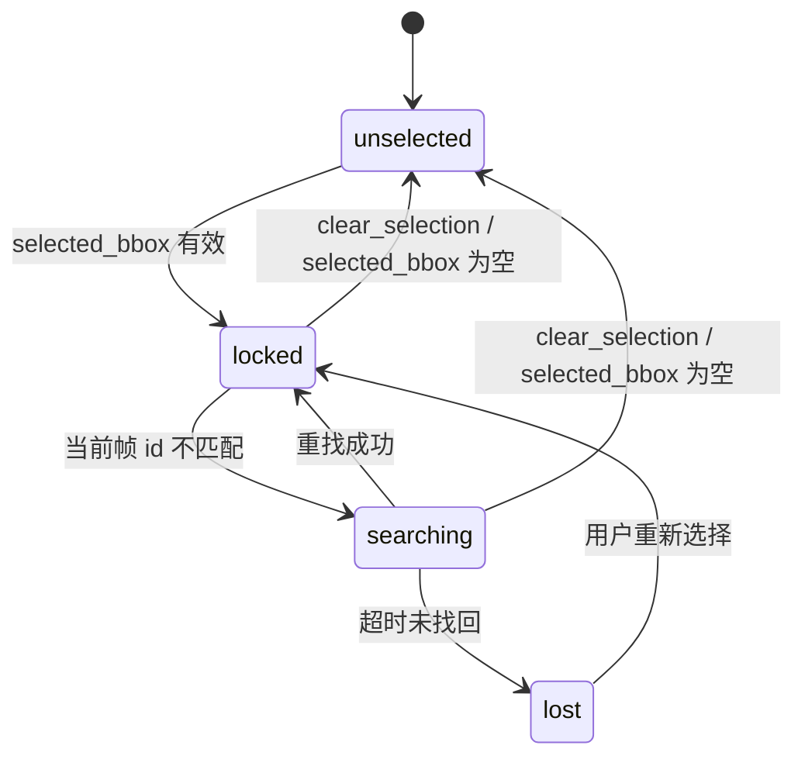
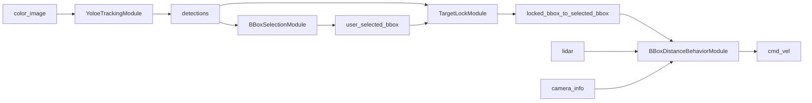

# Custom Robot Blueprints

## 目录结构

```
dimos/robot/custom/
├── modules/                             # 纯业务逻辑，无 blueprint / vis 代码
│   ├── bbox_selection_module.py         # BBoxSelectionModule, BBoxSelectionConfig
│   ├── target_lock_module.py            # TargetLockModule, TargetLockConfig
│   ├── yoloe_tracking_module.py         # YoloeTrackingModule, YoloeTrackingConfig
│   └── go2_startup_self_check_module.py # Go2StartupSelfCheck, Go2StartupSelfCheckConfig
├── tasks/                                # 任务实现：每个 task 自带自己的状态机
│   └── bbox_distance_behavior_module.py  # BBoxDistanceBehaviorModule, BBoxDistanceBehaviorConfig
├── visualization/                       # Detection2DArray → Rerun 2D overlay 适配
│   └── detection2d_overlay.py           # detection_array_to_rerun / detections_overlay /
│                                        # selected_bbox_overlay / yoloe_overlay
├── blueprints/                          # autoconnect 组装 + rerun config + requirements
│   ├── bbox_distance_follow.py          # bbox_distance_follow blueprint
│   ├── yoloe_target_lock_distance_follow.py # 示例: YOLOE + selection + target lock + distance behavior
│   ├── yoloe_keyboard_teleop.py         # yoloe-keyboard-teleop blueprint
│   ├── yoloe_tracking_test.py           # yoloe_tracking_test blueprint
│   └── go2_startup_self_check.py        # unitree_go2_startup_self_check blueprint
└── tests/                               # 纯 pytest 单元测试，无需机器人硬件
    └── test_bbox_selection_module.py    # BBoxSelectionModule 单元测试
```

依赖方向：`blueprints/` → `modules/` + `tasks/` + `visualization/`；`tests/` → `modules/` + `tasks/` only。

## yoloe-keyboard-teleop

`yoloe-keyboard-teleop` 在 `yoloe-tracking-test` 的基础上加入了键盘遥控，让你在模拟器（或真机）上手动驾驶 Go2 的同时实时观察 YOLOE 检测效果。

### 组成

- `unitree_go2_basic`
- `YoloeTrackingModule.blueprint()`
- `MovementManager.blueprint()`
- `KeyboardTeleop.blueprint(publish_only_when_active=True)`
- 专用 Rerun viewer overlay（与 `yoloe-tracking-test` 相同布局）

数据流：

```text
KeyboardTeleop.cmd_vel -> MovementManager.tele_cmd_vel -> MovementManager.cmd_vel -> GO2Connection.cmd_vel
unitree_go2_basic.color_image -> YoloeTrackingModule -> /color_image/yoloe_detections -> Rerun overlay
```

### 模型准备

与 `yoloe-tracking-test` 相同，需预先准备 YOLOE 模型：

```bash
git lfs pull --include data/.lfs/models_yoloe.tar.gz
uv run python -c 'from dimos.utils.data import get_data; print(get_data("models_yoloe"))'
```

### 启动

```bash
# 模拟器（可实际控制移动）
dimos --simulation run yoloe-keyboard-teleop

# Replay（检测效果只读，机器人不移动）
dimos --replay run yoloe-keyboard-teleop

# 真机
dimos --robot-ip 192.168.123.161 --rerun-open native run yoloe-keyboard-teleop
```

启动后会弹出一个 pygame 窗口，焦点在该窗口时键盘输入生效：

| 按键    | 动作                 |
| ------- | -------------------- |
| W / S   | 前进 / 后退          |
| A / D   | 左转 / 右转          |
| Shift   | 速度加倍（2×）       |
| Ctrl    | 慢速模式（0.5×）     |
| Space   | 发布零 Twist（急停） |
| Esc / Q | 退出键盘窗口         |

## 双层状态机（Detector-agnostic）

`BBoxSelectionModule` 只负责选择，不做目标丢失恢复。目标连续性由 `TargetLockModule` 负责，任务行为由任务模块（当前示例是 `BBoxDistanceBehaviorModule`）负责。

### TargetLock 状态机



### 模块间调用关系



### Visualization 与 TargetLock 的集成链路

这部分描述的是“在 dimos-view 中点击 -> 选框 -> 锁定 -> 叠加显示”的完整闭环。

```mermaid
flowchart LR
    A[dimos-view Camera click] --> B[RerunWebSocketServer.clicked_point]
    B --> C[BBoxSelectionModule._on_clicked_point]
    C --> D[user_selected_bbox]
    D --> E[TargetLockModule._on_selected_bbox]
    F[detections] --> G[TargetLockModule._on_detections]
    E --> H[locked_bbox]
    G --> H
    F --> I[/color_image/yoloe_detections]
    D --> J[/color_image/selected_bbox]
    H --> K[/color_image/locked_bbox]
    I --> L[RerunBridge -> world/color_image/yoloe_detections]
    J --> M[RerunBridge -> world/color_image/selected_bbox]
    K --> N[RerunBridge -> world/color_image/locked_bbox]
    L --> O[yoloe_overlay]
    M --> P[selected_bbox_overlay]
    N --> P
```

关键代码出处：

- 点击选择处理：`BBoxSelectionModule._on_clicked_point()` 与 `_publish_selected()`
  - `dimos/robot/custom/modules/bbox_selection_module.py`
- 锁定状态机处理：`TargetLockModule._on_selected_bbox()` / `_on_detections()` / `_set_state()`
  - `dimos/robot/custom/modules/target_lock_module.py`
- 2D overlay 转换：`detection_array_to_rerun()`、`yoloe_overlay()`、`selected_bbox_overlay()`
  - `dimos/robot/custom/visualization/detection2d_overlay.py`
- overlay 与实体路径绑定（`visual_override`）以及 topic 映射（`transports`）
  - `dimos/robot/custom/blueprints/yoloe_target_lock_distance_follow.py`

显示层约定：

- `yoloe_overlay`：青色，`draw_order=95`
- `selected_bbox_overlay`：绿色，`draw_order=100`
- `locked_bbox` 当前也使用 `selected_bbox_overlay`，所以在 Camera 视图里会以绿色高优先级覆盖显示。

注意：`detection_array_to_rerun()` 在输入空数组时会返回空 `Boxes2D`，这会清除 viewer 中的旧框；因此 `TargetLockModule` 在 `searching/lost` 时发布空 `locked_bbox`，视觉上会立即反映为锁定框消失。

## 示例蓝图：yoloe-target-lock-distance-follow

新增示例蓝图 `blueprints/yoloe_target_lock_distance_follow.py`，用于演示双层拆分：

- 检测层：`YoloeTrackingModule`
- 选择层：`BBoxSelectionModule`
- 目标锁定层：`TargetLockModule`
- 任务层（示例任务）：`BBoxDistanceBehaviorModule`

数据流：

```text
unitree_go2_basic.color_image
  -> YoloeTrackingModule.detections
  -> BBoxSelectionModule.detections + TargetLockModule.detections

BBoxSelectionModule.selected_bbox
  -> (remap) user_selected_bbox
  -> (remap) TargetLockModule.selected_bbox
  -> TargetLockModule.locked_bbox
  -> (remap) BBoxDistanceBehaviorModule.selected_bbox
  -> BBoxDistanceBehaviorModule.cmd_vel
  -> GO2Connection.cmd_vel
```

该示例蓝图同时发布：

- `/color_image/yoloe_detections`
- `/color_image/selected_bbox`
- `/color_image/locked_bbox`

便于在 Rerun 中同时对比：检测结果、用户选择结果、锁定结果。

### TargetLockModule（示例实现）

职责：

- 输入 `detections` 和 `selected_bbox`（在示例蓝图中经由 `user_selected_bbox` remap 到 `selected_bbox`）。
- 输出 `locked_bbox`（单目标锁定结果）和 `lock_status`（JSON 字符串状态）。
- 不做 detector 推理，不做任务行为决策。

配置：

- `search_timeout_sec=3.0`
- `reacquire_by_class=True`

状态：

- `unselected`
- `locked`
- `searching`
- `lost`

RPC：

- `clear_lock() -> str`
- `get_lock_state() -> dict[str, Any]`

重找策略（当前实现）：

- 优先按 tracking id 直接匹配。
- id 匹配失败且仍在超时时间内：
  1. 若开启 `reacquire_by_class`，先按 `class_id` 过滤候选；
  2. 再按 bbox 中心点与上次位置的欧氏距离最近原则重找。
- 超时未找回进入 `lost`，并输出空 `locked_bbox`。

### 运行示例蓝图

该示例尚未注册到 `all_blueprints.py`，可直接以模块方式启动：

```bash
.venv/bin/python -m dimos.robot.custom.blueprints.yoloe_target_lock_distance_follow
```

## yoloe-tracking-test

`yoloe-tracking-test` 是一个只用于验证 YOLOE tracking 效果的 Go2 replay blueprint。它不接距离控制、不接 Agent/MCP/skill，只把 Go2 `color_image` 输入到 `YoloeTrackingModule`，并把 YOLOE 的 `Detection2DArray` 发布到 `/color_image/yoloe_detections`。

### 组成

- `unitree_go2_basic`
- `YoloeTrackingModule.blueprint()`
- 专用 Rerun viewer overlay

数据流：

```text
unitree_go2_basic.color_image
  -> YoloeTrackingModule.color_image
  -> YoloeTrackingModule.detections
  -> /color_image/yoloe_detections
  -> Rerun Camera overlay
```

### 离线模型准备

运行 `yoloe-tracking-test` 时不会拉取或解压 YOLOE 模型。需要先在有网络的环境准备模型：

```bash
git lfs pull --include data/.lfs/models_yoloe.tar.gz
uv run python -c 'from dimos.utils.data import get_data; print(get_data("models_yoloe"))'
ls -lh data/models_yoloe/yoloe-11s-seg-pf.pt
```

如果 `data/models_yoloe/yoloe-11s-seg-pf.pt` 不存在，blueprint 会在部署前失败并打印同一组预处理命令。真机或离线 replay 环境只运行 blueprint，不做模型下载。

### 启动

```bash
.venv/bin/dimos --replay run yoloe-tracking-test
```

Rerun Camera 视图会显示 `world/color_image/yoloe_detections`。bbox 标签使用 detection id；当 YOLOE 返回 tracking id 时，可以直接观察同一个目标跨帧 id 是否稳定。

## bbox-distance-follow

`bbox-distance-follow` 是一个最小可启动的 Go2 blueprint，用于验证 “检测多个 bbox -> 用户选择一个 bbox -> 根据 selected bbox + lidar + camera_info 控制 Go2 距离” 这条链路。

这个 blueprint 只保留 DimOS Module/RPC，不接 `@skill`、Agent、Prompt、MCP 或新的 UI 模块。它可以通过 `dimos run bbox-distance-follow` 启动，也可以在 replay 下通过 viewer 观察 selected bbox overlay。

### 组成

- `unitree_go2_basic`
- `Detection2DModule.blueprint(camera_info=GO2Connection.camera_info_static, publish_detection_images=False)`
- `BBoxSelectionModule.blueprint()`
- `BBoxDistanceBehaviorModule.blueprint()`

全局配置：

```python
.global_config(n_workers=6, robot_model="unitree_go2")
```

### 数据流

```text
unitree_go2_basic.color_image
  -> Detection2DModule.color_image
  -> Detection2DModule.detections
  -> BBoxSelectionModule.detections
  -> BBoxSelectionModule.selected_bbox
  -> BBoxDistanceBehaviorModule.selected_bbox
  -> BBoxDistanceBehaviorModule.cmd_vel
  -> GO2Connection.cmd_vel

unitree_go2_basic.lidar
  -> BBoxDistanceBehaviorModule.lidar

unitree_go2_basic.camera_info
  -> BBoxDistanceBehaviorModule.camera_info

dimos-viewer Camera click
  -> RerunWebSocketServer.clicked_point
  -> BBoxSelectionModule.clicked_point
  -> BBoxSelectionModule.selected_bbox
```

`Detection2DModule.detections` 明确发布到 LCM topic `/color_image/detections`，`selected_bbox` 明确发布到 LCM topic `/color_image/selected_bbox`。RerunBridge 会把它们映射到 `world/color_image/detections` 和 `world/color_image/selected_bbox`，本 blueprint 对这两个实体路径配置了专用 `visual_override`，把 YOLO 候选 bbox 显示为黄色框，把 selected bbox 显示为绿色框。Go2 viewer 的 Camera view origin 是 `world/color_image`，所以这些 bbox 会作为相机图像子实体显示在 Camera 视图上。

`publish_detection_images=False` 是有意设置：`Detection2DModule.detected_image_0/1/2` 当前是 cropped detection images，不是原始相机图像上的 bbox overlay。这个 blueprint 直接在 Rerun Camera 视图里渲染 bbox，避免 cropped images 出现在 3D view 中并触发无 Pinhole 的 2D visualizer warning。

### BBoxSelectionModule

职责：

- 消费 `Detection2DModule.detections` 的多 bbox。
- 消费 dimos-viewer 发回的 `clicked_point`，把 Camera 视图里的像素点击映射到最新一帧 bbox。
- 保存最新一帧 detections。
- 通过 RPC 保存用户选择的 `index` 或 `id`。
- 通过 viewer 点击保存用户选择的 `index`；如果点击在 Camera 视图但没有命中任何 bbox，会清空当前选择。
- 每帧只转发当前选中的 detection。
- 如果当前帧找不到选中 bbox，发布空 `Detection2DArray`，避免下游或 viewer 复用旧 bbox。

它不创建 detector、不跑 YOLO、不调用 VLM、不做 ReID/EdgeTAM，也不负责目标丢失恢复。

RPC：

- `list_candidates() -> list[dict[str, Any]]`
- `select_bbox(index: int | None = None, id: str | None = None) -> str`
- `clear_selection() -> str`

候选字段：

- `index`
- `id`
- `bbox: [x1, y1, x2, y2]`
- `confidence`
- `class_id`

### BBoxDistanceBehaviorModule（task）

职责：

- 消费 `selected_bbox + lidar + camera_info`。
- 输出 `cmd_vel` 和 `behavior_status`。
- 只负责“点中选框后自动靠近到 0.2m 并结束”。

行为方式：

- `BBoxSelectionModule` 一旦输出非空 `selected_bbox`，行为模块自动进入 `approaching`。
- 当估计距离进入 `0.2m ± 0.05m` 容差时，行为模块进入 `done` 并持续输出零速度。
- 如果 `selected_bbox` 被清空，行为模块回到 `idle` 并停止输出。

RPC：

- `start_bbox_distance_behavior(approach_distance=None) -> str`
- `stop_bbox_distance_behavior() -> str`

默认参数：

- `command_hz = 20.0`
- `approach_distance = 0.2`
- `depth_percentile = 25.0`
- `max_linear_speed = 0.45`
- `max_angular_speed = 0.8`

状态机：

```text
idle -> approaching -> done
```

`selected_bbox` 进入后模块就直接开始靠近。bbox 为空、camera_info 缺失、lidar 距离无效时发布 `Twist.zero()` 并等待。完成或停止时发布 `Twist.zero()`。

lidar 距离 MVP 直接用 camera intrinsics 将点云投影到 bbox，取 `depth_percentile` 深度；如果实际 lidar 坐标系没有和相机对齐，后续再补 TF 修正。

### 启动

`bbox-distance-follow` 复用 `Detection2DModule` 的默认 YOLO detector。真机测试通常断网，所以需要先在有网络的环境预下载 `yolo11n.pt`：

```bash
mkdir -p data/models_yolo
curl -L -o data/models_yolo/yolo11n.pt https://github.com/ultralytics/assets/releases/download/v8.4.0/yolo11n.pt
```

确认文件存在：

```bash
ls -lh data/models_yolo/yolo11n.pt
```

如果这个文件缺失，blueprint 会在部署模块前直接报错并打印同一条预下载命令，避免 Ultralytics 在真机断网时隐式下载失败。

CLI 全局参数必须放在 `run` 前面，例如 `--robot-ip`、`--replay`、`--rerun-open` 都是全局参数。

```bash
.venv/bin/dimos --replay run bbox-distance-follow
```

或连接真实 Go2：

```bash
.venv/bin/dimos --robot-ip 192.168.123.161 --rerun-open native run bbox-distance-follow
```

如需后台运行：

```bash
.venv/bin/dimos --replay run bbox-distance-follow --daemon
```

### 命令行 RPC 选择 bbox

列出候选：

```bash
.venv/bin/python -c 'from dimos.core.rpc_client import RPCClient; from dimos.robot.custom.modules.bbox_selection_module import BBoxSelectionModule; c=RPCClient.remote(BBoxSelectionModule); print(c.list_candidates()); c.stop_rpc_client()'
```

选择第 0 个 bbox：

```bash
.venv/bin/python -c 'from dimos.core.rpc_client import RPCClient; from dimos.robot.custom.modules.bbox_selection_module import BBoxSelectionModule; c=RPCClient.remote(BBoxSelectionModule); print(c.select_bbox(index=0)); c.stop_rpc_client()'
```

按 id 选择 bbox：

```bash
.venv/bin/python -c 'from dimos.core.rpc_client import RPCClient; from dimos.robot.custom.modules.bbox_selection_module import BBoxSelectionModule; c=RPCClient.remote(BBoxSelectionModule); print(c.select_bbox(id="0")); c.stop_rpc_client()'
```

清除选择：

```bash
.venv/bin/python -c 'from dimos.core.rpc_client import RPCClient; from dimos.robot.custom.modules.bbox_selection_module import BBoxSelectionModule; c=RPCClient.remote(BBoxSelectionModule); print(c.clear_selection()); c.stop_rpc_client()'
```

停止距离行为：

```bash
.venv/bin/python -c 'from dimos.core.rpc_client import RPCClient; from dimos.robot.custom.tasks.bbox_distance_behavior_module import BBoxDistanceBehaviorModule; c=RPCClient.remote(BBoxDistanceBehaviorModule); print(c.stop_bbox_distance_behavior()); c.stop_rpc_client()'
```

### Viewer 点击选择

启动 replay + viewer 后，Camera 视图里会显示 `world/color_image`。`Detection2DModule` 发布的全部 YOLO 候选框会显示为黄色 bbox。通过命令行 RPC 调用 `select_bbox(index=...)` 后，`BBoxSelectionModule` 会发布 `/color_image/selected_bbox`，本 blueprint 的专用 visual override 会让 RerunBridge 在 `world/color_image/selected_bbox` 上显示绿色 bbox。

也可以直接在 dimos-viewer 的 Camera 视图里点击黄色 bbox。点击会沿用 viewer 已有的 WebSocket 回传链路变成 `clicked_point`，`BBoxSelectionModule` 会用点击像素坐标命中最新一帧候选 bbox，并立即发布对应的 `selected_bbox`。点击 Camera 视图里没有 bbox 的位置会清空当前选择，让行为模块收到空 selected bbox 后停止输出运动命令。

当 selected bbox 在后续帧中移动，overlay 会跟随当前帧 detection 更新；当选择被清除或当前帧找不到选中 bbox，模块会发布空 `Detection2DArray`，viewer 中旧框会消失。

### 非目标

- 不新增通用 `dimos rpc` CLI。
- 不接 Agent、Prompt、MCP、McpServer 或 McpClient。
- 不新增 `@skill`。
- 不在 `BBoxSelectionModule` 内实现 YOLO、ReID、EdgeTAM 或目标丢失恢复。
- 不在 `BBoxDistanceBehaviorModule` 内做人识别或 bbox 选择。

后续如果 lidar 和 camera 坐标系不一致，可在点云投影前补 TF 对齐。
