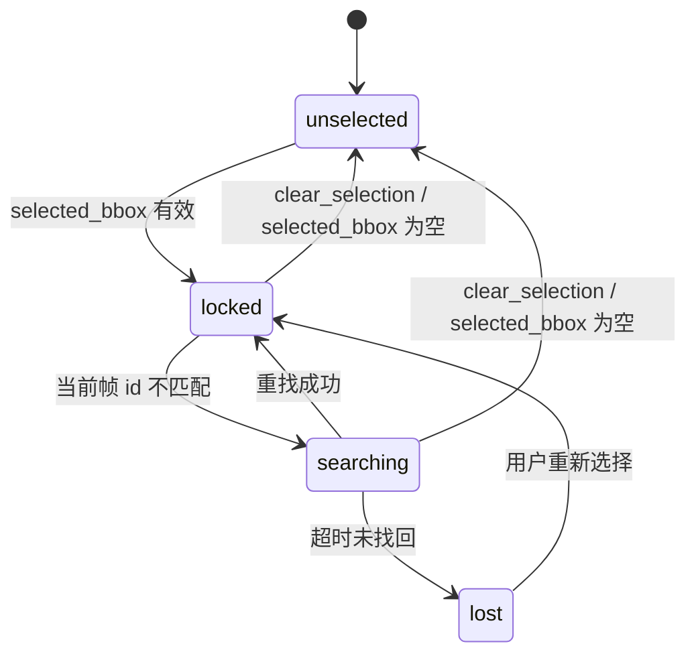
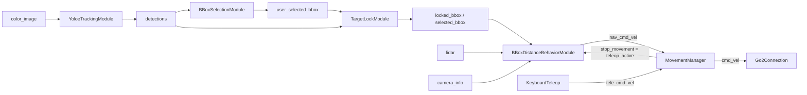

# Custom Robot Blueprints

## 目录结构

```text
dimos/robot/custom/
├── modules/                               # 纯业务逻辑，无 blueprint / vis 代码
│   ├── bbox_selection_module.py           # BBoxSelectionModule, BBoxSelectionConfig
│   ├── target_lock_module.py              # TargetLockModule, TargetLockConfig
│   ├── yoloe_tracking_module.py           # YoloeTrackingModule, YoloeTrackingConfig
│   └── go2_startup_self_check_module.py   # Go2StartupSelfCheck, Go2StartupSelfCheckConfig
├── tasks/                                 # 任务实现：每个 task 自带状态机
│   └── bbox_distance_behavior_module.py   # BBoxDistanceBehaviorModule, BBoxDistanceBehaviorConfig
├── visualization/                         # Detection2DArray -> Rerun 2D overlay 适配
│   └── detection2d_overlay.py             # detection_array_to_rerun / detections_overlay /
│                                          # selected_bbox_overlay / yoloe_overlay
├── blueprints/                            # autoconnect 组装 + rerun config + requirements
│   ├── bbox_distance_follow.py            # 最小距离任务蓝图
│   ├── yoloe_target_lock_distance_follow.py # 推荐闭环示例：YOLOE + selection + target lock + task
│   ├── yoloe_keyboard_teleop.py           # 键盘遥控 + YOLOE（非本文重点）
│   ├── yoloe_tracking_test.py             # 仅检测/跟踪验证
│   └── go2_startup_self_check.py          # 开机自检蓝图
└── tests/
    ├── test_bbox_distance_behavior_module.py
    └── test_target_lock_module.py
```

依赖方向：`blueprints/` -> `modules/` + `tasks/` + `visualization/`；`tests/` -> `modules/` + `tasks/`。

## 如何最小化测试

建议按下面顺序做最小验证，能最快定位问题在哪一层。

### 1. 先跑 task + lock 单元测试

```bash
source .venv/bin/activate
pytest dimos/robot/custom/tests/test_bbox_distance_behavior_module.py dimos/robot/custom/tests/test_target_lock_module.py -q
```

### 2. 再验证 blueprint 自动注册

```bash
source .venv/bin/activate
pytest dimos/robot/test_all_blueprints_generation.py
```

### 3. 最后跑最小闭环蓝图

```bash
.venv/bin/dimos --replay run yoloe-target-lock-distance-follow
```

这个顺序可以把问题快速归类到：
- 单模块逻辑
- 蓝图注册/装配
- 运行时流转

## 当前 blueprint 状态机

### 1) yoloe-target-lock-distance-follow（推荐闭环）

组成：
- `unitree_go2_basic`
- `YoloeTrackingModule.blueprint()`
- `BBoxSelectionModule.blueprint()`
- `TargetLockModule.blueprint()`
- `BBoxDistanceBehaviorModule.blueprint(approach_distance=0.2)`
- `KeyboardTeleop.blueprint(publish_only_when_active=True)`
- `MovementManager.blueprint()`

键盘控制（pygame 窗口需要焦点）：
- W / S — 前进 / 后退
- A / D — 左转 / 右转
- Q / E — 横移
- Shift — 加速 (2×)  |  Ctrl — 慢速 (0.5×)
- Space — 紧急停止  |  Esc / Q — 退出

TargetLock 状态机：



模块消息流：



速度优先级（MovementManager）：
- 键盘有输入时：`tele_cmd_vel` 优先，`nav_cmd_vel` 被压制（冷却 1 s）
- 冷却结束后：`nav_cmd_vel`（任务）恢复控制
- 键盘输入同时触发 `stop_movement → teleop_active` → 任务重置为 idle

Visualization 点击闭环：

```mermaid
flowchart LR
    A[dimos-view Camera click] --> B[RerunWebSocketServer.clicked_point]
    B --> C[BBoxSelectionModule._on_clicked_point]
    C --> D[user_selected_bbox]
    D --> E[TargetLockModule._on_selected_bbox]
    F[detections] --> G[TargetLockModule._on_detections]
    E --> H[locked_bbox]
    G --> H
    H --> K[/color_image/locked_bbox]
```

### 2) bbox-distance-follow（最小任务链路）

组成：
- `unitree_go2_basic`
- `Detection2DModule.blueprint(camera_info=GO2Connection.camera_info_static, publish_detection_images=False)`
- `BBoxSelectionModule.blueprint()`
- `BBoxDistanceBehaviorModule.blueprint()`

任务状态机：

```text
idle -> approaching -> done
```

状态转移规则：
- 选中 bbox（非空）-> `approaching`
- 到达 `0.2m ± 0.05m` -> `done`
- 选择清空（空 bbox）-> `idle`

## Task Module

`BBoxDistanceBehaviorModule` 位于 `tasks/`，职责是“执行任务”，不是“做检测或选择”。

职责：
- 输入：`selected_bbox` + `lidar` + `camera_info`
- 输出：`cmd_vel` + `behavior_status`
- 行为目标：点中目标后自动靠近到 0.2m 并结束

RPC：
- `start_bbox_distance_behavior(approach_distance=None) -> str`
- `stop_bbox_distance_behavior() -> str`

默认参数：
- `command_hz = 20.0`
- `approach_distance = 0.2`
- `depth_percentile = 25.0`
- `max_linear_speed = 0.45`
- `max_angular_speed = 0.8`

点击和深度调参（实机/仿真常用）：
- `BBoxSelectionConfig.click_hit_padding_px`：点击命中 bbox 的边缘扩张像素。
- `BBoxSelectionConfig.click_snap_distance_px`：未命中时吸附到最近 bbox 的最大像素距离。
- `BBoxDistanceBehaviorConfig.depth_bbox_padding_px`：深度采样时 bbox 初始扩张像素。
- `BBoxDistanceBehaviorConfig.depth_bbox_max_padding_px`：深度采样允许的最大扩张像素。
- `BBoxDistanceBehaviorConfig.depth_bbox_padding_step_px`：深度采样逐级扩张步长。

推荐调参顺序：
1. 点不中 bbox：先增大 `click_hit_padding_px`，再增大 `click_snap_distance_px`。
2. 点中了但不前进（常见 `no_depth_for_target`）：先增大 `depth_bbox_padding_px`，再增大 `depth_bbox_max_padding_px`。
3. 深度跳变明显：降低 `depth_bbox_max_padding_px` 或增大 `depth_percentile`。

边界行为：
- bbox 为空：发布 `Twist.zero()` 并回到 `idle`
- 深度无效：发布 `Twist.zero()` 并等待
- 达到目标或 stop：发布 `Twist.zero()`

## 排查故障

### 1. 看不到框
- 检查检测流是否有输出（`detections` 是否持续更新）。
- 检查 overlay 绑定是否正确（`/color_image/yoloe_detections`、`/color_image/selected_bbox`、`/color_image/locked_bbox`）。
- replay 场景下确认模型文件存在。

### 2. 点击后不进入 approaching
- 检查 `clicked_point` 是否到达 `BBoxSelectionModule`。
- 检查 `selected_bbox` 是否非空。
- 检查 `behavior_status` 是否切到 `approaching`。

### 3. 锁定后很快丢失
- 检查 tracking id 是否稳定。
- 检查 `TargetLockModule.search_timeout_sec` 是否过短。
- 检查 `reacquire_by_class` 是否开启。
- 观察 `lock_status` 是否进入 `searching/lost`。

### 4. 不前进但没 done
- 检查点云是否正确投影到 bbox。
- 检查 `camera_info` 是否匹配当前相机。
- 检查 bbox 是否过小或位置异常导致深度采样失败。

### 5. 注册/运行异常
- 重新执行：

```bash
source .venv/bin/activate
pytest dimos/robot/test_all_blueprints_generation.py
```

### 6. 建议排查顺序
1. 单测：`test_bbox_distance_behavior_module.py` + `test_target_lock_module.py`
2. 注册：`test_all_blueprints_generation.py`
3. 运行：`dimos --replay run yoloe-target-lock-distance-follow`
