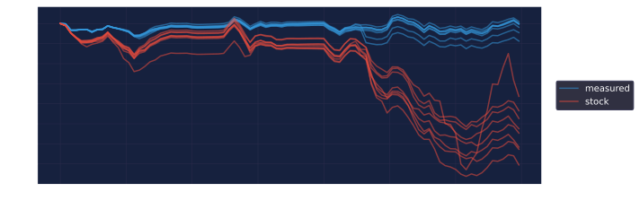

# go2sim

A measured Go2 plant for MuJoCo, and the identification pipeline that
produced it: record the real robot → replay/rollout in sim → tune → verify.

---

## 1. Watch it

No environment variables and no checkouts: the scene is vendored (§3), so
these run from a fresh clone. Both open a MuJoCo viewer, paced to wall
clock; the viewer and the headless run are the same function.

**The closed loop (Mode B)** — the real policy driving the sim, against the
recorded robot. The closest thing to "does it look right":

```bash
python -m dimos.robot.unitree.go2.sim.sysid.ground \
    ~/recordings/hard_floor/20260816-194142_policy-freewalk-hard_vive.mcap \
    data/ml-trajectory-research/freewalk_mcf.bin \
    --view --start 6 --seconds 40 --replicates 1
```

`--replicates 1` reaches the viewer sooner (the report labels itself "a
draw, not a verdict" — §7); `--speed 0.25` slows to watch footfalls;
`--preset stock` shows bare menagerie, the comparison every claim rests on.
The sim starts from the measured mid-walk state (joints, attitude, tracker
velocity), so it moves with the ghost from the first frame.

> The numbers these commands print are NOT the verdict: a short window with
> one replicate measures its floor from itself, so the SNRs are inflated.
> The verdict needs the full span, replicates, and the robot-repeat floor
> (§7). Use these to LOOK.

**Open loop (Mode A)** — recorded joint targets driven straight into the
plant, no policy:

```bash
python -m dimos.robot.unitree.go2.sim.sysid.replay \
    ~/recordings/hard_floor/20260816-194142_policy-freewalk-hard_vive.mcap \
    --view --no-reinit --speed 0.25
```

`--no-reinit` disables the multiple-shooting snap-back — the only way to
SEE what open loop costs; with re-init on it looks deceptively good,
corrected every 0.4 s.

**What to trust with your eyes.** Trust the ghost's POSITION (trajectory,
turns, where it ends up). Do not judge body tilt against it: the ghost is
the tracker pose, and the tracker's attitude *rate* is a retired instrument
(§6) — it invents roll rate at ~2.5× the gyro's truth, so the ghost rocks
more than reality. What is actually still wrong is the speed family (§8):
expect the sim to lag on straight stretches and re-converge on turns.

Only recordings driven by Ivan's executor can be watched or graded in
Mode B (§7); native-runner recordings serve the floor and Mode A only.

---

## 2. The plant

**Three built-in presets** (`ranges.py`), with distinct jobs:

- **`measured`** — the plant: a weighed trunk (mass, CoM and inertia from a
  kitchen scale and parallel-axis analysis), the selected draw's knobs
  (§5), the measured torque envelope, and a friction pair derived from
  `FLOOR_MU = 0.90` at import (`anchors.derive` — the same call the fit
  pins from, so plant and fitting discipline agree by construction). Every
  value names its provenance on the preset (`Preset.provenance`:
  `selected` / `fitted` / `derived` / `declared` / `measured`), and two
  structural tests hold the discipline: every value inside the range that
  admits it, every derived value equal to its own derivation.
- **`stock`** — bare vendored menagerie. Not history: the experimental
  control. Every claim here is comparative ("the tuned plant matches the
  robot better than bare menagerie"), and the eventual transfer experiment
  is stock-vs-tuned by design. Delete it and the claims become
  unverifiable.
- **`fast`** — the batched-training plant: `measured` with the four contact
  knobs RE-IDENTIFIED under the cheap solver MJX is fast at (Newton 1/5,
  elliptic — ~7.5× `measured`'s batched throughput; `engines/bench.py`),
  pinned to `measured` everywhere else so the comparison isolates what the
  cheap solver costs. Shipped by draw selection like `measured` itself
  (fit on the same recordings, 37 of 78 draws stable open-loop, selected
  on `195401` ×16, quoted once on the speeds-strafe reserve `200750`):
  selection 2.29 vs `measured`'s 2.79, reserve 3.81 vs 4.10 — the cheap
  solver costs nothing the referee can measure, on a reserve whose content
  (speeds+strafe) differs from the fit set. Its contact is a different
  SHAPE, not a softer copy: solref 4.2 ms / width 71 mm / dmin 0.48
  against `measured`'s 14.8 ms / 1.6 mm / 0.015 — near the width and dmin
  range bounds, so the region likely extends past them. Pyramidal (4×
  faster still) was killed by measurement: 101 of 103 fitted draws explode
  open loop, and the best survivor explodes 1 in 16 closed-loop rollouts.
  **What the cheap solver does to cross-engine identity, and why it turned
  out not to matter.** At 1 Newton iteration the solver never converges, so
  its truncation IS plant behaviour and the two engines truncate
  differently. Open loop, on the same plan, the gap grows as the solver
  gets cheaper — 1.0e-9 N·m median per step at 100/50, 1.4e-3 at 4/10,
  **0.14 N·m at the shipped 1/5** (−13.9% of the scored residual, MJX the
  closer of the two to the recording, so this is not MJX being worse). That
  made the refereed plant (CPU-1/5) and the plant that would train
  (MJX-1/5) siblings rather than one object, which is why `MjxSession`
  exists: loop 2 runs over the batched engine, so the training plant is
  GRADED, not bounded. Measured, 8 seeds paired (replicate *i* gets the
  identical perturbation under both engines — far sharper than comparing
  medians against the MDD): **+0.032 ± 0.004 loss, ~0.4%**, every
  behavioural statistic within 0.55 of the chaos floor (worst `stride_hz`
  0.55, `speed_gain` 0.50). Statistically resolvable, behaviourally
  negligible: **the closed loop absorbs the open-loop truncation gap**,
  which is §5's own lesson pointed at the engines instead of the knobs.
  The dtype is free twice over: 0.1% open loop, and inside that 0.4%
  closed loop.

**The contact solver is part of the preset.** `solver_iterations` /
`solver_ls_iterations` / `solver_cone` are knobs like any other (never
searched — a solver is chosen, then the contact is identified UNDER it),
applied to `model.opt` by the same `apply_physics` both engines compile
from. They were inherited silently from menagerie's scene until the batched
engine made them a choice. Measured on the shipped contact: a PD-held stand
converges by Newton 2, but WALKING is bit-identical only down to 15/20 and
explodes intermittently at 10/10 and below — impact clips, invisible to the
stand probe. `measured` records the scene's 100/50/elliptic explicitly — a
no-op, held by test — and an absent key keeps the scene default, so
pre-schema preset JSONs reproduce bit-for-bit.

**The plant's provenance is deliberately hybrid — do not "fix" it by
refitting.** The knobs were fitted with the torque envelope OFF and are run
with it ON, so the envelope's average effect is double-counted into the
viscous/inertial knobs. The envelope-consistent refit was run twice, on two
different objectives: each was the better open-loop identification and each
grounded WORSE on the referee — the **anti-transfer** result. Open-loop
pointwise fidelity, on any channel family, is not a proxy for closed-loop
fidelity; loop 2 adjudicates every promotion.

---

## 3. The base model is pinned

Every fitted knob is a delta on menagerie's `unitree_go2/scene.xml`, so the
base model is part of the plant's identity:

- **Vendored assets.** `data/go2_menagerie` (via `get_data`, the LFS road)
  carries the `unitree_go2` subtree + `LICENSE` (BSD-3-Clause, Unitree
  Robotics — notice retained verbatim) from
  google-deepmind/mujoco_menagerie @ `4c358ef`, verified byte-identical at
  vendoring time and pinned by a tree hash (`model.MENAGERIE_TREE_SHA256`,
  held by `test_vendor.py`). Missing or altered assets are a FAILURE, not a
  skip. `MUJOCO_MENAGERIE` remains as an explicit developer override.
- **Exact engine.** `mujoco==3.10.0` everywhere the repo declares mujoco. A
  version range is a claim that the contact solver doesn't matter, and §8
  measured 12–14 mm/stance of contact creep. Bumping is a deliberate act:
  re-run this package's acceptance suite.

Side effect worth having: `stock` means something reproducible — bare
menagerie at a known commit, not "whatever your checkout had that day".

---

## 4. Architecture: the seam

Everything above the seam is simulator-agnostic — ingest, regimes,
segments, scoring, identifiability, the fit, the referee. The backend never
sees a regime, a channel weight or a fit; it is handed a plan and returns a
prediction.

```
recordings ──► ingest ──► regimes ──► segments+clips ──► rollout ──► score
                                                            ▲          │
                                                         BACKEND       ▼
                                                                     knobs
```

The seam is a file the engines cannot reach into: `backend.py` carries the
protocols and the plan/prediction types and imports no engine, while every
engine lives in `engines/` — `engines/mujoco.py` today, `engines/mjx.py`
next. `engines/model.py` sits between them: it vendors the scene and applies
the knobs, and both MuJoCo-family backends compile the same `MjModel` from
it, which is what makes "the same plant under two engines" structural rather
than asserted. `test_seam.py` holds the split — a new module is above the
seam by default and must be listed to be anything else.

```python
class Backend(Protocol):
    def knobs(self)    -> Mapping[str, Knob]:   # what it can VARY
    def channels(self) -> frozenset[str]:       # what it can PREDICT
    def apply(self, values: Mapping[str, float]) -> None    # set the knobs
    def rollout(self, plan: RolloutPlan) -> Prediction      # run the physics

class ClosedLoopBackend(Backend, Protocol):     # declared, like channels()
    def session(self, pose, *, ghost, view, view_speed) -> LoopSession
```

`apply` is the only way the fit changes anything (a knob left out keeps the
engine default; applying twice gives the same model). `rollout` is the only
method that does physics: it takes a **`RolloutPlan`** — which stretch,
the commands actually sent (q, dq, kp, kd, tau_ff), the measured states to
re-initialise from and when, and whether the base is FREE (walking) or
PINNED to the measured attitude (hanging) — and returns a **`Prediction`**
(joints, trunk sensors, tracker quantities, clip boundaries). In one line:
*here is what the robot was told and where to start — tell me what your
simulator thinks happened.*

**"Decided before any physics" is load-bearing.** Two candidate plants get
an IDENTICAL plan — same segments, clip boundaries, snap times, commands —
so any output difference is the physics. Schedules live above the seam
(`sysid.regimes`), so a second engine is handed the same plans and the
cross-simulator comparison means something. Fitted VALUES do not transfer
between backends; the recordings, the anchors (a weighed robot is 16.5 kg
in any simulator), the regime labels and the method do.

**The closed loop crosses the seam through a second declared capability.**
A policy in the loop cannot be a pre-decided instruction sheet, so Mode B's
seam is a stepping primitive: `session()` returns a `LoopSession`
(`state()` / `step(torques)` / `snap(state)` / `show_ghost` / `close`), and
the generic driver (`sysid.ground.rollout_policy`) owns the policy, the
observation build, the command slew and the actuator chain. A second
backend implements the session methods and inherits the entire referee.
Backends are picklable by contract — configuration only, no live engine
state — which is what lets worker processes receive the configured backend
instead of rebuilding one.

**The third seamed axis is the recording format**: readers implement
`RecordingReader` (`sysid/recording.py`), everything downstream consumes
`Streams`; the Go2 DDS reader in `ingest.py` is one implementation. Robot
constants travel via `RobotSpec` (`anchors.py`).

All of it is held by `test_seam.py`, not convention: every above-seam
module imports in a clean interpreter (no engine may arrive), and an AST
pass allows the engine's name only inside a `main()`.

**The knob spec** makes ranges carry their own epistemics:

```python
@dataclass(frozen=True)
class Knob:
    lo: float
    hi: float
    log: bool = False   # the range is judged in THIS metric
    unit: str = ""
    why: str = ""       # where the range came from; required to ship
```

**Everything is a knob; only the provenance differs.** There is no separate
category of "anchor": `mass_kg`, the tracker lever arm and `armature` are
the same kind of object, differing in whether we happen to know the value.
`robot.json` is a source of pins (`{"pin": 16.500, "why": "kitchen
scale"}` vs `{"search": [lo, hi]}`). Prefer a pin when you can measure the
thing — a weighing found 1.3 kg that no fit ever did — but a wrong pin held
with confidence is worse than a searched range. Pinning does not delete the
range; it stops the search from using it.

---

## 5. The tuning loop

### Two loops, one partition

|         | loop 1 — identify           | loop 2 — ground                    |
|---------|-----------------------------|------------------------------------|
| runs    | open-loop replay, no policy | the real policy, closed loop       |
| against | recorded signals, per clip  | tracker position + IMU attitude    |
| yields  | ~10⁵ constraints/recording  | ~14 statistics                     |
| decides | **the knobs**               | **every promotion**                |

**Identify with 1, verify with 2, never fit the plant on 2.** A controller
is engineered to hide plant error, so judging the plant through it means
judging through the mask. And the converse, measured on two objectives:
never promote on a loop-1 score alone — better open-loop identification
has repeatedly grounded worse (the anti-transfer, §2).

**The loops partition what they judge.** Loop 1 scores joint-level,
pointwise quantities — `q`/`dq`/`tau`, 36 signals at 500 Hz, compared
sample-by-sample under multiple shooting (re-init every 0.05–0.8 s keeps
the residual about dynamics, not divergence). Loop 2 scores emergent,
body-level quantities — where the robot went, how it followed commands,
how it oscillated. The partition is what makes loop 2 a referee: one that
judges what the fit optimised is not an independent check.
`score.DEFAULT_WEIGHTS`: joint .4 / dq .4 / tau .2, flight share 0.25,
every body-level channel at zero — `accel` deliberately so despite being
the most identifiable single channel (resolution is not correctness). Zero
weight never means unreported: every channel's residual prints on every fit
report and on `fit --judge`.

**The weight vector is a misspecification map.** If the simulator were
correct, weights would be a pure efficiency question — a correct model can
match every channel at once. Under misspecification the weights decide
which discrepancies are absorbed into the parameters and which are left in
the residual. So a de-weighted channel's residual is part of the
deliverable — *"`tau` down-weighted, residual at 3× the floor"* is a
precise statement of where the model is wrong — and where the referee
pushes the weights makes a falsifiable prediction about which
misspecifications matter. Two anchors keep this honest: measured pins are
inviolable (no weight vector may move a weighed mass), and weights are
selected on one recording and reported on another. The measured conclusion
that closes the topic: held out, the judge-weight axes are FLAT — refit
stochasticity dominates every weighting scheme — which is why shipping is
draw selection (below), not weight search.

### The score

```
score = Σ  w[channel, regime] · residual[channel, regime] / scale[channel]
```

`scale` makes terms dimensionless (each channel's residual RMS under the
baseline plant, frozen at calibration — a moving scale would make the
search see a moving objective). Terms are masked by regime span (a
suspended span permits only the joint family — a held trunk makes every
trunk-frame signal an echo of the boundary condition); missing terms
renormalise; the total is the mean over segments of each segment's weighted
sum, which gives the loss a measurable sampling noise.

Channels are what the robot also measures — `joint`/`dq`/`tau` (500 Hz
motor state), `accel`/`gyro` (500 Hz IMU), `pos`/`rot` (tracker, ~200 Hz,
optional). Scoring compares the intersection of what the recording has,
what the backend predicts, and what the regime permits: no tracker →
`pos`/`rot` drop out and everything else proceeds.

### The fit: a region, not a point

Seeds that agree on loss to within 3 points disagree on parameters by up
to 8.8× — the knobs trade against each other, so the fit locates a REGION.
The fit therefore restarts (seeded studies), harvests every trial within
one paired SE of each study's best, pools across studies, and ships the
per-parameter median with the p10–p90 spread; it stops when the
leave-one-study-out drift of the spread stabilises (<10% twice), not when
a counter runs out. Hitting the study cap is a result — the region is
wider than the data pins. Trials within a study are never parallelised
(seeded reproducibility); segments fan out across workers, bit-identical
to serial by test.

```bash
python -m dimos.robot.unitree.go2.sim.sysid.fit REC.mcap JUMPS.mcap \
    --workers 20 --held-out OTHER.mcap --out results/freewalk
```

Multiple recordings pool into one objective with shared scales; regime
imbalance is handled by shape (each channel×regime term is a per-regime
mean), so a 2.5 s flight budget still means something next to 60 s of
floor.

### Shipping: draw selection

The fit's median is not what ships. Refit stochasticity moves the referee
verdict more than any judge-weighting choice (measured: an identical
objective, reseeded, moved the verdict by ~1.6× the MDD), so the point
that ships is chosen from the region by the referee:

1. The fit persists its pooled cloud as **index-aligned joint draws**
   (`ranges.json: "cloud"` — joint rows, never per-knob resampling, which
   fabricates off-valley points the fit never visited).
2. Every draw is grounded at 16 replicates on the **selection recording**.
3. The top few are quoted ONCE on the **reserve recording** — a recording
   nothing was ever fitted or selected on — alongside the previous plant
   in the same pass. The reserve's winner ships, and the reserve is
   retired: the next shipping decision needs a fresh never-touched
   recording.

First run (2026-08-18): 161 draws; ten beat the previous plant on
selection (best 1.41 — selection-flattered, as the reserve then showed);
on the reserve the finalists read **1.93 / 2.00 / 2.01 vs the previous
plant's 2.14**, each margin under the single-comparison MDD, the
improvement carried by all three finalists beating it on both recordings.
The fit's own median grounded at 2.20 — selection bought ~0.27 for one
25-minute fit plus ~40 minutes of grounding.

### Tuning a new robot from scratch

1. **Weigh the robot** (`robot.json`). This anchors trunk mass, CoM and
   inertia; the Go2 model was 1.3 kg light and no fit ever found it.
2. **Record**: several speeds, hard maneuvers (information concentrates in
   aggressive motion — standing still contributes nothing; content beats
   duration). Hang it and run dynamic moves for the joint-level knobs.
   Keep one recording out of the fit for selection and one never touched.
3. **Declare** the two things no signal reveals — `suspended`, and the
   floor. Everything else (flight spans, contamination, command source,
   tracker presence) is detected.
4. **Identify before fitting** (`sysid.identify`): which knobs does this
   data resolve? Few resolved knobs means the robot never did anything
   hard.
5. **Anchor what physics knows; fit only what the spectrum says is
   visible.**
6. **Fit with seeded restarts**, ship median + spread (above).
7. **Select the shipping draw on the referee** (above), quote once on the
   reserve.
8. **Ship the plant AND its ranges.** A point estimate alone is a claim
   this pipeline can prove it cannot make.

---

## 6. The referee's instruments

**Verify the net first.** Mode B is meaningless unless the net in the sim
produced the recording. `sysid.verify_net` checks by teacher-forced replay
against the recorded `policy/lowcmd`, with a different net as the
yardstick (`freewalk_mcf.bin` explains its recording at 0.024 rad RMS,
ratio 0.123 of signal; a wrong net is 4–5× worse).

**The instrument split is by quantity, not by axis** (`sysid.real`,
engine-free):

- **Rates and oscillation statistics → IMU/gyro.** The tracker invents
  roll RATE at 2.47× the gyro's truth (correlation 0.44, the excess
  growing 34× with activity); the IMU gyro reads 38× SNR at rest and its
  attitude filter reproduces the raw gyro at correlation 0.992+.
  "Simplifying" back to tracker-everything silently reintroduces a ~2×
  attitude error.
- **Absolute pose at horizons → tracker.** Drift-free and absolutely
  referenced; its instantaneous 2–3° disagreement with the IMU averages
  out with window length. IMU yaw increments anchor windows (drift
  <1°/min). Attitude quantities print against BOTH instruments; any gap
  is published as measurement uncertainty.

Every `Summary` carries an instrument-provenance `source` field, printed
on every table.

**The statistics.** Eleven behavioural statistics (attitude family, height,
speed/command-following family, stride pair — the stride pair from
`sysid.gait`, rigid FK on joint angles, engine-free, one code path for
recording and rollout), plus the **tracking areas**, loop 2's headline
(`sysid.ground.tracking_curves`): mean |error| of the free verdict
rollouts against the recording over the full horizon, per component —
position split along/cross in the real trajectory's heading frame (raw
euclidean error over a long rollout is mostly a yaw measurement in
disguise), yaw/pitch/roll each their own term. Area under the error curve
over horizon: plain units, no windows, no fitted slope, nothing chosen.
Curves are published beside the number — they are the diagnostic product
(the shipped-vs-stock yaw exhibit:
).
Comparisons only on identical recording and horizon.

**What is reported but never scored**, each for a measured reason:

- `trk_pitch`/`trk_roll` — instrument-floored: the tracker's instantaneous
  attitude error IS their measured value (ratios 1.04–1.3×).
- `gait_hz` — measured its own estimator (bob autocorrelation locks onto
  harmonics), not the robot; the stride pair carries the cadence claim.
- `height_mean` — measures the room-frame floor calibration, not the
  robot.
- The snapped divergence instrument (`LoopSession.snap` + `window_curves`)
  — the local-response diagnostic: snapping resets accumulation, so its
  rates read short-horizon wander the command schedule re-absorbs. Right
  tool for response fidelity with clean initial conditions, wrong tool for
  the judge.

The pattern behind the retirements has a name: a statistic is
untrustworthy when its estimator's nuisance parameters move it by more
than the claim's floor.

---

## 7. Verification discipline

**Floors — what "close enough" is measured against.** The floor's source
is part of the claim:

- **sim-perturb (chaos)**: replicate rollouts of the identical plant under
  ±0.3° initial-pose perturbation — the sim against itself. Used when no
  repeat recordings are given.
- **robot-repeat**: repeat recordings of the same walk, battery sag and
  motor temperature included (`ground --noise-from REC2 REC3`; the
  grounded recording stays OUT of its own floor). This is the floor the
  publishable sentence needs: *"the simulator differs from the robot by
  less than the robot differs from itself on N of M statistics."*
- **instrument**: scored floors are clamped below by what the sensor can
  support (`usable_floor`); statistics whose value is the instrument's own
  error are demoted to reported (§6).

The robot's own variability is 2–5× the chaos floor on the attitude
family — chaos is the harsher yardstick. Floor repeats must be
command-envelope-comparable to the grounded recording, or the
command-conditioned statistics compare different walks.

**The verdict is a distribution.** Single rollouts do not resolve plant
differences: replicate groundings of the identical plant span a wide loss
range (heavy right tail — excursions and occasional falls are real chaos
of the mid-walk seed), and window choice dwarfs chaos (losses compare only
on the identical window). So `ground --replicates` (default 8) rolls
perturbed rollouts; the verdict is the per-statistic MEDIAN with draw
ranges printed on every table, and a single rollout labels itself "a draw,
not a verdict". **Minimum detectable difference** (bootstrap, 95%, same
window and floor): median-of-4 **0.900**, median-of-8 **0.571**,
median-of-16 **0.260** — plant-selection verdicts run `--replicates 16`,
and losses closer than the MDD are declared ties. The match count ("k of
M") wobbles ±1 whenever statistics sit near SNR 1: quote it with its draw
range, never alone.

**Three splits, not two.** Fits happen on the fit set; selection happens
on a recording no fit touched; the final number is quoted on a reserve
recording neither touched. Selecting on the recording you then report is
overfitting one storey up, with the added insult that it looks rigorous.
Measured demonstration: an ordering that was clean and monotone on the fit
recording dissolved entirely on the held-out one.

**Current recording roles** (`~/recordings/hard_floor`):

| recording                     | executor      | role                       |
|-------------------------------|---------------|----------------------------|
| `20260816-194142` freewalk    | Ivan's        | fit set                    |
| `20260816-174724` sport-jumps | native        | fit set (flight regime)    |
| `20260817-153320`, `153558`   | native runner | robot-repeat floor pair    |
| `20260817-154201`             | native runner | excluded (loose mount)     |
| `20260817-195401`             | Ivan's        | selection (also `fast`'s, 2026-08-19) |
| `20260817-195715`             | Ivan's        | alternate floor partner; `fast` fit held-out |
| `20260817-195539`             | Ivan's        | reserve — SPENT 2026-08-18 (draw054) |
| `validation/20260816-200750` speeds-strafe | Ivan's | reserve — SPENT 2026-08-19 (`fast`); content differs from the fit set, stated in `fast`'s claim |

Mode B models Ivan's executor (raw un-smoothed actions on `policy/lowcmd`,
22.3 ms median tick); the Go2's native runner is a second execution path
(20.0 ms tick, output smoothing) Mode B does not model — native-runner
recordings serve floors and Mode A only. The reserve was spent shipping
draw054: the next shipping decision needs a fresh never-touched recording,
and one more same-executor freewalk would also retire the cross-executor
caveat on the floor pair.

**The loop mechanisms stay default-off** (`action_latency`, `ObsNoise`,
`control_intervals`; the envelope rides the preset instead). Every loop
leg is measured (`sysid.loop`): command transport 1.34 ms, target→plant
≈ 0, sensor noise 2–3× below training levels — the physical budget sums
under 6 ms. An unbounded latency search "wants" 10–16 ms, tracking each
plant's maximum survivable delay: a proxy that manufactures oscillation,
not a transport measurement. Pinning a real latency wants a hardware
timestamp echo, not a fit on the referee.

---

## 8. Accuracy today

**Headline, quoted held-out** (the reserve pass, robot-repeat floor,
`--replicates 16`): `measured` **loss 1.93, 5 of 14** vs its
predecessor's 2.14 and the fit-median's 2.20. On the fit recording the
shipped plant reads 1.88 to the predecessor's 1.52 — worse in-sample,
better on both held-out recordings; that trade is the point of shipping
held-out. `stock` reads ~12, 4 of 14 (draws to 49 — genuine falls under
the mid-walk seed, absorbed by the median); the tuned-vs-stock separation
is ~18× the n=8 MDD. Every one of the shipped plant's 8 free-rollout draws
beats every one of stock's 8 on every tracking component.

**What still fails**, in SNR order: the tracking family (~3 — the sim
wanders from the robot ~3× more than it wanders from itself), `roll_std`
~2.8, `speed_gain` ~1.9.

**The open problem is the speed family**: the sim delivers ~15–18% less
speed per unit command. On the shipped plant the deficit is cadence-shaped
(`stride_hz` −9% at SNR 0.8, `stride_len` −3% at SNR 0.3) — both
components individually inside the robot floor at current replication
while `speed_gain` is not, so the aggregate defect is confirmed and its
attribution is not. What is known, so nobody re-opens it:

- **No admissible knob setting closes it.** Inertia/dissipation deflation
  strides shorter; the frictionloss and actuator_tau floors buy speed only
  by breaking attitude.
- **The measured torque envelope closes about half** — a measurement
  (`sysid.drive`'s transfer function, zero free parameters), which is why
  promoting it spent no data.
- **The residual is real and located.** On the robot: measured
  propulsion-axis series compliance (~8 mm/stance released as body motion
  the encoders never see; `sysid.compliance`). In the sim: 12–14 mm/stance
  of stance slip INSENSITIVE to μ across 0.6–1.6 — soft-contact tangential
  creep, a contact-model question, not a knob.
- **Friction is exonerated** at 3× the declared range (0.4% speed effect
  against an 18% deficit). **The drive is exonerated**: measured
  first-order, 2–9 ms equivalent lag, no resonance, no backlash
  (`sysid.drive`).

**A hardware note:** FR's kinematic gain reads 0.63–0.69 on three separate
recordings against 0.88–1.14 for the other legs — whatever it is, it is on
the robot, consistent, and worth a look.

**Owed:** the transfer experiment (train stock vs tuned, deploy both) —
the only thing that validates any of this; a fresh reserve recording; and
re-derivation of the series-compliance candidate against the
cadence-shaped deficit before it is cited for the shipped plant.
