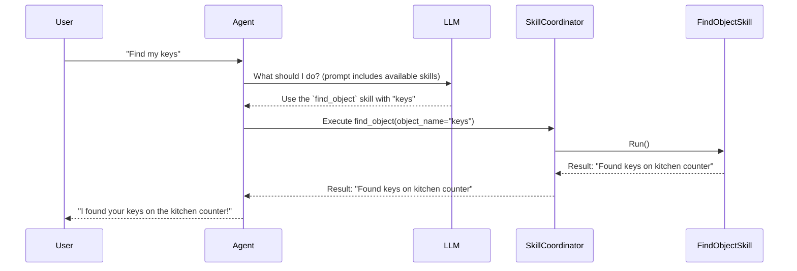

# Chapter 1: Agent

Welcome to the `dimos` tutorials! We're going to start our journey with the most central and exciting concept: the **Agent**. Think of the Agent as the robot's brain. It's the part of the system that thinks, decides, and acts.

### What Problem Does the Agent Solve?

Imagine you want to tell a robot to do something simple, like "find my keys." How does the robot go from hearing your words to actually performing the task?

*   It needs to *understand* what "find my keys" means.
*   It needs to *plan* the steps: "Okay, I need to look around. Where should I look first? What do keys look like?"
*   It needs to *execute* those steps by moving its body and using its camera.

The **Agent** is the component that orchestrates this entire process. It connects human language to the robot's actions, making it the core of the robot's intelligence.

### The Captain of the Ship

A great way to think about the Agent is like the captain of a ship.

*   The captain **receives information**: from the crew, from the radar, or from headquarters (like a human giving a command).
*   The captain **makes a decision**: "We need to turn left to avoid that iceberg."
*   The captain **gives orders**: They don't steer the wheel themselves; they tell the crew, "Steer the ship to port."

Our Agent works the same way. It receives information (like your command), uses a Large Language Model (LLM) to "think" and make a decision, and then gives orders by calling the robot's [Skills](03_skills_.md).

### How an Agent Works: A Simple Example

Let's stick with our "find my keys" example. Here's a high-level look at what the Agent does.

1.  **You:** "Hey robot, find my keys."
2.  **Agent (Receives Command):** The Agent gets your text command.
3.  **Agent (Thinks with LLM):** It sends a question to its brain, a Large Language Model (like GPT-4o). The question is something like:
    > "A user wants me to 'find my keys'. I have a `find_object` skill. What should I do?"
4.  **LLM (Responds):** The LLM, understanding language and logic, responds:
    > "You should use the `find_object` skill and tell it the object to find is 'keys'."
5.  **Agent (Acts):** The Agent now knows what to do. It calls the `find_object` skill, which handles the robot's physical actions of navigating, scanning rooms, and looking for objects that match the description of "keys."

This cycle of receiving, thinking, and acting is the fundamental job of the Agent.

### Using an Agent in Code

Let's see what this looks like in code. While `dimos` can have many complex configurations, creating and talking to a basic Agent is straightforward.

Imagine we have an `Agent` and a simple `find_object` skill already set up. Here's how you would ask it to find your keys.

```python
# main.py

# Assume 'agent' is an already deployed Agent instance
# We'll learn how to deploy one in later chapters.
agent = get_my_robot_agent()

# Let's ask the agent to find the keys.
response = agent.query("find my keys")

# The agent will think, use its skills, and eventually respond.
print(response)
```

**What Happens?**

When you run `agent.query("find my keys")`, the Agent kicks off the "think-act" cycle we described above.

**Example Output:**

The final output you see might be a simple string confirming the result of the action:

```
"Okay, I am looking for your keys. ... I found the keys on the kitchen counter!"
```

Behind this simple response, the Agent used the LLM to decide to call the `find_object` skill, and that skill did the work of controlling the robot to locate the keys.

### Under the Hood: The Agent's Thought Process

So, how does the `query` method actually work? Let's trace the journey of your command through the `dimos` system.

First, here's a diagram showing the flow of communication.



The `Agent` is the central coordinator. It talks to the **LLM** to decide what to do and uses a **`SkillCoordinator`** to execute the chosen [Skills](03_skills_.md).

#### The Core Loop

The logic for this process lives inside a method called `agent_loop`. Let's look at a simplified version of it to understand the key steps.

**Step 1: Thinking (Invoking the LLM)**

The first thing the agent does is consult the LLM. It takes the entire conversation history (so it has context) and asks the LLM for the next step.

```python
# Simplified from agents2/agent.py

class Agent:
    def agent_loop(self, query):
        # ... setup code ...

        # Combine your new query with past messages
        full_history = self.history()

        # Ask the LLM what to do next
        # This is the "thinking" part!
        msg = self._llm.invoke(full_history)

        # ... acting code ...
```

The `msg` returned by the LLM isn't just a sentence; it's a structured response. If the LLM decides the robot should take an action, the `msg` will contain a "tool call"—an instruction to use a specific skill.

**Step 2: Acting (Executing Skills)**

If the LLM's response includes a tool call, the Agent executes it.

```python
# Simplified from agents2/agent.py

class Agent:
    def agent_loop(self, query):
        # ... thinking code from above ...

        # Check if the LLM decided to use a skill
        if msg.tool_calls:
            # This is the "acting" part!
            self.execute_tool_calls(msg.tool_calls)

        # ... loop until the task is done ...
```

The `execute_tool_calls` method passes the job to the `SkillCoordinator`.

**Step 3: The Skill Coordinator Takes Over**

The `SkillCoordinator` is a manager responsible for running skills. Its `call_skill` method finds the right skill and tells it to run with the arguments provided by the LLM.

```python
# Simplified from protocol/skill/coordinator.py

class SkillCoordinator:
    def call_skill(self, call_id, skill_name, args):
        # Find the skill the LLM asked for
        skill_config = self.get_skill_config(skill_name)
        if not skill_config:
            # Handle error: skill not found
            return

        # Tell the skill to run with the given arguments
        return skill_config.call(call_id, **args)
```

The skill then runs, controlling the robot's hardware. Once it's done, it reports its result back up the chain, and the Agent can finally give you a final answer.

### Conclusion

You've just learned about the most important concept in `dimos`: the **Agent**.

*   The Agent is the **brain** of the robot.
*   It uses a **Large Language Model (LLM)** to understand commands and make decisions.
*   It acts by calling **[Skills](03_skills_.md)**, which are the robot's tools for interacting with the world.
*   This "think-act" loop allows the robot to turn high-level goals (like "find my keys") into concrete actions.

But for an Agent to make good decisions about the physical world, it needs to be able to *see* it. How does the robot process video from its cameras and understand what's in front of it? We'll explore that in the next chapter.

Next up: [Perception Pipeline](02_perception_pipeline_.md)

---

Generated by [AI Codebase Knowledge Builder](https://github.com/The-Pocket/Tutorial-Codebase-Knowledge)