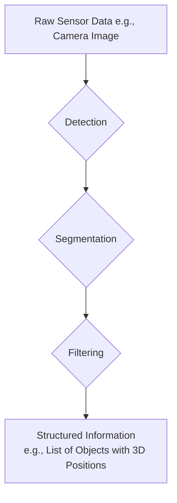
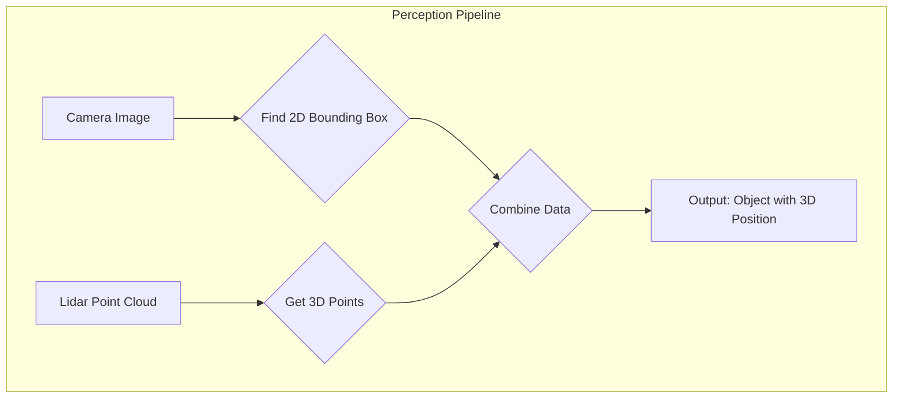
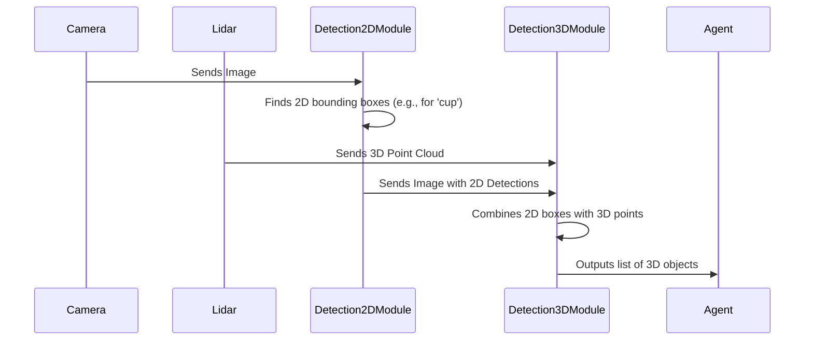

# Chapter 2: Perception Pipeline

In the last chapter, we learned about the [Agent](01_agent_.md), the robot's brain that makes decisions. But for a brain to make good decisions about the real world, it needs senses. It needs to see, hear, and feel its environment.

This is where the **Perception Pipeline** comes in. Think of it as the robot's eyes and visual cortex combined.

### What Problem Does the Perception Pipeline Solve?

Imagine our [Agent](01_agent_.md) is given the command "find the red cup." The robot's camera sees this:


This image is just a grid of pixels to a computer. It has no inherent meaning. The robot doesn't know what a "cup" is or where it is in 3D space.

The **Perception Pipeline** solves this problem. It takes raw, messy sensor data (like this camera image) and processes it into a clean, structured understanding of the world that the [Agent](01_agent_.md) can use.

**Input (Raw Data):** A stream of camera images.
**Output (Structured Information):** "I see a 'red cup' at position (x: 1.5, y: 0.2, z: 0.8)."

### The Three Key Stages of Perception

The pipeline works in a series of stages, much like how our own brains process vision. The most common stages are Detection, Segmentation, and Filtering.



#### 1. Detection: Finding Objects

Detection is the first step: finding *where* the objects are. The system scans the image and draws bounding boxes around anything that looks like a distinct object.

*   **Analogy:** It's like quickly drawing a rectangle around every interesting thing you see in a picture.

Here's what our example image looks like after detection:


#### 2. Segmentation: Outlining Shapes

A bounding box is good, but it's not very precise. It includes a lot of background. Segmentation is the process of figuring out the *exact* pixels that belong to an object, creating a "mask."

*   **Analogy:** It's like carefully tracing the outline of each object with a pair of scissors.

This gives the robot a much better understanding of an object's true shape.


#### 3. Filtering: Cleaning Up the Data

Sensor data is often noisy. A camera might have glare, or a 3D Lidar sensor might pick up stray points from reflective surfaces. Filtering cleans up this noise so the robot can focus on the real objects.

*   **Analogy:** It's like wiping a smudge off your glasses to see more clearly.

For example, filtering can remove random, isolated points from a 3D point cloud, making the shapes of objects much clearer.

### From 2D Pixels to 3D Positions

A camera image is flat. How does the robot know the cup is 1.5 meters away and not 10?

The Perception Pipeline combines the 2D information from a camera with depth information from another sensor, like a Lidar or a depth camera. By overlaying the 2D bounding box on the 3D depth data, it can calculate the object's real-world position, size, and orientation.



### Using Perception in Code

In `dimos`, you don't usually call each stage manually. Instead, you use a module that bundles them into a convenient stream of data. The `ObjectDetectionStream` is a perfect example.

Let's imagine we have a `video_stream` from the robot's camera. We can create a perception pipeline like this:

```python
# Assume 'video_stream' is an observable stream of images
# and 'camera_intrinsics' holds our camera's calibration data.

# 1. Create the perception pipeline
detection_stream = ObjectDetectionStream(
    video_stream=video_stream,
    camera_intrinsics=my_camera_intrinsics
)

# 2. Get the stream of structured object data
object_data_stream = detection_stream.get_stream()

# 3. Subscribe to the stream to see the results
object_data_stream.subscribe(
    lambda data: print(f"Found {len(data['objects'])} objects!")
)
```

**What Happens?**

This code sets up a pipeline that runs in the background. For every new image from the camera, it performs detection and 3D calculation. The `subscribe` call lets us peek at the output.

**Example Output:**

Every time the pipeline processes a frame, it will print a message. The `data` variable it receives is a dictionary containing the processed frame and, most importantly, a list of found objects.

```
Found 3 objects!
Found 3 objects!
...
```

The `data['objects']` list contains rich information that the [Agent](01_agent_.md) can use:

```python
# A simplified look at what one object's data might look like
one_object = {
    "label": "cup",
    "confidence": 0.95,
    "position": Vector(x=1.5, y=0.2, z=0.8),
    "size": {"width": 0.08, "height": 0.1}
}
```

### Under the Hood: The Journey of an Image

Let's trace how a single camera image and a lidar scan become a 3D object that the Agent can understand.



#### Step 1: 2D Detection

First, a module like `Detection2DModule` receives the raw image. Its main job is to run a detection model (like YOLO) on the image.

```python
# Simplified from perception/detection/module2D.py

class Detection2DModule(Module):
    def process_image_frame(self, image: Image) -> ImageDetections2D:
        # This is the core detection step!
        # It uses a pre-trained model to find objects in the image.
        imageDetections = self.detector.process_image(image)
        
        # It can also filter out unwanted detections
        return imageDetections.filter(...)
```
This step gives us the bounding boxes and labels ("cup," "laptop," etc.), but only in 2D pixel coordinates.

#### Step 2: Going 3D

Next, the `Detection3DModule` takes the 2D results and combines them with a 3D point cloud from a Lidar.

```python
# Simplified from perception/detection/module3D.py

class Detection3DModule(Detection2DModule):
    def process_frame(
        self,
        detections2d: ImageDetections2D,
        pointcloud: PointCloud2,
        # ... other info ...
    ) -> ImageDetections3DPC:
        
        detection3d_list = []
        # Loop through each object found in the 2D image
        for detection in detections2d:
            # Project the 2D box into 3D space using the point cloud
            detection3d = Detection3DPC.from_2d(
                detection,
                world_pointcloud=pointcloud,
                # ...
            )
            detection3d_list.append(detection3d)

        return ImageDetections3DPC(detections2d.image, detection3d_list)
```

This function iterates through each 2D detection and uses the `pointcloud` data to find its location in 3D space, finally producing the structured data our Agent needs.

### Conclusion

You've now learned about the robot's "senses"—the **Perception Pipeline**.

*   It turns **raw sensor data** (like images) into **structured information** (like a list of objects with 3D positions).
*   It works through key stages like **Detection**, **Segmentation**, and **Filtering**.
*   This structured output is what allows the [Agent](01_agent_.md) to reason about the physical world.

The robot can now see and understand its environment. But how does it actually *do* things, like move its arm to pick up that cup? For that, we need a toolbox of actions.

Next up: [Skills](03_skills_.md)

---

Generated by [AI Codebase Knowledge Builder](https://github.com/The-Pocket/Tutorial-Codebase-Knowledge)