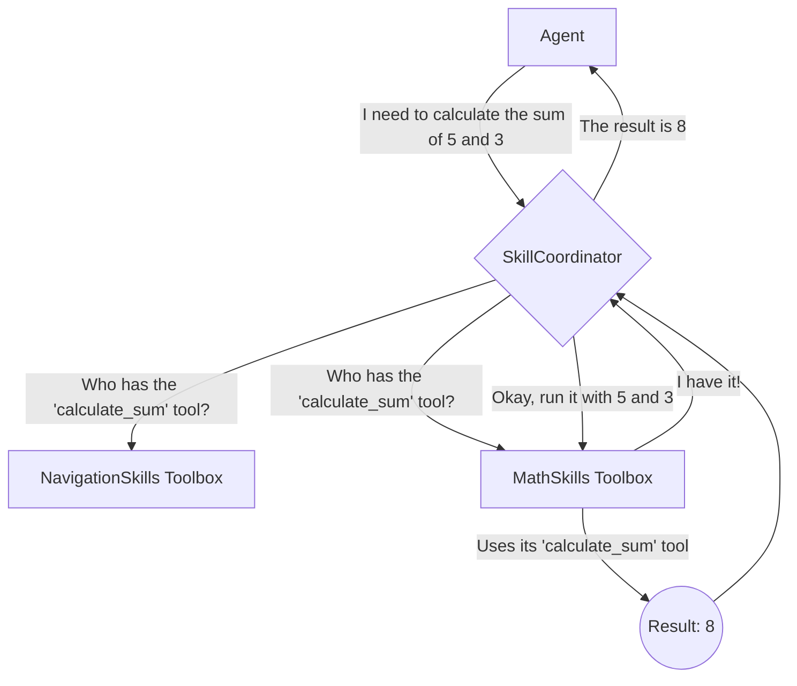
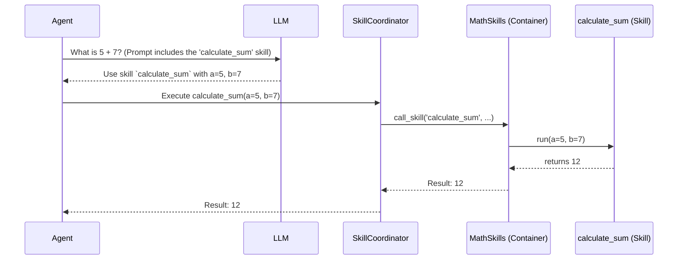

# Chapter 3: Skills

In the previous chapter on the [Perception Pipeline](02_perception_pipeline_.md), we gave our robot the ability to "see" and understand its environment. Now it's time to give it the ability to *act*.

This is where **Skills** come in. Skills are the robot's toolbox of actions. They are the fundamental building blocks that allow the [Agent](01_agent_.md) to interact with the world.

### What Problem Do Skills Solve?

The [Agent](01_agent_.md) is smart, but it doesn't know how to directly control the robot's motors or speakers. It needs a simple, clean list of abilities it can call upon, just like a manager delegates tasks to a team.

Imagine you want the robot to do two things:
1.  Navigate to the kitchen.
2.  Calculate the sum of 5 and 7.

These are very different tasks. One involves physical movement, and the other is pure computation. How can we expose both of these abilities to the AI [Agent](01_agent_.md) in a consistent way?

**Skills** solve this problem by providing a standardized way to define the robot's capabilities, whether they are physical or digital. They turn complex robotics code into simple functions that the AI can understand and use.

### The Three Key Parts of the Skill System

It's helpful to think of the Skill system using an analogy: a workshop.

1.  **Skill:** A single tool, like a screwdriver or a calculator. In `dimos`, a Skill is a simple Python function that performs one specific action.
2.  **SkillContainer:** A toolbox that holds a set of related tools. A `SkillContainer` is a Python class that groups related skills together, like a `NavigationSkills` toolbox or a `MathSkills` toolbox.
3.  **SkillCoordinator:** The workshop manager. The `SkillCoordinator` receives a request from the [Agent](01_agent_.md) (e.g., "I need to calculate a sum"), finds the right toolbox (`MathSkills`), gets the right tool (`calculate_sum`), and runs it.



This system keeps the robot's abilities organized, modular, and easy for the AI to discover and use.

### How to Create a Skill

Creating a skill is incredibly simple. You just write a standard Python function and add a `@skill` decorator to it.

Let's create a `MathSkills` toolbox.

**Step 1: Create the SkillContainer (the toolbox)**

First, we define a class that inherits from `SkillContainer`.

```python
# skills/math_skills.py

from dimos.protocol.skill.skill import SkillContainer, skill

class MathSkills(SkillContainer):
    # Our skills will go here
    pass
```
This class will be our "toolbox" for holding math-related skills.

**Step 2: Define a Skill (the tool)**

Now, let's add a function to calculate a sum. We mark it with the `@skill` decorator to let `dimos` know it's an ability available to the [Agent](01_agent_.md).

```python
# skills/math_skills.py

from dimos.protocol.skill.skill import SkillContainer, skill

class MathSkills(SkillContainer):
    @skill()
    def calculate_sum(self, a: int, b: int) -> int:
        """Calculates the sum of two integers."""
        print(f"Calculating {a} + {b}...")
        return a + b
```

That's it! You've just created a skill. The docstring `"""Calculates the sum of two integers."""` is very important, as the AI uses this description to understand what the skill does.

**Step 3: Register the Toolbox with the Manager**

Finally, the `SkillCoordinator` (the manager) needs to know about our new toolbox. This is usually done when setting up the robot system.

```python
# main.py

# Assume 'coordinator' is our SkillCoordinator instance
coordinator = get_skill_coordinator()
math_toolbox = MathSkills()

# Tell the coordinator about our new set of skills
coordinator.register_skills(math_toolbox)
```

Now, when the [Agent](01_agent_.md) asks the `SkillCoordinator` for a list of available tools, `calculate_sum` will be on that list.

**Example: The Agent Uses Our Skill**

If you tell the [Agent](01_agent_.md), "Hey robot, what is 5 plus 7?", here's what happens:
1.  The [Agent](01_agent_.md) asks its LLM: "The user wants to know '5 plus 7'. I have a skill called `calculate_sum`. What should I do?"
2.  The LLM replies: "Call the `calculate_sum` skill with `a=5` and `b=7`."
3.  The [Agent](01_agent_.md) tells the `SkillCoordinator` to run `calculate_sum(a=5, b=7)`.
4.  The `SkillCoordinator` finds our `MathSkills` container and calls the function.
5.  Your function runs, prints `"Calculating 5 + 7..."`, and returns `12`.
6.  The [Agent](01_agent_.md) gets the result and replies to you: "The sum of 5 and 7 is 12."

### Under the Hood: The Journey of a Skill Call

Let's trace the command through the system with a diagram.



The `SkillCoordinator` acts as the central router, ensuring the [Agent](01_agent_.md)'s request gets to the right place.

#### Step 1: The `@skill` Decorator Attaches Information

When you add `@skill()` to your function, it's doing something important behind the scenes. It wraps your function and attaches a `SkillConfig` object to it.

```python
# Simplified from protocol/skill/skill.py

def skill(...) -> Callable:
    def decorator(f: Callable[..., Any]) -> Any:
        # Create a configuration object with details about the skill
        skill_config = SkillConfig(
            name=f.__name__,
            schema=function_to_schema(f), # Analyzes function for AI
            # ... other settings ...
        )

        # Attach the config to the function itself
        wrapper._skill_config = skill_config
        return wrapper
    return decorator
```
This `SkillConfig` is like a label on the tool that tells the `SkillCoordinator` everything it needs to know: its name, what arguments it takes, and what it does (from the docstring).

#### Step 2: The Container Exposes Its Skills

The `SkillContainer` has a special method called `skills()` that the `SkillCoordinator` uses to see what tools are inside.

```python
# Simplified from protocol/skill/skill.py

class SkillContainer:
    @rpc
    def skills(self) -> dict[str, SkillConfig]:
        # Look through all my attributes...
        return {
            name: getattr(self, name)._skill_config
            for name in dir(self)
            # ...and find the ones that have a _skill_config attached!
            if hasattr(getattr(self, name), "_skill_config")
        }
```
When `coordinator.register_skills(math_toolbox)` is called, the coordinator calls this `skills()` method to get a list of all available tools and their configurations.

#### Step 3: The Coordinator Executes the Call

When the [Agent](01_agent_.md) decides to use a skill, it tells the `SkillCoordinator`. The coordinator's `call_skill` method looks up the skill in its registry and executes it on the correct container.

```python
# Simplified from protocol/skill/coordinator.py

class SkillCoordinator:
    def call_skill(self, call_id: str, skill_name: str, args: dict[str, Any]):
        # Find the configuration for the requested skill
        skill_config = self.get_skill_config(skill_name)
        if not skill_config:
            # Handle error: skill not found
            return

        # The config knows which function to run!
        # It calls the actual method on the container instance.
        return skill_config.call(call_id, **args)
```
This process cleanly separates the AI's *decision* to act from the *execution* of the action.

### Conclusion

You've just learned about the robot's toolbox: the **Skill system**.

*   A **Skill** is a single action, defined as a Python function with a `@skill` decorator.
*   A **SkillContainer** is a "toolbox" class that groups related skills.
*   The **SkillCoordinator** is the "manager" that finds and runs the correct skill when the [Agent](01_agent_.md) requests it.

This powerful system allows us to create a library of modular, reusable, and AI-friendly capabilities for our robot.

We've talked about what the robot sees and what it can do. But one of the most important things a mobile robot can do is move from one place to another. How is that complex task managed?

Next up: [Navigation Stack](04_navigation_stack_.md)

---

Generated by [AI Codebase Knowledge Builder](https://github.com/The-Pocket/Tutorial-Codebase-Knowledge)