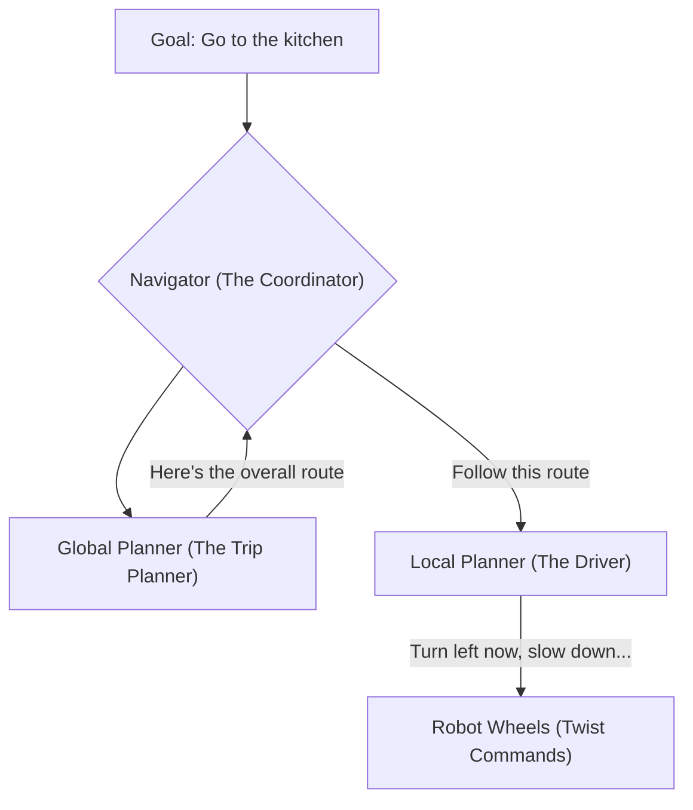
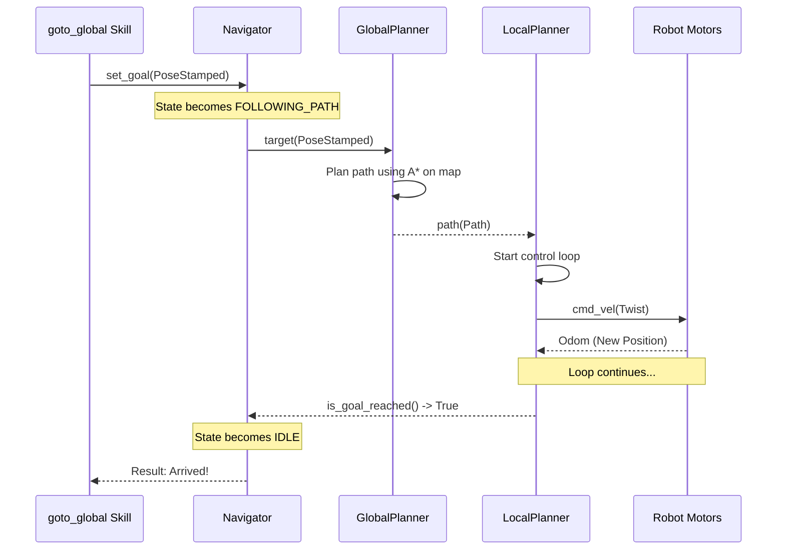

# Chapter 4: Navigation Stack

In the last chapter, we learned about [Skills](03_skills_.md), the robot's toolbox for performing actions. One of the most important things a mobile robot can do is move from one place to another. But navigating a complex environment is far too tricky for a single, simple skill. It requires a dedicated, intelligent system.

This is where the **Navigation Stack** comes in. Think of it as the robot's GPS and self-driving system, all rolled into one.

### What Problem Does the Navigation Stack Solve?

Let's say you tell the [Agent](01_agent_.md), "Go to the kitchen." The robot is in the living room. How does it get there?

*   It can't just drive forward. There might be a sofa in the way.
*   It needs a map of the house to know where the kitchen is.
*   It needs to plan a route that avoids walls and furniture.
*   As it moves, it needs to watch out for unexpected obstacles, like a person walking by or a pet on the floor.

The **Navigation Stack** is the specialized system that handles this entire process, from high-level planning to the low-level commands that turn the wheels. It turns a simple goal like "go to (x, y)" into a series of safe, precise movements.

### The Three Key Players in Navigation

The best way to understand the Navigation Stack is to think of it like planning a road trip. You have three key roles: the Trip Planner, the Driver, and the Coordinator.



1.  **Global Planner (The Trip Planner):** This is like your GPS app (e.g., Google Maps). It looks at the entire map of the environment and calculates the best *overall path* from your starting point to your destination. It finds a route that avoids all the known, large obstacles like walls and big furniture.

2.  **Local Planner (The Driver):** This is like the driver behind the wheel. The driver doesn't focus on the final destination; they focus on the next 50 feet of road. The Local Planner's job is to follow the path given by the Global Planner while handling *immediate, local* challenges. It steers around small, unexpected obstacles and makes sure the robot's wheels are turning at the right speed.

3.  **Navigator (The Coordinator):** This is the manager that oversees the whole operation. When it receives a destination, it first asks the `GlobalPlanner` for a route. Once it has the route, it hands it off to the `LocalPlanner` and says, "Execute this." It monitors the progress and reports back when the goal has been reached.

### How Navigation Works in `dimos`

Let's trace what happens when an [Agent](01_agent_.md) uses a skill like `goto_global(x=10, y=5)`.

1.  The `goto_global` [Skill](03_skills_.md) is called.
2.  The skill doesn't know how to move the robot. Instead, it sends the goal coordinates `(10, 5)` to the `Navigator`.
3.  The `Navigator` asks the `GlobalPlanner`, "Find me a path to (10, 5)."
4.  The `GlobalPlanner` looks at the saved map of the area, runs an algorithm (like A*), and produces a `Path`—a list of small waypoints to follow.
5.  The `Navigator` gives this `Path` to the `LocalPlanner`.
6.  The `LocalPlanner` starts its loop:
    *   Look at the robot's current position.
    *   Look at the next waypoint on the path.
    *   Check for immediate obstacles using live sensor data.
    *   Calculate the perfect speed and turn angle (`Twist` command) to get closer to the waypoint without crashing.
    *   Send this `Twist` command to the robot's motors.
7.  This loop repeats many times per second until the `LocalPlanner` reports that the final waypoint has been reached.

### Using Navigation in Code

You typically don't interact with the individual planners directly. You just give a goal to the main navigation system. In `dimos`, this is often done through a [Skill](03_skills_.md) that talks to the `Navigator`.

Let's look at a simplified version of the `goto_global` skill.

```python
# Simplified from navigation/rosnav.py

@skill()
def goto_global(self, x: float, y: float):
    """go to coordinates x,y in the map frame"""
    
    # 1. Create a goal message with the desired coordinates.
    target = PoseStamped(
        frame_id="map",
        position=Vector3(x, y, 0.0),
        # ... other details ...
    )

    # 2. Ask the navigation system to handle it.
    # This is a non-blocking call. The navigation happens
    # in the background.
    self.navigate_to(target)

    return "Okay, moving to the new location."
```

When this skill is called, it simply packages the `x` and `y` coordinates into a `PoseStamped` message and passes it to `self.navigate_to()`. The entire complex process we described above is kicked off by that single function call.

**Example Input:**
`agent.query("go to position 10, 5")`

**What Happens:**
The robot will start moving. It will first plan a route and then begin following it, smoothly avoiding any obstacles in its path. It won't respond with a final answer until it has arrived at the destination.

### Under the Hood: The Journey of a Goal

Let's visualize the communication between the modules. When you ask the robot to go to a location, a chain reaction of messages occurs.



#### Step 1: The Navigator Receives the Goal

The `BehaviorTreeNavigator` is our coordinator. Its `set_goal` method is the entry point. It transforms the goal into the correct coordinate frame and changes its internal state to start the process.

```python
# Simplified from navigation/bt_navigator/navigator.py

class BehaviorTreeNavigator(Module, NavigationInterface):
    @rpc
    def set_goal(self, goal: PoseStamped) -> bool:
        """Set a new navigation goal."""
        
        # ... code to transform goal ...
        
        with self.goal_lock:
            self.current_goal = transformed_goal
        
        # This is the key part: we are now in navigation mode!
        with self.state_lock:
            self.state = NavigationState.FOLLOWING_PATH
            
        return True
```
Once the state is `FOLLOWING_PATH`, its main control loop becomes active.

#### Step 2: The Global Planner Makes a Plan

The `Navigator`'s control loop publishes the goal to the `GlobalPlanner`. The `AstarPlanner` listens for this goal. When it receives one, it plans a path.

```python
# Simplified from navigation/global_planner/planner.py

class AstarPlanner(Module):
    def _on_target(self, goal: PoseStamped) -> None:
        """Handle incoming target and trigger planning."""
        if self.latest_costmap is None or self.latest_odom is None:
            return

        # The core planning step using the A* algorithm
        path = astar(self.latest_costmap, goal.position, self.latest_odom.position)

        if path:
            # Publish the resulting path for the Local Planner
            self.path.publish(path)
```

This planner uses the `astar` algorithm on a `costmap` (a grid representing obstacles) to find the most efficient path.

#### Step 3: The Local Planner Takes Over

The `BaseLocalPlanner` is always listening for a new path. When the `GlobalPlanner` publishes one, the local planner's control loop starts.

```python
# Simplified from navigation/local_planner/local_planner.py

class BaseLocalPlanner(Module):
    def _on_path(self, msg: Path) -> None:
        """A new path has been received!"""
        self.latest_path = msg
        # Start the thread that will follow the path.
        self._start_planning_thread()

    def _follow_path_loop(self) -> None:
        """Main loop that generates motor commands."""
        while not self.stop_planning.is_set():
            if self.is_goal_reached():
                break # We're done!
            
            # This is where the magic happens!
            cmd = self.compute_velocity()
            self.cmd_vel.publish(cmd)
            
            time.sleep(self.control_period)
```
The `compute_velocity` method (not shown) is the heart of the `LocalPlanner`. It performs the calculations to figure out exactly how fast the robot should move forward and how quickly it should turn to follow the path and avoid hitting anything.

### Conclusion

You now understand the robot's self-driving system, the **Navigation Stack**.

*   It's a multi-part system designed for robustly moving the robot from point A to B.
*   The **Global Planner** acts like a GPS, creating a long-range plan.
*   The **Local Planner** acts like a driver, handling immediate movements and obstacle avoidance.
*   The **Navigator** coordinates the entire process, starting the plan and monitoring its execution.

This separation of concerns makes the navigation system powerful and flexible. We've seen how these different components are implemented as separate, communicating pieces of code. But what is the underlying structure that allows us to build and connect these pieces?

Next up: [Module System](05_module_system_.md)

---

Generated by [AI Codebase Knowledge Builder](https://github.com/The-Pocket/Tutorial-Codebase-Knowledge)