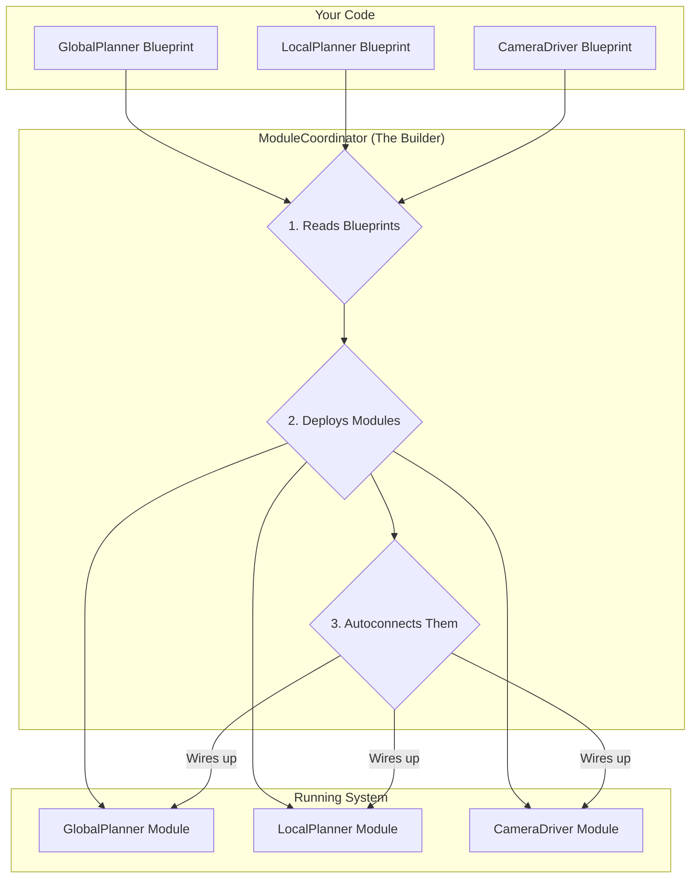
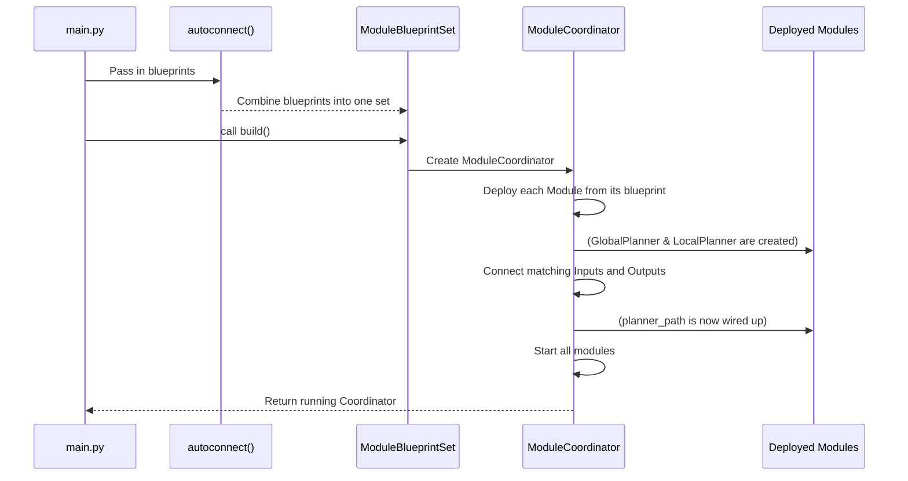

# Chapter 5: Module System

In the last chapter, we explored the [Navigation Stack](04_navigation_stack_.md), a complex system made of multiple cooperating parts like the `GlobalPlanner` and `LocalPlanner`. We saw how they work together to move the robot.

But this raises a crucial question: How do we build such a system? How do we take all these separate pieces of code, run them, and make sure they're all connected correctly to talk to each other?

This is the job of the **Module System**. It's the factory and assembly line for our robot's software.

### What Problem Does the Module System Solve?

Imagine building a robot's software from LEGO bricks.

*   You have a "camera" brick, a "wheel motor" brick, and a "navigation planner" brick.
*   Each brick needs to be turned on.
*   The camera brick needs to be connected to the navigation brick so it can see obstacles.
*   The navigation brick needs to be connected to the wheel motor brick to drive the robot.

Doing this manually for a complex robot with dozens of components would be a nightmare. You'd have to write tons of boilerplate code just to wire everything up.

The **Module System** solves this by providing a simple, declarative way to describe your robot's software architecture. You just tell it *what* pieces you need and it handles the *how* of building and connecting them.

### The LEGO Bricks of Dimos

The Module System has three core concepts that fit our LEGO analogy perfectly.

1.  **`Module` (The LEGO Brick):** A `Module` is a self-contained piece of software that does one specific job. The `GlobalPlanner` from the last chapter is a `Module`. The `LocalPlanner` is another `Module`. Think of each one as a specialized brick.

2.  **`ModuleBlueprint` (The Instruction Manual):** You don't use the `Module` class directly. Instead, you create a `ModuleBlueprint` from it. This blueprint is like the instruction manual for a single brick. It tells the system, "I need one of these bricks, built in this specific way."

3.  **`ModuleCoordinator` (The Builder):** This is the person who assembles the final model. The `ModuleCoordinator` takes all your blueprints, builds the modules, and then uses a master plan to connect them all together, making sure they are correctly wired up to work as a complete system.



### How to Build a System

Let's see how we can use these concepts to build a simplified version of our navigation stack.

#### Step 1: Create Blueprints for Each Module

Every `Module` in `dimos` has a special `blueprint()` method that creates its instruction manual. Let's create blueprints for our two main navigation planners.

```python
# main.py
from navigation.global_planner import AstarPlanner
from navigation.local_planner import BaseLocalPlanner

# Create a blueprint for the A* global planner module.
global_planner_bp = AstarPlanner.blueprint()

# Create a blueprint for the base local planner module.
local_planner_bp = BaseLocalPlanner.blueprint()
```
That's it! We now have two "instruction manuals." We haven't built anything yet; we've just declared what we *want* to build.

#### Step 2: Combine Blueprints into a Master Plan

Now we need a master plan that includes all the parts we need. The `autoconnect` function is perfect for this. It takes any number of blueprints and bundles them into a single `ModuleBlueprintSet`.

```python
# main.py
from dimos.core import autoconnect
# ... (previous blueprint code) ...

# Combine our blueprints into one master plan.
# 'autoconnect' understands how these modules should
# be wired together based on their inputs and outputs.
navigation_system_plan = autoconnect(
    global_planner_bp,
    local_planner_bp,
)
```
This `navigation_system_plan` is now the complete architectural plan for our navigation system.

#### Step 3: Build and Run the System

This is the final and easiest step. We just tell our master plan to `build()` itself. This creates a `ModuleCoordinator` that handles the entire assembly process.

```python
# main.py
# ... (previous plan code) ...

# The 'build' command creates a ModuleCoordinator,
# deploys all modules, and connects them.
coordinator = navigation_system_plan.build()

print("Navigation system is running!")

# This keeps the program alive so the modules can run.
coordinator.loop()
```

**What Happens?**

When you run this code, `dimos` performs a series of actions in the background:
1.  It starts up a `ModuleCoordinator`.
2.  The coordinator reads your `navigation_system_plan`.
3.  It deploys the `AstarPlanner` and `BaseLocalPlanner` modules, giving each its own process to run in.
4.  Crucially, it inspects their inputs and outputs. It sees that `AstarPlanner` outputs a `Path` and `BaseLocalPlanner` expects a `Path` as input. It automatically "wires" them together.
5.  It starts both modules, and your navigation system is now live and ready for goals.

### Under the Hood: The Journey of a Blueprint

How does this "magic" of `autoconnect` actually work? Let's trace the process.



#### Step 1: Creating a Blueprint (`_make_module_blueprint`)

When you call `AstarPlanner.blueprint()`, a function looks inside the `AstarPlanner` class. It scans for special type hints called `In` and `Out`, which define the module's connection points.

```python
# Simplified from core/blueprints.py

def _make_module_blueprint(module: type[Module], ...):
    connections = []
    # Look at all the type hints in the Module class...
    for name, annotation in get_type_hints(module).items():
        origin = get_origin(annotation) # Is it In<> or Out<>?

        # If we find an 'In' or 'Out', it's a connection point!
        if origin in (In, Out):
            direction = "in" if origin == In else "out"
            type_ = get_args(annotation)[0]
            # Record the connection's name, type, and direction.
            connections.append(ModuleConnection(name, type_, direction))

    return ModuleBlueprint(module=module, connections=tuple(connections), ...)
```
This process creates a data structure that knows, for example, that `AstarPlanner` has an *output* named `path` of type `Path`.

#### Step 2: Assembling the System (`_connect_transports`)

The most important work happens inside the `build()` method. After deploying all the modules, the coordinator runs a connection routine. It groups all the inputs and outputs from all the blueprints by their name and type.

```python
# Simplified from core/blueprints.py

class ModuleBlueprintSet:
    def _connect_transports(self, module_coordinator: ModuleCoordinator):
        # First, gather all connection points from all blueprints.
        connections = defaultdict(list)
        for blueprint in self.blueprints:
            for conn in blueprint.connections:
                # Group them by name and type, e.g., ('path', <class 'Path'>)
                connections[conn.name, conn.type].append(blueprint.module)

        # Now, wire them up!
        for (name, type), modules in connections.items():
            # If an input and output have the same name and type,
            # they belong on the same "wire".
            # Create a transport (the wire) for them.
            transport = self._get_transport_for(name, type)

            # Tell each module to use this wire for that connection.
            for module in modules:
                instance = module_coordinator.get_instance(module)
                instance.set_transport(name, transport)
```
This is the heart of `autoconnect`. It finds matching pairs of `In` and `Out` across your entire system and creates a communication channel—a "transport"—to link them. It's like a roboticist plugging in all the cables for you.

### Conclusion

You've now learned about the backbone of any `dimos` application: the **Module System**.

*   A **`Module`** is a self-contained component, like a LEGO brick.
*   A **`ModuleBlueprint`** is the instruction manual for creating a specific `Module`.
*   The **`ModuleCoordinator`** is the builder that assembles everything based on your blueprints.
*   The **`autoconnect`** function gathers your blueprints into a master plan, allowing the coordinator to automatically wire up the entire system.

This system lets you define complex software architectures in a clean, declarative, and manageable way. We saw that the `ModuleCoordinator` connects modules using "transports," but what are those exactly? What different kinds of "wires" can we use to connect our bricks?

Next up: [Streams and Transports](06_streams_and_transports_.md)

---

Generated by [AI Codebase Knowledge Builder](https://github.com/The-Pocket/Tutorial-Codebase-Knowledge)