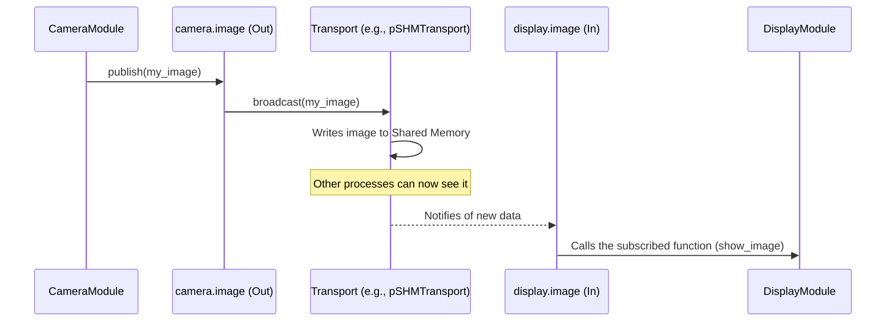

# Chapter 6: Streams and Transports

In the previous chapter on the [Module System](05_module_system_.md), we learned how to build our robot's software from LEGO-like `Module` bricks. We saw that the `autoconnect` function can magically wire these modules together.

But what are these "wires"? How does data actually get from a `CameraModule` to a `Navigation` module?

This is where **Streams** and **Transports** come in. They are the plumbing system that allows data to flow through your `dimos` application.

### What Problem Do Streams and Transports Solve?

Let's stick with our LEGO house analogy. If `Module`s are the rooms in the house (the kitchen, the workshop), then:

*   **Streams** are the pipes connecting them. An `Out` stream is an outlet pipe, and an `In` stream is an inlet pipe. They define the connection points.
*   A **Transport** is the *type* of material the pipe is made of. Is it a copper pipe for water? A big PVC pipe for drainage? An electrical wire?

This system solves a critical problem: it separates *what* is being sent from *how* it is sent. A `CameraModule` shouldn't have to care if its video feed is going to another process on the same computer or to a different computer across the network. It just wants to send data out of its `Out` pipe. The underlying `Transport` handles the rest.

### The Key Concepts: Pipes and Materials

#### 1. Streams (`In` and `Out`)

Streams are the connection points on a module. You declare them as type hints inside your `Module` class.

*   `Out[DataType]`: An **output stream**. This is a "faucet" where the module can send data out.
*   `In[DataType]`: An **input stream**. This is a "drain" where the module can receive data from another module.

The `DataType` tells `dimos` what kind of data will flow through this stream, like an `Image` or a `Path`.

```mermaid
graph TD
    subgraph CameraModule
        direction LR
        A[Image Data] --> B[image_out: Out[Image]];
    end

    subgraph DisplayModule
        direction LR
        C[image_in: In[Image]] --> D[Show on Screen];
    end

    B -- Data Flow --> C;
```

#### 2. Transports

A `Transport` is the actual communication mechanism used to connect an `Out` stream to an `In` stream. `dimos` provides several types of "pipe materials" for different jobs.

*   **`pSHMTransport` (Shared Memory):** This is like a high-speed conveyor belt. It's incredibly fast for moving large amounts of data (like images) between modules running on the *same computer*. It works by putting the data in a special memory location that both modules can access directly.
*   **`pLCMTransport` (Network Broadcast):** This is like a radio broadcast. It uses the network to send messages. It's perfect for sending smaller messages to many different modules, even if they are on different computers.

The beauty is that your `Module` code doesn't change. The `ModuleCoordinator` picks the right `Transport` when it wires everything up.

### How to Use Streams

Let's build a very simple system with two modules: a `Camera` that produces images and a `Display` that shows them.

#### Step 1: Define the `CameraModule` with an `Out` Stream

Our `CameraModule` needs an output for the images it captures. We declare this with `image: Out[Image]`.

```python
# modules/camera.py
from dimos.core import Module, Out
from dimos.msgs.sensor_msgs import Image
import time

class CameraModule(Module):
    # This is our output pipe for images.
    image: Out[Image]

    def run(self):
        # In a real module, this would get images from a camera.
        # Here, we'll just pretend.
        while True:
            fake_image = Image.new_random() # Create a dummy image
            print("Camera: Sending a new image...")
            self.image.publish(fake_image)
            time.sleep(1)
```

The key line is `self.image.publish(fake_image)`. This is how the module sends data out through its `Out` stream.

#### Step 2: Define the `DisplayModule` with an `In` Stream

Our `DisplayModule` needs an input to receive images. We declare this with `image: In[Image]`.

```python
# modules/display.py
from dimos.core import Module, In
from dimos.msgs.sensor_msgs import Image

class DisplayModule(Module):
    # This is our input pipe for images.
    image: In[Image]

    def run(self):
        # We subscribe to the input stream.
        # The 'self.show_image' function will be called
        # every time a new image arrives.
        self.image.subscribe(self.show_image)
        
    def show_image(self, received_image: Image):
        print(f"Display: Got an image of size {received_image.width}x{received_image.height}!")
```

The key line is `self.image.subscribe(self.show_image)`. This tells the `In` stream, "Hey, whenever you get data, please run my `show_image` function."

#### Step 3: Connect Them with `autoconnect`

Just like in the last chapter, we use `autoconnect` to create a plan. `dimos` is smart enough to see that both modules have a stream named `image` of type `Image`. It will automatically connect them.

```python
# main.py
from dimos.core import autoconnect
from modules.camera import CameraModule
from modules.display import DisplayModule

# Create a plan to connect the camera's output to the display's input.
system_plan = autoconnect(
    CameraModule.blueprint(name="camera"),
    DisplayModule.blueprint(name="display"),
)

# Build and run the system.
coordinator = system_plan.build()
coordinator.loop()
```

**What Happens?**

When you run this code, the `ModuleCoordinator` will:
1.  Start the `CameraModule` and `DisplayModule`.
2.  See that `camera.image` is an `Out[Image]` and `display.image` is an `In[Image]`.
3.  Since they are on the same computer, it will choose a fast `pSHMTransport` (Shared Memory) to connect them.
4.  The `CameraModule` will start `publish`ing images, and the `DisplayModule` will immediately start receiving them and printing messages.

**Example Output:**

```
Camera: Sending a new image...
Display: Got an image of size 640x480!
Camera: Sending a new image...
Display: Got an image of size 640x480!
...
```

### Under the Hood: The Journey of a `publish` Call

How does a call to `publish` in one module trigger a function in another? It all happens through the `Transport`.



Let's look at the key pieces of code that make this happen.

#### Step 1: `Out.publish()` Hands Off to the Transport

When you call `publish()` on an `Out` stream, it doesn't do the communication itself. It just passes the message to its configured `_transport`.

```python
# Simplified from core/stream.py

class Out(Stream[T]):
    def publish(self, msg):
        if self._transport is None:
            raise Exception("Transport for stream is not specified")
        
        # The Out stream just tells its transport to send the message.
        self._transport.broadcast(self, msg)
```
This is the "separation of concerns" in action. The `Out` stream knows *what* to send, but the `Transport` knows *how*.

#### Step 2: The Transport Does the Real Work

The `broadcast` method of a specific `Transport`, like `pSHMTransport`, is where the data is actually moved. It uses a `SharedMemory` object to publish the data.

```python
# Simplified from core/transport.py

class pSHMTransport(PubSubTransport[T]):
    def __init__(self, topic: str):
        # It uses a SharedMemory pub/sub system under the hood.
        self.shm = PickleSharedMemory()

    def broadcast(self, _, msg):
        # When told to broadcast, it publishes to the shared memory topic.
        self.shm.publish(self.topic, msg)
```

This `shm.publish` call (from `protocol/pubsub/shmpubsub.py`) is a low-level function that serializes the data and writes it into a shared memory buffer that other processes can read.

#### Step 3: `In.subscribe()` Listens to the Transport

On the other side, the `In` stream's `subscribe` method registers a callback with the same `Transport`.

```python
# Simplified from core/stream.py

class In(Stream[T], ObservableMixin[T]):
    # returns an unsubscribe function
    def subscribe(self, cb) -> Callable[[], None]:
        # The In stream tells its transport to call `cb`
        # whenever a new message arrives.
        return self.transport.subscribe(cb, self)
```
The `pSHMTransport`'s `subscribe` method, in turn, tells the underlying `SharedMemory` system to listen for new messages on its topic and run the callback when one is received. This completes the circuit.

### Conclusion

You've now learned about the plumbing of `dimos`: **Streams and Transports**.

*   **Streams (`In` and `Out`)** are the connection points on a `Module`, defining where data enters and leaves.
*   **Transports (`pSHMTransport`, `pLCMTransport`)** are the underlying communication methods, the "pipe material" that actually moves the data.
*   This system powerfully separates the logic of your modules from the details of how they communicate.
*   You simply `publish` from an `Out` stream and `subscribe` to an `In` stream, and `dimos` handles the rest.

We've seen how `Image` data flows through these streams. But what exactly is an `Image` object? How do we define the structure of the data that flows between our modules?

Next up: [Message Types](07_message_types_.md)

---

Generated by [AI Codebase Knowledge Builder](https://github.com/The-Pocket/Tutorial-Codebase-Knowledge)