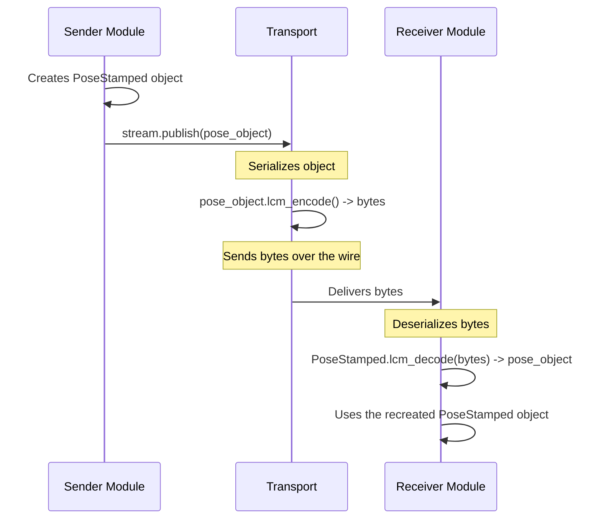

# Chapter 7: Message Types

In our last chapter on [Streams and Transports](06_streams_and_transports_.md), we learned about the "plumbing" of `dimos`. We saw how `Module`s can communicate through `In` and `Out` streams, which act like pipes connected by a `Transport`.

But what exactly flows through these pipes? If one module sends a jumble of bytes, how does the receiving module know if it's looking at a camera image, a robot's location, or a motor command?

This is the problem that **Message Types** solve. They are the standardized "data packages" that ensure communication is clear and unambiguous.

### What Problem Do Message Types Solve?

Imagine you're running a global shipping company. You can't just throw different goods onto a ship.

*   Bananas need a refrigerated container.
*   A car needs a large, flat container.
*   Grain needs a bulk cargo container.

Each container has a standard size, shape, and label that tells everyone what's inside and how to handle it.

**Message Types** are the shipping containers of `dimos`. They define the exact structure of the data being sent between [Module System](05_module_system_.md).

*   An `Image` message is like a refrigerated container for pixel data.
*   A `PoseStamped` message is like a container for a car, holding position and orientation data.
*   A `Twist` message is a small package with instructions for how fast the robot's wheels should turn.

When a module receives a message, it knows exactly what "shape" the data will have, what fields to expect, and how to "unpack" it. This eliminates guesswork and makes the whole system reliable.

### The Anatomy of a Message

A Message Type in `dimos` is simply a Python class that defines a set of attributes. Let's look at two of the most common ones.

#### 1. `PoseStamped`: A Position in Space

The `PoseStamped` message is used everywhere in robotics to describe an object's position and orientation at a specific moment in time.

It's "Stamped" because it has a time**stamp**.

Here's what its "shipping label" looks like:
*   `position`: Where is it? (An `x`, `y`, `z` coordinate).
*   `orientation`: Which way is it facing? (A `quaternion`).
*   `ts`: *When* was it at this position? (A timestamp).
*   `frame_id`: Where is this position relative to? (e.g., "the map" or "the robot's base").

This gives us a complete picture of an object's pose in space and time.

#### 2. `Image`: A Picture from a Camera

The `Image` message is used to send video frames. Its structure includes:
*   `data`: The actual pixel data, usually as a NumPy array.
*   `height`: The image height in pixels.
*   `width`: The image width in pixels.
*   `format`: The color format (e.g., `RGB`, `BGR`, `GRAY`).
*   `ts`: The timestamp of when the frame was captured.

### Using Message Types in Code

You've already seen Message Types in action in previous chapters! They are the objects you pass to `stream.publish()`. Let's create a couple from scratch.

#### Creating a `PoseStamped` Message

Imagine our [Perception Pipeline](02_perception_pipeline_.md) has found a cup at position `x=1.5, y=0.5` on the map. Here's how we'd create the message to send to the [Agent](01_agent_.md).

```python
import time
from dimos.msgs.geometry_msgs import PoseStamped, Vector3, Quaternion

# Create a message representing a pose.
# It's at position (1.5, 0.5, 0.0) relative to the "map" frame.
cup_pose = PoseStamped(
    ts=time.time(),
    frame_id="map",
    position=Vector3(1.5, 0.5, 0.0),
    orientation=Quaternion.identity() # No rotation
)

print(cup_pose)
```

This code creates a `PoseStamped` object, which is the standardized "package" for this information.

**Example Output:**
```
PoseStamped(pos=[1.500, 0.500, 0.000], euler=[0.000, 0.000, 0.000])
```

#### Creating an `Image` Message

Now let's create a dummy `Image` message, like one a camera module would produce.

```python
import numpy as np
from dimos.msgs.sensor_msgs import Image, ImageFormat

# Create a fake 640x480 black image using NumPy.
# The format is BGR (Blue, Green, Red), which is common.
fake_camera_data = np.zeros((480, 640, 3), dtype=np.uint8)

# Package the numpy array into a standard Image message.
image_msg = Image.from_numpy(
    fake_camera_data,
    format=ImageFormat.BGR
)

print(image_msg)
```

This code takes a raw NumPy array and wraps it in our standard `Image` container. Now, any other module that receives this message knows how to interpret the data.

**Example Output:**
```
Image(shape=(480, 640, 3), format=BGR, dtype=uint8, dev=cpu, ts=1678886400.0)
```

### Under the Hood: The Journey of a Message

So how does a Python object in one module magically appear as the same Python object in another module, possibly even in a different process?

The secret is **serialization** and **deserialization**.
*   **Serialization:** Packing the object into a flat stream of bytes.
*   **Deserialization:** Unpacking the bytes back into the original object.



Every `dimos` message type knows how to perform these two actions.

#### Step 1: Packing the Message (`lcm_encode`)

When you call `stream.publish(my_message)`, the [Transport](06_streams_and_transports_.md) calls the message's `lcm_encode()` method. This method takes all the data in the Python object and packs it into a compact byte format.

Let's look at a simplified `lcm_encode` method for `PoseStamped`.

```python
# Simplified from msgs/geometry_msgs/PoseStamped.py

class PoseStamped(Pose, Timestamped):
    # ... attributes: ts, frame_id, position, orientation ...

    def lcm_encode(self) -> bytes:
        # Create an empty container for the LCM format.
        lcm_msg = LCMPoseStamped()

        # Copy data from our Python object into the container.
        lcm_msg.header.frame_id = self.frame_id
        lcm_msg.header.stamp.sec = int(self.ts)
        lcm_msg.header.stamp.nsec = int(...)

        lcm_msg.pose.position.x = self.position.x
        # ... copy y, z, and orientation ...

        # This final call does the actual conversion to bytes.
        return lcm_msg.lcm_encode()
```

This function acts as the "packing instructions" for our shipping container, ensuring all the data is stored in a predictable, standardized way.

#### Step 2: Unpacking the Message (`lcm_decode`)

On the receiving end, the `Transport` gets a blob of bytes. It knows it's supposed to be a `PoseStamped` message, so it calls the `PoseStamped.lcm_decode()` class method. This method does the reverse of `encode`.

```python
# Simplified from msgs/geometry_msgs/PoseStamped.py

class PoseStamped(Pose, Timestamped):
    @classmethod
    def lcm_decode(cls, data: bytes) -> PoseStamped:
        # First, decode the bytes into the LCM container format.
        lcm_msg = LCMPoseStamped.lcm_decode(data)

        # Now, create a new Python PoseStamped object
        # and populate it with data from the container.
        return cls(
            ts=lcm_msg.header.stamp.sec + (lcm_msg.header.stamp.nsec / 1e9),
            frame_id=lcm_msg.header.frame_id,
            position=[lcm_msg.pose.position.x, ...],
            orientation=[lcm_msg.pose.orientation.x, ...]
        )
```
This function is the "unpacking instruction," perfectly rebuilding the original Python object so the receiving module can use it as if it were created locally.

### Conclusion

You've now learned about the final core concept: **Message Types**.

*   They are the **standardized data packages** that flow between modules.
*   They act like labeled **shipping containers**, ensuring data is understood correctly.
*   Common examples include `Image`, `PoseStamped`, `PointCloud2`, and `Twist`.
*   Behind the scenes, they use **serialization** (`encode`) and **deserialization** (`decode`) to travel through [Streams and Transports](06_streams_and_transports_.md).

Congratulations! You've completed the tour of the core `dimos` concepts. You've learned how an [Agent](01_agent_.md) thinks, how a [Perception Pipeline](02_perception_pipeline_.md) sees, how [Skills](03_skills_.md) act, and how the [Navigation Stack](04_navigation_stack_.md) moves. You've also seen how the entire system is built and connected using the [Module System](05_module_system_.md), [Streams and Transports](06_streams_and_transports_.md), and **Message Types**.

You now have the foundational knowledge to start building intelligent, modular, and powerful robotics applications with `dimos`. Happy building

---

Generated by [AI Codebase Knowledge Builder](https://github.com/The-Pocket/Tutorial-Codebase-Knowledge)