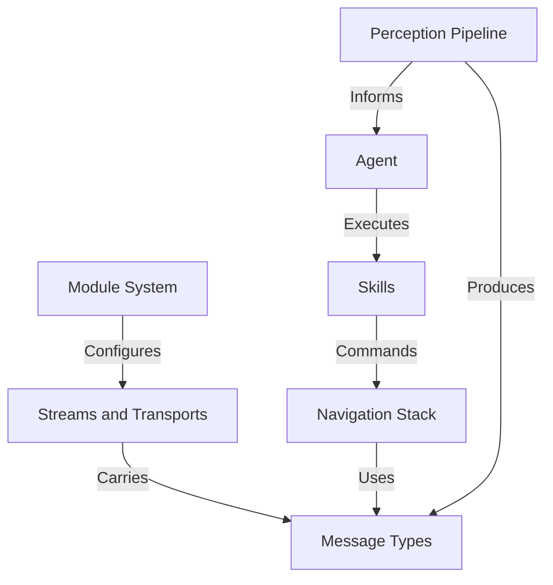

# Tutorial: dimos

The `dimos` project is a software framework for building intelligent robots. The robot's software is constructed from modular components called **Modules**, which communicate with each other using a system of *Streams* and *Transports*. The robot's "brain" is an **Agent**, typically a large language model, that makes decisions and controls the robot by calling **Skills**. This agent perceives the world through a **Perception Pipeline** that processes sensor data, and it moves around using a **Navigation Stack** to plan paths and avoid obstacles. The entire system is designed to be flexible and easy to manage, much like assembling a complex machine from well-defined, interconnected parts.

**Source Repository:** [None](None)

## Chapters

1. [Agent
](01_agent_.md)
2. [Perception Pipeline
](02_perception_pipeline_.md)
3. [Skills
](03_skills_.md)
4. [Navigation Stack
](04_navigation_stack_.md)
5. [Module System
](05_module_system_.md)
6. [Streams and Transports
](06_streams_and_transports_.md)
7. [Message Types
](07_message_types_.md)

---

Generated by [AI Codebase Knowledge Builder](https://github.com/The-Pocket/Tutorial-Codebase-Knowledge)