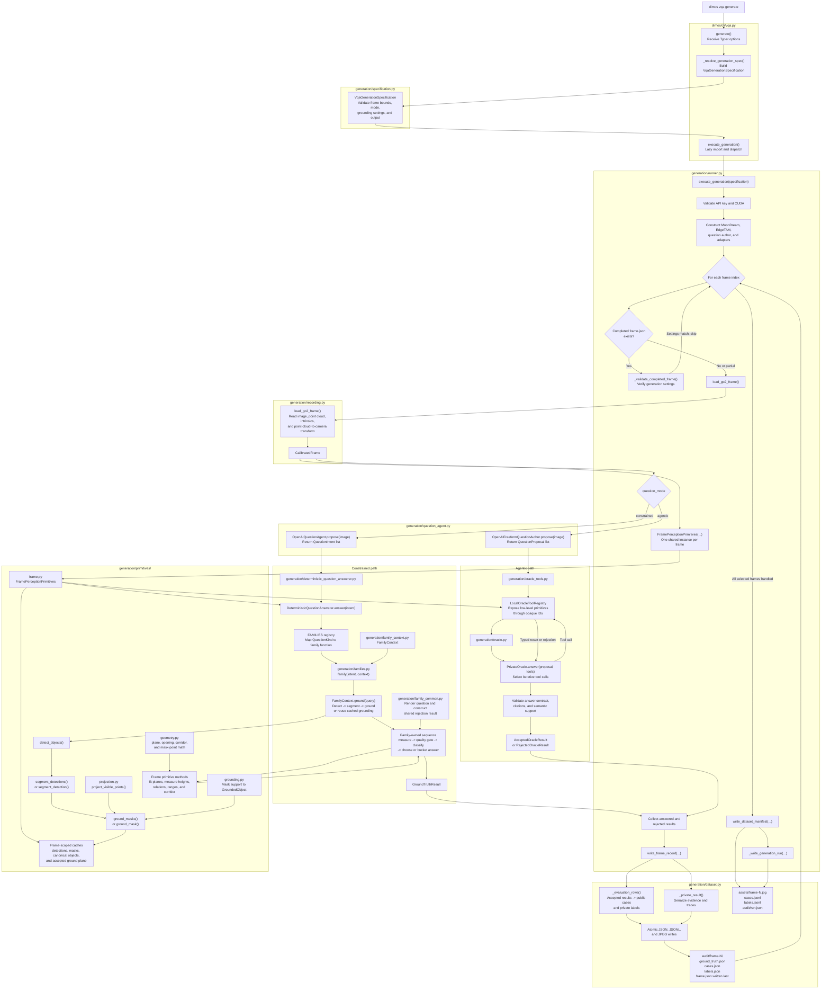

# VQA Generation Code Flow

This flowchart traces one `dimos vqa generate` execution through the Python files, classes, and
functions that implement generation. For command options and artifact schemas, see
[Pipeline](/docs/benchmarking/vqa-generation/pipeline.md). For component responsibilities, see
[Infrastructure](/docs/benchmarking/vqa-generation/infrastructure.md).

The primary code boundary is:

- `runner.py` owns execution and model lifecycle.
- `FramePerceptionPrimitives` owns reusable frame-scoped perception, measurements, and caches.
- Constrained functions in `families.py` own complete deterministic answer recipes.
- The agentic oracle selects low-level primitive calls through `LocalOracleToolRegistry`.
- `dataset.py` owns serialization and atomic publication; it does not generate answers.
