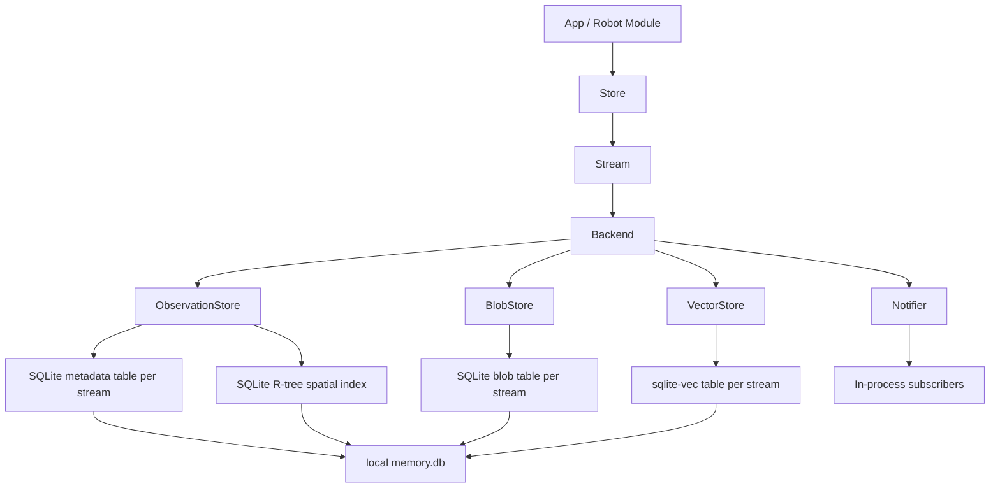
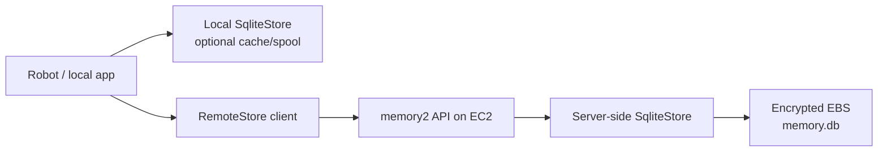
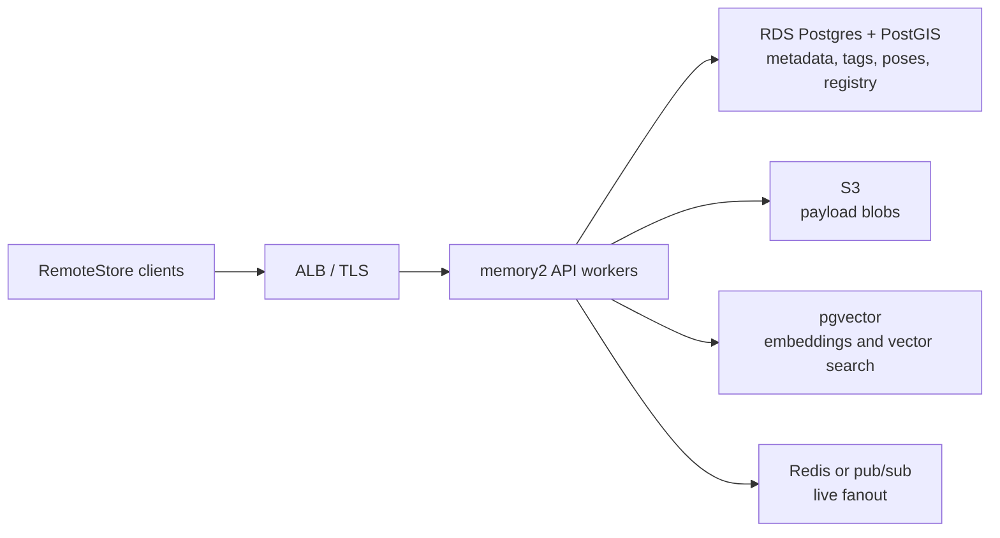
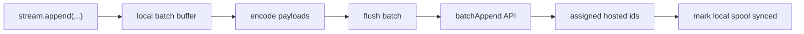

# Hosted memory2 design brief

## Executive summary

`memory2` is local-first today. It works well for robot-local recording, replay, and offline operation, but it is not yet shaped for hosted shared memory, batch uploads, or remote query from multiple clients.

The proposed direction is not to migrate everyone from local memory to cloud memory. Instead, keep local SQLite as a first-class backend and add a hosted backend through a service boundary:

```python
# Local/offline/replay
store = SqliteStore(path="memory.db")

# Hosted/shared memory
store = RemoteStore(base_url="https://memory.example.com", token=token)
```

The first hosted MVP (basically POC) can run a `memory2` API on EC2 and use server-side SQLite on encrypted EBS. That validates the API, batch ingest, auth, remote query, lazy blob loading, and live streaming without rewriting storage internals. Production can then replace the service internals with Postgres/PostGIS/pgvector plus S3 while preserving the same client API.

## Problem statement

The current memory system is designed to run locally. That creates several issues for hosted memory:

- SQLite is embedded and local; clients cannot safely use it as a shared network database.
- Current append behavior is observation-oriented. Remote upload needs batch-oriented ingest to avoid excessive network round trips.
- Large payloads such as images and point clouds should not always be pulled eagerly over the network.
- Hosted memory needs auth, tenant/robot scoping, pagination, live tails, retries, and operational visibility.
- Multiple clients and robots need a shared API instead of direct access to local DB files.

## Goals

- Preserve the current `Store` and `Stream` ergonomics for users.
- Keep `SqliteStore` for local memory, replay, demos, and offline robot operation.
- Add `RemoteStore` for hosted shared memory.
- Support batch upload as a first-class remote operation.
- Support remote query, vector search, lazy blob reads, and live tailing.
- Start with an EC2 MVP that reuses existing `SqliteStore`.
- Move production storage to scalable managed services without changing client usage.

## Non-goals

- Do not remove local SQLite.
- Do not force every robot operation to depend on cloud availability.
- Do not require normal memory2 users to manage Terraform, EC2, IAM, or S3.
- Do not prematurely commit to a dedicated vector database before scale requires it.

## Current local architecture

Today, `memory2` is structured around a local `Store`. The `Store` creates streams, and each stream is backed by a `Backend` that coordinates metadata, blobs, vectors, and live notifications.




Current SQLite table shape:

- `"{stream}"`: metadata, ids, timestamps, scalar values, pose, tags
- `"{stream}_blob"`: encoded payload bytes
- `"{stream}_vec"`: embedding vectors via `sqlite-vec`
- `"{stream}_rtree"`: spatial index for near/pose queries
- registry table: stream configuration and payload codec metadata

This is good for:

- low-latency local recording
- replay and debugging
- offline operation
- simple setup
- single-process or local-process usage

It is limited for:

- multi-client hosted access
- fleet-level memory
- remote batch ingest
- horizontal scaling
- managed backups and operational isolation

## Proposed architecture

The proposal is to add a hosted memory API and a `RemoteStore` client adapter. Users keep the same mental model: they open a store, select a stream, append/query observations, and optionally consume live streams.

The architecture should be presented in two separate views:

- Phase 1: MVP on EC2 with server-side SQLite
- Phase 2: production hosted memory with managed storage

## Phase 1: MVP architecture

The MVP runs a hosted memory2 API container on EC2. Internally, the service can use the existing `SqliteStore` against a durable encrypted EBS volume.



MVP purpose:

- prove the hosted API contract
- prove batch upload
- prove remote query and pagination
- prove lazy blob loading
- prove live tailing over WebSocket or SSE
- keep implementation small by reusing existing storage code

MVP characteristics:

| Area | Expected behavior |
| --- | --- |
| Performance | Slower than local SQLite per request because network is added |
| Upload throughput | Better than naive remote append because batches amortize network cost |
| Scalability | Scale-up model: bigger EC2, bigger EBS, one service owner for SQLite writes |
| Latency | Higher than local; acceptable for remote query/upload validation |
| Operational complexity | Low |
| Production readiness | Good for prototype/internal deployment, not fleet-scale final state |

## Phase 2: Production architecture

Production keeps the same external API but replaces the internal storage components.



Production backend responsibilities:

- Postgres stores metadata, stream registry, timestamps, tags, pose fields, cursors, and idempotency records.
- PostGIS handles richer spatial indexing if needed.
- S3 stores large encoded payload blobs.
- pgvector stores embeddings close to metadata for simpler filtered vector search.
- Redis/SNS/WebSocket fanout handles live tails across multiple API workers.

Production characteristics:

| Area | Expected behavior |
| --- | --- |
| Performance | Better for concurrent hosted workloads and large shared datasets |
| Upload throughput | High, especially with batch metadata commits and direct-to-S3 blob upload |
| Scalability | Horizontal API workers plus managed storage |
| Latency | Higher than local, but controlled with pagination, lazy blob reads, and colocated services |
| Operational complexity | Higher than MVP |
| Production readiness | Suitable for shared/fleet memory |

## API contract

The hosted API should be stream-oriented and batch-first.

```text
POST /v1/streams
  Create or validate a stream registry entry.

GET /v1/streams
  List streams visible to the authenticated tenant/robot/user.

GET /v1/streams/{stream}
  Get stream metadata and summary.

POST /v1/streams/{stream}/observations:batchAppend
  Append many observations in one request.

POST /v1/streams/{stream}/query
  Execute a serialized StreamQuery and return a page of observations.

POST /v1/streams/{stream}/search
  Execute vector search with optional metadata filters.

GET /v1/streams/{stream}/blobs/{id}
  Fetch one encoded payload blob or redirect to a presigned object URL.

GET /v1/streams/{stream}/live
  WebSocket or SSE live tail. Supports backfill cursor, then new observations.
```

### Batch append request

```json
{
  "stream": "color_image",
  "payload_module": "dimos.msgs.sensor_msgs.Image.Image",
  "codec_id": "jpeg",
  "idempotency_key": "robot-7:batch-001337",
  "observations": [
    {
      "client_id": "frame-100",
      "ts": 1770000000.0,
      "pose": null,
      "tags": {"camera": "front"},
      "payload_b64": "...",
      "embedding": null
    }
  ]
}
```

### Batch append response

```json
{
  "stream": "color_image",
  "accepted": 1,
  "failed": 0,
  "results": [
    {
      "client_id": "frame-100",
      "id": 42,
      "status": "accepted"
    }
  ]
}
```

### Query request

```json
{
  "filters": [
    {"type": "after", "t": 1770000000.0},
    {"type": "tags", "tags": {"camera": "front"}}
  ],
  "order_by": "ts",
  "order_desc": false,
  "limit": 100,
  "cursor": null,
  "include_blobs": false
}
```

### Query response

```json
{
  "observations": [
    {
      "id": 42,
      "ts": 1770000001.5,
      "pose": [1.0, 2.0, 0.0, 0.0, 0.0, 0.0, 1.0],
      "tags": {"camera": "front"},
      "value": null,
      "blob_ref": "s3://dimos-memory2-prod/org/robot/color_image/42.bin",
      "similarity": null
    }
  ],
  "next_cursor": "opaque-page-token"
}
```

### Vector search request

```json
{
  "embedding": [0.01, 0.02, 0.03],
  "k": 20,
  "filters": [
    {"type": "time_range", "t1": 1770000000.0, "t2": 1770000600.0},
    {"type": "tags", "tags": {"camera": "front"}}
  ],
  "include_blobs": false
}
```

### Blob read response

Small payload mode:

```text
GET /v1/streams/color_image/blobs/42
200 OK
Content-Type: application/octet-stream
```

Large payload mode:

```json
{
  "download_url": "https://s3-presigned-url",
  "expires_at": "2026-06-08T18:00:00Z"
}
```

## Batch upload model

Remote clients should not call one network request per observation. They should buffer and flush:

- by observation count
- by byte size
- by elapsed time
- on shutdown
- when backpressure requires it

Recommended client behavior:




For robotics, the safest pattern is local-first:

1. write to local `SqliteStore`
2. enqueue upload batch
3. retry until hosted memory acknowledges
4. keep robot operation independent of cloud availability

## Latency and performance impact


| Path                   | Latency                                    | Throughput                         | Notes                                        |
| ---------------------- | ------------------------------------------ | ---------------------------------- | -------------------------------------------- |
| Local `SqliteStore`    | Lowest                                     | High for local process             | No network, best for recording/replay        |
| Remote MVP with SQLite | Higher                                     | Good with batching                 | Network added, simple hosted path            |
| Remote production      | Higher than local, lower variance at scale | Highest for shared/fleet workloads | Managed DB/blob/vector services scale better |


Expected latency changes:

- Local memory remains unchanged.
- Remote writes are slower per observation if sent individually.
- Remote batch writes reduce amortized latency and improve throughput.
- Remote reads should return metadata first and fetch blobs lazily.
- Live reads should use WebSocket/SSE instead of repeated polling.

## Scalability summary

```text
Local SQLite:
  Best for one robot/local process.
  Not intended as shared hosted infrastructure.

EC2 + server-side SQLite MVP:
  Best for proving hosted API and batch upload.
  Scales vertically.
  Keep one service owner for writes.

Postgres + S3 + pgvector production:
  Best for shared/fleet hosted memory.
  Scales API workers horizontally.
  Uses managed durability and backups.
  Can add Milvus/Qdrant later if vector search dominates.
```

## User versus admin responsibilities

Normal users should only choose a memory backend:

```python
store = SqliteStore("memory.db")
store = RemoteStore("https://memory.example.com", token=token)
```

Admins/platform maintainers manage hosted infrastructure:

- Terraform
- EC2 or API workers
- IAM
- S3 bucket permissions
- RDS/Postgres
- TLS and ingress
- monitoring and backups

## Rollout plan

### Step 1: Define protocol and client

- Add serializable query/filter schemas.
- Add observation wire schema.
- Add batch append schema.
- Add `RemoteStore` and remote backend adapter.
- Add fake/in-process service tests.

### Step 2: Build hosted MVP

- Add FastAPI memory2 service.
- Implement stream registry, batch append, query, blob read, and live endpoints.
- Use server-side `SqliteStore` internally.
- Deploy to EC2 using the admin Terraform scaffold.

### Step 3: Add local spool sync

- Write locally first.
- Upload batches in the background.
- Track idempotency and sync status.
- Recover from network loss.

### Step 4: Move production storage

- Add `PostgresObservationStore`.
- Add `S3BlobStore`.
- Add `PgVectorStore`.
- Add live fanout across API workers.
- Add managed backups, metrics, and retention policies.

## Final recommendation

Expose two backends to users:

- `SqliteStore` for local/offline/replay memory
- `RemoteStore` for hosted/shared/fleet memory

Use EC2 plus server-side SQLite as the fastest MVP to prove the hosted API. Move to Postgres plus S3 plus pgvector for production once the API and product behavior are validated.