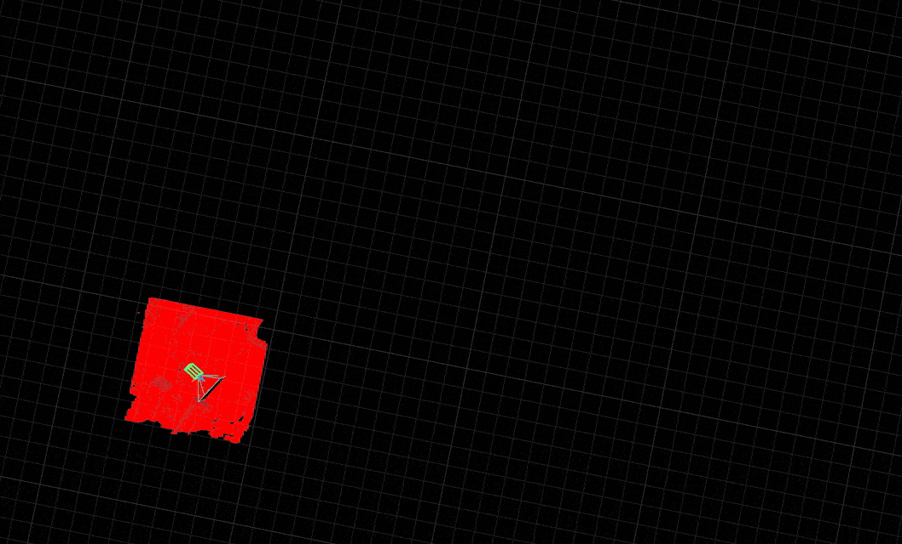

# Go2 Navigation Overview

The Go2 navigation stack uses a simple **column-carving voxel map** strategy: each new LiDAR frame replaces the corresponding region of the global map entirely, ensuring the map always reflects the latest observations. Map live as you drive, or return to a known space using a saved premap and relocalization.

## go2

| Workflow                    | When to use                                                            | Blueprint                    | Docs                                                               |
|-----------------------------|------------------------------------------------------------------------|------------------------------|--------------------------------------------------------------------|
| **Live mapping**            | Explore a new space where the map updates every frame                  | `unitree-go2`                | [Navigation deep dive](/docs/capabilities/navigation/deep_dive.md) |
| **Premap + relocalization** | Return to a known space and plan on a loop-closed map                  | `unitree-go2-relocalization` | [Relocalization](/docs/capabilities/navigation/relocalization.md)  |
| **Live loop closure**       | Map a space with revisits and correct drift while driving              | `unitree-go2-pgo`            | [Live loop closure](/docs/capabilities/navigation/live_loop_closure.md) |

Live column-carving maps are fast and reactive, but odometry drifts over long distances. `unitree-go2-pgo` closes loops live with pose-graph optimization (PGO). For spaces you return to across sessions, record once, run PGO offline, then relocalize against the exported premap at runtime.

For hardware setup, simulation, and the full blueprint list, see the [Go2 platform guide](/docs/platforms/quadruped/go2/index.md).

## Generic

| Workflow                 | When to use                                                            | Blueprint     | Docs                                                |
|--------------------------|------------------------------------------------------------------------|---------------|-----------------------------------------------------|
| **Simulation, no robot** | Run the raycaster and planner against a photoreal scan of a real house | `habitat-nav` | [Habitat](/docs/capabilities/navigation/habitat.md) |
