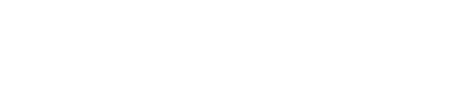

# Go2 Non-ROS Navigation


The Go2 navigation stack runs entirely without ROS. It uses a **column-carving voxel map** strategy: each new LiDAR frame replaces the corresponding region of the global map entirely, ensuring the map always reflects the latest observations.

## Data Flow

<details>
<summary>diagram source</summary>

<details><summary>Pikchr</summary>

```pikchr fold output=assets/go2nav_dataflow.svg
color = white
fill = none

Go2: box "Go2" rad 5px fit wid 170% ht 170%
arrow right 0.5in "PointCloud2" above italic
Vox: box "VoxelGridMapper" rad 5px fit wid 170% ht 170%
arrow right 0.5in "PointCloud2" above italic
Cost: box "CostMapper" rad 5px fit wid 170% ht 170%
arrow right 0.5in "OccupancyGrid" above italic
Nav: box "Navigation" rad 5px fit wid 170% ht 170%
```

</details>

<!--Result:-->


</details>

## Pipeline Steps

### 1. LiDAR Frame — `GO2Connection`

We don't connect to the LiDAR directly — instead we use Unitree's WebRTC client (via [legion's webrtc driver](https://github.com/legion1581/unitree_webrtc_connect)), which streams a heavily preprocessed 5cm voxel grid rather than raw point cloud data. This allows us to support stock, unjailbroken Go2 Air and Pro models out of the box.


### 2. Global Voxel Map — `VoxelGridMapper`

Each incoming frame is spliced into the global map via column carving. The map grows as the robot explores, with previously visited areas updated in-place whenever the robot returns. We don't have proper loop closure and stable odometry, we trust the data go2 reports, which is surprisingly stable but does drift eventually.


### 3. Global Costmap — `CostMapper`

The 3D voxel map is projected down to a 2D occupancy grid. We map the slope of terrain in order to conclude traversability — flat areas (light) are traversable, steep height changes (dark) are obstacles.


### 4. Navigation Costmap — `ReplanningAStarPlanner`

The planner will process the terrain gradient and compute it's own algo-relevant costmap, prioritizing safe free paths, while be willing to path aggressively through tight spaces if it has to

We run the planner in a constant loop so it will dynamically react to obstacles encountered.


### 5. All Layers Combined

All visualization layers shown together — 3D voxel map, 2D costmap, and the planned path overlaid in a single view.


---

## Voxel Mapping & Column Carving

The [`VoxelGridMapper`](/dimos/mapping/voxels.py) maintains a sparse 3D occupancy grid using Open3D's `VoxelBlockGrid` backed by a hash map. Each voxel is a 5cm cube by default.

### How frames are added

1. Incoming points are quantized to voxel coordinates: `vox = floor(point / voxel_size)`
2. The (X, Y) footprint of the new frame is extracted
3. **All existing voxels** sharing those (X, Y) coordinates are erased — the entire Z-column is removed
4. New voxels are inserted

```python skip
# Column carving: erase all existing voxels sharing (X,Y) with new data
xy_keys = new_keys[:, :2]                    # extract (X,Y) footprint
xy_hashmap.insert(xy_keys, ...)              # build lookup
_, found_mask = xy_hashmap.find(existing_xy)  # find overlapping columns
self._voxel_hashmap.erase(existing[found_mask])  # erase old
self._voxel_hashmap.activate(new_keys)            # insert new
```

### Why column carving?

The robot's LiDAR sees a cone of space from its current position. Within that cone, any previously mapped voxels are now stale — the sensor has a fresh observation. By erasing entire Z-columns in the footprint, we guarantee:

- No ghost obstacles from previous passes
- Dynamic objects (people, doors) get cleared automatically
- The latest observation always wins

The hash map provides O(1) insert/erase/lookup, so this is efficient even with millions of voxels. The grid runs on **CUDA** by default for speed, with CPU fallback.

## Cost Mapping

The [`CostMapper`](/dimos/mapping/costmapper.py) converts the 3D voxel map into a 2D navigation grid. The default algorithm (`height_cost`) works as follows:

1. **Height maps**: For each (X, Y) cell, find min and max Z across all voxels
2. **Pass-under detection**: If the vertical gap exceeds `can_pass_under` (default 0.6m), the robot can fit underneath — use ground height instead of obstacle height
3. **Slope analysis**: Apply Sobel filter to the height map to compute terrain gradient
4. **Cost assignment**: `cost = (gradient × resolution / can_climb) × 100`, clamped to [0, 100]

| Cost | Meaning |
|------|---------|
| 0 | Flat, easy to traverse |
| 50 | Moderate slope (~7.5cm rise per cell) |
| 100 | Steep or impassable (≥15cm rise per cell) |
| -1 | Unknown (no observations) |

## Blueprint Composition

The navigation stack is composed in the [`unitree_go2`](/dimos/robot/unitree/go2/blueprints/__init__.py) blueprint:

```python skip
unitree_go2 = autoconnect(
    unitree_go2_basic,                    # robot connection + visualization
    voxel_mapper(voxel_size=0.1),         # 3D voxel mapping
    cost_mapper(),                        # 2D costmap generation
    replanning_a_star_planner(),          # path planning
    wavefront_frontier_explorer(),        # exploration
).global_config(n_dask_workers=6, robot_model="unitree_go2")
```

Modules are auto-wired by matching stream names and types:
- `GO2Connection.pointcloud` → `VoxelGridMapper.lidar` (both `PointCloud2`)
- `VoxelGridMapper.global_map` → `CostMapper.global_map` (both `PointCloud2`)
- `CostMapper.global_costmap` → planner and explorer (both `OccupancyGrid`)

## Configuration

### Voxel Mapper

| Parameter | Default | Description |
|-----------|---------|-------------|
| `voxel_size` | 0.05 | Voxel cube size in meters |
| `block_count` | 2,000,000 | Max voxels in hash map |
| `device` | `CUDA:0` | Compute device (`CUDA:0` or `CPU:0`) |
| `carve_columns` | `true` | Enable column carving (disable for append-only mapping) |
| `publish_interval` | 0 | Seconds between map publishes (0 = every frame) |

### Cost Mapper (height_cost)

| Parameter | Default | Description |
|-----------|---------|-------------|
| `resolution` | 0.05 | 2D grid cell size in meters |
| `can_pass_under` | 0.6 | Min gap height the robot can fit through (m) |
| `can_climb` | 0.15 | Height change that maps to cost 100 (m) |
| `ignore_noise` | 0.05 | Height changes below this are zeroed (m) |
| `smoothing` | 1.0 | Gaussian sigma for height map smoothing |
