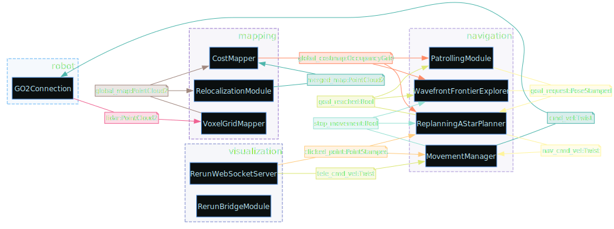

Relocalization lets a Go2 navigate on a previously built map instead of only on what it sees right now. At runtime, `RelocalizationModule` aligns live LiDAR to a saved premap and publishes a `world → map` transform, so the costmap and planner operate on the live scan and premap together.


> **Note:** Requires DimOS v0.0.13 or newer for PGO loop closure and `dimos map` export.

This guide takes four steps:

1. Record a walk-through with `unitree-go2-memory`
2. Build the premap with `dimos map global {DB_NAME} --export`
3. Test relocalization in replay, no robot needed
4. Deploy on the live Go2

Throughout this guide, `{DB_NAME}` is the stem of your recording, for example `recording_go2` for `recording_go2.db`. For `map_file`, pass the same stem and DimOS appends `.pc2.lcm` automatically.

## 1. Record a run

Drive the Go2 through the space you want as your premap. Close loops when you can because PGO uses revisits to correct drift.

```bash
dimos --robot-ip {YOUR_ROBOT_IP} run unitree-go2-memory
```

If `ROBOT_IP` is set in the environment or `.env`, you can omit `--robot-ip`:

```bash
dimos run unitree-go2-memory
```

This writes `recording_go2.db` to the repo root (`DIMOS_PROJECT_ROOT`) and records `lidar`, `odom`, and `color_image` plus the live TF tree. The recorder stamps lidar frames with the latest odom pose so `dimos map global` can reconstruct poses later- see [`Go2Memory`](/dimos/robot/unitree/go2/blueprints/smart/unitree_go2.py).

### Quick validation (optional)

Before building a premap, inspect the recording:

```bash
dimos mem summary recording_go2
dimos map replay recording_go2 --duration 60
```

`summary` prints stream names and time ranges. `replay` opens Rerun so you can confirm lidar and odometry look sane.

## 2. Build the premap

Export a loop-closed global map as `.pc2.lcm`:

```bash
dimos map global recording_go2 --export
```

| Flag | Effect |
|------|--------|
| `--export` | Run PGO and write `./{DB_NAME}.pc2.lcm` to the current working directory (implies `--pgo`) |
| `--no-gui` | Skip launching Rerun for headless servers or CI |
| `--pgo-tol 0.3` | Spatial dedup tolerance for keyframes in meters. Use `0` to keep all posed frames |
| `--voxel 0.05` | Voxel size in meters (default matches live mapper) |

`{DB_NAME}` accepts a bare stem, `./path/to/file.db`, or an absolute path. Bare names resolve in this order:

1. Current working directory
2. `DIMOS_PROJECT_ROOT`
3. `data/` via LFS (`get_data`)

Examples:

```bash
dimos map global recording_go2 --export --no-gui
dimos map global ./recordings/office_walk.db --export
dimos map global data/go2_hongkong_office.db --export
```

Sample log:

```
running PGO twopass map...
  Pass 1: 908 frames, 1 keyframes
exporting PGO twopass map to .../recording_go2.pc2.lcm...
wrote .../recording_go2.pc2.lcm
```

Open the companion `{DB_NAME}.rrd` in Rerun to verify loop closure before deploying to hardware.

## 3. Relocalize in replay

Test alignment without the robot. `unitree-go2-relocalization-lidar` is `unitree-go2` plus `RelocalizationModule` (RANSAC prior only):

```bash
dimos --replay --replay-db recording_go2 run unitree-go2-relocalization-lidar \
  -o relocalizationmodule.map_file=recording_go2
```

`map_file` resolves `{DB_NAME}.pc2.lcm` with the same search order as above (cwd, then project root, then `data/`).

### Reading the logs

```
Relocalization module started: map_file='recording_go2'  loaded_map.frame_id='map'
relocalize skipped: n_pts=37770 < MIN_LOCAL_POINTS=50000
relocalize rejected: fitness=0.433 < threshold=0.45 time_cost=8.1s n_pts=57385
relocalize: source=ransac fitness=0.657 time_cost=3.0s n_pts=64703 reloc_t=[-0.007, -0.01, -0.102] TF 'world' -> 'map' published_t=[0.007, 0.009, 0.102]
```

`relocalize skipped` means the live submap is still warming up- fewer than `min_local_points` accumulated. `relocalize rejected` means a candidate alignment was found but its fitness was below the threshold, so no transform is published. Once `relocalize:` lines appear at info level, the `world → map` TF is live. `source=` names which proposer won the fitness judge (`ransac`, `fiducial`, or `last_pose`).

> **Held-out rule.** To *measure* relocalization, the premap must come from a **different run** of the same space than the recording you replay. Replaying the same recording the premap was built from measures memorization, not relocalization. Score a held-out pair with the `--eval` flag; see [Relocalization benchmark](/docs/capabilities/navigation/relocalization_benchmark.md).

### Rerun visualization

Watch alignment in Rerun, which is enabled by default on Go2 blueprints:

- **Merged map** shows the premap transformed into `world` plus the live scan, column-carved together.
- Toggle the merged map entity off to compare the live scan alone against the merged costmap.

## 4. Relocalize on a live robot

Run the replay test first. On hardware, use the same blueprint and `map_file`:

```bash
dimos --robot-ip {YOUR_ROBOT_IP} run unitree-go2-relocalization-lidar \
  -o relocalizationmodule.map_file=recording_go2
```

Before sending navigation goals, walk through this checklist:

1. Place the Go2 in a region that overlaps the premap on the same floor with recognizable geometry.
2. Wait for `relocalize:` info lines. Skipped and rejected lines are normal for the first 30 to 60 seconds.
3. Confirm stable `world → map` TF in Rerun before sending navigation goals.
4. Click to navigate or use agent skills such as `navigate_with_text` on the aligned costmap.

## How it works

The `unitree-go2-relocalization-lidar` blueprint is the standard [Go2 navigation stack](/docs/capabilities/navigation/deep_dive.md) plus `RelocalizationModule`:

<details>
<summary>diagram source</summary>

```python skip fold output=assets/go2_reloc_blueprint.svg
from dimos.core.coordination.blueprints import autoconnect
from dimos.core.introspection.svg import to_svg
from dimos.mapping.relocalization.module import RelocalizationModule
from dimos.mapping.relocalization.priors import RansacPriorConfig
from dimos.robot.unitree.go2.blueprints.smart.unitree_go2 import unitree_go2

unitree_go2_relocalization_lidar = autoconnect(
    unitree_go2,
    RelocalizationModule.blueprint(priors=[RansacPriorConfig()]),
).global_config(n_workers=11)

to_svg(unitree_go2_relocalization_lidar, "assets/go2_reloc_blueprint.svg")
```

</details>



Note that [`CostMapper`](/dimos/mapping/costmapper.py) builds the costmap from the merged map only while [`RelocalizationModule`](/dimos/mapping/relocalization/module.py) has a good alignment; until then it falls back to the live map alone.

### File formats

| File | Format | Produced by | Consumed by |
|------|--------|-------------|-------------|
| `{name}.db` | memory2 SQLite (`lidar`, `odom`, `color_image`, …) | `unitree-go2-memory` | `dimos map *`, `--replay-db` |
| `{name}.pc2.lcm` | LCM-encoded `PointCloud2` premap | `dimos map global --export` | `RelocalizationModule` (`map_file`) |
| `{name}.rrd` | Rerun recording (visual QA) | `dimos map global` | Rerun viewer |

## Configuration reference

CLI overrides use blueprint module config (`-o relocalizationmodule.<field>=…`):

| Field | Default | Description |
|-------|---------|-------------|
| `map_file` | `None` (module disabled) | Premap stem or path. DimOS appends `.pc2.lcm` automatically |
| `fitness_threshold` | `0.45` | Minimum ICP fitness to accept a relocalization (0 to 1) |
| `min_local_points` | `50000` | Minimum live map points before a relocalization is attempted |
| `reloc_interval_s` | `2.0` | Seconds between relocalization attempts |
| `gravity_tilt_max_deg` | `10.0` | Reject a candidate whose up axis tilts more than this from world-z (degrees) |
| `use_carving` | `true` | Column-carve when merging premap and live scan |
| `publish_loaded_map` | `false` | Republish raw premap on `loaded_map` every 2 s |

### Priors

`priors` is a list of candidate proposers, each an equal, toggleable entry keyed by `type`. Every entry competes through the same wall-fitness judge; none bypasses it. The list is set by preset (blueprint), not by a flat `-o` override (the dotted override parser cannot index a list).

| `type` | Enabled by default | Own params |
|--------|--------------------|------------|
| `ransac` | yes | none — the search knobs live in `relocalize.py` |
| `last_pose` | no | none — the seed is captured at runtime |
| `fiducial` | no | `marker_map_file`, `marker_length_m`, `aruco_dictionary`, `ambiguity_ratio_min`, `camera_info`, `age_max_s`, `aggregation` |

Every entry also carries `enabled` plus the inert fusion fields (`tier`, `weight`, `max_age_s`) the Phase-4 arbiter will read. The three Go2 presets:

| Blueprint | Priors |
|-----------|--------|
| `unitree-go2-relocalization-lidar` | `ransac` |
| `unitree-go2-relocalization-lidar-fiducial` | `ransac` + `fiducial` |
| `unitree-go2-relocalization-fiducial` | `fiducial` only |

The `fiducial` type needs a surveyed `marker_map_file` (`.json` of `map_T_tag` per id) and consumes a `detections` `Detection3DArray` In stream; `MarkerDetectionStreamModule` publishes the matching Out, so the two autoconnect by name/type in the `*-fiducial` blueprints (which share the fiducial family via `aruco_dictionary`). Each tag's sightings fuse into one `world→map` candidate (medoid seed + Huber IRLS), age-gated, competing on wall fitness; it never publishes a pose on its own.

One constant is not overridable via CLI:

| Constant | Value | Role |
|----------|-------|------|
| `PUBLISH_INTERVAL` | `2.0` s | TF and `loaded_map` publish rate |

To accept all candidates for visualization only (not for production nav):

```bash
-o relocalizationmodule.fitness_threshold=0.0
```

## Troubleshooting

| Symptom | Likely cause | Fix |
|---------|--------------|-----|
| `Relocalization module disabled (no map_file configured)` | Missing `-o relocalizationmodule.map_file=…` | Set `map_file` to your premap stem |
| File not found for `.pc2.lcm` | Export not run or wrong cwd | Run `dimos map global … --export` and check cwd or `data/` |
| Long stretch of `relocalize skipped` | Map still accumulating points | Wait or drive slowly through mapped geometry |
| Repeated `relocalize rejected` | Poor overlap with premap or wrong space | Start in a known area and check premap in `.rrd` |
| Nav works but map looks misaligned | Low fitness accepted in debug mode | Raise `fitness_threshold` back to default `0.45` |
| PGO map looks wrong | Bad odometry in recording | Run `dimos map replay` or `summary` and re-record with smoother motion |

## Related docs

For hardware setup, simulation, and the full blueprint list, see the [Go2 platform guide](/docs/platforms/quadruped/go2/index.md). The [v0.0.13 release notes](https://github.com/dimensionalOS/dimos/releases/tag/v0.0.13) summarize the PGO, `dimos map`, and relocalization work this guide builds on.
