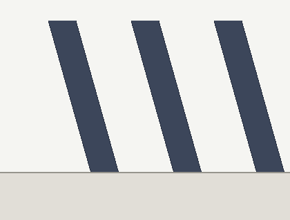

# Visual Odometry (dimSLAM)

dimSLAM answers one question: **"where is the robot right now?"** It tracks camera images (cuVSLAM visual odometry) and fuses them with an IMU and any other odometry you have (like wheel encoders) into one smooth position estimate.

This page is the setup checklist for a new robot, in the order that actually matters.

---

# 🥇 Step 0: Pick the right camera

This decision matters more than any config value. A bad camera cannot be tuned into a good one.

**You want:**

- **Global shutter.** See [the section below](#-global-shutter-vs-rolling-shutter). This is the big one.
- **Stereo** (two cameras with a known distance between them). One camera can't tell "small and close" from "big and far"; two can.
- **Grayscale is fine.** Tracking doesn't need color. The infrared pair on a RealSense D455 works great, and is what the examples below use.
- **Wide field of view.** More of the world in frame means more things to track when part of the view is blocked or blank.

**You don't need:** high resolution or high frame rate. 640x480 at 15 fps tracks well.

---

# 📸 Global shutter vs rolling shutter

A **global shutter** camera captures the whole image at the same instant.
A **rolling shutter** camera captures the image row by row, top to bottom.

While those rows are being read out, the robot keeps moving. So a rolling shutter camera turning past straight poles sees this:

| Global shutter | Rolling shutter (turning) |
| --- | --- |
|  |  |

The poles are vertical in the real world. The rolling shutter image shears them because the bottom rows were captured a few milliseconds after the top rows, and the camera had turned in between.

Visual odometry works by looking at where things are in the image and computing where the camera must be. If the image itself is warped, the answer is warped too, and it gets worse exactly when you care most: fast turns. This is why phone-style cameras make poor odometry cameras even when the picture looks fine to a human.

Rule of thumb: **rolling shutter color cameras are for humans and VLMs; global shutter cameras are for odometry.**

---

# 🚀 Step 1: A minimal working config

`DimSlam` is a module like any other: put it in your robot's blueprint, wire its streams, and start the blueprint with [`dimos run`](/docs/usage/cli.md). A minimal stereo + IMU setup:

```python
from dimos.mapping.dim_slam.dim_slam import Covariance, DimSlam, ImuConfig, SourceConfig

DimSlam(
    camera_mode="stereo",
    # The RealSense D455's datasheet noise figures.
    imus=[
        ImuConfig(
            frame_id="camera_accel_optical_frame",
            gyro_noise_density=2e-4,
            gyro_random_walk=1e-5,
            accel_noise_density=1.8e-3,
            accel_random_walk=1e-4,
        )
    ],
)
```

```results
00:03:53.633 [inf][otocol/service/zenohservice.py] Zenoh session opened connect=[] gossip=True listen=['tcp/127.0.0.1:0'] mode=peer multicast_interface=lo0
```

Connect the camera driver's `image` and `camera_info` outputs (both infrared streams publish onto the same input; they're told apart by `frame_id`), the IMU stream, and tf. The module publishes fused `odometry` and the `odom -> base_link` transform.

Then: **start the robot and leave it still for about one second.** The filter uses that stillness to measure the gyro bias. This is automatic (if the robot is moving at startup, calibration just restarts once it's still), but until it has happened, expect drift. On one 8-minute test drive, skipping it turned a 1.6 m final error into 19.8 m.

---

# 🕰️ Step 2: Make sure your timestamps are honest

Every image, IMU sample, and odometry message carries a timestamp. The fusion filter believes them. If two sensors disagree about what time it is, the filter blends measurements from different moments and the estimate smears.

- Stereo pairs must be stamped closely together. cuVSLAM expects both images of a pair within **1 ms** by default, which hardware-triggered rigs (like the D455) do naturally. Software-triggered rigs do not: Spot's cameras land ~15 ms apart, so every pair would be dropped. For those, set `max_skew_ms=20.0` (or whatever your rig's spread is) in `DimSlamConfig`.
- If odometry looks fine when still and wrong when moving, suspect timestamps before anything else.

---

# 📐 Step 3: Tell it where the cameras are

dimSLAM needs two pieces of geometry:

- **Intrinsics** (`camera_info`): what the lens does. A RealSense publishes its own calibrated `camera_info`, so there is nothing to do. For other cameras, run [camera calibration](/docs/usage/camera_calibration.md).
- **Extrinsics** (tf): where each camera sits on the robot. dimSLAM looks the camera's frame up in the tf tree, so the static transform from your robot's base to the camera's optical frame must exist and be right.

A few millimeters of extrinsic error shows up as a small constant drift. A wrong optical-frame rotation shows up as complete nonsense. If tracking "works" but the robot moves the wrong direction, check the extrinsics first.

---

# 🛞 Step 4 (optional): Add whatever other odometry you have

Skip this if all you have is the camera. But if the robot publishes wheel or leg odometry, each estimator becomes an `odom_sources` entry, and the fused estimate gets more robust: when the cameras face a blank wall, the wheels carry the estimate through.

```python skip
odom_sources=[
    SourceConfig(
        parent_frame_id="wheel_odom",   # matches the messages' header.frame_id
        child_frame_id="base_link",     # and their child_frame_id
        twist_variances=Covariance(x=0.01, yaw=0.02),
    )
]
```

---

# 🎚️ Step 5: Tune the trust

This is where the fused estimate goes from "works" to "good": tell the filter which parts of each sensor to believe, and tell it what your robot physically cannot do. The one-liner that helps almost every ground robot, "I do not fly, roll, or pitch":

```python skip
per_dimension_error_variance=Covariance(z=1e-6, roll=1e-6, pitch=1e-6)
```

The full guide, including per-sensor trust: [How to Not Trust Your Sensors](/docs/capabilities/navigation/how_to_not_trust_your_sensors.md).

---

# ✅ A working setup, in short

1. Global shutter stereo camera, rigidly mounted
2. `DimSlam` in the blueprint with `camera_mode="stereo"` and the IMU's datasheet noise figures
3. One second of stillness at startup
4. Honest timestamps (`max_skew_ms` for software-triggered rigs)
5. Correct extrinsics in tf
6. Extra odometry sources if the robot has them
7. Trust tuned per [How to Not Trust Your Sensors](/docs/capabilities/navigation/how_to_not_trust_your_sensors.md)
