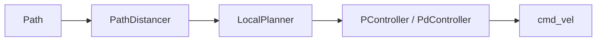
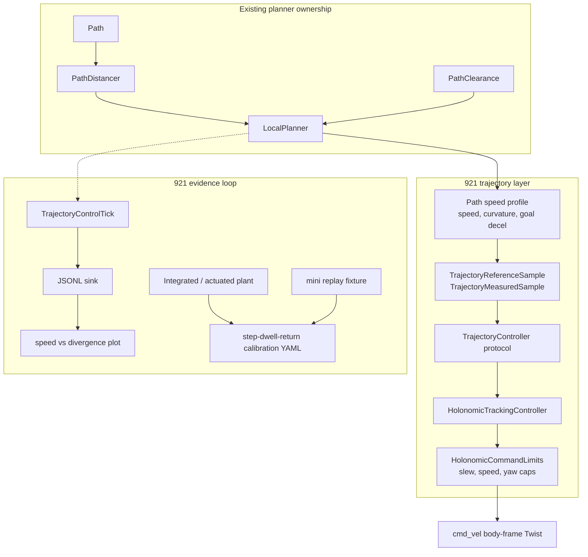
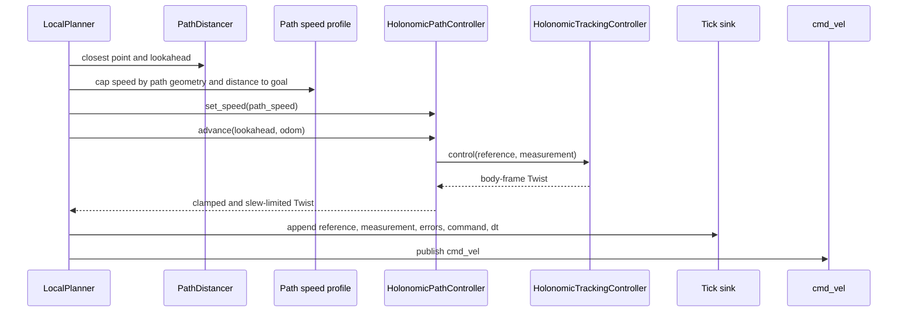
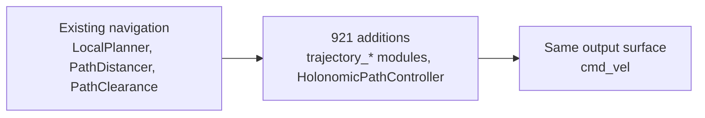
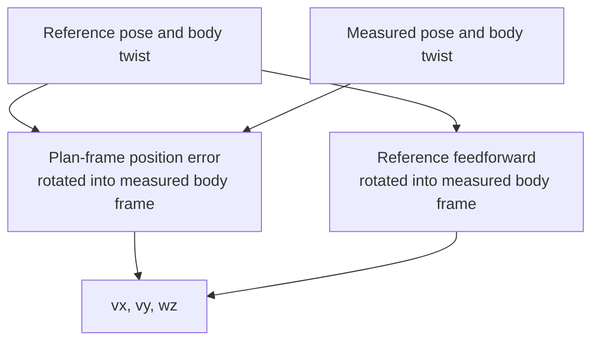

# Issue 921 Architecture: Holonomic Trajectory Control

Issue 921 did not replace navigation. It turned the existing local path follower into a measurable, swappable, holonomic-correct trajectory control stack.

The short version:

- Before 921, `LocalPlanner` picked a lookahead point, asked a path controller for `cmd_vel`, and published it. That worked as a navigation loop, but the controller boundary was too narrow to compare control laws, produce speed-vs-divergence evidence, or tune a holonomic base from logs.
- After 921, `LocalPlanner` still owns obstacle checks, path progress, and `cmd_vel` publication. The new trajectory layer adds typed reference and measurement samples, a holonomic tracking law, command limits, speed profiling, tick telemetry, JSONL export, calibration, replay, and focused validation.
- The main "a-ha": 921 adds an evidence loop around path following. Every controller tick can now answer: "what was the target, what did the robot do, what did we command, and how much divergence did that produce at this speed?"

## Before 921

The old path follower was essentially a direct path-to-command loop.

That shape was small, but it hid the important review questions:

- What is the formal controller input and output contract?
- Is the controller suitable for a holonomic base, or is it still rotate-then-drive behavior?
- What speed produced what divergence?
- How do we compare a new controller with the old one on the same scenario?
- How do we calibrate or validate without a real robot in default CI?

## After 921

The live navigation spine remains familiar, but it now has a trajectory control layer in the middle and an evidence loop around it.

The architecture deliberately keeps obstacle policy planner-side. `PathClearance` still tells `LocalPlanner` whether to stop. The trajectory controller is responsible for following the current reference well and reporting how well it did.

## Runtime Path

At runtime, one local-planner tick now has this shape:

This is the smallest useful change: `LocalPlanner` remains the integration point, while controller math, speed selection, command limiting, and telemetry become explicit modules.

## What Was Added

| Area | Added modules | Why it matters |
| --- | --- | --- |
| Controller contract | `trajectory_types.py`, `trajectory_controller.py` | Gives controllers stable `reference + measurement -> command` inputs instead of planner-specific assumptions. |
| Holonomic control | `trajectory_holonomic_tracking_controller.py`, `HolonomicPathController` in `replanning_a_star/controllers.py` | Commands `vx`, `vy`, and `wz` directly. This is not Pure Pursuit and does not throw away holonomic degrees of freedom. |
| Command safety | `trajectory_command_limits.py`, live `HolonomicCommandLimits` | Applies speed, yaw, and acceleration limits in one place, including slew against the previous command. |
| Speed profile | `trajectory_path_speed_profile.py`, live `_path_speed_for_index(...)` | Lets high requested speed survive on open geometry while slowing before tight turns and near the goal. |
| Telemetry | `trajectory_control_tick_log.py`, `trajectory_control_tick_export.py` | Records each tick as stable JSONL with reference, measurement, errors, command, and `dt_s`. |
| Calibration | `trajectory_holonomic_calibration.py`, calibration YAML schema and fixture | Runs bounded step-dwell-return scenarios and writes versioned suggested gains. |
| Plant and replay | `trajectory_holonomic_plant.py`, `trajectory_replay_loader.py`, mini replay fixture | Lets CI and developers validate controller behavior without real hardware or LFS. |
| Validation | analytic tests, swap regression, golden replay, simulation matrix docs | Proves the seam is swappable, the holonomic controller tracks line and arc cases, and the live planner emits measurable ticks. |

## Key Design Choices

### 1. Keep `LocalPlanner` as the integration seam

The branch does not migrate navigation to a new coordinator. That would be a larger architectural project. For 921, the right move is to keep the shipped replanning path intact and insert the trajectory layer where path following already happens.

### 2. Make holonomic behavior the default path controller

The legacy controller rotates toward the lookahead and drives forward. That is reasonable for differential behavior, but it is the wrong mental model for a holonomic base. The new default controller tracks planar pose error directly in the measured body frame and can command lateral velocity.

### 3. Treat rate and speed as measured decisions

921 rejects "100 Hz because faster sounds better." The live default is `10 Hz`, the config validates a bounded range, and the plot path lets reviewers compare control rates with actual achieved `dt_s` and speed-vs-divergence data.

### 4. Make "run not walk" geometry-aware

`planner_robot_speed` can request higher speed, but the live path speed profile caps the command before it reaches the controller:

- tangent acceleration caps speed changes along the path;
- normal acceleration caps speed through curvature;
- goal deceleration slows near the target.

That is why the controller can be asked to run on open geometry without pretending a sharp corner should be taken at full speed.

## How Reviewers Should Read The 921 implementation

Read in this order:

1. `dimos/navigation/replanning_a_star/local_planner.py` - the live integration point. Look for speed capping, controller selection, tick append, and `cmd_vel` publication.
2. `dimos/navigation/replanning_a_star/controllers.py` - the adapter from existing lookahead planner semantics to the new holonomic tracking law.
3. `dimos/navigation/trajectory_holonomic_tracking_controller.py` - the controller math. This is the "not Pure Pursuit" center of the change.
4. `dimos/navigation/trajectory_control_tick_log.py` and `trajectory_control_tick_export.py` - the measurement contract for speed-vs-divergence plots.
5. `dimos/navigation/trajectory_holonomic_calibration.py`, `trajectory_holonomic_plant.py`, and `trajectory_replay_loader.py` - the hardware-free calibration and validation loop.
6. `docs/development/921_trajectory_controller/docs/trajectory_simulation_validation.md` - the confidence envelope before P8 hardware validation - how simulation was actually performed. Also - `dimos/docs/development/921_trajectory_controller/simulation/matrix_presets_and_scenarios.md` - a description of sim-matrix presets and scenarios.

7. (optional) `dimos/docs/development/921_trajectory_controller/docs/robot_running_simulation_plan.md` - full simulation development story and pipeline, intended for agents.
8. (optional) `dimos/docs/development/921_trajectory_controller/docs/trajectory_controller_backlog.md` - complete 921 implementation backlog + audit
9. (optional) `dimos/docs/development/921_trajectory_controller/docs` - other docs not covered by this paper

## What This Enables

After 921, a developer can:

- swap a controller behind a stable protocol;
- run the same scenario through different controllers;
- log live local-planner ticks to JSONL;
- plot commanded speed against planar divergence;
- choose control rate from evidence instead of guessing;
- calibrate gains from bounded plant or replay runs;
- validate the software path in default CI without a robot.

That is the implementation: not a separate navigation rewrite, but a trajectory-control and evidence layer around the path follower DimOS already had.
