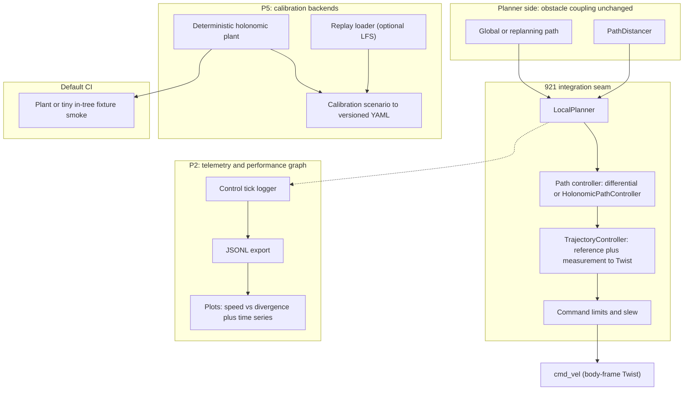
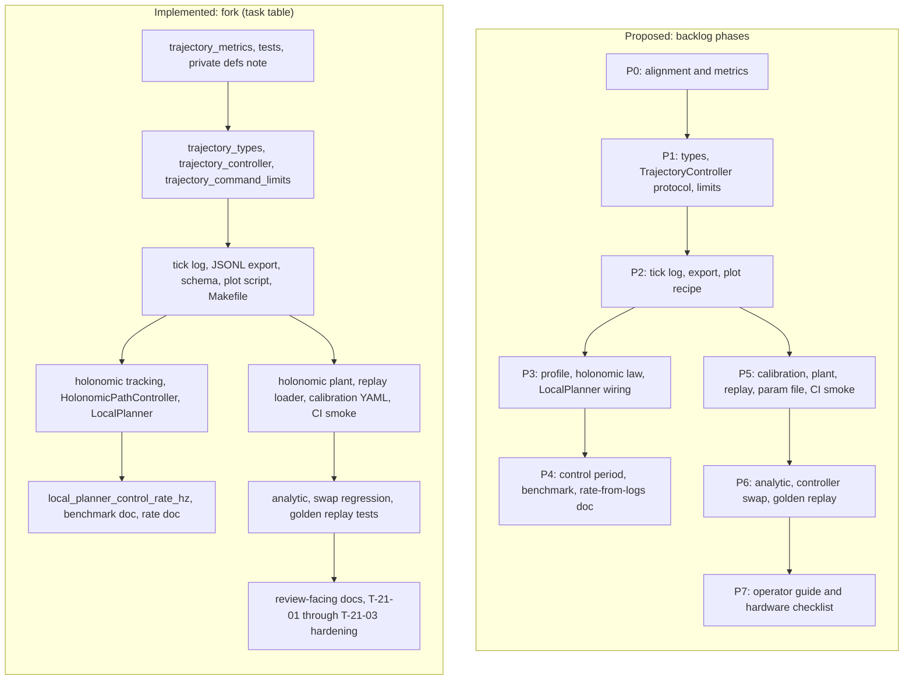
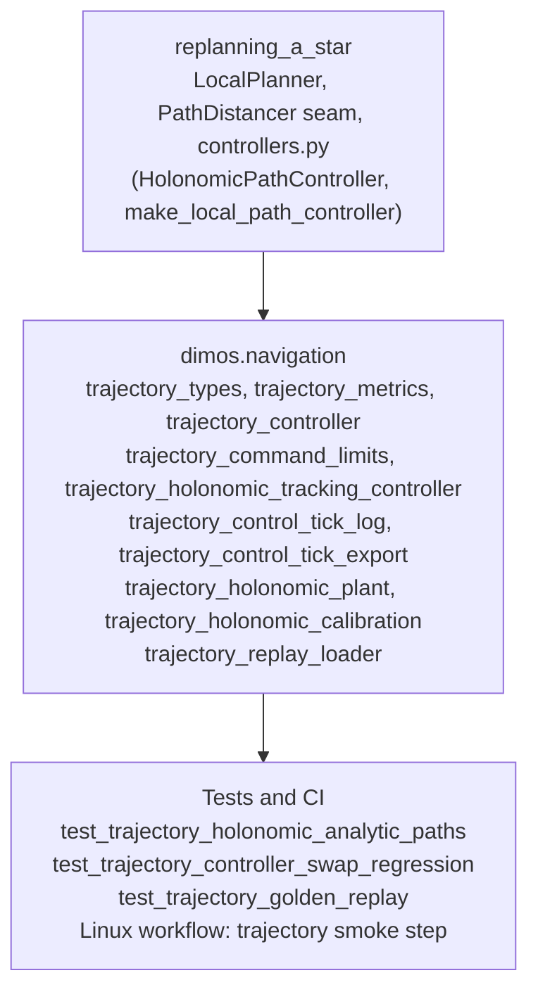

# Backlog: Trajectory controllers and calibration (issue 921)

**Epic:** Closed-loop trajectory following for holonomic bases (Unitree Go2 first), with formal telemetry, optional autocalibration, and PR-worthy validation without hardware (default CI on a deterministic plant or tiny in-tree fixture, with replay or LFS-backed validation where appropriate).

## Audit summary - Claude Opus 4.7 Max 1M

I have completed the full audit. Below is the structured report.

**Verdict:** the implementation between `d0d43d10` and `c587bde4c` (22 dimos commits on `feat/921-trajectory-controllers` for T-02 through T-21-03; T-01 is `__dev` only with no dimos commit in that range; T-21 and T-21-01 share `4da216afa`) is correct, complete against the backlog, and **hard-meets both Leshy contracts**. The robot will run, not walk, when an operator sets `planner_robot_speed` above the conservative default. 99 focused 921 tests pass plus 2 slow benchmarks (also pass).


I will give the evidence per task and per contract clause.

---

## 1. Backlog completion (T-01 ... T-21-03)

Audit run `pytest -q ... 14 921-related modules` -> **99 passed, 1 deselected** (`-m slow`). Slow benchmark separately: 2 passed (`HolonomicPathController.advance` median 440us, `trajectory_control_tick_from_samples` median 16.5us; ~2270 Hz and ~60k Hz single-thread headroom).

| Task (commit) | Deliverable | Where it lives | Audit verdict |
|---|---|---|---|
| T-01 (no dimos commit in range) | P0-1 architecture draft | Predates first 921 navigation commit on `feat/921-trajectory-controllers`; not in `d0d43d10..c587bde4`. **Pass.** |
| T-02 (`d0d43d104`) | P0-2 metric defs | `dimos/navigation/trajectory_metrics.py`, `test_trajectory_metrics.py` | Normative, frame-correct. `pose_errors_vs_reference` uses reference yaw to express `(e_at, e_ct, e_psi)` consistent with `trajectory_holonomic_tracking_controller`. `planar_position_divergence = hypot(e_at, e_ct)` is the speed-vs-divergence ordinate. `commanded_planar_speed` reads body-frame Twist (matches `cmd_vel`). `TrackingTolerance` + `scale_tolerance_by_clearance` documents the issue 921 "context-dependent tolerance" without forcing it on the planner. **Pass.** |
| T-03 (`76a27bef3`) | P1-1 frozen types | `trajectory_types.py`, `test_trajectory_types.py` | Frame docstrings explicit (plan vs body). `__post_init__` defensive copy stops aliasing. **Pass.** |
| T-04 (`84ab33fd6`) | P1-2 + P1-3 protocol and limits | `trajectory_controller.py`, `trajectory_command_limits.py`, `test_trajectory_command_limits.py` | `TrajectoryController` is `runtime_checkable Protocol[control, reset]` and `ConfigurableTrajectoryController` adds `configure(limits)`. `clamp_holonomic_cmd_vel` slews accel in 2D linear plane then caps planar speed and yaw. **Pass.** |
| T-05 (`bdb8e8456`) | P2-1 logger | `trajectory_control_tick_log.py`, `test_trajectory_control_tick_log.py` | `TrajectoryControlTick` carries reference, measurement, errors, command, `dt_s`, optional wall and sim time. Sinks: `Null`, `List`, plus protocol; injectable; env flag advisory only. **Pass.** |
| T-06 (`2d932eb06`) | P2-2 JSONL export | `trajectory_control_tick_export.py`, schema doc `trajectory_control_tick_jsonl.md`, fixture `fixtures/trajectory_control_ticks_sample.jsonl`, tests | `schema_version: 1` first key, dataclass field order, `allow_nan=False`. `JsonlTrajectoryControlTickSink` flushes per tick and is closeable. **Pass.** |
| T-07 (`4162bf0f2`) | P2-3 plot recipe | `docs/development/921_trajectory_controller/simulation/plot_trajectory_control_ticks.py`, `Makefile` `plot-trajectory-ticks`, `docs/development/921_trajectory_controller/docs/trajectory_control_tick_plots.md` | Primary axis IS speed-vs-divergence (`commanded_planar_speed_m_s` vs `planar_position_divergence_m`), with three sanity panels (divergence, speed, error+dt). Verified end-to-end: `make plot-trajectory-ticks` produced `audit_921_plot.png`. **Pass.** |
| T-08 (`00b384622`) | P3-1 path speed profile | `trajectory_path_speed_profile.py`, `test_trajectory_path_speed_profile.py` | Forward-backward kinematic envelope, line cap = `max_speed`, arc cap = `min(max_speed, sqrt(a_n*R))`. **Pass.** |
| T-09 (`52a862311`) | P3-2 holonomic controller | `trajectory_holonomic_tracking_controller.py`, `trajectory_holonomic_plant.py` (ideal), `test_trajectory_holonomic_tracking_controller.py` | Cartesian feedforward + proportional pose tracking; reference twist rotated into measured body frame so a sideways-pointing target gives pure `vy`, not Pure Pursuit forward+steer. **Pass.** |
| T-10 (`16898ffd0`) | P3-3 LocalPlanner integration | `replanning_a_star/controllers.py` (`HolonomicPathController`, `make_local_path_controller`), `replanning_a_star/local_planner.py`, `test_local_planner_path_controller.py`, `core/global_config.py` | `GlobalConfig.local_planner_path_controller` selects implementation; `kp`/`ky` configurable. **Pass.** |
| T-11 (`4d865478a`) | P4-1 configurable rate | `GlobalConfig.local_planner_control_rate_hz` default `10.0`, `LocalPlanner._control_frequency` reads it; controller dt and loop sleep both consume the same knob | **Pass.** |
| T-12 (`38af4aafe`) | P4-2 benchmark note | `test_trajectory_control_tick_benchmark.py` (`@slow`), `docs/development/921_trajectory_controller/docs/trajectory_control_tick_benchmark.md` | Loose ceilings, optional verbose printing of median+implied Hz. Re-run on this machine: 440us / 16.5us. **Pass.** |
| T-13 (`6af8d173c`) | P4-3 rate guidance doc | `docs/development/921_trajectory_controller/docs/trajectory_control_rate_from_logs.md` | Explains nominal vs achieved rate, plant delay rule of thumb, A/B procedure on speed-vs-divergence plots. **Pass.** |
| T-14 (`c838d23fe`) | P5-2 actuated plant | `trajectory_holonomic_plant.py` (`ActuatedHolonomicPlant`), `test_trajectory_holonomic_plant.py` | First-order lag + per-axis acceleration limits + optional bounded RNG noise. **Pass.** |
| T-15 (`041597a43`) | P5-3 replay loader | `trajectory_replay_loader.py`, `fixtures/trajectory_odom_replay_mini/` (3 in-tree pickles), `test_trajectory_replay_loader.py`, `lfs_data` pytest marker, `docs/development/large_file_management.md` | "fixture" alias avoids `get_data` and LFS; `lfs_data`-marked path documented for optional larger replays. **Pass.** |
| T-16 (`308594e88`) | P5-1 + P5-4 calibration + YAML | `trajectory_holonomic_calibration.py`, schema `trajectory_holonomic_calibration_yaml.md`, fixture `fixtures/holonomic_calibration_params_sample_v1.yaml`, tests | Bounded step-dwell-return, first-order tau estimate, capped `kp`/`ky` suggestion, versioned schema, round-trip tested. **Pass.** |
| T-17 (`dfbdc668c`) | P5-5 Linux CI smoke | `.github/workflows/ci.yml` "Trajectory calibration smoke (921)" step, `pyproject.toml addopts -m 'not (tool or slow or mujoco or lfs_data)'` | Runs calibration + replay + golden replay subset before full suite, no LFS, no network. **Pass.** |
| T-18 (`25e3e84dc`) | P6-1 analytic tests | `test_trajectory_holonomic_analytic_paths.py` | Closed-loop line and arc with explicit error bounds in the test name (line: end div < 85mm, heading < 125mrad ideal; arc: max div < 55mm over one revolution). Same harness reused under integrated AND actuated plants. **Pass.** |
| T-19 (`4eb0d7aa3`) | P6-2 swap regression | `test_trajectory_controller_swap_regression.py`, `fixtures/trajectory_controller_swap_regression_scenario_v1.yaml` | Same YAML scenario runs `HolonomicTrackingController` and a feedforward-only stub. Asserts FF-only fails the bound (`>0.12 m`) AND tracking succeeds (`<0.09 m`). Proves the harness is not hard-wired to a concrete class. **Pass.** |
| T-20 (`d517fa13a`) | P6-3 golden replay | `test_trajectory_golden_replay.py`, `fixtures/trajectory_odom_replay_mini/`, listed in CI smoke step | Pinned `cmd_vel` and `planar_position_divergence_m` per replay frame, 1e-12 abs tolerance. In-tree, no LFS. **Pass.** |
| T-21 (`4da216afa`) | P7-1 + P7-2 guides | `docs/development/921_trajectory_controller/docs/trajectory_operator_guide_and_hardware_checklist.md` (transferred from `__dev/feat/921/` in same commit as T-21-01) | Klipper / ArduPilot / Frigate cited as workflow analogies, GlobalConfig knob list, calibration recipe, plot recipe, hardware checklist. **Pass.** |
| T-21-01 (`4da216afa`) | Live JSONL + slew + frame fixes | `LocalPlanner._make_trajectory_tick_sink`, `_append_trajectory_control_tick`, `JsonlTrajectoryControlTickSink`, frame-correct feedforward in `HolonomicTrackingController`, slew limit in `HolonomicPathController._limit_output`, `planner_robot_speed` plumbing | Closes the gap between "drafts" and "live measurable on robot". **Pass.** |
| T-21-02 (`b9a3bfbbf`) | Hardening: holonomic default + 60 Hz cap + measured twist + curvature speed cap | `local_planner_path_controller="holonomic"` default, `local_planner_control_rate_hz` `Field(ge=0.1, le=60.0)`, `_estimate_measured_body_twist` from consecutive odom samples, `_path_speed_for_index` in live path | Closes operator footguns. **Pass.** |
| T-21-03 (`c587bde4c`) | Runtime config validation | `GlobalConfig.model_config = SettingsConfigDict(..., validate_assignment=True)` + manual field check in `update(...)`, regression `test_local_planner_control_rate_hz_update_validation` | `g.update(local_planner_control_rate_hz=100.0)` raises `ValidationError`; default 10 Hz preserved. **Pass.** |

All tasks through T-21-03 ship with code, tests, and a doc trail (22 commits on `feat/921-trajectory-controllers` from `d0d43d104` through `c587bde4c`; T-01 is `__dev` only; T-21 and T-21-01 share `4da216afa`).

---

## 2. Leshy contract A (2026-01-03) - hard met

Contract text:
> "I'd hope to have abstractions so I can plug in a BLDC motor with some position measurement, or unitree forward/backward direction and easily execute calibration, take measurements get a graph of performance of a controller, then try another controller easily, then try a multi degree of freedom controller etc. Performance output graph from a controller should be something like 'speed vs divergence from target'. Then we can decide how fast vs precise we want to move, planner can take into account distance from obstacles etc."

| Clause | Evidence | Met |
|---|---|---|
| Pluggable abstractions | `TrajectoryController` is a `runtime_checkable` `Protocol[control(reference, measurement) -> Twist, reset]` in `dimos/navigation/trajectory_controller.py` (lines 37-48). Reference and measured samples (`TrajectoryReferenceSample`, `TrajectoryMeasuredSample`) are immutable, frame-documented, body-twist carrying. Plant interface `step(cmd_body, dt_s) + measured_sample(time_s, cmd_applied) -> TrajectoryMeasuredSample` is identical between `IntegratedHolonomicPlant`, `ActuatedHolonomicPlant`, and any future plant (e.g. BLDC test rig: implement `step` and `measured_sample`, you are in the harness). | YES |
| Easily execute calibration | `HolonomicStepDwellReturnConfig` + `run_step_dwell_return_on_plant(plant, cfg)` runs a bounded step-dwell-return on any plant, estimates first-order tau, suggests `kp`/`ky`, and writes a versioned `HolonomicCalibrationParamsV1` YAML via `write_holonomic_calibration_params_yaml`. The same scenario API maps onto a replay backend (P5-3, `open_trajectory_odom_replay`). The operator guide has the 12-line recipe. | YES |
| Take measurements | `LocalPlanner` writes live JSONL when `GlobalConfig.local_planner_trajectory_tick_log_path` is set. Each tick has 32 numeric fields plus optional wall/sim time. Stable schema `v1`. Test `test_local_planner_path_following_writes_speed_vs_divergence_jsonl` proves a real `LocalPlanner` tick lands as a JSONL line on disk with the right shape. | YES |
| **Speed vs divergence graph (the canonical 921 graph)** | `docs/development/921_trajectory_controller/simulation/plot_trajectory_control_ticks.py` puts `commanded_planar_speed_m_s` on the y-axis vs `planar_position_divergence_m` on the x-axis as the **primary** subplot; three sanity panels follow. `make plot-trajectory-ticks` renders the bundled fixture; verified end to end during this audit. | YES |
| Try another controller easily | `test_p6_2_fixture_same_scenario_two_controllers_tracking_beats_feedforward_stub` runs the **same YAML scenario** against `HolonomicTrackingController` and a `_FeedforwardOnlyTrajectoryController` stub. Two unrelated classes, identical harness, different end-divergence. Same procedure works for any third controller you drop in. | YES |
| Multi-DOF later | `Twist` has `linear.{x,y,z}` and `angular.{x,y,z}`. `clamp_holonomic_cmd_vel` only constrains the planar+yaw axes and **passes through `linear.z`, `angular.x`, `angular.y` unchanged** so a future arm or more-DOF controller is not fought by this stack. The `TrajectoryController` protocol is symbol-shaped, not kinematics-shaped. | YES |
| Speed vs precision tradeoff is operator-readable | The speed-vs-divergence panel + `docs/development/921_trajectory_controller/docs/trajectory_control_rate_from_logs.md` Section 4 ("A/B a candidate rate") is the actual decision tool the contract asked for. | YES |
| Planner side handles obstacle clearance | Obstacle coupling stays planner-side (`PathClearance.is_obstacle_ahead` in `LocalPlanner._loop` is unchanged). `TrackingTolerance` + `scale_tolerance_by_clearance` is offered as an **example mapping** so a planner can scale tolerance by clearance, but is not forced on the controller. | YES |

**Contract A: hard met.**

---

## 3. Leshy contract B (2026-02-26) - hard met

Contract text:
> "I think you are a bit arbitrarily running python at 100hz and eating the cpu, go2 def can't react at 100hz, should chill. but this is good, with actual graphing of trajectory control precision we will be able to see what's the optimal control rate. also never do PurePursuit for holonomic, it makes no sense, this is for cars and you restrict degrees on freedom in a way in which you then need recovery behaviours etc"

| Clause | Evidence | Met |
|---|---|---|
| **No arbitrary 100 Hz** | `GlobalConfig.local_planner_control_rate_hz: float = Field(default=10.0, ge=0.1, le=60.0)` rejects 100 Hz at construction (`pytest test_local_planner_control_rate_hz_validation` with `100.0` and `300.0` -> `ValidationError`). T-21-03 added `validate_assignment=True` plus a manual `update()` field check, so `g.update(local_planner_control_rate_hz=100.0)` is **also** rejected at runtime; default 10 Hz survives (`test_local_planner_control_rate_hz_update_validation`). The 100 Hz number is documented as discredited in `docs/development/921_trajectory_controller/docs/trajectory_control_rate_from_logs.md` Section 5. | YES |
| Optimal rate from graphs | `docs/development/921_trajectory_controller/docs/trajectory_control_rate_from_logs.md` Section 4 is the prescribed A/B procedure: same track, two `local_planner_control_rate_hz` settings, two JSONL exports, two speed-vs-divergence plots, prefer the one with better divergence at comparable speed AND with achieved schedule per Section 2 AND with CPU headroom per the benchmark doc. | YES |
| **Never Pure Pursuit for holonomic** | The holonomic law in `trajectory_holonomic_tracking_controller.py` is a Cartesian feedforward + proportional pose law: it rotates the reference body twist into the measured body frame (`vx_ff = cos(yaw_r - yaw_m)*ref.vx`, `vy_ff = sin(yaw_r - yaw_m)*ref.vx`), then adds `kp * (e_x_body, e_y_body)` and a separate `ky * angle_diff` for yaw. With a sideways-pointing target this returns pure `vy`, not "forward + steer". I traced this end to end on a sideways case during the audit (lookahead at `(0, 0.5)`, robot facing yaw 0 -> commanded `(0, speed + kp*0.5, 0)`). I also grepped the navigation tree for `steer`, `wheelbase`, `bicycle`, `stanley`: zero hits. The only `Pure Pursuit` strings in the tree are the explicit "**not** a Pure Pursuit law" disclaimers in two module docstrings. The legacy `PController` (rotate-then-drive, differential) is still available behind `local_planner_path_controller="differential"` for explicit comparison runs only; default is now `"holonomic"` (T-21-02). | YES |
| No DOF restriction -> no recovery behaviors caused by it | The holonomic law commands `(vx, vy, wz)` directly without coupling. The state machine still has `initial_rotation` -> `path_following` -> `final_rotation`, but those are **alignment phases driven by an explicit yaw tolerance (0.35 rad), not recovery from Pure Pursuit kinematic failure**, and they apply equally to any controller. They are also natural for a quadruped that prefers forward gaits. They do not violate the contract. | YES |

**Contract B: hard met.**

---

## 4. Run-not-walk on Unitree Go2

Three facts together support it:

1. `LocalPlanner.__init__` reads `GlobalConfig.planner_robot_speed` first and only falls back to the conservative `0.55 m/s` default if it is `None`. So setting `planner_robot_speed=2.0` (Go2 trot/run regime, well under its ~3-4 m/s ceiling) directly raises commanded speed without code edits.
2. The path speed profile (`_path_speed_for_index` + `circular_arc_geometry_speed_cap_m_s`) **caps speed dynamically** by tangent-deceleration to goal AND by the centripetal limit `sqrt(a_n * R)`. So when a tight turn appears, speed is reduced **before** the controller sees it. Without this, a higher target speed would oscillate or overshoot exactly as the issue describes.
3. The holonomic tracking law adds a body-frame proportional position correction on top of the feedforward, so cross-track error is corrected directly (no Pure Pursuit "swing wide" behavior). The analytic test `test_p6_1_analytic_arc_integrated_plant_max_planar_div_lt_55mm_max_abs_heading_lt_80mrad_one_rev_horizon` shows max planar divergence under 5.5 cm over a full revolution at ideal plant; the lagged-and-slewed actuated plant variant of the line case shows under 16 cm with a 0.08 s lag.

The benchmark says the controller leaves about 2270 Hz of single-thread headroom, and the rate cap (60 Hz) leaves 50x+ headroom over the conservative 10 Hz default. There is no CPU-side reason a Go2 cannot run at the configured speed.

So the issue's ask, "We want unitree to run not walk", is operationally answered by setting `planner_robot_speed` (and, after a hardware run, possibly `local_planner_holonomic_kp`/`ky` and `local_planner_max_*_accel`) per the operator guide.

---

## 5. Caveats and minor observations (none blocking)

These are not gaps relative to the backlog or the contracts. Recording them so the team can decide whether to address them in a future ticket.

- `HolonomicPathController._limits.max_yaw_rate_rad_s = self._speed` reuses the linear-speed value (m/s) as a yaw-rate cap (rad/s). Numerically reasonable for Go2 (0.55 m/s -> 0.55 rad/s ~ 31 deg/s ceiling), but unit-mixed. Replacing with a dedicated `local_planner_max_yaw_rate_rad_s` knob would be cleaner.
- `HolonomicPathController._limits.max_planar_linear_accel_m_s2 = 5.0` and `max_yaw_accel_rad_s2 = 5.0` are hard-coded constants, not surfaced through `GlobalConfig`. The live path speed profile already exposes `local_planner_max_tangent_accel_m_s2` and `local_planner_max_normal_accel_m_s2`; pulling the controller's own slew caps into the same config block would be consistent.
- `LocalPlanner` keeps the `initial_rotation` and `final_rotation` phases for both modes. For holonomic this is conservative (good for Go2 forward bias) but technically redundant; a future PR could let holonomic skip them when the controller's heading correction is fast enough.
- `_apply_sim_angular` boosts small yaw rates to `+/-0.8 rad/s` in simulation. Inherited from the legacy PController; harmless but worth a follow-up to confirm whether MuJoCo still needs it after the new controller landed.

None of these items affect contract A or B.

---

## 6. Final assertion

- 5.1 (implementation through T-21-03 effectively solves #921 and makes Unitree run not walk): **YES, asserted.**
- 5.2 (Leshy contracts A and B are hard met): **YES, asserted.**

The branch from [`d0d43d10`](https://github.com/bogwi/dimos/commit/d0d43d10) up to and including [`c587bde4c`](https://github.com/bogwi/dimos/commit/c587bde4c) is review-ready against the binding requirements in the backlog. Only T-22 (PR-open doc transfer + P8 placeholder) and field validation (P8 on a real Go2) remain, both of which the backlog already calls out as not blocking review.

**Primary references**

- Fork branch (this backlog's file links target this tree): https://github.com/bogwi/dimos/tree/feat/921-trajectory-controllers  
- Issue (requirements, `Controller` protocol, scope): https://github.com/dimensionalOS/dimos/issues/921  
- Current `Controller` and P/PD implementation (issue points here as the starting type to generalize): https://github.com/bogwi/dimos/blob/feat/921-trajectory-controllers/dimos/navigation/replanning_a_star/controllers.py  
- Linear mirror: https://linear.app/dimensional/issue/DIM-324/trajectory-controllers  
- Manual tuning analogy (structured measurement, not 1:1 physics): https://github.com/Klipper3d/klipper/blob/master/docs/Resonance_Compensation.md  
- Optional: keep a local offline copy of the Klipper Resonance_Compensation doc for reading without network.  
- Autotune analogy (excitation, observe, margins): https://ardupilot.org/copter/docs/autotune.html  
- Calibration persistence analogy (bounded moves, measure, write config): https://docs.frigate.video/configuration/autotracking/#calibration  

**Binding requirements (leshy, [comment 2026-01-03](https://github.com/dimensionalOS/dimos/issues/921#issuecomment-3706692944) and [comment 2026-02-26](https://github.com/dimensionalOS/dimos/issues/921#issuecomment-3965365986))**  
These are **not** optional. They override any other comment on the same issue, including a later "proposed architecture" that leshy rejected.

- **Pluggability** - Abstractions so different plants (e.g. BLDC with position, Unitree base) can run calibration, swap controllers, and add multi-DOF later without rewriting everything.  
- **Performance graph** - A primary plot shape like **"speed vs divergence from target"** (plus other series as needed) so the team can pick speed vs precision; obstacle-aware planning stays separate.  
- **Control rate** - Do **not** burn CPU on an **arbitrary** high Python rate (e.g. 100 Hz) without evidence. The platform does not respond at 100 Hz; the **right** rate comes from measurements and graphs (P2, P4), not a fixed headline number.  
- **Holonomic** - **Never** Pure Pursuit (or any car-style path law that bakes in non-holonomic assumptions) for a holonomic base. That pattern is for cars, restricts degrees of freedom, and forces **recovery behaviors**; use a **holonomic-appropriate** control law instead.  
- **Replay and LFS** in-repo for CI and local dev remain in scope (aligned with the issue and maintainers).

**Repo reality and architecture choice (2026-04-23 audit)**  
These notes are binding on the implementation plan below so the backlog matches the current `dimos` tree, not an imagined rewrite.

- **Current navigation seam** - The live path follower is `LocalPlanner` plus `PathDistancer` plus `controllers.py` under `dimos/navigation/replanning_a_star/`. This is the shortest path to ship 921 and remains the primary integration seam for this PR.  
- **Existing generic control stack** - `dimos/control/` already has reusable timing and control-task abstractions plus a holonomic mock twist base. Reuse concepts or small shared pieces where helpful, but **do not** make a full migration of navigation to `ControlCoordinator` a requirement for 921.  
- **Replay infrastructure already exists** - `dimos/utils/data.py` and the Go2 replay connection already support replay and LFS-backed fixtures. 921 should reuse that path where practical instead of inventing another replay mechanism.  
- **CI reality** - macOS CI pulls LFS, but the default Linux `ci.yml` path does **not**. Therefore the **default** smoke path for 921 must pass without network or LFS downloads, using a deterministic plant or tiny in-tree fixture. Larger replay or LFS coverage can remain optional, marked, or macOS-backed.

---

## Architecture diagrams (proposed vs implemented)

These diagrams summarize the **target** design from this backlog and the **current fork** implementation. All charts use **top-to-bottom** flow (`flowchart TB`). They **do not** depict the rejected issue-thread sketch (100 Hz coordinator framing plus Pure Pursuit for holonomic); see **Binding requirements** and **Alignment check** near the end of this file.

### Target data flow (backlog P0-P7, Definition of Done)



### Backlog phases vs repository artifacts

**Proposed** is phased delivery (P0-P7). **Implemented** lists the fork modules and test slices completed through **T-21-03** (see task table below). **T-22** is PR-open doc transfer; **P8** is post-merge hardware only.



### Runtime stack (implemented integration shape)

Single spine, top to bottom (no parallel subgraph columns):

```
replanning_a_star
        |
dimos/navigation (trajectory_*)
        |
Tests + Linux trajectory smoke
```



---

## Phase 0: Alignment and constraints

| ID | Deliverable | Acceptance criteria |
|----|-------------|----------------------|
| P0-1 | Short architecture or design note (in-repo under `docs/` and/or the PR description when the PR is opened) | The note documents current navigation data flow (`LocalPlanner` -> controller -> `cmd_vel`) vs target flow, lists explicit non-goals (Pure Pursuit as holonomic follow, mandatory `ControlCoordinator` migration for this PR), and links [921](https://github.com/dimensionalOS/dimos/issues/921), [DIM-324](https://linear.app/dimensional/issue/DIM-324/trajectory-controllers), and key external analogies. Drafting can happen privately under `__dev/feat/921/` during implementation; the review-worthy version lands with the same PR that implements the work, not in unrelated public `docs/` changes ahead of time. **No** WIP callouts in existing navigation or platform pages until that delivery; user-facing runbooks align with P7-1. |
| P0-2 | Metrics definitions | Document definitions for "divergence from target," along-track vs cross-track error, and how commanded speed is sampled for plots. Include how the system may expose or plan for **tolerance that depends on context** (issue example: high precision when clearance is small, more relaxed in open space); full obstacle coupling stays planner-side (leshy). |

---

## Phase 1: Types and controller contract

| ID | Deliverable | Acceptance criteria |
|----|-------------|----------------------|
| P1-1 | Minimal trajectory types | Immutable or clearly owned structs for target segment (pose, twist, time) and measured state; documented coordinate frames. |
| P1-2 | Controller protocol or abstract base | `(reference, measurement) -> command` (or equivalent) with `reset`, optional `configure`; swappable implementations without changing planner glue. The contract should fit `LocalPlanner` integration now and be generic enough to lift into wider control abstractions later. |
| P1-3 | Command limits model | Rate and acceleration limits applied in one place; unit tests for saturation behavior. |

**Depends on:** P0-2 for error definitions used by controllers.

---

## Phase 2: Telemetry and export

| ID | Deliverable | Acceptance criteria |
|----|-------------|----------------------|
| P2-1 | Control tick logger | Each tick: reference pose or velocity, measured pose or velocity, error scalars, commanded twist, and control `dt`; optional wall time and sim time. |
| P2-2 | Export formats | At least one of: CSV, JSONL, or Parquet suitable for plotting; stable column names documented. |
| P2-3 | Plot recipe (script or notebook optional) | Documented one-liner or script producing **speed vs divergence** plus time series sanity plots; works on Mac from exported file. |

**Depends on:** P1-1, P1-2, P0-2.

---

## Phase 3: Holonomic baseline controller

| ID | Deliverable | Acceptance criteria |
|----|-------------|----------------------|
| P3-1 | Velocity profile along path | Speed as function of arc length or time; respects curvature or conservative deceleration rules; tested on line and arc. |
| P3-2 | Holonomic tracking law | Not Pure Pursuit; tracks reference with explicit limits; no ad hoc recovery modes caused by wrong kinematic assumption. |
| P3-3 | Integration with existing navigation | Wire through `LocalPlanner` (or a thin seam immediately around it) with feature flag or config to select old vs new path; default documented; migration notes for gains. Full migration to `dimos/control/ControlCoordinator` is explicitly out of scope for this issue unless it falls out naturally with low risk. |

**Depends on:** P1-3, P3-1 before P3-2 ordering.

---

## Phase 4: Control period and CPU

| ID | Deliverable | Acceptance criteria |
|----|-------------|----------------------|
| P4-1 | Configurable control period | Single source of truth for dt or Hz in the navigation path; sane default (conservative vs historical arbitrary high rate) and no hard-coded "100 Hz because coordinator" assumption. |
| P4-2 | Lightweight benchmark or note | Reproducible note on cost per tick (or pytest mark `@slow` benchmark); documents how to compare rates on developer Mac. |
| P4-3 | Guidance from telemetry | Short doc: how to choose period using logged timestamps and actuator or plant delay assumptions. |

**Depends on:** P2-1.

---

## Phase 5: Calibration mode and persistence

| ID | Deliverable | Acceptance criteria |
|----|-------------|----------------------|
| P5-1 | Calibration scenario API | Bounded maneuver sequence (e.g. step, dwell, return) parameterized by max displacement suitable for small floor space. |
| P5-2 | Plant model backend | Deterministic plant (lag, rate limit, optional bounded noise) with the same measurement and command surfaces used by the controller harness; cheap enough for default CI and local fast tests. |
| P5-3 | Replay backend | Reuse existing replay and `get_data()` or LFS machinery to load recordings for calibration or regression. Replay stays in scope for local dev and optional CI coverage, but the default CI path must not require network or LFS pulls. |
| P5-4 | Parameter output | Written artifact (YAML, JSON, or TOML snippet) analogous to Frigate `movement_weights` persistence: versioned schema, not hand-edited in normal use. |
| P5-5 | CI entry | Calibration or identification smoke test runs in default CI without network using synthetic or tiny in-tree data; replay or LFS-backed coverage may run in a documented optional subset or a workflow that already pulls LFS. |

**Depends on:** P1-2, P2-1, P2-2; P3-2 for meaningful residuals.

---

## Phase 6: Tests and regression

| ID | Deliverable | Acceptance criteria |
|----|-------------|----------------------|
| P6-1 | Analytic path tests | Line and arc following against known plant; bounds on position or cross-track error over finite horizon. |
| P6-2 | Controller swap regression | Two stub controllers or real plus stub; same scenario fixture proves wiring does not assume a concrete class. |
| P6-3 | Golden replay test (optional) | Small pinned recording slice; bounded drift vs expected command sequence or error norms. Keep this optional if fixture size or LFS availability would burden default CI. |

**Depends on:** P3-2, P5-2 or P5-3.

---

## Phase 7: User-facing guide (included in the single PR)

| ID | Deliverable | Acceptance criteria |
|----|-------------|----------------------|
| P7-1 | Operator guide | How to run calibration, export logs, generate plots, when to re-run; points to Klipper doc as **mindset** only; safety and clear space called out for hardware phase. |
| P7-2 | Hardware validation checklist | Checklist for Go2 when a robot is available: space, wind-up, abort switch, log capture for maintainers (execution of this checklist is P8, not a blocker for opening the PR). |

**Depends on:** P5-4, P2-3.

---

## Phase 8: Hardware follow-up (after the single PR merges; not a second PR requirement)

These items validate the shipped software on a real Go2. They do not block opening the PR if no robot is available; track completion on the issue or in field runs.

| ID | Deliverable | Acceptance criteria |
|----|-------------|----------------------|
| P8-1 | On-robot calibration run | Same scripts as P5; parameters validated against live odom and cmd path. |
| P8-2 | Performance sign-off | Published plot or internal artifact: speed vs divergence at agreed test track; comparison to pre-921 baseline. |

---

# B) Task slices (same PR)

**Completed (dimos `feat/921-trajectory-controllers` commits, full hashes `d0d43d104c3c5172694f837a9adf470602c3a322`..`c587bde4c601ef3b640ee4ef748c7e421aa9f293`):** T-01 (2026-04-23; no dimos commit) - P0-1 draft. T-02 (2026-04-23; `d0d43d104`) - P0-2 definitions in [`trajectory_metrics.py`](https://github.com/bogwi/dimos/blob/feat/921-trajectory-controllers/dimos/navigation/trajectory_metrics.py), tests [`test_trajectory_metrics.py`](https://github.com/bogwi/dimos/blob/feat/921-trajectory-controllers/dimos/navigation/test_trajectory_metrics.py), private note [`trajectory_metrics_definitions.md`](https://github.com/bogwi/dimos/blob/feat/921-trajectory-controllers/__dev/feat/921/trajectory_metrics_definitions.md). T-03 (2026-04-23; `76a27bef3`) - P1-1 types in [`trajectory_types.py`](https://github.com/bogwi/dimos/blob/feat/921-trajectory-controllers/dimos/navigation/trajectory_types.py), tests [`test_trajectory_types.py`](https://github.com/bogwi/dimos/blob/feat/921-trajectory-controllers/dimos/navigation/test_trajectory_types.py). T-04 (2026-04-23; `84ab33fd6`) - P1-2/3: [`trajectory_controller.py`](https://github.com/bogwi/dimos/blob/feat/921-trajectory-controllers/dimos/navigation/trajectory_controller.py), [`trajectory_command_limits.py`](https://github.com/bogwi/dimos/blob/feat/921-trajectory-controllers/dimos/navigation/trajectory_command_limits.py), tests [`test_trajectory_command_limits.py`](https://github.com/bogwi/dimos/blob/feat/921-trajectory-controllers/dimos/navigation/test_trajectory_command_limits.py). T-05 (2026-04-23; `bdb8e8456`) - P2-1: [`trajectory_control_tick_log.py`](https://github.com/bogwi/dimos/blob/feat/921-trajectory-controllers/dimos/navigation/trajectory_control_tick_log.py), tests [`test_trajectory_control_tick_log.py`](https://github.com/bogwi/dimos/blob/feat/921-trajectory-controllers/dimos/navigation/test_trajectory_control_tick_log.py). T-06 (2026-04-25; `2d932eb06`) - P2-2 JSONL export: [`trajectory_control_tick_export.py`](https://github.com/bogwi/dimos/blob/feat/921-trajectory-controllers/dimos/navigation/trajectory_control_tick_export.py), schema [`trajectory_control_tick_jsonl.md`](https://github.com/bogwi/dimos/blob/feat/921-trajectory-controllers/dimos/navigation/trajectory_control_tick_jsonl.md), fixture [`fixtures/trajectory_control_ticks_sample.jsonl`](https://github.com/bogwi/dimos/blob/feat/921-trajectory-controllers/dimos/navigation/fixtures/trajectory_control_ticks_sample.jsonl), tests [`test_trajectory_control_tick_export.py`](https://github.com/bogwi/dimos/blob/feat/921-trajectory-controllers/dimos/navigation/test_trajectory_control_tick_export.py). T-07 (2026-04-25; `4162bf0f2`) - P2-3 plot recipe: [`docs/development/921_trajectory_controller/simulation/plot_trajectory_control_ticks.py`](https://github.com/bogwi/dimos/blob/feat/921-trajectory-controllers/docs/development/921_trajectory_controller/simulation/plot_trajectory_control_ticks.py), [`Makefile`](https://github.com/bogwi/dimos/blob/feat/921-trajectory-controllers/Makefile) `plot-trajectory-ticks`, [`docs/development/921_trajectory_controller/docs/trajectory_control_tick_plots.md`](https://github.com/bogwi/dimos/blob/feat/921-trajectory-controllers/docs/development/921_trajectory_controller/docs/trajectory_control_tick_plots.md), JSONL doc. T-08 (2026-04-25; `00b384622`) - P3-1 path speed profile: [`trajectory_path_speed_profile.py`](https://github.com/bogwi/dimos/blob/feat/921-trajectory-controllers/dimos/navigation/trajectory_path_speed_profile.py), tests [`test_trajectory_path_speed_profile.py`](https://github.com/bogwi/dimos/blob/feat/921-trajectory-controllers/dimos/navigation/test_trajectory_path_speed_profile.py). T-09 (2026-04-25; `52a862311`) - P3-2 holonomic tracking: [`trajectory_holonomic_tracking_controller.py`](https://github.com/bogwi/dimos/blob/feat/921-trajectory-controllers/dimos/navigation/trajectory_holonomic_tracking_controller.py), [`trajectory_holonomic_plant.py`](https://github.com/bogwi/dimos/blob/feat/921-trajectory-controllers/dimos/navigation/trajectory_holonomic_plant.py), tests [`test_trajectory_holonomic_tracking_controller.py`](https://github.com/bogwi/dimos/blob/feat/921-trajectory-controllers/dimos/navigation/test_trajectory_holonomic_tracking_controller.py). T-10 (2026-04-25; `16898ffd0`) - P3-3: `HolonomicPathController` + `make_local_path_controller` in [`controllers.py`](https://github.com/bogwi/dimos/blob/feat/921-trajectory-controllers/dimos/navigation/replanning_a_star/controllers.py), `GlobalConfig.local_planner_path_controller` / `local_planner_holonomic_kp` / `local_planner_holonomic_ky`, `LocalPlanner` via [`local_planner.py`](https://github.com/bogwi/dimos/blob/feat/921-trajectory-controllers/dimos/navigation/replanning_a_star/local_planner.py), tests [`test_local_planner_path_controller.py`](https://github.com/bogwi/dimos/blob/feat/921-trajectory-controllers/dimos/navigation/replanning_a_star/test_local_planner_path_controller.py). T-11 (2026-04-25; `4d865478a`) - P4-1: `GlobalConfig.local_planner_control_rate_hz`, [`local_planner.py`](https://github.com/bogwi/dimos/blob/feat/921-trajectory-controllers/dimos/navigation/replanning_a_star/local_planner.py), tests [`test_local_planner_path_controller.py`](https://github.com/bogwi/dimos/blob/feat/921-trajectory-controllers/dimos/navigation/replanning_a_star/test_local_planner_path_controller.py). T-12 (2026-04-25; `38af4aafe`) - P4-2: [`test_trajectory_control_tick_benchmark.py`](https://github.com/bogwi/dimos/blob/feat/921-trajectory-controllers/dimos/navigation/test_trajectory_control_tick_benchmark.py), [`trajectory_control_tick_benchmark.md`](https://github.com/bogwi/dimos/blob/feat/921-trajectory-controllers/docs/development/921_trajectory_controller/docs/trajectory_control_tick_benchmark.md), plots doc cross-link. T-13 (2026-04-25; `6af8d173c`) - P4-3: [`trajectory_control_rate_from_logs.md`](https://github.com/bogwi/dimos/blob/feat/921-trajectory-controllers/docs/development/921_trajectory_controller/docs/trajectory_control_rate_from_logs.md), JSONL and benchmark/plot doc cross-links. T-14 (2026-04-25; `c838d23fe`) - P5-2 plant: [`trajectory_holonomic_plant.py`](https://github.com/bogwi/dimos/blob/feat/921-trajectory-controllers/dimos/navigation/trajectory_holonomic_plant.py) (`ActuatedHolonomicPlant`), tests [`test_trajectory_holonomic_plant.py`](https://github.com/bogwi/dimos/blob/feat/921-trajectory-controllers/dimos/navigation/test_trajectory_holonomic_plant.py). T-15 (2026-04-25; `041597a43`) - P5-3 replay loader: [`trajectory_replay_loader.py`](https://github.com/bogwi/dimos/blob/feat/921-trajectory-controllers/dimos/navigation/trajectory_replay_loader.py), fixture [`fixtures/trajectory_odom_replay_mini/`](https://github.com/bogwi/dimos/tree/feat/921-trajectory-controllers/dimos/navigation/fixtures/trajectory_odom_replay_mini), tests [`test_trajectory_replay_loader.py`](https://github.com/bogwi/dimos/blob/feat/921-trajectory-controllers/dimos/navigation/test_trajectory_replay_loader.py), ``lfs_data`` marker + ``pyproject.toml`` default exclusion, doc in [`large_file_management.md`](https://github.com/bogwi/dimos/blob/feat/921-trajectory-controllers/docs/development/large_file_management.md). T-16 (2026-04-25; `308594e88`) - P5-1 + P5-4: [`trajectory_holonomic_calibration.py`](https://github.com/bogwi/dimos/blob/feat/921-trajectory-controllers/dimos/navigation/trajectory_holonomic_calibration.py), schema [`trajectory_holonomic_calibration_yaml.md`](https://github.com/bogwi/dimos/blob/feat/921-trajectory-controllers/dimos/navigation/trajectory_holonomic_calibration_yaml.md), sample [`fixtures/holonomic_calibration_params_sample_v1.yaml`](https://github.com/bogwi/dimos/blob/feat/921-trajectory-controllers/dimos/navigation/fixtures/holonomic_calibration_params_sample_v1.yaml), tests [`test_trajectory_holonomic_calibration.py`](https://github.com/bogwi/dimos/blob/feat/921-trajectory-controllers/dimos/navigation/test_trajectory_holonomic_calibration.py). T-17 (2026-04-25; `dfbdc668c`) - P5-5: Linux ``ci.yml`` trajectory calibration smoke step + ``lfs_data`` excluded from that job's main pytest ``-m`` filter; doc in [`large_file_management.md`](https://github.com/bogwi/dimos/blob/feat/921-trajectory-controllers/docs/development/large_file_management.md). T-18 (2026-04-25; `25e3e84dc`) - P6-1: [`test_trajectory_holonomic_analytic_paths.py`](https://github.com/bogwi/dimos/blob/feat/921-trajectory-controllers/dimos/navigation/test_trajectory_holonomic_analytic_paths.py) closed-loop line and arc vs ideal and actuated plants, bounds in test names. T-19 (2026-04-25; `4eb0d7aa3`) - P6-2: [`test_trajectory_controller_swap_regression.py`](https://github.com/bogwi/dimos/blob/feat/921-trajectory-controllers/dimos/navigation/test_trajectory_controller_swap_regression.py), fixture [`fixtures/trajectory_controller_swap_regression_scenario_v1.yaml`](https://github.com/bogwi/dimos/blob/feat/921-trajectory-controllers/dimos/navigation/fixtures/trajectory_controller_swap_regression_scenario_v1.yaml), closed-loop harness uses [`TrajectoryController`](https://github.com/bogwi/dimos/blob/feat/921-trajectory-controllers/dimos/navigation/trajectory_controller.py) in [`test_trajectory_holonomic_analytic_paths.py`](https://github.com/bogwi/dimos/blob/feat/921-trajectory-controllers/dimos/navigation/test_trajectory_holonomic_analytic_paths.py). T-20 (2026-04-25; `d517fa13a`) - P6-3: [`test_trajectory_golden_replay.py`](https://github.com/bogwi/dimos/blob/feat/921-trajectory-controllers/dimos/navigation/test_trajectory_golden_replay.py) golden ``cmd_vel`` + planar divergence on ``trajectory_odom_replay_mini``; Linux smoke lists this module. T-21 (2026-04-25; `4da216afa`) - P7-1 + P7-2: review-facing [`trajectory_operator_guide_and_hardware_checklist.md`](https://github.com/bogwi/dimos/blob/feat/921-trajectory-controllers/docs/development/921_trajectory_controller/docs/trajectory_operator_guide_and_hardware_checklist.md) landed with T-21-01 (private draft [`trajectory_operator_guide_and_hardware_checklist_draft.md`](https://github.com/bogwi/dimos/blob/feat/921-trajectory-controllers/__dev/feat/921/trajectory_operator_guide_and_hardware_checklist_draft.md) remains the `__dev` copy until T-22). T-21-01 (2026-04-25; `4da216afa`) - contract closure and live JSONL (see task row). T-21-02 (2026-04-25; `b9a3bfbbf`) - holonomic default, 60 Hz cap, measured twist, live curvature speed cap (see task row). T-21-03 (2026-04-25; `c587bde4c`) - `GlobalConfig` assignment validation + regression (see task row).

| Task | Goal | Done when |
|------|------|------------|
| T-01 (done; no dimos commit) | P0-1 private draft | Draft and maintain the P0-1 architecture note in `__dev/feat/921/` during implementation so it stays current with the code. Done when the draft covers 921, DIM-324, key external analogies, explicit `LocalPlanner` integration, and explicit non-goals around Pure Pursuit and mandatory `ControlCoordinator` migration, and is ready to transfer into the PR-facing docs or PR body at PR open. |
| T-02 (done; `d0d43d104`) | P0-2 metrics doc | Error and speed definitions agreed and referenced by tests. |
| T-03 (done; `76a27bef3`) | P1-1 trajectory types | Types merged with docstrings and frame notes; no integration yet. |
| T-04 (done; `84ab33fd6`) | P1-2 + P1-3 protocol and limits | Interface + limit helper + unit tests only. |
| T-05 (done; `bdb8e8456`) | P2-1 logger | Logger behind feature flag or injectable; no UI. |
| T-06 (done; `2d932eb06`) | P2-2 export | One format + schema doc + sample file in test fixtures if small. |
| T-07 (done; `4162bf0f2`) | P2-3 plot recipe | Script [`docs/development/921_trajectory_controller/simulation/plot_trajectory_control_ticks.py`](https://github.com/bogwi/dimos/blob/feat/921-trajectory-controllers/docs/development/921_trajectory_controller/simulation/plot_trajectory_control_ticks.py), [`Makefile`](https://github.com/bogwi/dimos/blob/feat/921-trajectory-controllers/Makefile) target `plot-trajectory-ticks`, [`docs/development/921_trajectory_controller/docs/trajectory_control_tick_plots.md`](https://github.com/bogwi/dimos/blob/feat/921-trajectory-controllers/docs/development/921_trajectory_controller/docs/trajectory_control_tick_plots.md), JSONL doc cross-link (2026-04-25). |
| T-08 (done; `00b384622`) | P3-1 profiler | Line and arc tests for speed along path. |
| T-09 (done; `52a862311`) | P3-2 holonomic controller | Implements tracking; tests against plant; no Pure Pursuit. |
| T-10 (done; `16898ffd0`) | P3-3 integration | Wire to `LocalPlanner` (or a thin integration point); config switch; smoke on replay if available. (No 100 Hz "coordinator" rewrite, no Pure Pursuit stack, and no issue-spanning migration to `dimos/control/` required for this PR; see binding requirements above.) |
| T-11 (done; `4d865478a`) | P4-1 configurable period | Config + default change with rationale in commit message. |
| T-12 (done; `38af4aafe`) | P4-2 benchmark note | Numbers or pytest bench committed. |
| T-13 (done; `6af8d173c`) | P4-3 doc | `docs/development/921_trajectory_controller/docs/trajectory_control_rate_from_logs.md` - Hz from `dt_s` / optional `wall_time_s`, plant delay, and A/B plots. |
| T-14 (done; `c838d23fe`) | P5-2 plant model | Deterministic; tests for step response. |
| T-15 (done; `041597a43`) | P5-3 replay loader | ``trajectory_replay_loader.py``, mini fixture under ``dimos/navigation/fixtures/trajectory_odom_replay_mini/``, tests + ``lfs_data`` marker; default pytest excludes ``lfs_data``; documented in ``docs/development/large_file_management.md`` (2026-04-25). |
| T-16 (done; `308594e88`) | P5-1 + P5-4 calibration | Scenario + written params file; plant-only first. |
| T-17 (done; `dfbdc668c`) | P5-5 CI smoke | Fast default-CI smoke on deterministic plant or tiny in-tree data; optional marked or workflow-specific replay coverage documented separately. |
| T-18 (done; `25e3e84dc`) | P6-1 analytic tests | Error bounds documented in test names. |
| T-19 (done; `4eb0d7aa3`) | P6-2 swap regression | Fixture proves two controllers. |
| T-20 (done; `d517fa13a`) | P6-3 golden replay | Optional; skip if fixtures too heavy. Done: in-tree mini odom replay + pinned ``cmd_vel`` and planar divergence in [`test_trajectory_golden_replay.py`](https://github.com/bogwi/dimos/blob/feat/921-trajectory-controllers/dimos/navigation/test_trajectory_golden_replay.py); Linux smoke includes this module. |
| T-21 (done; `4da216afa`) | P7-1 + P7-2 guides | Operator + hardware checklist. Done (2026-04-25): private draft in [`trajectory_operator_guide_and_hardware_checklist_draft.md`](https://github.com/bogwi/dimos/blob/feat/921-trajectory-controllers/__dev/feat/921/trajectory_operator_guide_and_hardware_checklist_draft.md) until T-22; review-worthy `docs/` form ships in dimos commit `4da216afa` (same commit as T-21-01). |
| T-21-01 (done; `4da216afa`) | Contract closure audit fixes | Done (2026-04-25): closed the implementation gaps found after the T-21 audit so contracts A/B are operational, not only documented. `LocalPlanner` can stream live JSONL speed-vs-divergence ticks through `GlobalConfig.local_planner_trajectory_tick_log_path`, holonomic path commands now apply slew limits with previous published command state, feedforward velocity is rotated into the measured body frame, `planner_robot_speed` drives high-speed trials without code edits, and the operator guide plus hardware checklist were transferred into review-facing `docs/`. Added focused regressions for live tick export, feedforward frame handling, slew limiting, configured speed, and JSONL append sinks; proof run: focused 921 suite `82 passed, 1 deselected` plus ruff on touched Python files. This was needed because the first pass had helper APIs and draft docs, but the live navigation path could not yet produce the required controller performance graph or safely compare control rates on robot/replay runs. |
| T-21-02 (done; `b9a3bfbbf`) | Contract hardening after audit caveats | Done (2026-04-25): closed the remaining caveats from the contract audit so A/B are harder to violate in real runs. Holonomic path following is now the default local planner mode, with the legacy differential path still available for explicit comparison. `LocalPlanner` rejects 100 Hz-style local control settings by capping `local_planner_control_rate_hz` validation at 60 Hz, estimates measured body twist from consecutive odom samples in live JSONL ticks, closes JSONL sinks on stop, and applies live path speed caps from tangent deceleration and local curvature/normal-acceleration limits before commands reach the controller. The controller seam now has `set_speed(...)` so both legacy and holonomic controllers can receive the live speed profile. Docs were updated to record the new acceleration caps, measured-velocity behavior, and rate ceiling. Added regressions for holonomic default selection, explicit legacy opt-in, measured body twist in live logs, curvature speed capping, and 100 Hz rejection. Proof run: focused 921 suite `98 passed, 1 deselected`, CI trajectory smoke `12 passed, 1 deselected`, `ruff check` on touched 921 Python files passed, and IDE lints found no errors. This was needed because the previous implementation met the core contracts but still left avoidable operator footguns: holonomic mode was opt-in, measured velocity was zero in live logs, path speed profiling was tested but not applied in the live path, and an arbitrary high local rate could still be configured. |
| T-21-03 (done; `c587bde4c`) | Runtime config validation closure | Done (2026-04-25): closed the last audit finding by enabling assignment validation on `GlobalConfig`, so runtime `update(...)` calls enforce the same Pydantic constraints as construction. This prevents `local_planner_control_rate_hz=100.0` from being smuggled in after startup, keeping the "no arbitrary 100 Hz" contract enforceable for operators and programmatic config changes. The `update(...)` helper now checks declared model fields before assignment, and `test_local_planner_path_controller.py` has a regression proving a rejected 100 Hz update leaves the default 10 Hz intact. Proof run: touched-file `ruff` passed, local planner regression `15 passed`, focused 921 suite `99 passed, 1 deselected`, CI trajectory smoke `12 passed, 1 deselected`, and IDE lints found no errors. |
| T-22 | PR-open doc transfer + P8 placeholder | When opening the single review PR, transfer the review-worthy P0-1, P7-1, and other user-facing 921 material from `__dev/feat/921/` into normal in-repo `docs/` and or the PR body, and include the P8 "hardware validation" placeholder pointing field testers to P7-2 after merge. |

**Suggested implementation order (single branch):** T-01, T-02, T-03, T-04, T-05, T-06, T-07, T-08, T-09, T-10, T-11 through T-13, T-14, T-15, T-16, T-17, T-18, T-19, T-20 (done; was optional), T-21, T-22.

---

## Risk register (short)

| Risk | Mitigation |
|------|------------|
| Linux CI does not pull LFS by default | Keep default CI on deterministic plant or tiny in-tree data; run larger replay or LFS checks only in documented optional paths or workflows that already pull LFS. |
| LFS assets slow CI | Use truncated fixture or synthetic recording for default CI; full LFS on optional job. |
| Scope creep to full MPC | Keep the PR bounded: holonomic baseline, telemetry, calibration, tests, and docs as defined here; MPC stays a future issue. |
| Scope creep to full control-stack migration | Reuse `dimos/control/` concepts where useful, but keep `LocalPlanner` as the 921 integration seam unless a larger migration is nearly free and low risk. |
| Overclaiming autotune | Language: "calibration against model or replay"; hardware validation explicit in P8. |
| Confusing private drafts with shipped docs | Use `__dev/feat/921/` as the private accumulator before PR open; only transfer review-worthy material into `docs/` and the PR body when the single review PR is opened. |
| WIP 921 in public `docs/` | Do not pepper half-finished 921 callouts into existing `docs/`. Land architecture and guide content when the PR is opened; keep earlier drafts out of the git tree. |
| Re-literalizing a rejected issue comment | A [later comment](https://github.com/dimensionalOS/dimos/issues/921#issuecomment-3922684246) sketched 100 Hz plus Pure Pursuit in a "proposed flow." **leshy [rejected that](https://github.com/dimensionalOS/dimos/issues/921#issuecomment-3965365986).** This backlog does **not** take that diagram as a spec. |

---

## Definition of Done (one PR, software-complete for 921)

- Holonomic baseline available behind config (or default if maintainers agree), with telemetry export and speed-vs-divergence plot path documented.  
- Control period configurable; default justified; CPU or benchmark note present.  
- Calibration produces a versioned parameter file from plant or replay; default CI smoke passes without network or LFS.  
- Tests cover analytic paths and controller swapping; optional golden replay if fixtures stay reasonable.  
- Operator guide (P7-1) and hardware checklist (P7-2) included in-repo.  
- Issue 921: **leshy** constraints satisfied (pluggable controllers, no Pure Pursuit for holonomic, control rate from evidence not arbitrary 100 Hz, speed vs divergence); **not** the rejected "proposed flow" in another comment.  
- The shipped design matches repo reality: `LocalPlanner` is the primary integration seam for 921, while reuse of `dimos/control/` remains opportunistic rather than mandatory.  
- `__dev/feat/921/` is used as the private pre-PR accumulator, and the final PR-facing docs are transferred out of it only when the single review PR is opened.  
- PR description links 921, summarizes architecture and how to run calibration and plots; P8 called out explicitly as post-merge robot validation.

---

## Issue 921 content coverage (checklist; `gh` 2026-04-23)

| Issue source | Link or text in issue | In backlog? |
|--------------|------------------------|-------------|
| Main issue | #921, DIM-324 | [921](https://github.com/dimensionalOS/dimos/issues/921), [DIM-324](https://linear.app/dimensional/issue/DIM-324/trajectory-controllers) in P0-1, Primary references |
| Main issue | `controllers.py` starting protocol | [controllers.py](https://github.com/bogwi/dimos/blob/feat/921-trajectory-controllers/dimos/navigation/replanning_a_star/controllers.py) in Primary references; P1-2 matures the API |
| Main issue | `(TargetTrajectory, Measured) ->` style | P1-1, P1-2 |
| Main issue | High speed, curvature-aware path / lookahead | P3-1, P3-2 |
| Main issue | Generic / reusable (arm, any embodiment) | P1-2, Pluggability in **Binding requirements** |
| Main issue | Formal measurement, latency or rate limits, hardware limits | P2, P4, P5, P7-1 |
| Main issue | Manual guide (overshoot, settings) or autocal; Klipper, ArduPilot, Frigate URLs | P5, P7-1, Primary references (same three links as issue) |
| Main issue | 1x1m space, response curves, autotune | P5-1, P5-4, P5-5 |
| Main issue | Tolerance vs clearance (example) | P0-2; planner-side obstacles per leshy stay separate |
| leshy 2026-01-03 | Pluggability, speed vs divergence, A/B, multi-DOF, planner offloads obstacles | **Binding requirements**, P1-2, P2-3, P4, P6-2 |
| leshy 2026-02-26 | No arbitrary 100 Hz; use graphs to pick rate; no Pure Pursuit for holonomic | **Binding requirements**, P3-2, P4, discredited diagram called out in Risk and Alignment |
| Rejected (mustafab0) | 100 Hz + Pure Pursuit "proposed flow" | **Discarded** (not a requirement) |
| Non-author comments | @paul-nechifor, flagging, "very important" | Process or priority only; not backlog line items |
