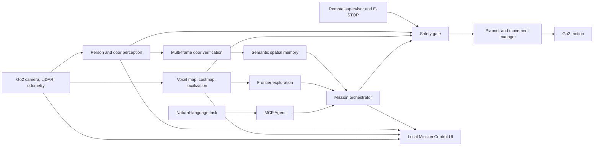

# Go2 Local Mission Control Design

## Status

Accepted for implementation planning on 2026-07-24.

This document defines a research prototype. It is not a certification that the
current Go2 hardware can operate collision-free in a dense public crowd. Dense
crowd motion remains disabled by default until every validation gate below has
passed.

## Requirements

### Functional

- Run over the local LAN without routing robot video, map, or motion through the
  Hosted Teleop broker.
- Show live camera video, LiDAR-derived map, robot pose, explored space, planned
  route, detected people, candidate doors, and mission progress in one Studio
  page.
- Accept a natural-language task such as: “自主探索，找到一扇门，走到门前并汇报。”
- Explore unknown indoor space without requiring the operator to mark locations.
- Detect candidate doors, verify them from multiple frames, store their
  positions in semantic memory, and navigate to a safe pose about one metre in
  front of the selected door.
- Stop, capture evidence, and report after reaching the door. Do not pass
  through or attempt to open the door.
- Yield to people: stop while people are close or likely to cross the path, then
  continue only after the passage is clearly free.
- Allow a remote supervisor at the computer to pause, cancel, take over, or
  emergency-stop. No person is required to follow beside the robot.

### Non-functional and safety limits

- Maximum autonomous speed: `0.1 m/s`.
- Minimum person distance: `1.5 m`.
- Minimum accepted passage width: `1.5 m`.
- Passage must remain clear for at least 3 seconds before resuming.
- Exploration radius: 5 metres from the start.
- Mission timeout: 5 minutes.
- Low-battery stop threshold: 30%.
- Replan after 30 seconds of blockage; cancel after three failed replans.
- Do not autonomously reverse with the current sensor coverage.
- Treat uncertain perception as occupied space.
- Loss of camera, LiDAR, localization, DimOS health, or LAN link causes a stop.
- Agent and external models can propose goals but cannot bypass the safety gate.

## Architecture

### Blueprint

Add a new `dimos-go2-mission-control.go2` Blueprint that composes existing
DimOS capabilities instead of creating another robot runtime:

- Go2 connection, camera, LiDAR, and odometry
- voxel mapping, cost mapping, localization, and replanning
- wavefront frontier exploration
- spatial memory and natural-language navigation
- MCP server/client and custom mission skills
- local person/door candidate detection
- optional external VLM confirmation
- a new mission orchestrator and safety gate
- a local telemetry bridge for Studio

### Mission state machine

`IDLE -> SAFETY_CHECK -> EXPLORE -> CANDIDATE_DOOR -> VERIFY_DOOR -> PLAN_APPROACH
-> APPROACH -> STOP_AND_REPORT -> COMPLETE`

Every active state can transition to `PAUSED`, `CANCELLED`, or
`SAFETY_STOPPED`. Resuming requires all sensor, clearance, health, and remote
supervision checks to pass again.

### Perception and models

- Use the existing Go2 LiDAR for geometric mapping and collision costs.
- Use Moondream or YOLOE locally for continuous low-cost candidate detection.
- Confirm a door with at least two usable frames from different observation
  poses. Store the map position, evidence frames, confidence, and timestamp.
- Use Qwen-VL or an OpenAI-compatible VLM only for candidate confirmation and
  scene description, not continuous video or motion control.
- Use the existing LangChain-compatible Agent model interface for task
  understanding. A local Ollama model remains an optional offline alternative.
- External model failure degrades to local perception and a safe stop; it never
  authorizes movement.

## Local Mission Control UI

Add a `/mission-control` Studio page containing:

- live camera panel
- 2D cost map with pose, path, frontiers, people zones, and door markers
- natural-language task composer
- mission step and Agent reasoning summary
- battery, link, sensor, localization, and model status
- pause, resume, cancel, manual takeover, and emergency-stop controls
- evidence view with the final door image and decision

The UI communicates with Studio through local REST and WebSocket endpoints.
Raw motion commands do not originate in the browser.

## Failure handling

| Failure | Required response |
|---|---|
| Person enters 1.5 m zone | Stop immediately; clear active velocity |
| Passage becomes narrow or uncertain | Mark occupied and replan |
| Person detection and LiDAR disagree | Treat as occupied |
| Camera, LiDAR, or localization stale | Safety stop |
| LAN or DimOS heartbeat lost | Safety stop |
| External VLM timeout | Keep stopped or continue local scanning without movement |
| Door confidence insufficient | Continue exploration; never approach |
| Three replans fail | Cancel and report blockage |
| Remote pause/E-STOP | Preempt Agent and navigation |

## Validation gates

1. Unit-test the mission state machine, safety rules, stale-data handling, and
   Agent tool permissions.
2. Run mapping, exploration, person-yield, and door-detection scenarios in
   simulation and recorded-data replay.
3. Connect to the real Go2 with movement locked and validate camera, LiDAR,
   map, person zones, door candidates, and UI.
4. Test motion in an empty indoor area at `0.1 m/s`.
5. Test static clutter and blocked passages.
6. Test one controlled person crossing the path.
7. Increase controlled pedestrian count while measuring stop distance, missed
   detections, false stops, replan success, and operator E-STOP response.
8. Enable dense-venue mode only after explicit review of the recorded results.

There is no automatic promotion between gates.

## ADR-001: Local hybrid autonomy with remote supervision

### Status

Accepted.

### Context

The target is autonomous door-finding in a cluttered, dense indoor venue using
the current Go2 hardware. The robot should make its own mission decisions and
does not have a person walking beside it, but a supervisor can watch the local
control page and issue an emergency stop.

### Decision

Use a local-LAN, hybrid autonomy architecture. Geometry, navigation, safety
rules, and motion execute locally. Local vision performs continuous candidate
detection. External models are optional and limited to semantic verification.
Remote supervision and E-STOP are mandatory. Dense-crowd movement is locked
until staged validation is complete.

### Consequences

#### Positive

- Lower control latency and reduced dependence on the cloud.
- Existing DimOS mapping, exploration, navigation, memory, and Agent modules can
  be reused.
- External-model failure cannot directly produce movement.
- The UI can show one coherent, inspectable mission state.

#### Negative

- Current hardware has perception blind spots and no independent certified
  safety controller.
- Crowd-yield behavior can create frequent stops or mission cancellation.
- Substantial simulation and real-world validation is required.
- The result remains a research prototype unless hardware and operational
  safety are upgraded and independently assessed.

### Alternatives considered

- Hosted Teleop plus Agent sidecar: rejected for the primary path because of
  cloud latency and split UI/control state.
- Fully cloud-driven perception and planning: rejected because network or model
  failure would be coupled to real-time behavior.
- Unsupervised dense-crowd deployment without validation gates: rejected because
  the current sensor and control stack cannot justify that safety claim.
- Mandatory human follower: safer, but rejected as a product requirement; a
  remote supervisor remains required.
