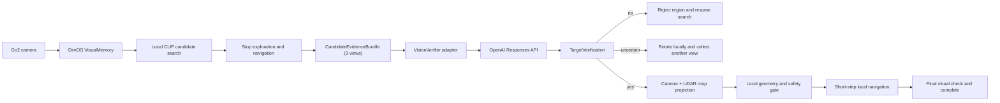

# Go2 Candidate Vision Verification Design

Date: 2026-07-25  
Status: Accepted for implementation planning

## Decision summary

Use a hybrid target-search loop:

- DimOS keeps camera ingestion, CLIP candidate retrieval, mapping, LiDAR,
  obstacle avoidance, navigation, mission state, and E-STOP local.
- Only a small set of candidate screenshots is sent to the OpenAI API.
- The external vision model may classify and localize a target in an image,
  but it cannot call movement tools or grant movement permission.
- A confirmed image region must still be projected into the local map and
  checked against LiDAR geometry before navigation.
- The current interactive Codex task is a development and debugging surface,
  not a runtime dependency.

The operator selected candidate-only cloud image upload ("A"). Continuous video
upload is out of scope.

## Requirements

### Functional

1. Continue local exploration while building the DimOS map.
2. Use the existing CLIP spatial memory as a cheap candidate generator.
3. Stop current movement before sending a candidate for cloud verification.
4. Retrieve three recent, spatially distinct images for the same candidate.
5. Ask a vision model whether the requested target is present and where it is.
6. Return a typed `yes`, `no`, or `uncertain` result with per-view image boxes.
7. Reject and remember false candidates; request another view when uncertain.
8. Project a verified image region through synchronized camera/LiDAR data into
   a metric map target.
9. Approach only after the normal local safety gate approves, and stop one
   metre before the target.
10. Re-verify the target after approach before completing the mission.

### Non-functional

- Candidate verification target: under 8 seconds, with one bounded retry.
- Images: at most three JPEGs per request, resized to at most 1024 pixels on the
  longest edge.
- Cloud failure, refusal, invalid JSON, stale images, or missing geometry must
  fail closed and never authorize movement.
- One in-flight request per candidate; duplicate candidate IDs are idempotent.
- Prompt version, provider, model, frame IDs, result, latency, and failure
  reason are logged locally.
- Candidate screenshots may leave the Mac; continuous video, LiDAR point
  clouds, map history, and unrelated stored frames remain local.
- The API key is stored in macOS Keychain and never in repository files,
  Studio settings JSON, logs, or mission records.

## Existing project facts

- `Go2StudioSkills.search_semantic_memory()` returns CLIP-ranked frame IDs and
  camera-viewpoint poses. It explicitly marks them as candidates requiring
  verification.
- `VisualMemory` stores JPEG data by frame ID and can retrieve the original
  image.
- `OpenAIVlModel` already supports image and multi-image requests, but it uses
  the older Chat Completions path, defaults to `gpt-4o-mini`, and is not exposed
  by the current `VlModelName` factory or Studio settings.
- `BBoxNavigationModule` converts a 2D box centre using an assumed fixed
  distance. This is not sufficient for a real door target; synchronized depth
  or LiDAR geometry is still required.
- The last real run persisted 578 camera frames, including the known CLIP
  candidate frame IDs. They provide an offline evaluation dataset before the
  Go2 is reconnected.

## High-level architecture



The cloud request is outside the collision-avoidance and control loops. Local
obstacle avoidance and E-STOP remain active while the model is unavailable.

## Components

### Candidate frame access

Add a runtime skill that accepts allowlisted frame IDs returned by spatial
memory and returns the corresponding JPEG plus timestamp and camera pose. It
must reject arbitrary file paths and cap payload size.

### `VisionVerifier`

Introduce a provider-neutral interface:

```python
class VisionVerifier(Protocol):
    def verify(self, bundle: CandidateEvidenceBundle) -> TargetVerification: ...
```

The first provider uses OpenAI Responses API image inputs and Structured
Outputs. Start with `gpt-5.6-terra` for acceptance testing; keep the model name
configurable so a lower-cost model can replace it only after replay evaluation.

The current `OpenAIVlModel` can supply image encoding and resizing behavior, but
the new verifier should use Responses API and a strict schema instead of
parsing free-form prose.

### Evidence contract

```json
{
  "candidate_id": "map-cluster-id",
  "target_description": "a real passable indoor door or doorway",
  "views": [
    {
      "frame_id": "frame-id",
      "captured_at": 0,
      "camera_pose": {"x": 0, "y": 0, "yaw": 0},
      "jpeg": "base64"
    }
  ]
}
```

Expected model result:

```json
{
  "verdict": "yes",
  "target_type": "doorway",
  "confidence": 0.91,
  "passable": true,
  "need_more_views": false,
  "reason": "Two views show a framed opening with visible space beyond it.",
  "views": [
    {
      "frame_id": "frame-id",
      "verdict": "yes",
      "bbox": [0.18, 0.12, 0.73, 0.94]
    }
  ]
}
```

Coordinates are normalized from zero to one. Model confidence is advisory, not
calibrated safety evidence. Acceptance requires at least two distinct recent
views to return `yes` with spatially consistent regions.

### Geometry projector

The projector combines:

- normalized image box or target point;
- camera intrinsics and camera-to-robot transform;
- synchronized depth/LiDAR observations;
- robot map pose at capture time.

It returns a metric target point, estimated passage width, evidence timestamp,
and geometry quality. VLM `passable=true` is only semantic evidence. The local
LiDAR width and free-space checks make the final passability decision.

### Mission runner

Replace the current candidate terminal state with:

```text
SEARCH
  -> CANDIDATE_STOPPED
  -> VERIFYING
     -> REJECTED -> SEARCH
     -> NEED_MORE_VIEW -> REOBSERVE -> VERIFYING
     -> VERIFIED -> GEOMETRY_CHECK
        -> GEOMETRY_FAILED -> SEARCH
        -> READY_TO_APPROACH
           -> APPROACHING
           -> FINAL_VERIFY
           -> COMPLETE
```

The model never invokes `start_patrol`, `navigate`, or raw motion. Only the
deterministic runner can request a local movement after all gates pass.

## Failure handling

| Failure | Required behavior |
|---|---|
| API timeout or rate limit | One retry, then mark `uncertain`; no approach |
| Invalid schema or refusal | Mark `uncertain`; preserve evidence for review |
| Image missing or stale | Reject verification request; gather fresh views |
| Model says `no` | Blacklist candidate cluster for the current mission |
| Model says `uncertain` | Stop, rotate by a bounded angle, capture again |
| No LiDAR/depth intersection | Do not use the camera viewpoint as the target |
| Geometry says passage is blocked/narrow | Reject approach regardless of VLM |
| Network lost during approach | Local safety stop; cloud is not consulted |
| Final check disagrees | Stop and report mismatch; do not cross the target |

## Security, privacy, and cost controls

- Store the OpenAI key using the existing macOS Keychain pattern.
- Show a visible Studio indicator whenever candidate images are being uploaded.
- Keep a local audit card showing the exact uploaded frame IDs and result.
- Do not send microphone audio, full maps, LiDAR data, faces cropped from
  unrelated frames, or continuous video.
- Limit requests by candidate ID and cooldown to avoid duplicate charges.
- Offer a later local-provider adapter without changing mission logic.

## Validation plan

### Gate 1: offline replay

- Load the persisted 578-frame `VisualMemory`.
- Build a small labelled set containing true doorway candidates and known
  false scenes such as glass walls, whiteboards, chairs, and people.
- Compare structured results without running a robot.
- Treat `uncertain` as a safe non-match.

### Gate 2: live verification without movement

- Connect the Go2 read-only.
- Collect live candidates and display the three uploaded screenshots plus the
  structured verdict in Studio.
- No exploration-to-target approach is allowed.

### Gate 3: local geometry

- Verify that the same candidate projects consistently from multiple poses.
- Visualize the projected point and passage width on the map.
- Reject any frame whose camera/LiDAR timestamps are outside tolerance.

### Gate 4: supervised short approach

- Start at low speed in a cleared area.
- Move in short segments, rechecking local obstacles after each segment.
- Stop one metre before the doorway, re-run visual verification, and never
  cross it during the acceptance test.

## ADR-002: Candidate-only external vision verification

### Status

Accepted.

### Context

Local CLIP retrieval can find semantically similar camera views but cannot
reliably distinguish a real door from venue clutter or provide a metric target
position. The user permits sending candidate screenshots to an external API,
but wants local autonomous navigation and a simple workflow.

### Decision

Use candidate-only OpenAI vision verification behind a provider-neutral
`VisionVerifier`. Keep continuous perception, geometry, navigation, safety, and
motion local. Use the external verdict only as semantic evidence.

### Consequences

#### Positive

- No model training is required for the first release.
- Stronger visual reasoning is used only where local CLIP is uncertain.
- Provider changes do not affect mission and safety logic.
- Cloud latency cannot directly steer the robot.

#### Negative

- Candidate images leave the computer.
- Internet, API credentials, rate limits, latency, and cost become operational
  dependencies for semantic confirmation.
- A general VLM may still produce incorrect values inside a valid schema.

### Alternatives considered

- Current interactive Codex task: rejected as a robot runtime dependency
  because it has no durable per-device service contract.
- Fully local Qwen/Moondream: retained as a future fallback, but not selected
  for the first acceptance because the current local path was unavailable or
  too weak for the observed venue.
- Continuous cloud video: rejected for latency, privacy, bandwidth, and cost.
- Fully cloud-driven navigation: rejected because network or model failure
  would be coupled to physical motion.

## Explicit non-goals

- Training or fine-tuning a custom model.
- Streaming all camera frames to the cloud.
- Letting an LLM issue low-level movement commands.
- Treating a screenshot-only answer as a metric map target.
- General home-object manipulation in the first door-finding slice.
