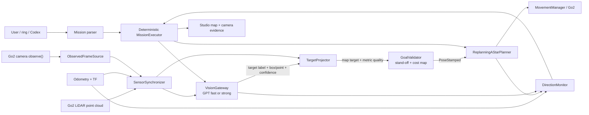

# Go2 GPT Vision-LiDAR Closed Loop Implementation Plan (English)

> **For Claude:** REQUIRED SUB-SKILL: Use `executing-plans` to implement this plan task-by-task.

**Goal:** Build a Demo-grade closed loop in which Go2 captures real camera frames, GPT identifies a requested semantic target, LiDAR and calibrated transforms place that target in the map, the existing local navigator approaches it, and the system continuously verifies direction and arrival.

**Architecture:** Keep one Python DimOS robot runtime and use GPT only as an event-driven semantic sensor. Python captures timestamped camera/LiDAR/pose evidence, calls the OpenAI Responses API, projects the returned image region into the map, and gives a validated stand-off `PoseStamped` to the existing A* navigator. High-rate motion, obstacle avoidance, progress monitoring, cancellation, and arrival remain deterministic and local; Codex remains the development/debug and mission-submission surface, not a frame-by-frame motor controller.

**Tech Stack:** Python 3.12, DimOS `0.0.14b1`, Unitree Go2 camera/LiDAR/odometry, DimOS TF and `Detection3DPC`, `ReplanningAStarPlanner`, OpenAI Python SDK Responses API, GPT-5.6 Luna/Terra, Pydantic structured outputs, MCP, Pytest, existing DimOS Studio HTML/JavaScript.

---

## 1. Direct answers and design decision

### Can `observe()` return the real robot image?

Yes. `GO2Connection.observe()` returns the most recent `Image` received from the
Go2 video stream. It returns `None` when the connection has not delivered a frame.
A trustworthy observation must therefore include more than raw pixels:

- frame ID;
- capture timestamp;
- camera calibration ID;
- robot pose at the image timestamp;
- freshness;
- source marked as `live`, `replay`, or `simulation`.

At the time this plan was written, no live Go2/DimOS runtime was running. The source
capability is confirmed, but a fresh physical frame was not validated in this task.

### Can Python send that image to GPT?

Yes. Python is the orchestration language, not the visual model. The Python runtime
can JPEG-encode a frame, call the OpenAI Responses API with `input_image`, validate
a typed response, and return the result to the mission executor.

Do not route every frame through an interactive Codex conversation. Codex is useful
for development, one-off inspection, replay analysis, and mission submission, but
a long-running robot loop must call the API directly so that it has explicit
timeouts, cancellation, metrics, retry policy, and typed results.

### Recommended model policy

- Fast candidate check: configurable `gpt-5.6-luna`, `reasoning.effort=none`,
  `detail=low`, one selected frame.
- Ambiguous/final check: configurable `gpt-5.6-terra`, `reasoning.effort=low`,
  `detail=high`, two independently captured views.
- Never choose the model only from marketing labels. Run the replay benchmark in
  Task 4 and select the smallest model that meets the measured target-recall and
  false-positive gates.
- Do not train or fine-tune a model for the first Demo.

The active code already has `OpenAIResponsesVisionVerifier`, but it defaults to
Terra, high-detail images, an 8 second timeout, and two-view verification. Reuse
its provider-neutral contract and split fast candidate detection from stronger
final verification.

### Chosen architecture

**Use direct GPT API calls from the Python robot runtime, with local LiDAR geometry
and local navigation.**

This avoids the current external Agent wrapper limitation: both
`agent-webhook-gateway/src/mcp-client.ts` and
`dimos-mcp-wrapper/src/dimos_mcp_wrapper/upstream.py` discard non-text MCP content.
The official embedded DimOS `McpClient` has special image-history handling, but
restoring a second embedded conversation Agent is unnecessary for the MVP.

## 2. Alternatives considered

### Option A: Interactive Codex sees every frame and controls the mission

Advantages:

- easiest to demonstrate manually;
- excellent for debugging prompts and reviewing evidence.

Disadvantages:

- conversation/session lifecycle becomes a runtime dependency;
- unpredictable latency and no deterministic control deadline;
- expensive and wasteful at video frame rate;
- unsuitable for collision avoidance or steering.

**Decision:** Provide a one-off debug image tool only. Do not use this as the
autonomous runtime.

### Option B: Direct GPT API for selected frames, local geometry and navigation

Advantages:

- explicit timeout, model, detail, schema, privacy, and retry configuration;
- keeps semantic understanding separate from metric localization;
- reuses DimOS camera, TF, point cloud, cost map, and A*;
- supports later replacement with another cloud or local model.

**Decision:** Recommended MVP.

### Option C: Fully local CLIP/Moondream perception

Advantages:

- no Internet round trip;
- low privacy exposure;
- useful as a high-rate candidate filter.

Disadvantages:

- current Mac runtime and model paths need optimization;
- open-ended household instructions are less reliable;
- a visual candidate is still not a metric goal.

**Decision:** Keep as an optional fast candidate generator/fallback, not the only
semantic verifier.

## 3. Runtime architecture



### Non-negotiable boundary

GPT may return:

- whether the requested semantic target is visible;
- a normalized image box or target point;
- a confidence and short evidence description;
- whether another view is required.

GPT must not return or authorize:

- `Twist`;
- motor commands;
- metric distance;
- map coordinates;
- “arrival complete” based on one image;
- collision-avoidance decisions.

## 4. Camera-to-LiDAR geometry

The dog camera is low to the ground and sees a different perspective from a human.
That is expected. The semantic model interprets the dog-camera image; calibrated
camera intrinsics and camera-to-base extrinsics reconcile the image with the LiDAR
and map.

For a synchronized image and point cloud:

1. GPT returns a normalized bounding box
   `bbox = [x1, y1, x2, y2]` or a normalized image point.
2. Convert the box to pixel coordinates using image width and height.
3. Transform candidate LiDAR points into the camera optical frame at the image
   timestamp.
4. Project each optical-frame point `(X, Y, Z)` into the image:

   ```text
   u = fx * X / Z + cx
   v = fy * Y / Z + cy
   ```

5. Keep points whose `(u, v)` fall inside the target region and whose `Z > 0`.
6. Remove floor, isolated, stale, and background points.
7. Estimate the target front surface with a robust percentile/median, not the
   far-wall centroid.
8. Transform the resulting target point into the map/world frame.
9. Calculate planar distance from robot pose:

   ```text
   distance = sqrt((target_x - robot_x)^2 + (target_y - robot_y)^2)
   ```

10. Build a stand-off goal:

    ```text
    direction = normalize(target_xy - robot_xy)
    goal_xy = target_xy - stand_off_m * direction
    ```

11. Validate the goal and corridor against the local cost map.
12. Send the validated `PoseStamped` to `ReplanningAStarPlanner.set_goal()`.

Reuse the projection path in
`dimos/navigation/visual_servoing/detection_navigation.py`, especially
`Detection3DPC.from_2d()`. Do not reuse its direct `Twist` output for this mission;
the projected map target must pass through the existing A* navigation stack.

### Projection failure policy

Return `unlocalized` and keep motion stopped when any of these is true:

- camera frame is older than 500 ms at capture;
- point cloud and image differ by more than the configured synchronization bound;
- the required TF is missing or stale;
- fewer than the minimum in-box 3D points remain;
- depth spread indicates foreground/background ambiguity;
- stand-off goal lies in an occupied or unknown cell;
- two views produce incompatible map targets.

Recovery is a bounded rotate-and-reobserve action, not a guessed distance.

## 5. Multi-rate closed loop

One model call per video frame is the wrong design. Use three rates:

| Loop | Frequency | Input | Responsibility |
|---|---:|---|---|
| Local navigation | 10–20 Hz | odometry, LiDAR, cost map, path | obstacle avoidance, path following, replanning |
| Visual tracking/checkpoint | 2–5 Hz | camera plus local tracker | target bearing continuity, target loss |
| GPT semantic check | event-driven, normally 0.5–1 Hz maximum | one selected frame; two for final | semantic identity, candidate/final verification |

Trigger a new GPT check when:

- a new candidate first appears;
- the robot travels 0.5–1.0 m;
- heading changes by more than 25 degrees;
- route deviation exceeds the threshold;
- target tracking is lost;
- the navigator enters recovery;
- the robot reaches the stand-off goal;
- the previous GPT result is older than the mission policy allows.

### Direction monitor

At every progress checkpoint, calculate:

- signed heading error to the current target;
- distance-to-goal trend over a rolling window;
- cross-track distance to the current A* path;
- target image position trend;
- freshness of pose, path, point cloud, and visual verdict;
- navigator state and current velocity.

The direction is accepted only when:

- the path distance is decreasing, or the navigator is executing a declared
  recovery;
- heading error is inside the phase-specific tolerance;
- cross-track error is not growing for the configured number of samples;
- the target identity remains consistent when visible.

If progress stalls, stop linear motion and run this bounded sequence:

1. wait for one fresh local replan;
2. rotate in place by a small angle and reobserve;
3. project a new target candidate;
4. replace the goal only if the new metric quality is better;
5. fail with evidence after the retry budget is exhausted.

## 6. Mission state machine

```text
IDLE
  -> PARSE
  -> SEARCH
  -> CANDIDATE
  -> VERIFY_FAST
  -> PROJECT_3D
  -> VALIDATE_GOAL
  -> NAVIGATE
  -> REOBSERVE
       -> NAVIGATE          target and route still valid
       -> PROJECT_3D        target shifted or better view exists
       -> SEARCH            candidate lost
  -> FINAL_VERIFY
  -> COMPLETE

Any active state -> CANCELLED
Any unrecoverable sensor/model/navigation fault -> FAILED
```

`COMPLETE` requires all of the following:

1. A* reports the goal reached.
2. Odometry is inside the configured position/yaw tolerance.
3. Robot velocity stays below the idle threshold for a settling window.
4. The target is confirmed in two recent, spatially distinct views.
5. Projected target distance lies inside the stand-off band.
6. Camera, point cloud, TF, and pose evidence are fresh.
7. The result records frame IDs, target map point, final robot pose, path distance,
   model IDs, latencies, and any recovery attempts.

## 7. Data contracts

```python
class ObservedFrame(BaseModel):
    frame_id: str
    captured_at_s: float
    jpeg_base64: str
    width: int
    height: int
    camera_frame_id: str
    camera_info_hash: str
    robot_pose: PoseSnapshot
    source: Literal["live", "replay", "simulation"]


class VisionTarget(BaseModel):
    verdict: Literal["yes", "no", "uncertain"]
    target_label: str
    bbox_norm: tuple[float, float, float, float] | None
    target_point_norm: tuple[float, float] | None
    confidence: float
    needs_another_view: bool
    evidence: str
    frame_id: str


class ProjectedTarget(BaseModel):
    frame_id: str
    target_map_x_m: float
    target_map_y_m: float
    target_map_z_m: float
    robot_distance_m: float
    point_count: int
    depth_median_m: float
    depth_spread_m: float
    quality: Literal["good", "weak", "unlocalized"]


class DirectionStatus(BaseModel):
    state: Literal["on_course", "recovering", "stalled", "target_lost", "arrived"]
    distance_to_goal_m: float
    heading_error_rad: float
    cross_track_error_m: float
    progress_rate_m_s: float
    visual_age_s: float
    reason: str
```

The GPT schema must reject unknown fields and require all fields. A malformed,
timed-out, refused, or empty model response becomes `uncertain`, never `yes`.

## 8. Architecture decisions

### ADR-1: Direct API instead of Codex as a runtime loop

Codex remains the development/control plane. The robot Python process uses the
OpenAI Python SDK directly so every inference has a deadline, model ID, schema,
audit event, and cancellation path.

### ADR-2: Semantics are separate from geometry

GPT identifies a semantic region in pixels. LiDAR, TF, and camera calibration
produce metric position. The cost map and A* produce motion.

### ADR-3: Event-driven cloud inference

Local navigation and tracking run continuously. GPT runs only at candidates and
checkpoints. This improves latency, cost, privacy, and resilience to network loss.

### ADR-4: Fail closed on stale or inconsistent geometry

No fresh synchronization means no new metric goal. The executor may rotate to
obtain a new view, but may not assume a fixed target distance.

### ADR-5: Preserve one robot runtime

Do not run both the lightweight Studio Blueprint and full
`unitree-go2-agentic` Blueprint. Add only the required modules to the existing
Studio runtime.

## 9. Non-functional targets

These are engineering gates, not vendor latency promises:

- captured frame age at request creation: less than 500 ms;
- image/point-cloud synchronization error: measured and bounded in configuration;
- local navigation update: 10 Hz minimum during live tests;
- GPT candidate request: one JPEG, maximum 1024 px long side, `detail=low`;
- final verification: two distinct JPEGs, `detail=high`;
- cloud timeout: 3 seconds for fast check, 6 seconds for final check;
- no unbounded retry; zero fast retries and one final retry;
- replay benchmark: report p50/p95 latency and success by model;
- model unavailability never disables local stop/cancel/obstacle avoidance;
- each mission stores only the selected evidence frames, not continuous video;
- API keys live in environment/Keychain and never in the repository.

## 10. Implementation tasks

### Task 1: Lock the evidence and result contracts

**Files:**

- Create: `extensions/go2-studio-agent/src/dimos_go2_studio/vision_contracts.py`
- Create: `extensions/go2-studio-agent/tests/test_vision_contracts.py`

**Step 1: Write failing tests**

Test that:

- normalized boxes must be ordered and inside `[0, 1]`;
- an affirmative verdict requires a box or point and matching frame ID;
- `uncertain` cannot authorize a projected goal;
- `ObservedFrame` rejects blank camera IDs and invalid dimensions;
- `ProjectedTarget.quality="good"` requires the configured minimum point count;
- unknown fields are rejected.

**Step 2: Run the focused test**

```bash
cd /Users/johnsonmac/ai_completion/dimos
PYTHONPATH=extensions/go2-studio-agent/src \
  .venv/bin/python -m pytest \
  extensions/go2-studio-agent/tests/test_vision_contracts.py -v
```

Expected: fail because `vision_contracts.py` does not exist.

**Step 3: Implement frozen Pydantic contracts**

Keep this file effect-free. Do not import OpenAI, navigation, LCM, or device code.

**Step 4: Run the test**

Expected: pass.

**Step 5: Commit**

```bash
git add \
  extensions/go2-studio-agent/src/dimos_go2_studio/vision_contracts.py \
  extensions/go2-studio-agent/tests/test_vision_contracts.py
git commit -m "feat(go2): add visual navigation evidence contracts"
```

### Task 2: Capture fresh, pose-associated real frames

**Files:**

- Create: `extensions/go2-studio-agent/src/dimos_go2_studio/frame_evidence.py`
- Create: `extensions/go2-studio-agent/tests/test_frame_evidence.py`
- Reference: `dimos/robot/unitree/go2/connection.py`

**Step 1: Write a failing test with fake image, clock, and TF**

Test:

- `None` from `observe()` becomes `no_frame`;
- stale images are rejected;
- the captured image timestamp is used for pose lookup;
- missing pose/TF becomes `unsynchronized`;
- JPEG long side is bounded without changing the original frame;
- frame ID is stable and unique;
- `source` cannot default to `live`.

**Step 2: Run the test and confirm failure**

```bash
PYTHONPATH=extensions/go2-studio-agent/src \
  .venv/bin/python -m pytest \
  extensions/go2-studio-agent/tests/test_frame_evidence.py -v
```

**Step 3: Implement `ObservedFrameSource`**

Inject:

- camera observation callable;
- TF/pose lookup;
- monotonic/wall clocks;
- JPEG encoder;
- source mode.

Do not read camera frames from files in live mode.

**Step 4: Re-run focused tests**

Expected: pass.

**Step 5: Commit**

```bash
git add \
  extensions/go2-studio-agent/src/dimos_go2_studio/frame_evidence.py \
  extensions/go2-studio-agent/tests/test_frame_evidence.py
git commit -m "feat(go2): capture timestamped camera evidence"
```

### Task 3: Add a provider-neutral GPT VisionGateway

**Files:**

- Create: `extensions/go2-studio-agent/src/dimos_go2_studio/gpt_vision_gateway.py`
- Create: `extensions/go2-studio-agent/tests/test_gpt_vision_gateway.py`
- Reuse: `dimos/perception/target_verification.py`

**Step 1: Write failing tests with a fake OpenAI client**

Test:

- fast mode sends one frame with `detail=low`;
- final mode sends exactly two distinct frames with `detail=high`;
- image data is sent as a JPEG data URL;
- output is parsed into `VisionTarget`;
- timeout, refusal, malformed schema, and API error become `uncertain`;
- no model output can contain a velocity or metric goal;
- `store=False` is always set;
- zero retry in fast mode and at most one retry in final mode;
- cancellation prevents a late response from changing mission state.

**Step 2: Run the test and confirm failure**

```bash
PYTHONPATH=extensions/go2-studio-agent/src \
  .venv/bin/python -m pytest \
  extensions/go2-studio-agent/tests/test_gpt_vision_gateway.py -v
```

**Step 3: Implement the minimal interface**

```python
class SceneVisionProvider(Protocol):
    def locate(
        self,
        target_description: str,
        frames: Sequence[ObservedFrame],
        mode: Literal["fast", "final"],
    ) -> VisionTarget: ...
```

Configure model IDs, reasoning effort, image detail, timeouts, and retry counts
through environment or Blueprint config. Do not hardcode an API key.

**Step 4: Run the test**

Expected: pass.

**Step 5: Commit**

```bash
git add \
  extensions/go2-studio-agent/src/dimos_go2_studio/gpt_vision_gateway.py \
  extensions/go2-studio-agent/tests/test_gpt_vision_gateway.py
git commit -m "feat(go2): add structured GPT vision gateway"
```

### Task 4: Benchmark Luna, Terra, and the local fallback on replay evidence

**Files:**

- Create: `scripts/benchmark_go2_vision.py`
- Create: `extensions/go2-studio-agent/tests/fixtures/vision_manifest.json`
- Create: `extensions/go2-studio-agent/tests/test_vision_benchmark_manifest.py`
- Create when real evidence exists:
  `extensions/go2-studio-agent/tests/fixtures/vision_frames/README.md`

**Step 1: Define a manifest before collecting frames**

Each item must include:

- frame path or protected evidence ID;
- target description;
- expected `yes/no/uncertain`;
- expected coarse box when applicable;
- environment and lighting label;
- live/replay provenance.

**Step 2: Add manifest validation tests**

Require at least:

- positive target frames;
- target-absent negatives;
- visually confusing negatives;
- partial/occluded targets;
- dog-height, wide-angle views.

**Step 3: Implement the read-only benchmark**

Report:

- target recall;
- false-positive rate;
- box overlap or point error;
- `uncertain` rate;
- p50 and p95 API latency;
- input/output tokens and estimated cost.

**Step 4: Run**

```bash
.venv/bin/python scripts/benchmark_go2_vision.py \
  --manifest extensions/go2-studio-agent/tests/fixtures/vision_manifest.json \
  --models gpt-5.6-luna gpt-5.6-terra \
  --output /tmp/go2-vision-benchmark.json
```

Expected: a report with no robot motion and no repository write outside the
explicit fixture/report targets.

**Step 5: Select defaults**

Use Luna only if its measured recall and false-positive rate meet the Demo gate.
Otherwise use Terra for that target class. Preserve the model as configuration.

**Step 6: Commit**

```bash
git add \
  scripts/benchmark_go2_vision.py \
  extensions/go2-studio-agent/tests/fixtures/vision_manifest.json \
  extensions/go2-studio-agent/tests/test_vision_benchmark_manifest.py \
  extensions/go2-studio-agent/tests/fixtures/vision_frames/README.md
git commit -m "test(go2): add vision replay benchmark"
```

### Task 5: Project image targets into the LiDAR map

**Files:**

- Create: `extensions/go2-studio-agent/src/dimos_go2_studio/target_projection.py`
- Create: `extensions/go2-studio-agent/tests/test_target_projection.py`
- Reuse: `dimos/navigation/visual_servoing/detection_navigation.py`
- Reuse: `dimos/perception/detection/type/detection3d/pointcloud.py`

**Step 1: Write failing synthetic geometry tests**

Construct a calibrated camera, target cluster, floor points, background wall, robot
pose, and TF. Test:

- known 3D target projects to the expected pixel box;
- reverse selection recovers the target map point within tolerance;
- floor and background points do not dominate;
- insufficient points return `unlocalized`;
- stale timestamp or missing TF returns `unlocalized`;
- box outside the image is rejected;
- two incompatible views cannot be fused.

**Step 2: Run the test and confirm failure**

```bash
PYTHONPATH=extensions/go2-studio-agent/src \
  .venv/bin/python -m pytest \
  extensions/go2-studio-agent/tests/test_target_projection.py -v
```

**Step 3: Implement `TargetProjector`**

Reuse `Detection3DPC.from_2d()` for the calibrated projection. Extract and test a
pure robust-front-surface helper rather than constructing a `Twist`.

**Step 4: Run focused and existing projection tests**

Expected: pass.

**Step 5: Commit**

```bash
git add \
  extensions/go2-studio-agent/src/dimos_go2_studio/target_projection.py \
  extensions/go2-studio-agent/tests/test_target_projection.py
git commit -m "feat(go2): localize visual targets with lidar"
```

### Task 6: Build and validate stand-off map goals

**Files:**

- Create: `extensions/go2-studio-agent/src/dimos_go2_studio/goal_validation.py`
- Create: `extensions/go2-studio-agent/tests/test_goal_validation.py`
- Reference: `dimos/navigation/replanning_a_star/module.py`

**Step 1: Write failing tests**

Test:

- stand-off goal lies on the robot-to-target line;
- minimum/maximum stand-off is enforced;
- occupied, unknown, or out-of-map goals are rejected;
- nearby free cells can be searched inside a small bounded radius;
- target pose is not mutated;
- output is a world/map-frame `PoseStamped`;
- no `Twist` is produced.

**Step 2: Run and confirm failure**

```bash
PYTHONPATH=extensions/go2-studio-agent/src \
  .venv/bin/python -m pytest \
  extensions/go2-studio-agent/tests/test_goal_validation.py -v
```

**Step 3: Implement `GoalValidator`**

Read the current cost map and return either a validated pose plus reason or a
typed failure. Never silently accept an unknown map cell.

**Step 4: Run focused tests**

Expected: pass.

**Step 5: Commit**

```bash
git add \
  extensions/go2-studio-agent/src/dimos_go2_studio/goal_validation.py \
  extensions/go2-studio-agent/tests/test_goal_validation.py
git commit -m "feat(go2): validate visual stand-off goals"
```

### Task 7: Add continuous direction and progress monitoring

**Files:**

- Create: `extensions/go2-studio-agent/src/dimos_go2_studio/direction_monitor.py`
- Create: `extensions/go2-studio-agent/tests/test_direction_monitor.py`

**Step 1: Write failing deterministic time-series tests**

Test:

- decreasing path distance becomes `on_course`;
- flat distance with nonzero commanded motion becomes `stalled`;
- temporary A* recovery is not mislabeled as failure;
- growing cross-track error triggers reobserve;
- stale target verdict becomes `target_lost`;
- reached pose plus nonzero velocity is not `arrived`;
- cancellation immediately invalidates pending recovery.

**Step 2: Run and confirm failure**

```bash
PYTHONPATH=extensions/go2-studio-agent/src \
  .venv/bin/python -m pytest \
  extensions/go2-studio-agent/tests/test_direction_monitor.py -v
```

**Step 3: Implement a pure monitor first**

Feed snapshots into the monitor. Do not let it publish motion. It returns a typed
decision for the mission executor.

**Step 4: Run focused tests**

Expected: pass.

**Step 5: Commit**

```bash
git add \
  extensions/go2-studio-agent/src/dimos_go2_studio/direction_monitor.py \
  extensions/go2-studio-agent/tests/test_direction_monitor.py
git commit -m "feat(go2): monitor route and visual progress"
```

### Task 8: Implement the closed-loop mission executor

**Files:**

- Create: `extensions/go2-studio-agent/src/dimos_go2_studio/visual_mission_executor.py`
- Create: `extensions/go2-studio-agent/tests/test_visual_mission_executor.py`
- Reuse or extend:
  `extensions/go2-studio-agent/src/dimos_go2_studio/mission_contracts.py`
  after the prior semantic mission plan is implemented

**Step 1: Write failing state-machine tests with fakes**

Cover:

- happy path from search through two-view final verification;
- GPT says `no`;
- GPT returns `uncertain`;
- projection fails and bounded rotate/reobserve succeeds;
- A* stalls, replans, then succeeds;
- target moves enough to require a replacement goal;
- cloud model times out while local stop remains available;
- cancel during an in-flight GPT request;
- final visual mismatch fails rather than completing;
- executor never directly publishes `cmd_vel`.

**Step 2: Run and confirm failure**

```bash
PYTHONPATH=extensions/go2-studio-agent/src \
  .venv/bin/python -m pytest \
  extensions/go2-studio-agent/tests/test_visual_mission_executor.py -v
```

**Step 3: Implement the minimal state machine**

Inject all effectful dependencies:

- frame source;
- vision provider;
- point-cloud source;
- projector;
- goal validator;
- navigation interface;
- direction monitor;
- clock and cancellation token.

Poll `NavigationInterfaceSpec` until physical arrival; do not treat
`set_goal()` returning `True` as mission completion.

**Step 4: Run focused tests**

Expected: pass.

**Step 5: Commit**

```bash
git add \
  extensions/go2-studio-agent/src/dimos_go2_studio/visual_mission_executor.py \
  extensions/go2-studio-agent/tests/test_visual_mission_executor.py
git commit -m "feat(go2): execute closed-loop visual missions"
```

### Task 9: Wire one runtime and expose typed MCP tools

**Files:**

- Modify: `extensions/go2-studio-agent/src/dimos_go2_studio/blueprint.py`
- Modify: `extensions/go2-studio-agent/src/dimos_go2_studio/skills.py`
- Modify: `extensions/go2-studio-agent/tests/test_blueprint.py`
- Create: `extensions/go2-studio-agent/tests/test_visual_mission_skills.py`

**Step 1: Change tests first**

Assert:

- exactly one Go2 connection;
- exactly one MovementManager;
- one executor and one direction monitor;
- no second embedded conversation Agent;
- API model config is injected;
- `run_visual_mission`, `visual_mission_status`, and
  `cancel_visual_mission` return text JSON through MCP;
- cancel remains available when GPT is unavailable.

**Step 2: Run and confirm failure**

```bash
PYTHONPATH=extensions/go2-studio-agent/src \
  .venv/bin/python -m pytest \
  extensions/go2-studio-agent/tests/test_blueprint.py \
  extensions/go2-studio-agent/tests/test_visual_mission_skills.py -v
```

**Step 3: Wire the minimum modules**

Keep movement, mapping, obstacle avoidance, and A* from `unitree_go2`. Do not add
full `unitree_go2_agentic`.

**Step 4: Run extension tests**

Expected: pass.

**Step 5: Commit**

```bash
git add \
  extensions/go2-studio-agent/src/dimos_go2_studio/blueprint.py \
  extensions/go2-studio-agent/src/dimos_go2_studio/skills.py \
  extensions/go2-studio-agent/tests/test_blueprint.py \
  extensions/go2-studio-agent/tests/test_visual_mission_skills.py
git commit -m "feat(go2): expose visual mission tools"
```

### Task 10: Add a Codex/debug snapshot path without making it the runtime

**Files:**

- Modify: `extensions/go2-studio-agent/src/dimos_go2_studio/skills.py`
- Create: `extensions/go2-studio-agent/tests/test_debug_frame_skill.py`
- Optional later:
  `../agent/components/agent-framework/agent-webhook-gateway/src/mcp-client.ts`
- Optional later:
  `../agent/components/agent-framework/dimos-mcp-wrapper/src/dimos_mcp_wrapper/upstream.py`

**Step 1: Write a failing debug-skill test**

Test that `capture_debug_frame`:

- returns one fresh image plus frame ID and pose metadata;
- never starts movement;
- labels replay/simulation/live accurately;
- returns text-only metadata when no image exists.

**Step 2: Implement the direct first-party MCP image response**

Use this for one-off Codex/operator inspection. The autonomous executor must not
wait for a human Codex turn.

**Step 3: Decide whether to extend the external wrappers**

Do not extend them for the MVP if the Python VisionGateway works. If later needed,
add explicit MCP image-content types end-to-end and separate tests; never encode
arbitrary binary content into unbounded JSON text.

**Step 4: Run tests and commit**

```bash
PYTHONPATH=extensions/go2-studio-agent/src \
  .venv/bin/python -m pytest \
  extensions/go2-studio-agent/tests/test_debug_frame_skill.py -v

git add \
  extensions/go2-studio-agent/src/dimos_go2_studio/skills.py \
  extensions/go2-studio-agent/tests/test_debug_frame_skill.py
git commit -m "feat(go2): expose debug camera evidence"
```

### Task 11: Show the semantic target, path, distance, and evidence in Studio

**Files:**

- Modify: `dimos/web/studio/models.py`
- Modify: `dimos/web/studio/service.py`
- Modify: `dimos/web/studio/app.py`
- Modify: `dimos/web/studio/static/index.html`
- Modify: `dimos/web/studio/static/app.js`
- Modify: `dimos/web/studio/static/styles.css`
- Modify: `dimos/web/studio/test_studio.py`
- Modify: `dimos/web/studio/test_mission.py`

**Step 1: Write API tests first**

Mission status must expose:

- current state and retry count;
- robot pose and current A* goal;
- projected target point and distance;
- model verdict, frame ID, and latency;
- sensor freshness;
- failure reason.

**Step 2: Run Studio tests and confirm failure**

```bash
.venv/bin/python -m pytest \
  dimos/web/studio/test_studio.py \
  dimos/web/studio/test_mission.py -v
```

**Step 3: Implement a minimal overlay**

Show:

- map robot position;
- A* path and stand-off goal;
- projected semantic target with quality state;
- selected camera evidence with GPT box;
- live distance and direction state.

Do not build a second WebGL scene. Reuse the existing visualization surface and
keep one browser/app view.

**Step 4: Run tests and manual visual check**

Expected: API tests pass, the page updates without opening duplicate tabs, and
the overlay distinguishes stale from live evidence.

**Step 5: Commit**

```bash
git add \
  dimos/web/studio/models.py \
  dimos/web/studio/service.py \
  dimos/web/studio/app.py \
  dimos/web/studio/static/index.html \
  dimos/web/studio/static/app.js \
  dimos/web/studio/static/styles.css \
  dimos/web/studio/test_studio.py \
  dimos/web/studio/test_mission.py
git commit -m "feat(studio): visualize semantic navigation evidence"
```

### Task 12: Validate replay, simulation, and then bounded live motion

**Files:**

- Create: `scripts/replay_go2_visual_mission.py`
- Create: `extensions/go2-studio-agent/tests/test_visual_mission_replay.py`
- Modify after acceptance: `docs/PROJECT_CONTEXT.md`

**Step 1: Add an effect-free replay test**

Replay synchronized camera, point cloud, TF, and pose evidence. Assert the same
target produces a stable projected point and the executor reaches `COMPLETE`
without a physical movement publisher.

**Step 2: Run the full focused suite**

```bash
PYTHONPATH=extensions/go2-studio-agent/src \
  .venv/bin/python -m pytest \
  extensions/go2-studio-agent/tests -v
```

Expected: pass.

**Step 3: Run lint**

```bash
.venv/bin/python -m ruff check \
  extensions/go2-studio-agent/src/dimos_go2_studio \
  extensions/go2-studio-agent/tests \
  scripts/benchmark_go2_vision.py \
  scripts/replay_go2_visual_mission.py
```

Expected: no errors.

**Step 4: Run simulation/replay**

Verify:

- image boxes align with evidence frames;
- projection error stays inside the test tolerance;
- reobserve/retry is bounded;
- cancel terminates pending GPT and navigation work.

**Step 5: Validate live sensors without motion**

With the dog connected:

- observe three fresh camera frames;
- confirm current calibration and TF;
- align a visible static object with LiDAR points;
- compare projected distance against a tape-measured distance;
- do not start autonomous movement until this error is acceptable.

**Step 6: Perform a bounded live movement gate**

Use a short, visible, obstacle-free target and retain operator stop control.
Validate:

- initial target projection;
- one A* stand-off goal;
- at least one mid-route direction checkpoint;
- final stopped state and two-view confirmation.

This step proves only the bounded target class and environment tested. It does not
prove general household autonomy.

**Step 7: Update canonical context only after the design is accepted and tested**

Update `docs/PROJECT_CONTEXT.md` with:

- actual implemented files;
- exact model/config selected by benchmark;
- replay and live results;
- known target/environment limits;
- unresolved synchronization, calibration, or latency issues.

**Step 8: Commit**

```bash
git add \
  scripts/replay_go2_visual_mission.py \
  extensions/go2-studio-agent/tests/test_visual_mission_replay.py \
  docs/PROJECT_CONTEXT.md
git commit -m "test(go2): validate visual lidar mission loop"
```

## 11. Privacy and operational requirements

- Selected camera images leave the Mac when cloud GPT is enabled. Show this state
  in Studio.
- Default to `store=False`; document organization-level data controls separately.
- Persist only evidence frames needed for replay/audit, with an explicit retention
  policy.
- Never include faces or private-room continuous video by default.
- Keep an offline/local semantic provider interface for Internet loss.
- A network or model failure must stop semantic progress, not local obstacle
  avoidance or cancellation.

## 12. Demo acceptance checklist

- [ ] `observe()` produced a fresh frame from the real Go2, not a saved fixture.
- [ ] Frame, point cloud, pose, and TF timestamps were recorded.
- [ ] GPT returned a schema-valid target region.
- [ ] LiDAR projection produced a map point with quality evidence.
- [ ] The stand-off goal passed cost-map validation.
- [ ] A* owned movement; GPT never emitted motor commands.
- [ ] Direction was rechecked during travel.
- [ ] At least one forced target-loss/recovery case was tested.
- [ ] Final completion required stopped motion and two recent views.
- [ ] Studio displayed robot, path, target, distance, and evidence provenance.
- [ ] The measured model latency/quality report was retained.

## 13. Recommended execution order

1. Tasks 1–3: typed evidence and GPT boundary.
2. Task 4: replay benchmark before selecting a default model.
3. Tasks 5–7: metric projection, goal validation, and progress monitor.
4. Tasks 8–9: mission state machine and one-runtime integration.
5. Tasks 10–11: Codex debug snapshot and visible Studio evidence.
6. Task 12: replay, calibration, then bounded live test.

Do not start with UI or model training. The first technical risk to retire is
camera-box-to-LiDAR-map projection accuracy; the second is deterministic
arrival/recovery; model selection comes from replay measurements.
