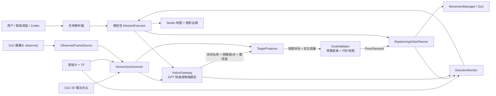

# Go2 GPT 视觉与雷达闭环实施计划

> **For Claude：**实施时必须使用 `executing-plans`，严格按任务逐项完成和验证。

**目标：**让 Go2 获取真实摄像头画面，由 GPT 理解用户指定的语义目标，再用 3D 雷达、摄像头标定和机器人位姿把图像目标转换为地图坐标，交给现有 A* 导航器接近目标，并在行进过程中持续确认方向和最终到达状态。

**架构：**只保留一个 Python DimOS 机器人运行时。GPT 只作为低频、事件触发的“语义传感器”；Python 负责取图、时间同步、结构化模型调用、相机与雷达投影、状态机和任务编排；现有 DimOS 负责高频避障、建图、路径规划、运动控制、停止和取消。Codex 用于开发、调试、下发任务和查看证据，不作为逐帧实时驾驶器。

**技术栈：**Python 3.12、DimOS `0.0.14b1`、Unitree Go2 摄像头/雷达/里程计、DimOS TF、`Detection3DPC`、`ReplanningAStarPlanner`、OpenAI Python SDK Responses API、GPT-5.6 Luna/Terra、Pydantic 结构化输出、MCP、Pytest、现有 DimOS Studio。

---

## 一、先直接回答核心问题

### 1. `observe()` 能不能返回机器狗看到的真实画面？

可以。

`GO2Connection.observe()` 会返回 Go2 视频流收到的最新一帧 `Image`。如果机器狗没有连接、视频流没有启动或者还没有收到图像，它会返回 `None`。

但是，真正能用于导航的“观察”不能只有一张图片，还必须绑定：

- 图像唯一编号；
- 拍摄时间；
- 图像宽高；
- 摄像头标定信息；
- 拍摄时机器狗的地图位姿；
- 数据来源是 `live`、`replay` 还是 `simulation`；
- 图像是否仍然新鲜。

写这份计划时，当前没有正在运行的 Go2/DimOS 实例。因此这里确认的是代码能力，不代表本轮已经拿到新的真实机器狗画面。

### 2. Python 运行时能不能使用 GPT 识别图片？

可以。Python 和 GPT 并不冲突。

Python 只是负责：

1. 从 Go2 取出图像；
2. 压缩成 JPEG；
3. 调用 OpenAI Responses API；
4. 把 GPT 的结果校验成固定 JSON；
5. 交给任务执行器。

GPT 才是图像语义模型。

不推荐把每一帧都发到交互式 Codex 对话中。Codex 适合：

- 开发代码；
- 调试提示词；
- 查看某一张截图；
- 分析回放；
- 给机器人下发任务；
- 查看任务证据。

但持续运行的机器人需要明确的超时、取消、模型选择、错误恢复和状态记录，所以应该由 Python 直接调用 API。

### 3. 第一版应该使用哪个模型？

建议采用两级模型：

#### 快速候选识别

- 默认候选：`gpt-5.6-luna`
- `reasoning.effort=none`
- `detail=low`
- 每次只发送一张经过缩放的 JPEG
- 不重试，失败立即返回 `uncertain`

用途：快速判断“画面里是不是可能出现了目标，以及目标大概在哪”。

#### 最终确认或疑难判断

- 默认候选：`gpt-5.6-terra`
- `reasoning.effort=low`
- `detail=high`
- 使用两个不同位置拍摄的新视角
- 最多重试一次

用途：最终确认“这是否确实是用户指定的目标”。

模型名称不能最终靠主观判断写死。必须先用 Task 4 的真实回放测试比较：

- 识别召回率；
- 误报率；
- 边界框准确性；
- p50/p95 延迟；
- 单次成本。

选择满足指标的最小模型。第一版不需要训练或微调模型。

### 4. 为什么不让 GPT 直接控制机器狗？

因为 GPT 擅长理解“这是什么”，但不适合承担毫秒级运动控制。

GPT 可以返回：

- 是否看到了目标；
- 目标名称；
- 目标在图片中的边界框或点；
- 置信度；
- 是否需要换角度再看一次；
- 一句简短证据说明。

GPT 不能返回或决定：

- `Twist`；
- 电机命令；
- 前进速度；
- 转向速度；
- 目标的米制距离；
- 地图坐标；
- 避障动作；
- 仅凭一张图宣布任务完成。

目标距离和地图位置必须由摄像头标定、雷达点云和 TF 计算；走路必须由本地 A* 和避障系统完成。

## 二、当前项目已经具备什么

### 可以直接复用的能力

- `GO2Connection.observe()`：获取最新摄像头画面。
- Go2 摄像头标定信息：内参已经由官方连接模块提供。
- `BASE_TO_OPTICAL`：摄像头与机器人坐标系之间的静态变换。
- Go2 雷达点云、里程计和 TF。
- `Detection3DPC.from_2d()`：把二维检测区域与三维点云结合。
- `ReplanningAStarPlanner`：接受地图坐标目标并持续重规划。
- 本地代价地图和障碍物处理。
- `SpatialMemory`：保存带机器人位姿的视觉画面，并支持 CLIP 语义检索。
- `OpenAIResponsesVisionVerifier`：已经存在的 OpenAI 图像验证适配器。
- MCP 服务和 Studio 任务页面。

### 当前必须正视的缺口

1. 当前没有正在运行的 Go2、MCP Wrapper 或上层 Agent。
2. 当前轻量 Go2 Studio Blueprint 没有完整接入 `SpatialMemory`、视觉任务执行器和闭环方向监控。
3. Studio 当前可以转发任务文字，但没有完整的后台执行器等待实际到达后再观察。
4. 外层 TypeScript MCP 客户端和 Python Wrapper 只保留文本内容，图像类型会被丢弃。
5. 当前 `navigate_with_text()` 调用 `set_goal()` 后就会返回，不能把“目标已发送”当成“机器狗已到达”。
6. CLIP 找到的是一个可能看到目标的历史观察位置，不是目标的真实三维位置。
7. 当前 `DetectionNavigation` 最后直接计算 `Twist`，不适合本方案；应该只复用它的二维到三维投影部分。

## 三、方案选择

### 方案 A：Codex 每一帧都查看并控制

优点：

- 最容易人工演示；
- 调试提示词方便。

缺点：

- 对话和网络延迟不可控；
- 无法满足实时运动频率；
- 运行会依赖某个 Codex 会话；
- 难以正确处理取消、超时和重启；
- 成本和内存消耗过大。

**结论：**只保留一个“抓取调试截图”的入口，不用于自主运行。

### 方案 B：Python 直接调用 GPT，雷达和导航留在本地

优点：

- 可以配置超时、模型、图片质量、重试和结构化结果；
- 语义识别、三维定位和运动控制分层清楚；
- 能复用当前 DimOS 建图、雷达、TF、代价地图和 A*；
- 后续可以替换其他云模型或本地模型。

**结论：推荐方案。**

### 方案 C：全部使用本地 CLIP/Moondream

优点：

- 没有网络延迟；
- 隐私更好；
- 可以作为高频候选过滤器。

缺点：

- 当前 Mac 上仍需进一步优化推理速度；
- 对开放式家庭任务的理解能力较弱；
- 即使识别到了物体，仍然必须完成雷达定位。

**结论：**作为可选候选器和断网降级方案，不作为唯一视觉模型。

## 四、总体运行架构



## 五、狗眼画面怎么与 3D 雷达建立联系

机器狗摄像头位置低、视角广，和人眼看到的世界不一样，这是正常现象。

系统需要三个坐标关系：

1. **摄像头内参**：图片中的一个像素对应摄像头朝哪个方向。
2. **摄像头外参**：摄像头相对于机器狗身体和雷达的位置、旋转角度。
3. **机器人地图位姿**：拍照时机器狗在地图中的位置和朝向。

### 基本计算过程

假设 GPT 返回归一化边界框：

```text
bbox = [x1, y1, x2, y2]
```

处理流程：

1. 根据图片宽高把归一化框换算成像素区域。
2. 取得与图片时间最接近的雷达点云。
3. 使用 TF 把雷达点转换到摄像头光学坐标系。
4. 对每个三维点 `(X, Y, Z)` 做投影：

   ```text
   u = fx * X / Z + cx
   v = fy * Y / Z + cy
   ```

5. 保留投影后位于 GPT 边界框内部、并且 `Z > 0` 的雷达点。
6. 去掉地面点、孤立点、远处背景墙和过期数据。
7. 使用靠近机器人一侧的稳健中位数/百分位估计目标前表面，不能直接取所有点的平均值。
8. 把目标点转换回地图坐标。
9. 用机器人和目标的地图坐标计算平面距离：

   ```text
   distance = sqrt((target_x - robot_x)^2 + (target_y - robot_y)^2)
   ```

10. 在目标前方生成停靠点：

    ```text
    direction = normalize(target_xy - robot_xy)
    goal_xy = target_xy - stand_off_m * direction
    ```

11. 检查停靠点和路径是否在可通行区域。
12. 把合法的 `PoseStamped` 交给 `ReplanningAStarPlanner.set_goal()`。

### 哪些情况不能继续走

出现以下任一情况，必须返回 `unlocalized`，不能猜距离：

- 图片已经过期；
- 图片与点云时间差过大；
- TF 丢失或过期；
- 目标框内有效雷达点太少；
- 同一个框同时覆盖近处物体和远处墙面；
- 两个视角计算出的目标位置严重冲突；
- 停靠点位于障碍物、未知区域或地图外；
- 摄像头标定与当前硬件不一致。

恢复动作只能是小范围旋转、重新观察、重新投影，不能使用“默认目标在前方两米”之类的猜测。

## 六、怎么持续确认方向正确

不能每一帧都调用 GPT，应使用三种不同频率：

| 循环 | 建议频率 | 输入 | 职责 |
|---|---:|---|---|
| 本地导航 | 10–20 Hz | 里程计、雷达、代价地图、路径 | 避障、路径跟随、重规划 |
| 本地视觉跟踪 | 2–5 Hz | 摄像头、目标框或轻量跟踪器 | 判断目标方向是否持续、目标是否丢失 |
| GPT 语义确认 | 事件触发，通常不超过 0.5–1 Hz | 一张候选图；最终两张图 | 确认目标身份和最终结果 |

### 重新调用 GPT 的触发条件

- 第一次发现候选目标；
- 机器狗移动了约 0.5–1 米；
- 朝向改变超过约 25 度；
- 偏离 A* 路径超过阈值；
- 本地跟踪器丢失目标；
- 导航器进入恢复状态；
- 到达停靠点；
- 上一次视觉结论已经过期。

### DirectionMonitor 需要持续计算

- 目标相对机器狗的方向误差；
- 剩余路径长度是否持续下降；
- 与当前 A* 路径的横向偏差；
- 目标在画面中是向中间靠近还是消失；
- 图像、点云、TF、位姿和 GPT 结果是否新鲜；
- 导航器状态；
- 当前线速度和角速度；
- 是否正在执行合法的恢复动作。

### 被挡住或没有进展时

使用有限重试：

1. 等待一次新的本地重规划；
2. 停止直线前进；
3. 小角度原地旋转；
4. 获取新图片和新点云；
5. 重新识别和投影目标；
6. 只有新目标质量更高时才替换旧目标；
7. 超过重试预算后停止并返回证据。

## 七、任务状态机

```text
IDLE
  -> PARSE              理解用户任务
  -> SEARCH             搜索目标
  -> CANDIDATE          找到视觉候选
  -> VERIFY_FAST        GPT 快速确认
  -> PROJECT_3D         图像目标投影到雷达地图
  -> VALIDATE_GOAL      检查停靠点和代价地图
  -> NAVIGATE           A* 导航
  -> REOBSERVE          中途重新确认
       -> NAVIGATE      目标和路径仍然有效
       -> PROJECT_3D    目标位置变化或新视角更好
       -> SEARCH        目标丢失
  -> FINAL_VERIFY       最终双视角确认
  -> COMPLETE

任何活动状态 -> CANCELLED
任何不可恢复故障 -> FAILED
```

### 什么才算真正完成

以下条件必须全部成立：

1. A* 报告到达目标。
2. 里程计位姿位于允许误差范围。
3. 机器狗速度持续低于停止阈值。
4. 两个新鲜且位置不同的视角都确认目标。
5. 雷达计算的目标距离位于停靠区间。
6. 图片、点云、TF 和位姿都没有过期。
7. 结果记录了图片编号、目标地图位置、机器狗最终位姿、路径距离、模型名称、调用延迟和恢复次数。

`set_goal()` 返回成功只表示“导航器接受了目标”，不表示机器狗已经到达。

## 八、核心数据结构

```python
class ObservedFrame(BaseModel):
    frame_id: str
    captured_at_s: float
    jpeg_base64: str
    width: int
    height: int
    camera_frame_id: str
    camera_info_hash: str
    robot_pose: PoseSnapshot
    source: Literal["live", "replay", "simulation"]


class VisionTarget(BaseModel):
    verdict: Literal["yes", "no", "uncertain"]
    target_label: str
    bbox_norm: tuple[float, float, float, float] | None
    target_point_norm: tuple[float, float] | None
    confidence: float
    needs_another_view: bool
    evidence: str
    frame_id: str


class ProjectedTarget(BaseModel):
    frame_id: str
    target_map_x_m: float
    target_map_y_m: float
    target_map_z_m: float
    robot_distance_m: float
    point_count: int
    depth_median_m: float
    depth_spread_m: float
    quality: Literal["good", "weak", "unlocalized"]


class DirectionStatus(BaseModel):
    state: Literal[
        "on_course",
        "recovering",
        "stalled",
        "target_lost",
        "arrived",
    ]
    distance_to_goal_m: float
    heading_error_rad: float
    cross_track_error_m: float
    progress_rate_m_s: float
    visual_age_s: float
    reason: str
```

GPT 结果必须拒绝未知字段并要求全部必要字段。模型超时、拒绝回答、格式错误或空结果一律转换为 `uncertain`，绝不能默认成 `yes`。

## 九、架构决策

### ADR-1：Codex 不进入实时运行闭环

Codex 负责开发、调试、任务下发和人工证据检查。机器人 Python 进程直接使用 OpenAI SDK，以便每次调用都有明确的超时、模型、结构、记录和取消机制。

### ADR-2：语义、几何和运动严格分开

- GPT：目标是什么、在图片哪里。
- 摄像头标定 + 雷达 + TF：目标在真实三维空间哪里。
- 代价地图 + A*：机器狗怎么走过去。

### ADR-3：GPT 只做事件触发判断

本地导航和跟踪持续运行；GPT 只在发现候选、方向检查和最终确认时运行。

### ADR-4：几何数据不可信时停止推断

没有新鲜的图片、点云和 TF，就不能生成新的米制目标。

### ADR-5：只运行一个 Go2 Runtime

不要同时运行轻量 Studio Blueprint 和完整 `unitree_go2_agentic` Blueprint，避免多个 Agent、多个运动控制器或多个浏览器页面争抢机器人。

## 十、非功能指标

这些是项目测试指标，不是对云服务的延迟承诺：

- 发起识别时图像年龄小于 500 ms；
- 图片与点云时间差必须有明确上限；
- 本地导航至少 10 Hz；
- 候选识别只发送一张 JPEG；
- 候选图片最长边不超过 1024 px；
- 候选使用 `detail=low`；
- 最终确认使用两个不同视角和 `detail=high`；
- 快速模型调用超时 3 秒；
- 最终模型调用超时 6 秒；
- 快速调用不重试；
- 最终调用最多重试一次；
- 必须记录各模型 p50/p95 延迟；
- 云模型故障不能影响本地停止、取消和避障；
- 默认只保存任务证据图片，不保存连续视频；
- API Key 只能放在环境变量或 macOS Keychain。

## 十一、逐步实施任务

### Task 1：建立视觉证据与结果协议

**文件：**

- 新建：`extensions/go2-studio-agent/src/dimos_go2_studio/vision_contracts.py`
- 新建：`extensions/go2-studio-agent/tests/test_vision_contracts.py`

**先写失败测试：**

- 边界框必须位于 `[0, 1]` 且坐标顺序正确；
- `yes` 必须包含边界框或目标点；
- 模型返回的 `frame_id` 必须与输入一致；
- `uncertain` 不能生成导航目标；
- 图片尺寸和摄像头 ID 必须有效；
- 好质量三维目标必须有足够点数；
- 未定义字段必须被拒绝。

**运行：**

```bash
cd /Users/johnsonmac/ai_completion/dimos
PYTHONPATH=extensions/go2-studio-agent/src \
  .venv/bin/python -m pytest \
  extensions/go2-studio-agent/tests/test_vision_contracts.py -v
```

预期：第一次因为模块不存在而失败；实现冻结的 Pydantic 协议后通过。

### Task 2：采集带时间和位姿的真实图片

**文件：**

- 新建：`extensions/go2-studio-agent/src/dimos_go2_studio/frame_evidence.py`
- 新建：`extensions/go2-studio-agent/tests/test_frame_evidence.py`
- 参考：`dimos/robot/unitree/go2/connection.py`

**测试：**

- `observe()` 返回 `None` 时得到 `no_frame`；
- 过期图片被拒绝；
- 使用图片时间查询机器人位姿；
- TF 或位姿缺失时返回 `unsynchronized`；
- JPEG 缩放不修改原始图像；
- 图片编号唯一；
- `source` 不能默认伪装成 `live`。

实现 `ObservedFrameSource`，把摄像头、TF、时钟、JPEG 编码器和数据来源都作为可注入依赖。

### Task 3：建立可替换的 GPT VisionGateway

**文件：**

- 新建：`extensions/go2-studio-agent/src/dimos_go2_studio/gpt_vision_gateway.py`
- 新建：`extensions/go2-studio-agent/tests/test_gpt_vision_gateway.py`
- 复用：`dimos/perception/target_verification.py`

**接口：**

```python
class SceneVisionProvider(Protocol):
    def locate(
        self,
        target_description: str,
        frames: Sequence[ObservedFrame],
        mode: Literal["fast", "final"],
    ) -> VisionTarget: ...
```

**测试：**

- fast 模式只发送一张 `detail=low` 图片；
- final 模式只发送两个不同视角的 `detail=high` 图片；
- 使用 JPEG Base64 Data URL；
- 使用严格 Pydantic 结果；
- 超时、拒绝、API 错误和格式错误返回 `uncertain`；
- GPT 结果中不能出现速度和米制目标；
- 始终设置 `store=False`；
- 取消后迟到的模型结果不能修改任务状态。

模型、超时和重试必须来自配置，不得把 API Key 写进代码。

### Task 4：用回放数据比较 Luna、Terra 和本地模型

**文件：**

- 新建：`scripts/benchmark_go2_vision.py`
- 新建：`extensions/go2-studio-agent/tests/fixtures/vision_manifest.json`
- 新建：`extensions/go2-studio-agent/tests/test_vision_benchmark_manifest.py`
- 新建：`extensions/go2-studio-agent/tests/fixtures/vision_frames/README.md`

测试数据必须包括：

- 清楚可见的正例；
- 目标不存在的负例；
- 容易混淆的负例；
- 遮挡和局部可见目标；
- 机器狗低机位和广角画面；
- 明确的 live/replay 来源。

输出：

- 召回率；
- 误报率；
- 边界框重叠率或目标点误差；
- `uncertain` 比例；
- p50/p95 延迟；
- Token 和成本。

**运行：**

```bash
.venv/bin/python scripts/benchmark_go2_vision.py \
  --manifest extensions/go2-studio-agent/tests/fixtures/vision_manifest.json \
  --models gpt-5.6-luna gpt-5.6-terra \
  --output /tmp/go2-vision-benchmark.json
```

只有 Luna 达到实际指标时才把它设为默认。

### Task 5：把 GPT 图像目标投影到雷达地图

**文件：**

- 新建：`extensions/go2-studio-agent/src/dimos_go2_studio/target_projection.py`
- 新建：`extensions/go2-studio-agent/tests/test_target_projection.py`
- 复用：`dimos/navigation/visual_servoing/detection_navigation.py`
- 复用：`dimos/perception/detection/type/detection3d/pointcloud.py`

先使用合成相机、地面点、目标点、背景墙、TF 和机器人位姿写测试：

- 已知三维目标能投影到预期像素框；
- 从像素框反查的目标地图位置位于误差范围；
- 地面和背景不能主导结果；
- 点数不足返回 `unlocalized`；
- TF 缺失或时间过期返回 `unlocalized`；
- 两个视角定位冲突时不能融合。

复用 `Detection3DPC.from_2d()`，但不要复用最终直接产生 `Twist` 的逻辑。

### Task 6：生成并验证停靠点

**文件：**

- 新建：`extensions/go2-studio-agent/src/dimos_go2_studio/goal_validation.py`
- 新建：`extensions/go2-studio-agent/tests/test_goal_validation.py`
- 参考：`dimos/navigation/replanning_a_star/module.py`

测试：

- 停靠点位于机器人到目标的连线上；
- 停靠距离受到上下限约束；
- 障碍物、未知区域和地图外目标被拒绝；
- 只在小范围内寻找替代空闲位置；
- 输出必须是地图坐标 `PoseStamped`；
- 不允许输出 `Twist`。

### Task 7：实现方向和进度监控

**文件：**

- 新建：`extensions/go2-studio-agent/src/dimos_go2_studio/direction_monitor.py`
- 新建：`extensions/go2-studio-agent/tests/test_direction_monitor.py`

使用确定性的时间序列测试：

- 剩余距离下降得到 `on_course`；
- 已有运动命令但距离长时间不变得到 `stalled`；
- A* 短暂恢复不能被误判成失败；
- 路径横向偏差持续增长触发重新观察；
- 视觉结果过期得到 `target_lost`；
- 到达位置但速度仍不为零时不能得到 `arrived`；
- 取消后立即终止恢复动作。

`DirectionMonitor` 只输出决策，不直接发布运动命令。

### Task 8：实现完整任务状态机

**文件：**

- 新建：`extensions/go2-studio-agent/src/dimos_go2_studio/visual_mission_executor.py`
- 新建：`extensions/go2-studio-agent/tests/test_visual_mission_executor.py`
- 复用之前语义任务计划中的：
  `extensions/go2-studio-agent/src/dimos_go2_studio/mission_contracts.py`

必须覆盖：

- 正常搜索、定位、导航和双视角完成；
- GPT 返回 `no`；
- GPT 返回 `uncertain`；
- 第一次投影失败，旋转重新观察后成功；
- A* 卡住、重规划后成功；
- 目标变化后更新停靠点；
- 云模型超时时本地停止仍可用；
- GPT 请求过程中取消任务；
- 最终视觉结果不一致时失败；
- 执行器从不直接发布 `cmd_vel`。

需要注入：

- Frame Source；
- Vision Provider；
- Point Cloud Source；
- Target Projector；
- Goal Validator；
- Navigation Interface；
- Direction Monitor；
- 时钟和取消令牌。

执行器必须轮询实际导航状态，不能在 `set_goal()` 后立即报告完成。

### Task 9：接入当前唯一 Go2 Blueprint 和 MCP

**文件：**

- 修改：`extensions/go2-studio-agent/src/dimos_go2_studio/blueprint.py`
- 修改：`extensions/go2-studio-agent/src/dimos_go2_studio/skills.py`
- 修改：`extensions/go2-studio-agent/tests/test_blueprint.py`
- 新建：`extensions/go2-studio-agent/tests/test_visual_mission_skills.py`

要求：

- 只有一个 Go2 连接；
- 只有一个 MovementManager；
- 只有一个任务执行器和方向监控器；
- 不新增第二个对话 Agent；
- 模型配置通过 Blueprint 注入；
- MCP 暴露：
  - `run_visual_mission`
  - `visual_mission_status`
  - `cancel_visual_mission`
- GPT 不可用时，取消和停止仍必须可用；
- MCP 主结果使用结构化文本 JSON，绕开当前外层 Wrapper 丢失图像的问题。

### Task 10：给 Codex 增加单张调试截图入口

**文件：**

- 修改：`extensions/go2-studio-agent/src/dimos_go2_studio/skills.py`
- 新建：`extensions/go2-studio-agent/tests/test_debug_frame_skill.py`
- 后续可选修改：
  `../agent/components/agent-framework/agent-webhook-gateway/src/mcp-client.ts`
- 后续可选修改：
  `../agent/components/agent-framework/dimos-mcp-wrapper/src/dimos_mcp_wrapper/upstream.py`

`capture_debug_frame` 应：

- 返回一张新鲜图片；
- 同时返回图片编号、时间和机器人位姿；
- 不启动任何运动；
- 准确标记 live/replay/simulation；
- 没有图片时只返回错误元数据。

这个入口供 Codex 和操作者调试。自动任务执行器不能等待人工 Codex 回复。

第一版不必修改外部 Wrapper 传图，因为 GPT VisionGateway 已经在 Python 内部完成识别。以后确实需要上层 Agent 直接看图时，再单独为 MCP 图像内容建立端到端类型和测试。

### Task 11：在 Studio 显示目标、路径、距离和证据

**文件：**

- 修改：`dimos/web/studio/models.py`
- 修改：`dimos/web/studio/service.py`
- 修改：`dimos/web/studio/app.py`
- 修改：`dimos/web/studio/static/index.html`
- 修改：`dimos/web/studio/static/app.js`
- 修改：`dimos/web/studio/static/styles.css`
- 修改：`dimos/web/studio/test_studio.py`
- 修改：`dimos/web/studio/test_mission.py`

任务状态 API 至少返回：

- 当前任务状态；
- 重试次数；
- 机器人位姿；
- 当前 A* 目标；
- 视觉目标地图位置；
- 机器狗到目标距离；
- GPT 判断、图片编号和延迟；
- 传感器新鲜度；
- 失败原因。

界面显示：

- 机器人当前位置；
- A* 路径；
- 停靠点；
- 视觉目标和定位质量；
- 带 GPT 边界框的证据图；
- 当前距离和方向状态。

不要再创建第二套 WebGL 场景，也不要自动打开多个相同浏览器页面。复用现有可视化页面。

### Task 12：依次完成回放、仿真和有限真机验证

**文件：**

- 新建：`scripts/replay_go2_visual_mission.py`
- 新建：`extensions/go2-studio-agent/tests/test_visual_mission_replay.py`
- 方案被接受并真实验证后修改：`docs/PROJECT_CONTEXT.md`

#### 12.1 无运动回放

回放同步的：

- 摄像头；
- 点云；
- TF；
- 机器人位姿。

确认同一目标能得到稳定地图位置，且不连接运动发布器也能完成状态机测试。

#### 12.2 完整测试

```bash
PYTHONPATH=extensions/go2-studio-agent/src \
  .venv/bin/python -m pytest \
  extensions/go2-studio-agent/tests -v
```

#### 12.3 代码检查

```bash
.venv/bin/python -m ruff check \
  extensions/go2-studio-agent/src/dimos_go2_studio \
  extensions/go2-studio-agent/tests \
  scripts/benchmark_go2_vision.py \
  scripts/replay_go2_visual_mission.py
```

#### 12.4 真机静态标定测试

机器狗连接后，先不运动：

1. 获取三张新鲜真实图片；
2. 检查摄像头标定和 TF；
3. 选择一个静止且清晰的目标；
4. 验证目标框与雷达点云对齐；
5. 用卷尺测量真实距离；
6. 比较雷达投影距离；
7. 误差不合格时禁止进入自主运动。

#### 12.5 有限运动测试

选择短距离、可见、无障碍目标，验证：

- 初始目标投影；
- 一个 A* 停靠点；
- 至少一次中途方向检查；
- 被挡住后的有限重规划；
- 最终机器狗停止；
- 两个视角确认目标；
- 操作者停止控制始终可用。

这个测试只能证明当前目标类别和当前环境，不代表已经实现通用家庭自主机器人。

## 十二、隐私与运行要求

- 启用云 GPT 时，选中的摄像头图片会离开本机；Studio 必须明确显示。
- API 调用默认 `store=False`。
- 只保存必要证据图片，并设置保存期限。
- 默认不要持续上传家庭视频。
- 保留本地视觉 Provider，作为断网降级方案。
- 网络或模型失败只能暂停语义任务，不能影响本地停止、避障和取消。
- API Key 不得提交到仓库。

## 十三、Demo 验收清单

- [ ] `observe()` 返回了真实 Go2 新鲜画面，不是历史文件。
- [ ] 图片、点云、TF 和位姿的时间被记录。
- [ ] GPT 返回符合协议的目标区域。
- [ ] 雷达投影生成了有质量证据的地图目标。
- [ ] 停靠点通过代价地图检查。
- [ ] A* 负责移动，GPT 从未输出运动命令。
- [ ] 行进过程中至少重新确认一次方向。
- [ ] 主动测试了一次目标丢失或路径恢复。
- [ ] 最终完成要求机器狗停止并通过两个视角确认。
- [ ] Studio 显示机器人、路径、目标、距离和证据来源。
- [ ] 保存了模型延迟和识别质量报告。

## 十四、推荐开发顺序

1. Task 1–3：先建立证据、协议和 GPT 接口。
2. Task 4：用回放测试决定模型，而不是先写死模型。
3. Task 5–7：完成雷达定位、停靠点和方向监控。
4. Task 8–9：完成任务状态机并接入唯一 Go2 Runtime。
5. Task 10–11：增加 Codex 调试截图和 Studio 可视化。
6. Task 12：先回放，再静态标定，最后进行有限真机运动。

不要先开发漂亮 UI，也不要先训练模型。

第一优先级是证明“GPT 返回的图像目标能稳定映射到正确的雷达地图坐标”；第二优先级是证明“导航器能够持续确认进展、恢复并正确判断到达”；模型选型必须由真实回放结果决定。
