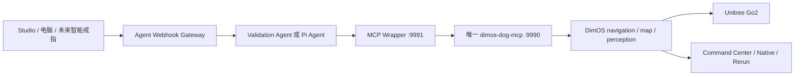

# Go2 团队协作与三阶段交付 Implementation Plan

> **For Codex/协作者:** 实现阶段任务时必须先阅读本文件和
> `docs/plans/2026-07-25-go2-three-stage-robot-validation-plan.md`，每次只执行一个
> `Sx-Tx`；真实 Go2 验收只能在项目负责人当前 Mac 上进行。

**Goal:** 让队友不依赖聊天记录即可理解两个仓库的职责、当前真实完成度、
Stage 1/2/3 的开发内容、可直接复用的能力，以及如何把代码提交给项目负责人的
Mac 完成最终真机验收。

**Architecture:** DimOS/Python 是唯一机器人 Runtime 和物理任务执行层；朋友的
Agent、Gateway 和 MCP Wrapper 负责高层输入、任务编译、转发和回复。队友可以在各自
电脑完成 contract、unit、replay 和 UI 开发，但不得远程启动第二套 Go2 Runtime；
每阶段最终通过与否由负责人 Mac 上的 fresh odometry、任务状态和证据判定。

**Tech Stack:** Python 3.12、DimOS `0.0.14b1`、Unitree Go2、MCP、
Pydantic v2、FastAPI、Rerun、Node.js 22.19+、TypeScript、Pi Agent、SQLite、
Pytest、Ruff、Vitest。

---

## 1. 一页结论

| 项目 | 当前结论 |
|---|---|
| 当前阶段 | **Stage 1 已通过，准备进入 Stage 2** |
| 下一项唯一开发任务 | `S2-T1 — 最小 Persistent SemanticWorld` |
| 真机最终验收环境 | 项目负责人当前 Mac + Go2 `192.168.12.1` |
| 当前机器人 Runtime | 朋友仓库 `components/dimos-mcp`，不是 Studio 的第二套 Blueprint |
| Stage 1 已证明 | 单一 Runtime、短距离移动、actual odometry、返回进程起点、中途停止 |
| Stage 1 没有证明 | 语义地点、视觉识别、戒指输入、人员跟随 |
| Stage 2 目标 | 两个已确认地点的保存、解析、往返、重启恢复和有界阻挡处理 |
| Stage 3 目标 | 有界探索、候选停止、视觉确认、LiDAR/map grounding、戒指触发 |
| 当前最大协作风险 | 两个仓库都有大量**未提交本地改动**，远端仓库尚不包含当前成果 |

不要把“代码已经写好”“MCP 返回成功”“页面能打开”和“真机任务已经完成”混为
一件事。本项目始终分开报告：

1. contract/unit test 是否通过；
2. Runtime/MCP 是否启动；
3. 命令是否被接受；
4. actual odometry 是否证明移动；
5. 任务是否满足终态验收。

## 2. 权威文档顺序

发生冲突时按以下顺序判断：

1. 当前可执行计划：
   `docs/plans/2026-07-25-go2-three-stage-robot-validation-plan.md`
2. 当前仓库事实：
   `docs/PROJECT_CONTEXT.md`
3. 本协作交接：
   `docs/plans/2026-07-25-go2-team-collaboration-handoff.md`
4. 长期架构/backlog：
   `docs/plans/2026-07-25-go2-agent-fusion-master-plan.md`
5. 历史技术计划：
   `docs/plans/2026-07-25-go2-semantic-autonomy-master-plan.md`

注意：三阶段计划底部的旧“下一步为 S1-T1”文字已经落后于该文件上方的状态表和
真实验收记录。当前事实是 `S1-T1/S1-T2/S1-T3 = DONE`、
`S1-R1 = PASSED`，下一步是 `S2-T1`。

## 3. 两个仓库如何分工

### 3.1 DimOS 产品与机器人能力仓库

本机路径：

```text
/Users/johnsonmac/ai_completion/dimos
```

当前 Git：

```text
branch: codex/openai-vision-baseline
baseline commit: 0a0e3d1f5
origin: https://github.com/dimensionalOS/dimos.git
```

职责：

- Go2 连接、相机、LiDAR、odometry、地图；
- 路径规划、局部控制、探索、巡逻和导航恢复；
- `TaskSpec`、`TaskSnapshot`、`MissionExecutor`；
- 后续 `SemanticWorld`、视觉证据、grounding；
- Studio、Native App 和 Rerun 可视化；
- 物理任务执行、取消和完成判定。

关键目录：

```text
dimos/robot/unitree/go2/                 # Go2 官方连接和 Blueprint
dimos/navigation/                        # 规划、控制、探索、巡逻、恢复
dimos/perception/                        # 相机/空间感知/后续视觉证据
dimos/web/studio/                        # Studio API 和网页
extensions/go2-studio-agent/             # 自定义任务层与 MissionExecutor
apps/DimOS Native.app/                   # 原生 macOS 控制/轨迹显示
docs/plans/                              # 当前计划和 child plan
```

### 3.2 朋友 Agent/MCP 仓库

本机路径：

```text
/Users/johnsonmac/ai_completion/agent
```

当前 Git：

```text
branch: main
baseline/origin: f6c47169
origin: https://github.com/human-chocker-and-robot-dog/agent.git
```

职责：

- `components/dimos-mcp`：当前唯一 Go2 产品 Runtime 组合入口；
- `dimos-mcp-wrapper`：按 profile 暴露/转发 MCP 工具；
- `agent-webhook-gateway`：接收用户/未来戒指指令、持久化、运行 Agent、投递回复；
- 后续 `instruction_id <-> task_id` 绑定；
- 不复制底层地图、导航、恢复或视觉实现。

关键目录：

```text
components/dimos-mcp/
components/agent-framework/dimos-mcp-wrapper/
components/agent-framework/agent-webhook-gateway/
CONTEXT.md
USAGE.md
```

### 3.3 唯一允许的运行拓扑



禁止：

- 同时启动朋友 `dimos-mcp` 和 Studio Go2 Blueprint；
- 启动第二个 `GO2Connection`；
- 让 Agent/VLM 直接输出 `Twist`；
- 把 Wrapper 当作地图或任务状态 owner；
- 队友从另一台电脑直接连真实 Go2 做未审批动作。

## 4. 当前已经开发好的能力

### 4.1 Stage 1 产品链路：已完成并通过真机

| 能力 | 实现位置 | 当前证明 |
|---|---|---|
| 单一 Runtime owner/端口预检 | 朋友 `dimos-mcp/runtime_owner.py` | 第二个 Runtime 或已占用 `9990` 会在连接硬件前失败 |
| Go2 唯一启动入口 | 朋友 `dimos-mcp/blueprint.py` | 一个 `ModuleCoordinator`、一个 Go2 连接 |
| Validation Wrapper profile | 朋友 Wrapper `config.py`、`server.py` | 精确暴露五个 Stage 1 工具 |
| 无模型 Validation Agent | Gateway `validation-agent.ts` | 不依赖付费模型完成 Stage 1 指令解析 |
| actual odometry 摘要 | 朋友 `dimos-mcp/robot_summary.py` | start/latest pose、actual path、freshness、累计里程、观测运动状态 |
| 返回 Runtime 起点 | 朋友 `HomeNavigationSkill` | 使用本进程第一帧有效 odometry，不依赖人工标点 |
| 统一停止 | 朋友 `Go2StopAllSkill` | 尝试停止探索、巡逻、散步、观察、导航、定时运动并发零速度 |
| Native actual path 显示 | DimOS Native `main.swift` | 轨迹来自 odometry，不用 A* path 伪装 |

Stage 1 真机证据：

- 0.3 m 请求产生 `0.1770 m` actual displacement；
- 返回起点距离从 `0.3262 m` 降至 `0.1836 m`；
- 运动中调用 `stop_all` 后 `0.600 s` 首次观测 stationary；
- 最终 fresh odometry、stationary、command state idle；
- 全程只有一个 Runtime owner。

这证明了最小控制闭环，不证明精确距离控制，也不证明语义导航。

### 4.2 DimOS P1 任务层：代码已完成，但尚未接入当前朋友 Runtime

| 模块 | 状态 | 已验证边界 |
|---|---|---|
| P1-T1 mission contracts | `DONE` | 5 类任务、严格字段、UTC、状态转换、终态理由/证据 |
| P1-T2 `MissionExecutor` | `DONE` | 单任务互斥、pause/resume/cancel/timeout、reached + idle 才完成 |
| P1-T3 `RecoverySupervisor` | `DONE` | 有界 replan/rotate-rescan、typed event、8 次后失败、取消抢占 |

对应文件：

```text
extensions/go2-studio-agent/src/dimos_go2_studio/mission_contracts.py
extensions/go2-studio-agent/src/dimos_go2_studio/mission_executor.py
dimos/navigation/replanning_a_star/recovery_supervisor.py
```

已记录的回归结果分别为 43、57、86 tests。关键限制：

- 当前 `MissionExecutor` 的生产 resolver 仍然 fail-closed；
- 当前朋友 `dimos-mcp` 没有加载 `MissionExecutor`；
- P1-T3 尚未通过真机临时阻挡验收；
- 所以这些代码不能被描述为“当前 Agent 已能语义导航”。

### 4.3 当前底层 MCP 可以直接使用的能力

朋友底层 `:9990/mcp` 的源代码契约当前是 **22 个工具**：

官方管理：

```text
server_status
list_modules
agent_send
```

官方 Go2/导航：

```text
relative_move
wait
current_time
execute_sport_command
get_battery_soc
observe
tag_location
navigate_with_text
begin_exploration
start_patrol
look_out_for
```

本项目扩展：

```text
move_forward
move_backward
motion_status
get_robot_summary
return_to_start
return_to_user_and_greet
start_stroll
stop_all
```

`validation` Wrapper 只允许：

```text
relative_move
return_to_start
motion_status
get_robot_summary
stop_all
```

当前 `product` Wrapper 允许的是已有高层导航/观察工具，但它还不是 Stage 2 的
typed task product surface；在 S2-T2/S2-T3 完成前，它没有
`start_task/get_task_status/cancel_task` 的完整朋友-Agent闭环。

### 4.4 当前可视化和控制面

| Surface | 用途 | 当前边界 |
|---|---|---|
| `http://127.0.0.1:7779/command-center` | 当前 Runtime 的地图/命令中心 | 来自唯一朋友 Runtime |
| `apps/DimOS Native.app` | 原生 macOS 控制壳和 actual path | 不应再启动第二套 Runtime |
| `http://127.0.0.1:8765` | Studio 配置和历史 Mission Control | 当前朋友 Runtime 运行时不要从这里再启动 Go2 Blueprint |
| Rerun/native viewer | 3D 点云、地图等 | 只读显示，不是任务完成证据 |

### 4.5 2026-07-25 巡场附加 smoke test

这不是 Stage 2 验收，只是已有巡逻能力验证：

- 当前位置成功保存为 `巡场测试起点`；
- `start_patrol` 成功启动官方已建图覆盖巡逻；
- fresh odometry 证明机器人持续移动；
- Runtime 累计路程从约 `4.38 m` 增至约 `83.99 m`；
- `stop_all` 返回 `patrol=Patrol stopped`，无失败组件；
- 停止后连续三次 fresh odometry 均为 stationary，速度约
  `0.0004–0.0012 m/s`。

结论：已建图巡逻和统一停止可用。它不证明机器人认识门、持久保存语义地点或完成
一次有语义终点的任务。

## 5. 当前不能宣称可用的部分

| 能力 | 当前状态 | 缺少什么 |
|---|---|---|
| “去门口测试点” typed mission | 不可用 | `SemanticWorld`、resolver、朋友 Runtime 集成 |
| 地点重启后恢复 | 不可用 | map version + persistent confirmed-place store |
| Agent accepted 后跟踪到终态 | 不可用 | instruction/task binding、task monitor |
| Agent/UI/MCP 同一 task ID | 不可用 | Stage 2 Gateway 和 UI read model |
| 自动识别门 | 不可用 | candidate verifier + 视觉/几何闭环 |
| 从 RGB 得到可导航门坐标 | 不可用 | camera/LiDAR/map grounding |
| 智能戒指触发 | 不可用 | 实际戒指协议和 ring adapter |
| 障碍感知人员跟随 | 当前三阶段不做 | dynamic target + navigation follow coordinator |
| 智能眼镜硬件映射 | 当前三阶段不做 | 只读 telemetry adapter，属于后续 backlog |

额外阻塞：

- 当前 Pi provider `zai/glm-5.1` 曾返回 429 余额不足；
- Stage 1 因此使用确定性的无模型 Validation Agent；
- 不能把本机 Codex Desktop 直接当作稳定、可部署的 Gateway 模型后端；
- 视觉候选的离线代码存在，但没有接入当前朋友 Runtime 的任务闭环。

## 6. Stage 1、Stage 2、Stage 3 的精确内容

### Stage 1 — Agent 到 Go2 最小控制闭环

**状态：`PASSED`**

已完成：

- `S1-T1` 单一 Runtime 启动和诊断；
- `S1-T2` 五工具 validation profile；
- `S1-T3` actual path 和停止状态；
- `S1-R1` 短距离、返回起点、中途停止真机复查。

后续每个阶段都必须回归 Stage 1 的单一 Runtime 和停止能力。

### Stage 2 — 已知语义地点导航

**状态：`NOT_STARTED`**

#### S2-T1 — 最小 Persistent SemanticWorld

只支持人工确认的地点，保存：

```text
name
aliases
map_id / map_version
map-frame pose
confirmed state
timestamp
```

必须测试保存、重启、alias、重复名称和 map mismatch。候选视觉结果不能自动变成
confirmed place。

#### S2-T2 — 朋友 MCP 加载唯一 MissionExecutor

- 将 `dimos-go2-studio` 声明为明确依赖；
- 组合 module atoms，不嵌套第二个完整 Blueprint；
- 暴露 `start_task/get_task_status/pause_task/resume_task/cancel_task`；
- 静态和 replay 测试必须证明只有一个 executor/navigator/MCP Server。

#### S2-T3 — Agent TaskSpec 和持久化任务绑定

- Agent 只输出 kind/destination 等受约束参数；
- Gateway 生成稳定 task ID 和 UTC 时间；
- 相同 instruction ID 只能绑定一个 task；
- start accepted 后轮询到 terminal snapshot；
- Gateway 重启不得重复物理任务；
- “停”仍走直接快速路径。

#### S2-T4 — 地点 UI、任务状态和恢复事件

最少显示：

```text
map ID/version
confirmed places
task ID/state
destination
planned path
actual path
recovery cause/attempt
cancel
```

#### S2-R1 — 真机复查

- 在同一地图确认 `测试起点`、`门口测试点`，相距建议 `1–3 m`；
- 执行三次单程，至少 `2/3` 到达；
- 到达误差 `<= 0.60 m`；
- Runtime 重启、relocalization 后地点仍可用；
- 临时阻挡产生完成或 typed failure，不无限顶撞；
- 任意 cancel 最终 navigation idle；
- Agent、MCP、UI 显示同一 task ID 和 terminal state。

Stage 2 未通过，不开始 Stage 3。

### Stage 3 — 自主视觉搜索与戒指触发

**状态：`BLOCKED_BY_STAGE_2`**

顺序：

1. `S3-T1`：同步 `ObservationBundle`；
2. `S3-T2`：只在候选事件调用视觉 verifier；
3. `S3-R1`：真机探索、发现候选、先停止并保存证据；
4. `S3-T3`：camera/LiDAR/map grounding；
5. `S3-R2`：约 1 m stand-off 的短距离接近；
6. `S3-T4`：有界 active search 和 evidence result；
7. `S3-T5`：智能戒指 input adapter；
8. `S3-R3`：电脑发起、戒指重复请求、provider 断开三类真机复查。

Stage 3 通过条件：

- 三次限定搜索没有 false verified target；
- 至少一次 candidate -> grounding -> approach；
- 找不到时诚实返回 `not_found/uncertain`；
- 相同戒指 command ID 只创建一个 task；
- provider 断开不影响本地停止；
- UI 保留 task、actual path、candidate frame、grounded pose 和 final result。

## 7. 队友如何协作

### 7.1 环境分工

| 环境 | 允许做什么 | 不允许做什么 |
|---|---|---|
| 队友电脑 | 阅读代码、unit/contract test、replay、UI mock、PR | 连接负责人真实 Go2、声称真机通过 |
| 负责人 Mac | 合并候选改动、唯一 Runtime、read-only、短真机验收 | 同时跑两套 Go2 Runtime |
| CI | 静态检查、unit test、schema compatibility | 替代真机 odometry/evidence |

### 7.2 Stage 2 推荐任务所有权

| Owner | 任务 | 主要仓库 | 合并依赖 |
|---|---|---|---|
| A：Semantic/DimOS | `S2-T1` | `dimos` | 第一优先，先冻结接口 |
| B：Runtime integration | `S2-T2` | 两个仓库 | 等 S2-T1 contract |
| C：Agent/Gateway | `S2-T3` | `agent` | 等 S2-T2 的 MCP schema |
| D：UI/acceptance | `S2-T4` + acceptance fixtures | `dimos` | 可先做 mock，最终等 S2-T3 |
| 负责人 | `S2-R1` | 当前 Mac/Go2 | 所有开发任务通过后 |

安全的并行项：

- A 实现 `SemanticWorld`；
- C 只准备 instruction/task binding 的纯 TypeScript tests，不接真实 MCP；
- D 准备 Stage 2 acceptance matrix 和 UI mock；
- B 等 `SemanticWorld` 接口冻结后再改 Runtime composition。

不要多人同时修改：

```text
agent/components/dimos-mcp/src/dimos_dog_mcp/blueprint.py
dimos/extensions/go2-studio-agent/src/dimos_go2_studio/blueprint.py
dimos/extensions/go2-studio-agent/src/dimos_go2_studio/mission_executor.py
```

### 7.3 每个 PR/补丁必须写明

- 对应唯一 `Sx-Tx`；
- 修改文件；
- 新增/变更 contract；
- focused test 命令和结果；
- replay/simulation 结果；
- 未验证边界；
- 是否改变工具 allowlist、端口、Runtime owner 或运动行为；
- 回滚文件范围；
- 不包含密钥、机器人私有凭据或本机数据库。

## 8. Git 协作现状和发布前置

### 8.1 当前远端看不到本机成果

截至本文生成时：

- `dimos`：约 33 个 dirty/untracked 路径；
- `agent`：约 54 个 dirty/deleted/untracked 路径；
- 朋友 `agent` 的远端 `main` 仍是 `f6c47169`；
- DimOS 修改位于本地 `codex/openai-vision-baseline`，origin 是官方仓库；
- 本文也只是本机文件，除非后续显式 commit/push 或打包分享。

所以“生成这份 MD”不会自动让队友获得代码。正式共享前需要用户决定：

1. 给两个仓库配置团队可写 fork/remote；
2. 将现有 dirty work 按功能拆成可审查 commits；
3. 推送专用协作分支；
4. 队友从对应 commit 开发并提 PR；
5. 负责人 Mac 合并后完成真机验收。

### 8.2 建议拆分提交

不要把当前所有改动压成一个提交。建议至少拆为：

1. `agent`: Stage 1 Runtime owner + odometry summary；
2. `agent`: validation Wrapper/Gateway；
3. `dimos`: P1 contracts + MissionExecutor；
4. `dimos`: recovery supervisor；
5. `dimos`: Native actual-path display；
6. 两仓库文档；
7. 朋友仓库的 Health/项圈删除另做独立提交并单独复核。

未经项目负责人确认，不要把当前 dirty work 直接推到 `main`，也不要 force-push。

## 9. 本地开发和验证命令

### 9.1 DimOS focused tests

```bash
cd /Users/johnsonmac/ai_completion/dimos
PYTHONPATH=extensions/go2-studio-agent/src \
  .venv/bin/python -m pytest \
  extensions/go2-studio-agent/tests \
  dimos/web/studio/test_mission.py -v

.venv/bin/ruff check \
  extensions/go2-studio-agent/src \
  extensions/go2-studio-agent/tests

git diff --check
```

### 9.2 朋友底层 MCP

```bash
cd /Users/johnsonmac/ai_completion/agent/components/dimos-mcp
PYTHONPATH=src \
  /Users/johnsonmac/ai_completion/dimos/.venv/bin/python \
  -m unittest discover -s tests -v
```

### 9.3 MCP Wrapper

```bash
cd /Users/johnsonmac/ai_completion/agent/components/agent-framework/dimos-mcp-wrapper
PYTHONPATH=src \
  /Users/johnsonmac/ai_completion/dimos/.venv/bin/python \
  -m unittest discover -s tests -v
```

### 9.4 Agent Webhook Gateway

```bash
cd /Users/johnsonmac/ai_completion/agent/components/agent-framework/agent-webhook-gateway
npm run check
node node_modules/vitest/dist/cli.js --run \
  test/agent-runtime.test.ts \
  test/config.test.ts \
  test/validation-agent.test.ts
```

真实 Runtime 运行期间不要运行会构建第二套 DimOS module graph 的 integration tests。
先运行纯 contract/unit tests；需要完整集成回归时，先正常停止巡逻/任务和 Runtime，
确认 `9990/9991/7779` 端口释放，再执行。

## 10. 负责人 Mac 的阶段验收模板

每个 `Sx-Rx` 至少记录：

```text
run_id
git commit / dirty state
Runtime owner PID
robot IP
module/tool list
instruction_id / task_id / MCP call ID
map ID/version
start pose
end pose
planned path
actual path
odometry freshness
navigation/motion state
recovery events
stop/cancel result
evidence IDs
failure reason
```

阶段结论只能是：

```text
PASSED
FAILED
BLOCKED
```

`MCP accepted`、`HTTP 200`、模型回复、页面截图或 planned path 都不能单独判定
`PASSED`。

## 11. 当前交接状态

### 当前可以立即做

1. 停止真机自主活动，保持唯一 Runtime 供只读诊断；
2. 整理并分享两个仓库的 Stage 1 改动；
3. 创建 `S2-T1` child plan；
4. 开发 confirmed-place `SemanticWorld`；
5. 队友并行准备 task-binding tests 和 Stage 2 acceptance matrix。

### 当前不要做

- 不开始 Stage 3 视觉/戒指实现；
- 不启用人员跟随；
- 不让队友直接连真实 Go2；
- 不同时启动 Studio Go2 Blueprint；
- 不把 `tag_location + start_patrol` 称为语义任务闭环；
- 不把未提交本机工作描述为队友已可从 Git 获取。

### 下一项唯一实现任务

```text
S2-T1 — 最小 Persistent SemanticWorld
```

完成条件：

- confirmed place 可原子保存和重载；
- alias 可解析到同一 entity；
- map version mismatch fail-closed；
- candidate 不会自动成为 confirmed；
- focused tests 和 Ruff 通过；
- 不连接或移动真实 Go2。
