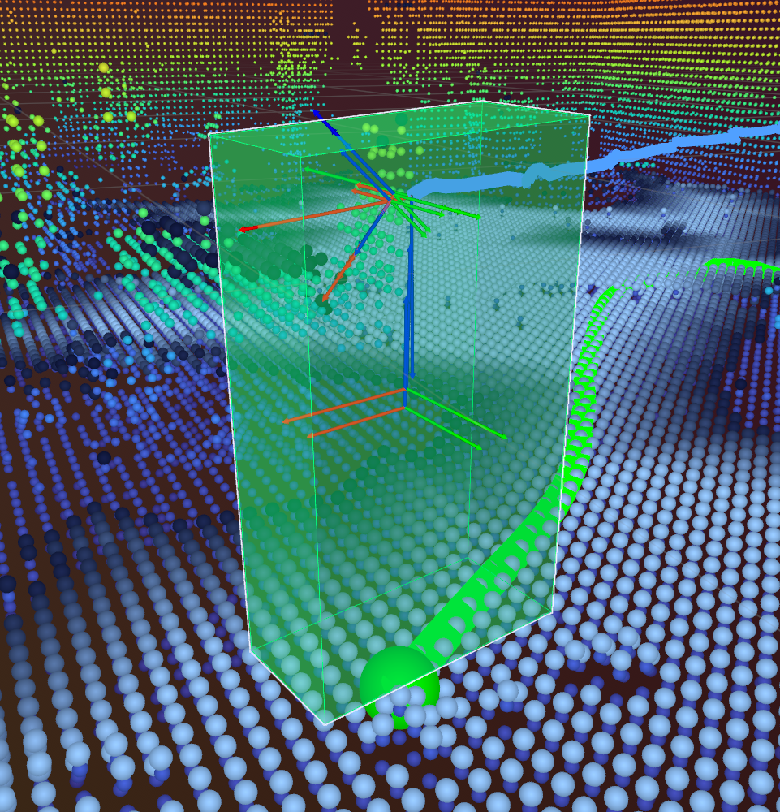

# Unitree G1



## Requirements

- Unitree G1 EDU (need SDK/SSH access)
- Laptop/Desktop with Ubuntu 22.04/24.04 with CUDA GPU (recommended), or macOS (experimental)

## 1. Get SSH Access

### Get Ethernet Working
1. Plug an Ethernet cable from the robot into your Laptop
2. Open up your Laptop's graphical network manager, manually set the IP addr of your system to `192.168.123.100`
3. Run wired ssh command:

```bash
ssh -L 3030:localhost:3030 unitree@192.168.123.164
# Password: 123
```

### Use Ethernet to get WiFi Working

After ssh-ing in, find additional IPs:
```bash
hostname -I
```
The second address allows SSH after disconnecting Ethernet.

WiFi passwords (varies by unit): `888888888` or `00000000`

### Network Interface Names

Common interface names needed for SDK examples:
- `eth0` / `enp2s0`: Ethernet
- `wlan0`: WiFi

Check with: `ip addr show`

### Remote Network

Recommended to setup [tailscale](https://tailscale.com/tailscale-ssh) to avoid needing to setup rounter specific configuraions for wireless control.

## 2. Install dimOS

SSH into the robot, then:

```bash
# pick the "developer" setup
bash <(curl -fsSL https://pub-4767fdd15e6a41b6b2ce2558d71ec8d9.r2.dev/install.sh)
```

#### Notes

dimOS handles DDS setup automatically. If you're using the Unitree SDK directly, set:
```bash
export CYCLONEDDS_HOME="$HOME/cyclonedds/install"
```

## 3. Get the G1 in Sport Mode

**WARNING**: You *need* to have the G1 in a good physical position before running this.

Get the hand-held controller for the G1.

Note: this button combination may vary based on the model of the G1

1. If you have a gantry, hang the robot up where its feet are touching the floor, knees straight.
   - Press **L2 + B** (no movement, color change)
   - Press **L2 + Up** (should straighten out)
   - Press **R2 + A** (will attempt to self-balance)
2. If don't have a gantry, there is a make-shift way to get it working. You should get a second person to help.
   - Make the robot lie down flat on the ground
   - Press **L2 + B** (no movement, color change)
   - Press **L2 + Up** (should straighten out)
   - The robot will be super stiff now. Manually pick it up into a standing position and hold it there.
   - Press **R2 + A** (will attempt to self-balance)

## 4. Start G1 teleoperation

The robot must already be standing and balancing in sport mode. Use a clear,
level work area, keep the Unitree remote and emergency stop reachable, and use
a gantry or spotter for the first hardware run. Do not walk while executing
planned arm motion because the upper-body planner excludes leg geometry.

On the G1 computer:

```bash
uv sync --extra all
uv run dimos run unitree-g1-teleop --network-interface eth0
```

The teleop blueprint excludes navigation and mapping, so no module-disable
arguments are needed. Wait for the Quest server to listen on port `8443`, then
activate the robot from a second SSH session:

```bash
uv run dimos hardware g1 status
uv run dimos hardware g1 activate
uv run dimos hardware g1 status
uv run dimos hardware g1 ready
```

`activate` runs the GR00T pose ramp and requires interactive confirmation before
enabling output. Check the status before `ready` moves both arms to the
conservative ready pose. Routine startup must use these hardware commands rather
than `dimos shell`. `activate --ready` remains available as a combined shortcut.

Open `https://<g1-computer-ip>:8443/teleop` in the Quest browser and accept the
self-signed certificate.

| Input | Operation |
|---|---|
| Left stick | Move forward or backward; yaw in strafe mode |
| Right stick | Yaw |
| Press right stick | Publish a zero-velocity stop command |
| Hold X + A | Engage both arms from a shared reference pose |
| B | Start or save a recording episode |
| Y | Discard the current episode |

The blueprint also serves the Viser manipulation panel at
`http://<g1-computer-ip>:8095`. It can execute arm motion; only expose this port
on a trusted robot network. Quest arm targets preempt planned arm trajectories.

When finished, cancel arm motion, enter dry-run, and disarm:

```bash
uv run dimos hardware g1 disable
uv run dimos stop
```

`disable` is a soft policy disarm into current-pose hold. It is not an
emergency stop and does not terminate low-level commands; use the Unitree
physical stop for emergencies and `dimos stop` for routine shutdown.

### SONIC full-body PICO teleoperation

SONIC uses the same `dimos hardware g1` lifecycle commands, discovered from
the running controller's task card. Start the real-hardware blueprint with:

```bash
uv run dimos --viewer none run unitree-g1-sonic-webxr-teleop \
  --network-interface <robot-nic>
```

The first hardware test requires the official overhead gantry, both feet in
contact with the floor, and three operators: one at the Unitree remote and
physical stop, one wearing the PICO, and one at the DimOS terminal. Do not run
the native `g1_deploy_onnx_ref` process at the same time, and do not attempt
untethered walking during the first session.

Follow NVIDIA's [whole-body teleoperation safety
guide](https://nvlabs.github.io/GR00T-WholeBodyControl/user_guide/teleoperation.html)
and [PICO workflow](https://nvlabs.github.io/GR00T-WholeBodyControl/tutorials/vr_wholebody_teleop.html).
Full-body tracking includes the operator's feet, so an occluded or incorrectly
tracked leg can command an unsafe whole-body reference. Wear close-fitting
pants, keep at least 3 m of clear space around the robot, and do not proceed if
tracking latency is above 30 ms or any body joint is unstable.

DimOS keeps the robot-policy and headset lifecycles separate:

```text
Robot policy (terminal)                 WebXR reference (PICO)

UNARMED/current hold
        |
        | dimos hardware g1 arm
        v
CONTROL/dry-run, SONIC planner
        |
        | dimos hardware g1 enable
        v
CONTROL/live, SONIC planner  <--------- OFF
        |                                |
        |                       A+B+X+Y  | start session
        |                                v
        +--------------------------- PLANNER
                                         |
                                align operator with robot
                                         |
                                      A+X| toggle
                                         v
                                       POSE
```

Run `status`, `arm`, `status`, `enable`, and `status` as separate commands so
the team can inspect the robot between transitions. Before starting the
headset session, stand upright with feet together, look forward, keep the upper
arms down, bend the forearms 90 degrees forward, and point the palms inward.

Select the WebXR pose window when launching the blueprint. Both options use the
same SONIC v1.1 ONNX models:

| `--sonic-pipeline` | Pose window | Use when |
|---|---:|---|
| `sonic-v1.1` (default) | 10 frames / about 200 ms | Matching the official temporal input is more important than latency |
| `sonic-low-latency` | 2 frames / about 40 ms | Responsiveness is more important; the newest frame fills the remaining encoder slots |

```bash
# Official ten-frame path (the flag may be omitted)
uv run dimos --simulation mujoco run unitree-g1-sonic-webxr-teleop \
  --sonic-pipeline sonic-v1.1

# Two-frame low-latency path
uv run dimos --simulation mujoco run unitree-g1-sonic-webxr-teleop \
  --sonic-pipeline sonic-low-latency
```

The selection is fixed for the process lifetime; restart the blueprint to
change it.

The controller sequence matches NVIDIA's official full-body process:

1. With SONIC balancing in planner mode, press **A+B+X+Y** once. DimOS enters
   WebXR `PLANNER` and begins building the selected 50 Hz pose window without
   moving the robot from its planner reference.
2. Physically align the operator's body and heading with the standing robot,
   then remain aligned until the selected pose window is ready: about 200 ms
   for `sonic-v1.1` or 40 ms for `sonic-low-latency`.
3. Press **A+X** once to enter `POSE`. Do not press it from a mismatched pose;
   the policy will immediately track the new whole-body reference.
4. Press **A+X** again to return to the balancing planner.
5. Press **A+B+X+Y** from either active mode to turn WebXR teleoperation off.

The four-button headset stop only removes the WebXR reference. It deliberately
does not disable the balancing policy and is not an emergency stop. Use the
Unitree physical stop for emergencies. Finish routine operation with `dimos
hardware g1 disable`, followed by `dimos stop`.

### Inspecting the SONIC pose reference

Launch the Rerun viewer when testing teleoperation:

```bash
uv run dimos --simulation mujoco --viewer rerun --rerun-open web run unitree-g1-sonic-webxr-teleop
```

The browser opens the direct Rerun Web viewer at `http://localhost:9878`.
This blueprint sends only the `world/sonic_reference` layer to Rerun; it does
not stream the G1 model, sensors, or other DimOS topics. The bridge retains only
the newest pending reference, displays it at up to 30 Hz, and prioritizes live
data when a browser connects or falls behind. The newest accepted skeleton is
bright cyan, the preceding frame is a faint trail, and RGB axes show the
separately sent root and wrist orientations. The layer is cleared when
teleoperation leaves `POSE`, so a visible skeleton is never stale data from
`PLANNER` or `OFF` mode. In `sonic-v1.1`, the robot follows the newest cyan
input with approximately 200 ms of deliberate reference latency; the
`sonic-low-latency` option reduces that window to approximately 40 ms.

For the first hardware run, exercise this complete button sequence in
`CONTROL/dry-run` and inspect `dimos hardware g1 status` before enabling live
commands. Tracking loss returns POSE to PLANNER; a WebXR reference-space change
turns the teleop session off and requires the four-button start sequence again.

## 5. Legacy navigation viewer example

In the ssh terminal `ssh -L 3030:localhost:3030 unitree@192.168.123.164`

```sh skip
source .venv/bin/activate
uv run dimos --rerun-host 0.0.0.0 run unitree-g1-nav-simple
# should print out something like:
# ============================================================
# Rerun gRPC server running (no viewer opened)
#
# Connect a viewer:
#   dimos-viewer --connect rerun+http://0.0.0.0:9877/proxy --ws-url ws://0.0.0.0:3030/ws
#   dimos-viewer --connect rerun+http://192.168.123.164:9877/proxy --ws-url ws://192.168.123.164:3030/ws  # eth0
#   dimos-viewer --connect rerun+http://100.88.236.73:9877/proxy --ws-url ws://100.88.236.73:3030/ws  # tailscale0
#   dimos-viewer --connect rerun+http://10.0.0.197:9877/proxy --ws-url ws://10.0.0.197:3030/ws  # wlan0
#   dimos-viewer --connect rerun+http://172.17.0.1:9877/proxy --ws-url ws://172.17.0.1:3030/ws  # docker0
#
#   hostname: ubuntu
# ============================================================
```

On your laptop:

```sh skip
# install uv
curl -LsSf https://astral.sh/uv/install.sh | sh
uv venv --python "3.12"
# use uv to get the dimos viewer
uvx dimos-viewer --version

# run the connect command. NOTE: the address will be different for you
uvx dimos-viewer --connect rerun+http://100.88.236.73:9877/proxy --ws-url ws://100.88.236.73:3030/ws
```

The viewer should open up. It'll run in faster-than-real speed until its caught up with reality, then should show what's happening in real time.

## Troubleshooting

### SONIC cannot activate `CUDAExecutionProvider`

SONIC requires GPU inference for responsive and safe teleoperation. Startup
fails instead of running the models on CPU if CUDA cannot be activated. If the
error mentions `libcublasLt.so.12` on a CUDA 13 host, install the project's CUDA
extra:

```bash
uv sync --extra all
```

DimOS uses ONNX Runtime's CUDA 12 build and preloads its CUDA 12/cuDNN 9
libraries from the virtual environment. A CUDA 13 NVIDIA driver can run this
CUDA 12 application; do not point `LD_LIBRARY_PATH` at CUDA 13 libraries to
satisfy a `.so.12` dependency.

On successful startup, the SONIC log lists `CUDAExecutionProvider` first for
the encoder, decoder, and planner. ONNX Runtime may also list its automatically
registered CPU provider; SONIC verifies that CUDA is active and never retries a
failed model with CPU-only inference. To inspect the preloaded libraries
independently:

```bash
uv run python -c 'import onnxruntime as ort; ort.preload_dlls(); ort.print_debug_info()'
```

See ONNX Runtime's [CUDA execution-provider requirements and preload
API](https://onnxruntime.ai/docs/execution-providers/CUDA-ExecutionProvider.html#preload-dlls).
GLFW, Wayland, and `libdecor-gtk.so` warnings come from the MuJoCo viewer and do
not cause ONNX Runtime to fall back to CPU.

### `libgomp.so.1: cannot allocate memory in static TLS block`

RoboPlan 0.6.0's aarch64 wheel bundles a renamed private `libgomp`, while
Pinocchio loads the system copy. On affected systems, start the blueprint with
both libraries preloaded:

```bash
ROBOPLAN_GOMP="$(find "$PWD/.venv/lib/python3.12/site-packages/roboplan.libs" \
  -maxdepth 1 -name 'libgomp-*.so*' -print -quit)"
test -n "$ROBOPLAN_GOMP" || {
  echo "RoboPlan's bundled libgomp was not found"
  exit 1
}

LD_PRELOAD="$ROBOPLAN_GOMP:/lib/aarch64-linux-gnu/libgomp.so.1" \
  uv run --no-sync dimos run unitree-g1-teleop --network-interface eth0
```

Preloading only the system library is insufficient. If startup still fails,
confirm that `ROBOPLAN_GOMP` resolves to a file and appears first in
`LD_PRELOAD`.

### Activation or ready-pose recovery

Use the individual stages to identify whether the arming ramp, output enable,
or planned ready motion failed:

```bash
uv run dimos hardware g1 arm
uv run dimos hardware g1 enable
uv run dimos hardware g1 ready
```

`ready` requires completed arming, enabled output, and disengaged Quest arm
tracking. Run `uv run dimos hardware g1 disable` before restarting the sequence.

### A mapping module tries to build with Nix

Update this branch. The G1 teleop blueprint no longer includes Point-LIO, voxel
mapping, cost mapping, route planning, or the navigation web view. Seeing one
of those modules means the checkout predates the upper-body-only composition.

### `dimos hardware g1 status` cannot connect

The teleop blueprint must still be running, and both terminals must use the
same dimOS transport configuration. Check the primary process with
`uv run dimos status` and `uv run dimos log -f`.

### Ready-pose planning fails

Do not bypass the planner. Confirm that the robot is stationary, both arm and
waist joint states are arriving, no object starts in collision with the upper
body, and `status` lists `g1_upper_body/left_arm` and
`g1_upper_body/right_arm`.

#### Keyboard Controls Not Working

This usually means port `3030` wasn't forwarded. The `3030:localhost:3030` in the ssh command is what forwards the port. If you use VS Code with the SSH plugin, ports will be forwarded automatically. However sometimes the auto-forward will map 3030 to 3031 - thus breaking the connect command. Clear whatever is on port 3030 (on the G1 sid and the Laptop) then try again.

#### Viewer Crashing

If the viewer keeps crashing for you, there are two options for now:
1. On the G1 (ssh connection) change `_MAX_HZ` (inside `dimos/robot/unitree/g1/blueprints/primitive/unitree_g1_vis.py`) to a lower number, like 20 or 15
2. Get more RAM


## External Resources

- [Unitree Developer Docs](https://support.unitree.com/home/en/developer)
- [Sport Mode Services](https://support.unitree.com/home/en/developer/sports_services)
- [Unitree SDK2 Python](https://github.com/unitreerobotics/unitree_sdk2_python)
