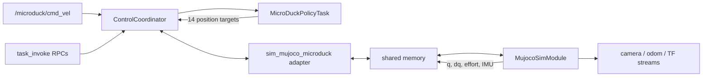

# MicroDuck MuJoCo simulation

> **Implementation status (2026-09-04): implemented, experimental simulation baseline.**
> This page is both the user-facing runbook and the high-level implementation
> contract for `microduck-sim`.

[MicroDuck](https://github.com/pollen-robotics/microduck) is Pollen Robotics'
approximately 25 cm, 800 g biped. Its locomotion and motions are produced by
small ONNX policies trained at 50 Hz in MuJoCo with
[microduck_rl](https://github.com/pollen-robotics/microduck_rl), which is built
on [mjlab](https://github.com/mujocolab/mjlab).

The first dimOS integration is simulation-only. It runs the official walking-mode
MJCF and policy set through `MujocoSimModule`, with one passive policy task owned
by `ControlCoordinator`. It does not connect to a physical MicroDuck.

In this document, **must** identifies an implementation or compatibility
requirement. Values copied from upstream are part of the policy ABI and must not
be tuned casually.

## What it supports

The initial `microduck-sim` blueprint exposes every motion in the official
non-roller policy set.

| Capability | `microduck-sim` requirement | Notes |
|---|---|---|
| Walk, reverse, strafe, turn | Required | Continuous trunk-frame `(vx, vy, yaw_rate)` command |
| Stand and get back up | Required | A near-zero or stale velocity command selects the standing/recovery policy |
| Joint-space head pose | Required | Four policy-space offsets: neck pitch, head pitch, head yaw, head roll |
| Look at a point | Required | Gaze IK for a point expressed in the trunk frame |
| Standing body pose | Required | Height, roll, and pitch; entering this mode stops locomotion |
| Sit and stand | Required | Idempotent posture request, not the upstream `sit_toggle` interface |
| Beak-to-floor / ground pick | Required | One 2.8 s phase-driven motion |
| Kick left or right | Required | One 0.5 s motion per side; the policy is ball-blind |
| Forward roll (`roulade`) | Required | One 1.0 s motion; repeated requests may chain it |
| Head camera, joint state, IMU, root pose | Required | Simulation streams; camera data is not a policy input |
| Roller locomotion and roller crouch | Deferred | Requires the wheel-equipped MJCF and a separate `microduck-roller-sim` blueprint |
| Swizzle, roller slope, roller stand-up, spin | Out of scope | Training tasks exist upstream, but these models are not in the official policy set |
| Mouth, quacks/voice, theremin, chorale | Out of scope | Separate hardware/runtime subsystems; the policies do not command the mouth |
| Physical camera, ToF, contact odometry | Out of scope | The first integration uses simulated sensors and ground-truth root pose |
| Runtime policy download/reload | Out of scope | V1 loads a pinned, bundled policy set only |
| Real robot control | Out of scope | A later hardware adapter requires a separate safety review |

The official robot has 15 physical servos. Every released alpha policy observes
and commands 14 joints; the mouth is deliberately excluded. The simulation must
therefore bind exactly 14 actuators and must not invent a fifteenth policy action.

## Run it

From a dimOS checkout, install the CPU inference and simulation dependencies:

```bash
uv sync --extra cpu --extra sim
```

Start the target blueprint with the normal viewer:

```bash
uv run dimos --simulation mujoco run microduck-sim
```

DimOS uses Zenoh by default. On macOS hosts where loopback-only Zenoh discovery
does not link the local worker processes, use network scouting consistently for
the run and any attached CLI:

```bash
uv run dimos --simulation mujoco --zenoh-scouting run microduck-sim
uv run dimos --zenoh-scouting shell
```

This changes transport discovery only; it does not change the MicroDuck stream
names or task contract. Using `--transport lcm` consistently is also supported.

Run it without a viewer and leave it in the background:

```bash
uv run dimos --simulation mujoco --viewer none run microduck-sim --daemon
uv run dimos status
uv run dimos log -f
```

On a headless Linux host, set the site's working MuJoCo OpenGL backend, commonly
`MUJOCO_GL=egl`, if off-screen rendering is enabled. Stop a foreground run with
Ctrl-C or a daemon with:

```bash
uv run dimos stop
```

The blueprint is simulation-only and pins `simulation="mujoco"`; the explicit
flag in these examples makes that choice visible. An explicitly selected
different simulator is rejected, and there is no real-hardware fallback.

### Drive with the keyboard

The blueprint's coordinator input is remapped to `cmd_vel`, so the existing
keyboard module can be composed at launch:

```bash
uv run dimos --simulation mujoco run microduck-sim keyboard-teleop \
  --keyboardteleop.linear-speed=0.20 \
  --keyboardteleop.angular-speed=0.60 \
  --keyboardteleop.boost-multiplier=1.50
```

Use W/S to move forward/backward, Q/E to strafe, and A/D to turn. Releasing the
keys publishes zero velocity. Space also publishes zero velocity; it is a motion
stop, not the coordinator's latched E-stop.

### Publish velocity commands

`/microduck/cmd_vel` carries `dimos.msgs.geometry_msgs.Twist`. Coordinates are
right-handed in the trunk frame: positive X is forward, positive Y is left, and
positive yaw turns left.

```bash
uv run dimos topic send /microduck/cmd_vel \
  'Twist(linear=[0.15, 0.0, 0.0], angular=[0.0, 0.0, 0.0])'
```

A single sample is useful for a short nudge and expires after at most 500 ms.
Continuous motion publishers should refresh at 10-50 Hz. The task clamps finite
stream values to the policy's trained envelope and drops non-finite messages:

| Axis | Accepted policy envelope |
|---|---:|
| Forward velocity `vx` | `[-0.4, 0.4] m/s` |
| Left velocity `vy` | `[-0.3, 0.3] m/s` |
| Left yaw rate `yaw_rate` | `[-1.0, 1.0] rad/s` |

Use `stop_motion` when an RPC caller needs to clear both the requested and
smoothed velocity immediately. It selects stand on the next policy tick unless
an already-running one-shot motion owns the scheduler.

### Use task commands

All task commands are reached through the existing `ControlCoordinator` RPC.
Open a second terminal:

```bash
uv run dimos shell  # add --zenoh-scouting when the run uses it
```

Then inspect and use the task:

```python skip
cc = app.get_module("ControlCoordinator")
print(cc.describe_task("microduck_policy"))
print(cc.task_invoke("microduck_policy", "get_status"))
print(cc.task_invoke("microduck_policy", "list_skills"))

# Head values are policy-space offsets from HOME, in radians.
cc.task_invoke(
    "microduck_policy",
    "set_head_pose",
    {"neck_pitch": 0.0, "head_pitch": -0.25, "head_yaw": 0.35, "head_roll": 0.0},
)

# Point the camera ahead-left. The point is in trunk-frame metres.
cc.task_invoke(
    "microduck_policy",
    "look_at",
    {"x": 1.0, "y": 0.3, "z": 0.0, "neck_pitch": 0.0},
)

# Lean while standing, then return to normal locomotion.
cc.task_invoke(
    "microduck_policy",
    "set_body_pose",
    {"z": -0.01, "roll": 0.10, "pitch": 0.0, "active": True},
)
cc.task_invoke(
    "microduck_policy",
    "set_body_pose",
    {"z": 0.0, "roll": 0.0, "pitch": 0.0, "active": False},
)

cc.task_invoke("microduck_policy", "set_posture", {"posture": "sit"})
cc.task_invoke("microduck_policy", "set_posture", {"posture": "stand"})

cc.task_invoke("microduck_policy", "run_skill", {"name": "ground_pick"})
cc.task_invoke("microduck_policy", "run_skill", {"name": "kick_left"})
cc.task_invoke("microduck_policy", "run_skill", {"name": "kick_right"})
cc.task_invoke("microduck_policy", "run_skill", {"name": "roulade"})
cc.task_invoke("microduck_policy", "stop_motion")
```

The simulation auto-arms. These coordinator-level calls remain the canonical
lifecycle and safety interface:

```python skip
cc.set_activated(False)  # calls disarm on declaring tasks
cc.set_activated(True)   # calls arm on declaring tasks

cc.set_estop(True)       # latch E-stop; task becomes inert within one tick
cc.set_estop(False)      # clear latch; task remains disarmed
cc.set_activated(True)   # explicit re-arm after an E-stop
```

Reset MuJoCo and policy history together. Disarming first prevents a policy tick
from writing an old target between the two reset calls:

```python skip
cc.set_activated(False)
app.get_module("MujocoSimModule").reset()
cc.reset_runtime_state(reactivate=True)
```

`stop_motion` is not an E-stop and must not interrupt a kick, ground pick, or
forward roll. `set_estop(True)` is the only command above that may cancel an
active motion immediately.

## Public runtime contract

The stable deployment names are:

| Item | Name |
|---|---|
| Blueprint | `microduck-sim` |
| Coordinator module instance | `ControlCoordinator` |
| Policy task type | `microduck_policy` |
| Policy task instance | `microduck_policy` |
| Hardware ID | `microduck` |
| Locomotion input | `/microduck/cmd_vel` (`Twist`) |
| Joint-state output | `/microduck/joints` (`JointState`) |
| IMU output | `/microduck/imu` (`Imu`) |
| Root-pose output | `/microduck/odom` (`PoseStamped`) |

The `MujocoSimModule` camera outputs must use `head_camera` and expose color,
depth, and camera-info streams using their standard dimOS message types. Exact
transport keys for those generic stream names are not part of the task RPC ABI.

V1 is a coordinator blueprint, not an agentic blueprint: it does not include
`McpServer`, `McpClient`, or an `@skill` container. In this page, a *skill* is an
upstream one-shot motion policy accepted by the task's `run_skill` command. A
later agentic blueprint may wrap those task commands without changing this ABI.

### Task card

The registry card must be equivalent to:

```python skip
TASK_CONSUMES = {
    "microduck_policy": {
        "twist_command": ("on_twist_command", "broadcast"),
    },
}

TASK_EXPOSES = {
    "microduck_policy": [
        "start",
        "arm",
        "disarm",
        "stop_motion",
        "set_head_pose",
        "look_at",
        "set_body_pose",
        "set_posture",
        "run_skill",
        "list_skills",
        "get_status",
        "reset_runtime_state",
    ],
}
```

`start` is declared because coordinator auto-start invokes it by name. `arm`,
`disarm`, and `reset_runtime_state` are declared so the coordinator's fan-out
RPCs can discover them. The task must implement `set_estop(estopped: bool)`, but
that method must not appear in `TASK_EXPOSES`: callers use the coordinator's
global E-stop rather than bypassing it for one task.

The stream handler must be
`on_twist_command(msg: Twist, t_now: float) -> bool`. The coordinator supplies
its monotonic dispatch time as `t_now`; the handler validates and clamps X, Y,
and yaw, records the command under the task lock, and returns whether it was
accepted. It must not run inference or write hardware.

There is deliberately no task `move` RPC. Locomotion is a continuously refreshed
stream with deadman behavior. There is also no synchronous `load_policy`,
`reload_policy`, or `set_drive_mode`: model loading can block the control tick,
and roller mode changes the physical model.

### Task command semantics

| Command | Required signature | Behavior |
|---|---|---|
| `start` | `start() -> None` | Activate the passive task, clear transient state, and auto-arm in this simulation blueprint |
| `arm` | `arm() -> IntentResult` | Idempotently enable policy output; start with zero twist |
| `disarm` | `disarm() -> IntentResult` | Idempotently stop policy output, clear pending motions and velocity |
| `stop_motion` | `stop_motion() -> IntentResult` | Clear requested and EMA twist; do not cancel a one-shot |
| `set_head_pose` | `set_head_pose(neck_pitch, head_pitch, head_yaw, head_roll) -> IntentResult` | Latch four finite offsets from HOME |
| `look_at` | `look_at(x, y, z, neck_pitch=0.0) -> LookResult` | Solve and latch head values for a trunk-frame point; closest reachable gaze is valid but marked clamped |
| `set_body_pose` | `set_body_pose(z=0.0, roll=0.0, pitch=0.0, active=True) -> IntentResult` | While active, force stand and track the pose; `active=False` clears it immediately |
| `set_posture` | `set_posture(posture) -> IntentResult` | Accept only `"sit"` or `"stand"`; repeated requests for the current posture succeed as no-ops |
| `run_skill` | `run_skill(name) -> IntentResult` | Start one available manifest-defined motion on the next tick |
| `list_skills` | `list_skills() -> list[SkillInfo]` | Return exactly the names accepted by `run_skill` and their manifest metadata |
| `get_status` | `get_status() -> MicroDuckStatus` | Return a lock-consistent, JSON-serializable snapshot without running inference |
| `reset_runtime_state` | `reset_runtime_state(reactivate=None) -> bool` | Clear policy/action/filter/timer state after a sim discontinuity and optionally re-arm |

Direct head requests must stay within the trained offset ranges: neck pitch and
head pitch `[-1.10, 1.10] rad`, head yaw `[-1.40, 1.40] rad`, and head roll
`[-0.31, 0.31] rad`. Body pose must stay within `z [-0.025, 0.010] m` and roll
and pitch `[-0.26, 0.26] rad`. RPC values outside these envelopes or any
non-finite value must be refused with a reason, not silently accepted.

Every externally returned record must serialize to these JSON shapes:

```text
IntentResult = {
  "accepted": bool,
  "reason": str | null
}

LookResult = {
  "accepted": bool,
  "reason": str | null,
  "clamped": bool,
  "head": {
    "neck_pitch": float,
    "head_pitch": float,
    "head_yaw": float,
    "head_roll": float
  }
}

SkillInfo = {
  "name": str,
  "duration_s": float,
  "chainable": bool,
  "required_mode": "walk"
}

MicroDuckStatus = {
  "active": bool,
  "armed": bool,
  "estopped": bool,
  "busy": bool,
  "current_policy": str | null,
  "posture": "standing" | "sitting" | "rising" | "unknown",
  "active_skill": str | null,
  "available_skills": list[str],
  "applied_twist": {"vx": float, "vy": float, "yaw_rate": float},
  "command_age_s": float | null,
  "last_error": str | null
}
```

`run_skill` must refuse an unknown skill, an unavailable model, an unarmed or
E-stopped task, a non-standing posture, or another active non-chainable motion.
A repeat request for the active chainable `roulade` refreshes its upstream-compatible
150 ms chain window. There is no ordinary mid-motion cancel in V1. New intents
must only update locked task state; policy selection and transitions occur in
`compute()` on the coordinator tick.

`list_skills()` for the walking blueprint must report:

| Name | Duration | Chainable |
|---|---:|---:|
| `ground_pick` | 2.8 s | No |
| `kick_left` | 0.5 s | No |
| `kick_right` | 0.5 s | No |
| `roulade` | 1.0 s | Yes |

Sit/stand is intentionally absent from this list because its retry-safe public
interface is `set_posture`, not a toggle or generic skill name.

## Architecture



`MujocoSimModule` is the sole owner of MuJoCo and its physics thread. The
whole-body adapter only translates shared-memory state and commands. The policy
task owns every ONNX session and all state shared across policies, but remains a
passive `ControlTask`: it creates no thread, reads only `CoordinatorState`, and
returns a `JointCommandOutput`.

The task must claim all 14 canonical joints at priority 50 in
`ControlMode.SERVO_POSITION`. No code in the task may write to the adapter or
MuJoCo directly. All timing inside the task must use `CoordinatorState.t_now`
and `CoordinatorState.dt`, never a wall clock.

### Scheduler

On each 50 Hz task tick, policy ownership is selected in this order:

1. An active manifest-defined one-shot (`roulade`, then kicks by manifest order).
2. Ground pick.
3. Sit or rise through the sit/stand policy.
4. Stand/recover when body-pose mode is active, the velocity command is stale,
   or the applied twist magnitude is at most `0.05`.
5. Walk otherwise.

While a kick or roulade runs, all 13 command slots are zero. Ground pick writes
`[cos(2*pi*phase), sin(2*pi*phase), 0]` into the twist slots, advances phase by
`dt / 4.0`, and hands back at phase `0.7`. Sit uses posture flag `twist.vx=1`;
rise uses `twist.vx=0`. Head and body commands remain live during sit/rise, as
they do upstream.

The task must preserve the previous raw action and previous filtered joint target
across ordinary policy switches. Loading each model in an independent stateless
controller would break the observation and transition behavior. Disarm, E-stop,
and `reset_runtime_state` clear this shared history.

## Policy ABI

All official models in this integration are float32 ONNX graphs with one
`[1, 61]` input and one `[1, 14]` output. Model input/output names must be
discovered from the session rather than hardcoded. At startup, the implementation
must validate the manifest, tensor shapes, and finite output on a discarded
warm-up inference before activating the task.

### Joint and action order

| Index | Joint | HOME (rad) |
|---:|---|---:|
| 0 | `left_hip_yaw` | `0.0000` |
| 1 | `left_hip_roll` | `-0.0873` |
| 2 | `left_hip_pitch` | `-0.4579` |
| 3 | `left_knee` | `-0.0049` |
| 4 | `left_ankle` | `0.4530` |
| 5 | `neck_pitch` | `0.3491` |
| 6 | `head_pitch` | `0.3491` |
| 7 | `head_yaw` | `0.0000` |
| 8 | `head_roll` | `0.0000` |
| 9 | `right_hip_yaw` | `0.0000` |
| 10 | `right_hip_roll` | `0.0873` |
| 11 | `right_hip_pitch` | `0.4579` |
| 12 | `right_knee` | `0.0049` |
| 13 | `right_ankle` | `-0.4530` |

Canonical coordinator names prefix each value with `microduck/`; MJCF joint and
actuator names use the unprefixed names above. Position targets are:

```text
target[i] = HOME[i] + action_scale * raw_action[i]
```

The previous-action observation stores `raw_action`, before scale, target
filtering, or joint-limit clamping.

### Observation layout

| Slice | Width | Value |
|---|---:|---|
| `0:3` | 3 | Gyroscope in trunk frame, rad/s |
| `3:6` | 3 | World gravity `[0, 0, -1]` rotated into the trunk frame |
| `6:20` | 14 | Joint position minus HOME, in policy order |
| `20:34` | 14 | Joint velocity, in policy order, rad/s |
| `34:48` | 14 | Previous raw policy action |
| `48:61` | 13 | Command block |

The command block is exactly:

| Observation slice | Value |
|---|---|
| `48:51` | `vx`, `vy`, `yaw_rate` |
| `51:55` | `neck_pitch`, `head_pitch`, `head_yaw`, `head_roll` |
| `55:57` | Body X and Y, always zero |
| `57` | Body Z offset |
| `58` | Body roll |
| `59` | Body pitch |
| `60` | Body yaw, always zero |

Head commands are inputs to the policy and must not also be added to its output.
Body X, Y, and yaw are unbound in training and must remain zero.

### Timing and filtering

| Setting | Required default |
|---|---:|
| Coordinator and policy tick | 50 Hz |
| MuJoCo physics timestep | 0.005 s (200 Hz) |
| Policy decimation | 1 coordinator tick; approximately 4 physics steps per target |
| Velocity deadman | 0.500 s |
| Stand selection threshold | Euclidean twist norm `<= 0.05` |
| Twist, head-command, body-command EMA | `state += 0.2 * (target - state)` per policy tick |
| Walking action scale | `0.9` |
| Standing action scale | `1.0` |
| Head target low-pass, indices 5-8 | `filtered = 0.5 * new + 0.5 * previous` |
| Leg target low-pass, other ten joints | `filtered = 0.7 * new + 0.3 * previous` |

Per-policy `action_scale`, durations, command encodings, and chaining flags in
the manifest override a fallback only where the schema permits. Final targets
must be finite and constrained to the matching MJCF joint ranges.

## MuJoCo contract

The bundled walking scene is derived from
`microduck_rl/src/mjlab_microduck/robot/microduck/scene.xml`, which includes
`robot_groundcontact.xml` and its `assets/` meshes. The bundled scene must set
`option.timestep` to `0.005` explicitly, matching upstream training and
`infer_policy.py`; MuJoCo's implicit 0.002 s default is not acceptable here.

`MujocoSimModule` must be configured with:

- `dof=14`, reset positions equal to HOME, and root spawn height `0.125 m`;
- camera `head_camera` with base frame `trunk_base`;
- floating root body `trunk_base` and free joint `trunk_base_freejoint`;
- quaternion sensor `orientation`, gyro preference `imu_ang_vel` then
  `angular-velocity`, and accelerometer `imu_accel`;
- a `RobotSimSpec` that explicitly lists the 14 joints and 14 same-named
  actuators, and requires both the floating base and IMU.

The official policies were trained with the BAM M6 model of the XL330 actuator,
including voltage behavior, friction, delays, and domain randomization. V1 must
instead use the MJCF's native `<position>` actuators through the existing shared
memory position-command mode. The `sim_mujoco_microduck` whole-body adapter must
read motor/IMU state from shared memory and forward each `MotorCommand.q` as a
native position target; it must not route MicroDuck through G1's PD-plus-torque
mode.

This native-actuator path is a functional integration baseline, equivalent in
scope to upstream `infer_policy.py --no-bam`. It is not a sim-to-real fidelity
claim. In particular, V1 cannot reproduce the real runtime's variable gain or
standing gain ratio. Existing G1 simulation behavior must remain unchanged.

## Assets and authoritative sources

The repositories below are authoritative for different parts of the integration.
The revisions are the ones reviewed for this specification.

| Source | Responsibility | Reviewed revision |
|---|---|---|
| [pollen-robotics/microduck](https://github.com/pollen-robotics/microduck/tree/bc41fb5c9a9b39894669c1e022e375cf83800382) | On-robot runtime, intent semantics, scheduler, safety defaults, gaze IK | `bc41fb5c9a9b39894669c1e022e375cf83800382` |
| [pollen-robotics/microduck_rl](https://github.com/pollen-robotics/microduck_rl/tree/29e887ecfbf5d37144759e5a9f8a176dfb83d547) | MJCF/assets, training environments, observation/action ABI, inference reference | `29e887ecfbf5d37144759e5a9f8a176dfb83d547` |
| [mujocolab/mjlab](https://github.com/mujocolab/mjlab/tree/8ee51fbcf806a7419189f706d9e394cbeb7790fa) | Training framework used by `microduck_rl` | `8ee51fbcf806a7419189f706d9e394cbeb7790fa` |
| [pollen-robotics/microduck-policies](https://huggingface.co/pollen-robotics/microduck-policies/tree/088524a64e2557dc453256b6071dbb9d23888802) | Official deployable ONNX files and schema-2 manifest | `088524a64e2557dc453256b6071dbb9d23888802` |

These sources declare Apache-2.0 licensing. The implementation must retain
applicable license and provenance notices for copied assets or ported code.
`mjlab` is a training-time source, not a dimOS runtime dependency.

The runtime must not import from developer clones or require these repositories
to be checked out. Bundle only the required walking-mode scene, referenced
meshes, seven non-roller ONNX files, manifest, licenses/notices, and a provenance
file in `data/.lfs/microduck.tar.gz`. Resolve it at runtime with
`LfsPath("microduck")`. The provenance file must include the source URLs,
revisions above, and SHA-256 digests of copied files.

## Required implementation pieces

The implementation should remain small and follow existing registry boundaries:

| Piece | Responsibility |
|---|---|
| `dimos/control/tasks/microduck_policy_task/` | Passive policy task, manifest parsing, scheduler, head IK, status, and task card |
| `dimos/simulation/adapters/whole_body/microduck.py` | 14-DOF shared-memory whole-body adapter using native position mode |
| `dimos/simulation/adapters/whole_body/_registry.py` | Lazy `sim_mujoco_microduck` adapter registration |
| `dimos/robot/pollen/microduck/` | Joint constants, `RobotSimSpec`, and `microduck-sim` blueprint |
| `data/.lfs/microduck.tar.gz` | Reproducible MJCF, meshes, policies, manifest, licenses, provenance |
| Co-located tests | ABI, scheduler, adapter, blueprint, and MuJoCo smoke coverage |

The blueprint must set `instance_name="ControlCoordinator"`, configure one
`HardwareComponent` of type `WHOLE_BODY`, auto-start the policy task, publish the
per-robot joint view, and register the built-in blueprint through the generated
registry workflow. The full upstream repositories must not be added as
submodules or Python dependencies.

## Failure and safety behavior

- A missing asset, manifest mismatch, wrong ONNX shape, missing MJCF binding, or
  failed warm-up must fail blueprint startup with the offending file and
  expected/actual value in the error.
- A runtime inference exception or non-finite observation/action/target must
  disarm the task, stop producing new targets, and retain a useful `last_error`.
- The task must ignore twist received while disarmed or E-stopped so re-arming
  cannot resume an old movement command.
- E-stop must clear velocity, body-pose mode, posture transitions, active skills,
  and policy history within one coordinator tick. Clearing E-stop does not arm.
- Ordinary command handlers must be lock-safe and non-blocking. ONNX sessions,
  files, and network resources must never be loaded from `compute()`.
- A missing or partial first state sample must produce no policy command; zeros
  must not be substituted for unknown joint state.

These are software safety semantics for a simulator. They are not sufficient for
physical hardware certification.

## Acceptance criteria

The feature is complete only when all of the following are true:

1. `dimos list` contains `microduck-sim`, and the documented foreground,
   headless, keyboard, shell, and stop commands work from a clean checkout.
2. Registry tests discover `microduck_policy`, its stream binding, every declared
   command, and `sim_mujoco_microduck` without eagerly importing ONNX or MuJoCo.
3. Unit tests pin all 61 observation indices, 14 joint/action indices, HOME,
   raw previous-action feedback, command zero-padding, scale selection, filters,
   deadman, scheduler priority, refusal reasons, idempotent posture, and reset.
4. Every bundled ONNX file validates as `[1,61] -> [1,14]` and produces finite
   output for a plausible state. Manifest names, durations, mode, and chaining
   are tested rather than duplicated as an unchecked second source of truth.
5. A binding test loads the actual bundled MJCF through `RobotSimSpec` and proves
   the exact root, sensors, joint order, actuator order, and native position mode.
6. A headless MuJoCo smoke run remains finite for at least 60 simulated seconds;
   zero twist selects stand, bounded nonzero twist selects walk and changes root
   pose, and command timeout returns to stand.
7. Each required one-shot can run in the official ground-contact scene, reports
   busy state for its window, and hands back to stand without stale command data.
8. Sit/stand, body pose, head pose, gaze clamping, E-stop/re-arm, and the paired
   simulator/task reset sequence are covered by integration tests.
9. Existing `MujocoSimModule`, G1 adapter, control coordinator, and blueprint
   tests remain green; focused tests and mypy pass before the full test suite.

Suggested final verification commands are:

```bash
uv run pytest dimos/control/tasks/microduck_policy_task \
  dimos/simulation/adapters/whole_body \
  dimos/robot/pollen/microduck -v
uv run pytest -m mujoco dimos/robot/pollen/microduck -v
uv run pytest dimos/robot/test_all_blueprints_generation.py
uv run mypy dimos/control/tasks/microduck_policy_task \
  dimos/simulation/adapters/whole_body/microduck.py \
  dimos/robot/pollen/microduck
uv run pytest
```

Passing unit tests alone does not establish that the native-actuator simulation
reproduces the published motions. The feature must stay labeled experimental
until the visual and headless behavior checks above have been recorded.
