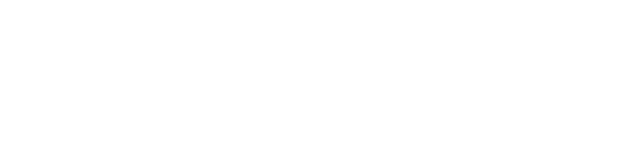
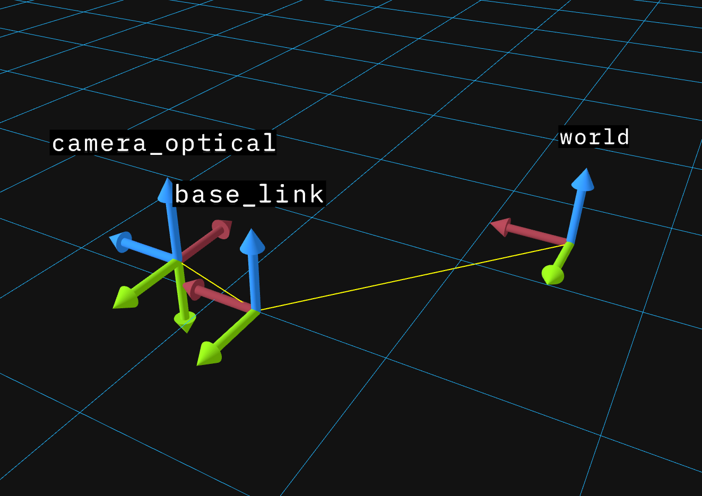
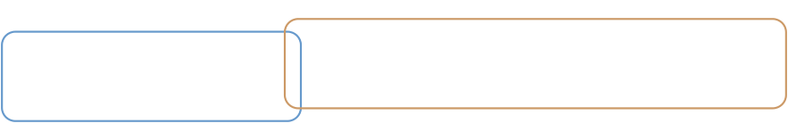

# Transforms

## The Problem: Everything Measures from Its Own Perspective

Imagine your robot has an RGB-D camera, which captures both color images and depth (distance to each pixel). These are common in robotics: Intel RealSense, Microsoft Kinect, and similar sensors.

The camera spots a coffee mug at pixel (320, 240), and the depth sensor says it's 1.2 meters away. You want the robot arm to pick it up. But the arm doesn't understand pixels or camera-relative distances. It needs coordinates in its own workspace: "move to position (0.8, 0.3, 0.1) meters from my base."

To convert camera measurements to arm coordinates, you need to know:
- The camera's intrinsic parameters (focal length, sensor size) to convert pixels to a 3D direction
- The depth value to get the full 3D position relative to the camera
- Where the camera is mounted relative to the arm, and at what angle

This chain of conversions is what **transforms** handle: (pixels + depth) → 3D point in camera frame → robot coordinates.

<details>
<summary>diagram source</summary>

```pikchr fold output=assets/transforms_tree.svg
color = white
fill = none

# Root (left side)
W: box "world" rad 5px fit wid 170% ht 170%
arrow right 0.4in
RB: box "robot_base" rad 5px fit wid 170% ht 170%

# Camera branch (top)
arrow from RB.e right 0.3in then up 0.4in then right 0.3in
CL: box "camera_link" rad 5px fit wid 170% ht 170%
arrow right 0.4in
CO: box "camera_optical" rad 5px fit wid 170% ht 170%
text "mug here" small italic at (CO.s.x, CO.s.y - 0.25in)

# Arm branch (bottom)
arrow from RB.e right 0.3in then down 0.4in then right 0.3in
AB: box "arm_base" rad 5px fit wid 170% ht 170%
arrow right 0.4in
GR: box "gripper" rad 5px fit wid 170% ht 170%
text "target here" small italic at (GR.s.x, GR.s.y - 0.25in)
```

</details>



Each arrow in this tree is a transform. To get the mug's position in gripper coordinates, you chain transforms through their common parent: camera → robot_base → arm → gripper.

## What's a Coordinate Frame?

A **coordinate frame** is simply a point of view: an origin point and a set of axes (X, Y, Z) from which you measure positions and orientations.

Think of it like giving directions:
- **GPS** says you're at 37.7749° N, 122.4194° W
- The **coffee shop floor plan** says "table 5 is 3 meters from the entrance"
- Your **friend** says "I'm two tables to your left"

These all describe positions in the same physical space, but from different reference points. Each is a coordinate frame.

In a robot:
- The **camera** measures in pixels, or in meters relative to its lens
- The **LIDAR** measures distances from its own mounting point
- The **robot arm** thinks in terms of its base or end-effector position
- The **world** has a fixed coordinate system everything lives in

Each sensor, joint, and reference point has its own frame.

## Generated Transform Values

A generated `Transform` contains translation and rotation. `TransformStamped` adds the parent frame, child frame and source timestamp. External [geometry helpers](/dimos/msgs/geometry.py) perform composition, inversion and matrix conversion:

- `header.frame_id` - The parent frame name
- `child_frame_id` - The child frame name
- `transform.translation` - A `Vector3` (x, y, z) offset
- `transform.rotation` - A `Quaternion` (x, y, z, w) orientation
- `header.stamp` - Integer `sec` and `nanosec` for temporal lookups

```python
from dimos_generated.geometry_msgs.msg import TransformStamped
from dimos_generated.std_msgs.msg import Header
from dimos_generated.builtin_interfaces.msg import Time
from dimos.msgs.geometry import compose_transforms, inverse_transform, transform_matrix
from dimos.msgs.time import time_from_seconds
from dimos_generated.geometry_msgs.msg import Quaternion
from dimos_generated.geometry_msgs.msg import Transform
from dimos_generated.geometry_msgs.msg import Vector3
camera_transform = TransformStamped(header=Header(stamp=Time(sec=0, nanosec=0), frame_id='base_link'), child_frame_id='camera_link', transform=Transform(translation=Vector3(x=0.5, y=0.0, z=0.3), rotation=Quaternion(x=0.0, y=0.0, z=0.0, w=1.0)))
print(camera_transform)
```

```results
<dimos_generated.geometry_msgs.msg.TransformStamped object at 0x7f36722d71d0>
```

### Transform Operations

Transforms can be composed and inverted:

```python
from dimos_generated.geometry_msgs.msg import TransformStamped
from dimos_generated.std_msgs.msg import Header
from dimos_generated.builtin_interfaces.msg import Time
from dimos.msgs.geometry import compose_transforms, inverse_transform, transform_matrix
from dimos.msgs.time import time_from_seconds
from dimos_generated.geometry_msgs.msg import Quaternion
from dimos_generated.geometry_msgs.msg import Transform
from dimos_generated.geometry_msgs.msg import Vector3
t1 = TransformStamped(header=Header(stamp=Time(sec=0, nanosec=0), frame_id='base_link'), child_frame_id='camera_link', transform=Transform(translation=Vector3(x=1.0, y=0.0, z=0.0), rotation=Quaternion(x=0.0, y=0.0, z=0.0, w=1.0)))
t2 = TransformStamped(header=Header(stamp=Time(sec=0, nanosec=0), frame_id='camera_link'), child_frame_id='end_effector', transform=Transform(translation=Vector3(x=0.0, y=0.5, z=0.0), rotation=Quaternion(x=0.0, y=0.0, z=0.0, w=1.0)))
t3 = compose_transforms(t1, t2)
print(f'Composed: {t3.header.frame_id} -> {t3.child_frame_id}')
print(f'Translation: ({t3.transform.translation.x}, {t3.transform.translation.y}, {t3.transform.translation.z})')
t_inverse = inverse_transform(t1)
print(f'Inverse: {t_inverse.header.frame_id} -> {t_inverse.child_frame_id}')
```

```results
Composed: base_link -> end_effector
Translation: (1.0, 0.5, 0.0)
Inverse: camera_link -> base_link
```

### Converting to Matrix Form

For integration with libraries like NumPy or OpenCV:

```python
from dimos_generated.geometry_msgs.msg import TransformStamped
from dimos_generated.std_msgs.msg import Header
from dimos_generated.builtin_interfaces.msg import Time
from dimos.msgs.geometry import compose_transforms, inverse_transform, transform_matrix
from dimos.msgs.time import time_from_seconds
from dimos_generated.geometry_msgs.msg import Quaternion
from dimos_generated.geometry_msgs.msg import Transform
from dimos_generated.geometry_msgs.msg import Vector3
t = Transform(translation=Vector3(x=1.0, y=2.0, z=3.0), rotation=Quaternion(x=0.0, y=0.0, z=0.0, w=1.0))
matrix = transform_matrix(t)
print('4x4 transformation matrix:')
print(matrix)
```

```results
4x4 transformation matrix:
[[1. 0. 0. 1.]
 [0. 1. 0. 2.]
 [0. 0. 1. 3.]
 [0. 0. 0. 1.]]
```

## Frame IDs in Modules

Modules in dimOS automatically get a `frame_id` property. This is controlled by two config options in [`core/module.py`](/dimos/core/module.py#L78):

- `frame_id` - The base frame name (defaults to the class name)
- `frame_id_prefix` - Optional prefix for namespacing

```python
from dimos.core.module import Module, ModuleConfig

class MyModuleConfig(ModuleConfig):
    frame_id: str = "sensor_link"
    frame_id_prefix: str | None = None

class MySensorModule(Module):
    config: MyModuleConfig

# With default config:
sensor = MySensorModule()
print(f"Default frame_id: {sensor.frame_id}")

# With prefix (useful for multi-robot scenarios):
sensor2 = MySensorModule(frame_id_prefix="robot1")
print(f"With prefix: {sensor2.frame_id}")
```

```results
2026-09-30T20:07:50.481506Z  INFO ThreadId(01) zenoh::net::runtime: Using ZID: 690930ce279005bc5b48266acca01f49
2026-09-30T20:07:50.481921Z  INFO ThreadId(01) zenoh::net::runtime::orchestrator: Zenoh can be reached at: tcp/127.0.0.1:40035
2026-09-30T20:07:50.482081Z  INFO ThreadId(01) zenoh::net::runtime::orchestrator: Listening scout messages on 224.0.0.224:7446
20:07:50.983 [inf][otocol/service/zenohservice.py] Zenoh session opened connect=[] gossip=True listen=['tcp/127.0.0.1:0'] mode=peer multicast_interface=lo
Default frame_id: sensor_link
With prefix: robot1/sensor_link
2026-09-30T20:07:50.989961Z  INFO ThreadId(01) zenoh::api::session: close session zid=690930ce279005bc5b48266acca01f49
```

## The tf Topic

Transforms travel on an ordinary stream named `tf` carrying [`TFMessage`](/dimos/message_codegen/schemas/tf2_msgs/msg/TFMessage.msg)s. A module declares the port like any other stream, choosing the direction it actually uses:

- `tf: Out[TFMessage]`: publishes transforms
- `tf: In[TFMessage]`: consumes transforms
- `tf: IO[TFMessage]`: both, on the same topic

The coordinator wires every port named `tf` onto one shared `/tf` transport, so all modules see one transform tree.

For lookups, use `self.tfbuffer`, a lazy [`TF`](/dimos/protocol/tf/tf.py) buffer view over the module's `tf` port that subscribes to the stream, buffers what it sees, and answers `get()` queries (including chained and inverse lookups). It is built on first touch and disposed with the module. Outside modules, construct the view explicitly: `TF(stream)` accepts any port or raw transport.

### Multi-Module Transform Example

This example demonstrates how multiple modules publish and receive transforms. Three modules work together:

1. **RobotBaseModule** - Publishes `world -> base_link` (robot's position in the world)
2. **CameraModule** - Publishes `base_link -> camera_link` (camera mounting position) and `camera_link -> camera_optical` (optical frame convention)
3. **PerceptionModule** - Looks up transforms between any frames

```python skip ansi=false
from dimos_generated.geometry_msgs.msg import TransformStamped
from dimos_generated.std_msgs.msg import Header
from dimos_generated.builtin_interfaces.msg import Time
from dimos.msgs.geometry import compose_transforms, inverse_transform, transform_matrix
from dimos.msgs.time import time_from_seconds
import time
import reactivex as rx
from dimos.core.core import rpc
from dimos.core.module import Module
from dimos.core.stream import In, Out
from dimos.core.coordination.blueprints import autoconnect
from dimos.core.coordination.module_coordinator import ModuleCoordinator
from dimos_generated.geometry_msgs.msg import Quaternion
from dimos_generated.geometry_msgs.msg import Transform
from dimos_generated.geometry_msgs.msg import Vector3
from dimos_generated.tf2_msgs.msg import TFMessage

class RobotBaseModule(Module):
    """Publishes the robot's position in the world frame at 10Hz."""
    tf: Out[TFMessage]

    @rpc
    def start(self) -> None:
        super().start()

        def publish_pose(_):
            robot_pose = TransformStamped(header=Header(frame_id='world', stamp=time_from_seconds(time.time())), child_frame_id='base_link', transform=Transform(translation=Vector3(x=2.5, y=3.0, z=0.0), rotation=Quaternion(x=0.0, y=0.0, z=0.0, w=1.0)))
            self.tf.publish(TFMessage(transforms=[robot_pose]))
        self.register_disposable(rx.interval(0.1).subscribe(publish_pose))

class CameraModule(Module):
    """Publishes camera transforms at 10Hz."""
    tf: Out[TFMessage]

    @rpc
    def start(self) -> None:
        super().start()

        def publish_transforms(_):
            camera_mount = TransformStamped(header=Header(frame_id='base_link', stamp=time_from_seconds(time.time())), child_frame_id='camera_link', transform=Transform(translation=Vector3(x=1.0, y=0.0, z=0.3), rotation=Quaternion(x=0.0, y=0.0, z=0.0, w=1.0)))
            optical_frame = TransformStamped(header=Header(frame_id='camera_link', stamp=time_from_seconds(time.time())), child_frame_id='camera_optical', transform=Transform(translation=Vector3(x=0.0, y=0.0, z=0.0), rotation=Quaternion(x=-0.5, y=0.5, z=-0.5, w=0.5)))
            self.tf.publish(TFMessage(transforms=[camera_mount, optical_frame]))
        self.register_disposable(rx.interval(0.1).subscribe(publish_transforms))

class PerceptionModule(Module):
    """Receives transforms and performs lookups."""
    tf: In[TFMessage]

    @rpc
    def lookup(self) -> None:
        print(self.tfbuffer)
        direct = self.tfbuffer.get('world', 'base_link')
        print(f'Direct: robot is at ({direct.transform.translation.x}, {direct.transform.translation.y})m in world\n')
        chained = self.tfbuffer.get('world', 'camera_optical')
        print(f'Chained: {chained}\n')
        inverse = self.tfbuffer.get('camera_optical', 'world')
        print(f'Inverse: {inverse}\n')
        print('Transform tree:')
        print(self.tfbuffer.graph())
if __name__ == '__main__':
    dimos = ModuleCoordinator.build(autoconnect(RobotBaseModule.blueprint(), CameraModule.blueprint(), PerceptionModule.blueprint()))
    time.sleep(2.5)
    dimos.get_instance(PerceptionModule).lookup()
    dimos.stop()
```

```results
16:21:45.203 [inf][ation/worker_manager_python.py] Worker pool started. n_workers=2
16:21:45.445 [inf][/coordination/python_worker.py] Deployed module. module=RobotBaseModule module_id=0 worker_id=0
16:21:45.451 [inf][/coordination/python_worker.py] Deployed module. module=CameraModule module_id=1 worker_id=1
16:21:45.452 [inf][/coordination/python_worker.py] Deployed module. module=PerceptionModule module_id=2 worker_id=0
16:21:47.968 [inf][dination/module_coordinator.py] Stopping module... module=PerceptionModule
16:21:48.022 [inf][dination/module_coordinator.py] Module stopped. module=PerceptionModule
16:21:48.022 [inf][dination/module_coordinator.py] Stopping module... module=CameraModule
16:21:48.041 [inf][dination/module_coordinator.py] Module stopped. module=CameraModule
16:21:48.041 [inf][dination/module_coordinator.py] Stopping module... module=RobotBaseModule
16:21:48.062 [inf][dination/module_coordinator.py] Module stopped. module=RobotBaseModule
16:21:48.062 [inf][ation/worker_manager_python.py] Shutting down all workers...
16:21:48.062 [inf][/coordination/python_worker.py] Worker stopping module... module=CameraModule module_id=1 worker_id=1
16:21:48.063 [inf][/coordination/python_worker.py] Worker module stopped. module=CameraModule module_id=1 worker_id=1
TF(3 buffers):
  TBuffer(base_link -> camera_link, 24 msgs, 2.37s [2026-04-21 01:21:45 - 2026-04-21 01:21:47])
  TBuffer(camera_link -> camera_optical, 24 msgs, 2.37s [2026-04-21 01:21:45 - 2026-04-21 01:21:47])
  TBuffer(world -> base_link, 24 msgs, 2.37s [2026-04-21 01:21:45 - 2026-04-21 01:21:47])
Direct: robot is at (2.5, 3.0)m in world

Chained: world -> camera_optical
  Translation: → Vector Vector([3.5 3.  0.3])
  Rotation: Quaternion(-0.500000, 0.500000, -0.500000, 0.500000)

Inverse: camera_optical -> world
  Translation: → Vector Vector([ 3.   0.3 -3.5])
  Rotation: Quaternion(0.500000, -0.500000, 0.500000, 0.500000)

Transform tree:
┌─────┐
│world│
└┬────┘
┌▽────────┐
│base_link│
└┬────────┘
┌▽──────────┐
│camera_link│
└┬──────────┘
┌▽─────────────┐
│camera_optical│
└──────────────┘
```


You can view these transforms in 3D using the Rerun viewer (see [Visualization](/docs/usage/visualization.md)).



Key points:

- **One shared topic**: every `tf` port is autoconnected onto the same `/tf` transport
- **Chained lookups**: TF finds paths through the tree automatically
- **Inverse lookups**: Request transforms in either direction
- **Temporal buffering**: Transforms are timestamped and buffered (default 10s) for sensor fusion

The transform tree from the example above, showing which module publishes each transform:

<details>
<summary>diagram source</summary>

```pikchr fold output=assets/transforms_modules.svg
color = white
fill = none

# Frame boxes
W: box "world" rad 5px fit wid 170% ht 170%
A1: arrow right 0.4in
BL: box "base_link" rad 5px fit wid 170% ht 170%
A2: arrow right 0.4in
CL: box "camera_link" rad 5px fit wid 170% ht 170%
A3: arrow right 0.4in
CO: box "camera_optical" rad 5px fit wid 170% ht 170%

# RobotBaseModule box - encompasses world->base_link
box width (BL.e.x - W.w.x + 0.15in) height 0.7in \
    at ((W.w.x + BL.e.x)/2, W.y - 0.05in) \
    rad 10px color 0x6699cc fill none
text "RobotBaseModule" italic at ((W.x + BL.x)/2, W.n.y + 0.25in)

# CameraModule box - encompasses camera_link->camera_optical (starts after base_link)
box width (CO.e.x - BL.e.x + 0.1in) height 0.7in \
    at ((BL.e.x + CO.e.x)/2, CL.y + 0.05in) \
    rad 10px color 0xcc9966 fill none
text "CameraModule" italic at ((CL.x + CO.x)/2, CL.s.y - 0.25in)
```

</details>



## Internals

## Transform Buffer

`TF` is a thin subscription layer over `MultiTBuffer`, a standalone class that maintains a temporal buffer of transforms (default 10 seconds) allowing queries at past timestamps. You can use it directly:

```python
import time

from dimos_generated.geometry_msgs.msg import Quaternion, Transform, TransformStamped, Vector3
from dimos_generated.std_msgs.msg import Header
from dimos_generated.builtin_interfaces.msg import Time
from dimos.msgs.time import time_from_nanoseconds
from dimos.protocol.tf.tf import MultiTBuffer

tf = MultiTBuffer()

# Simulate transforms at different times
for i in range(5):
    t = TransformStamped(
        header=Header(
            stamp=time_from_nanoseconds(time.time_ns() + i * 100_000_000),
            frame_id="base_link",
        ),
        child_frame_id="camera_link",
        transform=Transform(
            translation=Vector3(x=float(i), y=0.0, z=0.0), rotation=Quaternion(x=0.0, y=0.0, z=0.0, w=1.0)
        ),
    )
    tf.receive_transform(t)

# Query the latest transform
result = tf.get("base_link", "camera_link")
print(f"Latest transform: x={result.transform.translation.x}")
print(f"Buffer has {len(tf.buffers)} transform pair(s)")
print(tf)
```

```results
Latest transform: x=4.0
Buffer has 1 transform pair(s)
MultiTBuffer(1 buffers):
  TBuffer(base_link -> camera_link, 5 msgs, 0.40s [2026-09-30 13:07:51 - 2026-09-30 13:07:51])
```

This is essential for sensor fusion where you need to know where the camera was when an image was captured, not where it is now.

## Further Reading

For a visual introduction to transforms and coordinate frames:
- [Coordinate Transforms (YouTube)](https://www.youtube.com/watch?v=NGPn9nvLPmg)

For the mathematical foundations, the ROS documentation provides detailed background:

- [ROS tf2 Concepts](http://wiki.ros.org/tf2)
- [ROS REP 103 - Standard Units and Coordinate Conventions](https://www.ros.org/reps/rep-0103.html)
- [ROS REP 105 - Coordinate Frames for Mobile Platforms](https://www.ros.org/reps/rep-0105.html)

See also:
- [Modules](/docs/usage/modules.md) for understanding the module system
- [Configuration](/docs/usage/configuration.md) for module configuration patterns
