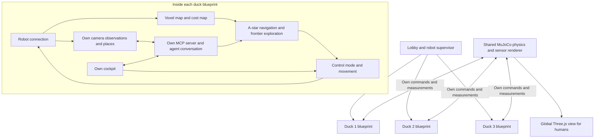

# Independent ducks — 2026-09-05

This is the previous checkpoint. See [the football club iteration](football-club.md)
for the current six-player roster, common prior knowledge and scene layout.

There are three robot identities: Duck 1 is the host; Duck 2 and Duck 3 are visitor
slots. Each runs the same independently built DimOS robot blueprint in its own
process tree. They share one MuJoCo physics world. Observers do not occupy a slot.

Every new visitor starts idle with no supplied room names, object names or previous
visitor knowledge. Sensors immediately build a local map of visible surfaces;
movement and exploration wait for user instructions. Select Agent mode and ask
“explore the space”, “stop exploring”, “what can you see?” or “remember this place”.
Duck 1 keeps the apartment's supplied room and landmark annotations.

The home page offers three explicit character choices and a spectator option.
Duck 1 is white, Duck 2 teal and Duck 3 violet; these shell colors are applied in
MuJoCo and exported to the human Three.js view. Existing robot meshes are reused.
Duck 1 shows “Map loaded”; Ducks 2 and 3 show “No previous map”. The spectator card and
world overview display room labels and live duck positions for humans only.
All three choices have exclusive control slots. “Leave duck” returns to the lobby;
“Back to lobby” lets a spectator choose a duck. `?host` remains a Duck 1 shortcut,
and cannot displace another controller.

## Composition

`robot_blueprint.py` composes standard DimOS mapping, planning, control, frontier
exploration and MCP modules. `run_robot.py` builds it through the pinned version's
`ModuleCoordinator.build`. The root `blueprints.py` contains the physics world,
observer bridge and lifecycle supervisor. It does not contain a shared robot agent.

The connection publishes ordinary DimOS `color_image`, `depth_image`, `camera_info`,
`tf`, `pointcloud`, `odom`, `joint_state` and policy streams. A synchronized
`observation` bundle binds a camera image to its measured depth and optical pose.
Visitors use a map frame translated to their spawn; their initial position is near
(0, 0). The browser world continues to use the common world coordinate frame.

## Isolation and lifecycle

- Each runtime has its own namespaced streams, module RPC addresses, MCP endpoint,
  conversation, background tool topic and map. The MCP server only registers that
  robot's skills; generic operator tools such as global `agent_send` are excluded.
- The simulator emits only the addressed robot's measurements. Sensors are
  occluded by geometry. A duck may see another duck through its camera or range
  sensor, just as a physical robot could. It receives no other robot's odometry,
  semantic map or memory.
- Global poses and scene assets serve the human Three.js panels. They are not
  connected to agent skills or perception inputs.
- A visitor session owns a UUID generation. Commands and measurements carry it;
  packets from an earlier occupant are rejected. The visitor's relay identity also
  includes this UUID, preventing old cockpit caches from reaching a new visitor.
- Reload or a brief disconnect retains the same runtime and knowledge. Leaving
  releases the slot immediately. A disconnect without reconnection expires after
  60 seconds. The supervisor stops expired runtimes and creates fresh processes
  for replacement visitors. Each robot has an independent command watchdog.

This is isolation of agent data and tool access, not an operating-system sandbox
for hostile code on Omarchy. Tailnet access still supplies the deployment's trust
boundary. Public hosting needs a Duck 1 access decision, admission limits, agent budgets
and a tested public transport route before exposure to the internet. See
[public-access.md](public-access.md).

## Knowledge and future perception

`DuckKnowledge` extends the existing Microduck skill container and PlacesMemory.
Agents can label their current location, save image-backed observations and use
`remember_object` to annotate a pixel in an image they actually observed. Object
positions are computed from that image's measured depth, intrinsics and camera
pose. Unknown observation IDs, out-of-bounds pixels and invalid depth are rejected.
Room names can be remembered as places; automatic room segmentation is not present.
The text description is still an LLM interpretation, not a verified detector label.

Duck 1's place database remains `state/places.db`. Visitor databases, evidence and
agent traces live under `state/robots/<duck>/<session>/`. Old session files are
retained for inspection but never loaded by replacement visitors. Occupancy maps
and conversations live in each running process; a world restart resets these.

YOLO is not installed in this checkpoint. Add a detector to the common robot
blueprint, consuming that duck's `color_image`; fuse detections with its depth,
calibration and TF for map annotations. No global scene labels are needed.
A physical Microduck can reuse the stack by replacing the simulator connection
with hardware drivers producing equivalent streams. Ground-truth simulation
odometry and range sensing still need real localization and sensor equivalents;
this has not been validated on hardware.

## Code ownership and operation

All application code lives in this project. `physics_robots.py` owns robot bodies
and gait mailboxes; `sensors.py` renders robot measurements; `connection.py` adapts
them to DimOS; `knowledge.py` and `exploration.py` extend reusable robot capabilities.
The cockpit remains composition in `cockpit.py` plus the project Three.js panels.
Scene XML, known host places and spawn settings remain under `assets/scenes/`.
The superseded manual-only visitor controller and shared prompt were removed.
No files under DimOS demos were changed.

Reusable DimOS additions for this step are: MCP calls bind deployed module-instance
names, background tool topics are configurable per runtime, and existing gait
command shaping and camera ray directions have public reuse points. The cumulative
vendor patch remains `patches/dimos-hosted-world.patch` against `dimos-revision.txt`.

`config/robots.json` configures the three loopback MCP ports; `setup` copies
`ops/robots.example.json` when no config exists. `logs/duck1.log`, `duck2.log` and
`duck3.log` hold runtime logs; `state/robot-runtimes.json` holds current PIDs and
session generations. All child runtimes belong to `microduck-world.service`.

## Verification

The browser checkpoint used independent host, two visitor and observer sessions on
the Mac. It verified visitor capacity, private empty initial knowledge, native and
Three.js cameras, user-requested exploration, stopping, object/place annotation,
independent posture control, reload and fresh visitor handoff. Duck 2 expanded its
measured cost map from about 2.9 to 16.6 square metres, observed a red cube, located
it using measured depth and named its current place. Duck 3 remained idle with an
empty conversation and no copied annotations. Coverage is a cost-map metric, not a
percentage of the apartment's floor area.

Detailed recorded results are in `logs/independence-live-checkpoint.json`. The
existing `ops/demo_multiplayer_checkpoint.py` has been updated for two visitors
plus an observer and can rerun the bounded movement/reconnect browser check.

Python tests cover private evidence, fresh databases, stale sensor generations,
MCP filtering and dispatch, scoped background events and a real MuJoCo occlusion
case. Lobby tests include a stale-runtime subscription rejection. Frontend type
checking, protocol/FPS tests and the production build are also part of validation.
Whole-PC reboot, hardware deployment and public internet load testing remain untested.

### Automated check results

- Project Python suite: 64 passed.
- Shared gait, policies and simulator: 96 passed, one optional test skipped.
- MCP notification/server unit tests: 34 passed. Two live-server tests are excluded
  while the hosted world owns their fixed port; the real agents were tested through
  browser chat instead.
- Lobby: 8 passed. Shared relay registry: 45 passed.
- Frontend: type check, 6 tests and production build passed.
- Project Ruff and strict mypy: passed (19 production files).
- Dependency compatibility: all 266 installed packages compatible.
- Clean pinned-source patch application: passed; details and SHA-256 are recorded
  in `logs/independence-patch-check.json`.

The pinned vendor's full Ruff rules still report seven existing warnings in the
MCP server and MuJoCo engine (broad exception handling and one import style rule).
Those pre-existing lines were not expanded as part of this change.

The updated repeatable browser acceptance run passed with both visitor slots free:
Duck 2 and Duck 3 connected, a third visitor observed, movement remained isolated,
reload retained the duck, and the observer took a released slot. Both test visitors
were explicitly released at teardown. See `logs/independent-browser-check.log` and
`logs/multiplayer-checkpoint.json`.
