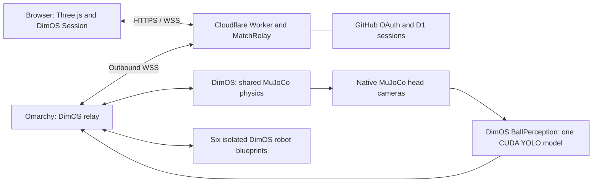

# Public Microduck demo

Deployed at **https://sim.tule.world** on 2026-09-10 UTC. GitHub authentication,
the outbound Cloudflare connection and native DimOS football perception are live.
The existing production checkout was fast-forwarded after its six slots were
confirmed empty. Its service names, private configuration and human CLI paths
were preserved. A private configuration and frontend backup is available under
`backups/public-launch-2026-09-10/` on Omarchy.

## What runs where

The Worker serves the built frontend and exported scene. Its single Durable Object
routes unchanged DimOS protocol frames. The application uses the stock DimOS
browser Session, codecs, subscriptions, command sequencing and teleop state
machine through a WebSocket adapter. The existing Registry on Omarchy owns duck
leases, generations, control authorization and private subscriptions.

Omarchy establishes the connection outward. No public inbound port, Cloudflare
Tunnel or dimTELE account is required. The private HTTPS/WebTransport gateway and
the loopback MCP endpoints remain usable. The `world` launcher continues calling
the DimOS CLI, including its status, daemon and human MCP commands.

MuJoCo remains version 3.10.0 with the existing timestep, gravity, floor, ball
contacts and goals. Hosting adds no physics authority, reset rule or kick impulse.
The six ducks, team spawns, smaller benchmark rooms, names, picker animation,
follow camera, policies, navigation and agent context remain in the application.

## Admission and identity

- The homepage and previews are public. Playing and watching require GitHub.
- GitHub identity uses immutable user IDs. OAuth requests no repository or email
  scopes. PKCE and single-use, five-minute state protect the callback.
- The seven-day session is a Secure, HttpOnly, SameSite=Lax cookie. D1 stores its
  hash. GitHub access tokens are discarded after fetching the account identity.
- One account owns one participant and one live browser connection. Reload
  replaces its old connection; existing 60-second duck reconnect grace applies.
- Six player slots and twenty connected spectator places are the initial limits.
- The user enters their duck name immediately before claiming an available slot.
- Spectators can select an active duck's public football camera. Private chat,
  maps, discoveries, controls and MCP services are not included in that feed.
- Requests are limited per account, or per IP before sign-in. Control traffic and
  queued bytes are bounded separately. Bad client frames disconnect that client.
- Logout and operator bans revoke the participant. Operators are explicitly
  allowlisted by GitHub ID; the first operator is `6902572`.

## Football perception

`BallPerception` is a DimOS module with six native `RobotVision` inputs. It uses
DimOS's `Yolo2DDetector` to load one `yolo11n.pt` model, then runs stateless
prediction on the CUDA GPU. The six cameras do not share persistent tracker state.
Only the COCO `sports ball` class is selected. This is a general ball detector,
not a trained football-specific classifier.

The module keeps one latest frame per duck, schedules ducks fairly, and rejects
old frames or previous participant generations. Detection runs outside the physics
callback. It publishes a typed `FootballObservation` for DimOS consumers and a
camera message containing the exact JPEG, timestamp, generation and boxes. The
browser decodes the image before displaying its overlay and clears stale frames.
`Detector unavailable` is distinct from `No ball detected`.

The smooth world and normal duck view still render with Three.js. Football boxes
appear on the native sensor image they were measured from. No browser image upload
or Ultralytics cloud service is used.

Runtime pins: Torch `2.7.1+cu128`, torchvision `0.22.1+cu128`, Ultralytics `8.3.203`,
Polars `1.33.1`, NumPy `2.3.5` and Pillow `12.2.0`. The separate `.venv-perception`
adds the existing base environment through a `.pth` file, preserving the pinned
DimOS installation and its `opencv-contrib-python` `4.13.0.92` provider of `cv2`.
Ultralytics's plain `opencv-python` dependency is intentionally satisfied by that
existing contrib build. `uv pip check` does not include the base `.pth` environment;
the setup script checks the combined runtime's package metadata instead.

Weights: official Ultralytics assets release `v8.3.0/yolo11n.pt`, SHA-256
`0ebbc80d4a7680d14987a577cd21342b65ecfd94632bd9a8da63ae6417644ee1`.
The Ultralytics code and weights retain their upstream licensing terms.

## Validation

| Check | Result |
| :--- | :--- |
| Python application regressions | 148 passed, including ball contacts and six-duck pitch entrances |
| DimOS application relay | 20 passed, including identity, cross-duck denial, reconnect and corrupt-client isolation |
| Frontend regressions | 14 passed; typecheck and production build passed |
| Cloudflare runtime | 11 passed, including OAuth, bans, bounded requests, slow viewers, origin loss and the browser transport adapter |
| Browser smoke test | All six choices, connection name prompt, active duck cockpit, native YOLO camera and existing controls verified; no browser console errors |
| Public agent and CLI | Agent replied `ready` through the public cockpit; the original human CLI listed all 20 tools for the signed-in duck |

The bounded capacity test used the actual isolated DimOS world and 26 protocol
clients: six player blueprints plus twenty spectators, each subscribed to the world
and one football camera. After startup and a 15-second warmup, a 45-second sample
measured:

| Metric | Result |
| :--- | :--- |
| Physics real-time factor | Median 0.9997, range 0.9988 to 1.0004 |
| World updates | Median 25.62 Hz, minimum 25.09 Hz |
| Camera updates | Median 1.89 Hz, range 1.82 to 1.93 Hz |
| Maximum observed camera frame age | 139 ms on localhost |
| Camera unavailable frames / failed clients | 0 / 0 |
| Aggregate delivered application payload | 4.86 MiB/s across all 26 subscribers |

This is a short local WebTransport load sample. It excludes browser rendering,
public network latency, OAuth traffic, agent inference, cold asset downloads and
Cloudflare egress measurements. It establishes an initial admission target, not
the maximum possible audience. The existing production world was also running on
Omarchy. Startup briefly skipped camera frames while six robot stacks initialized;
the measured steady-state workload retained real-time physics. The public origin
batches shared frames before upload; that uplink saving still needs measurement
through the deployed Cloudflare route.

The isolated native camera test used all six head cameras and all four actual scene
balls at 0.3, 0.5, 0.8 and 1.2 m, plus six empty views. Of 96 visible-ball images,
78 had a prediction overlapping the segmentation-derived ball box by IoU at least
0.5. Empty views had zero detections. All 18 misses were the three textured pitch
balls at 0.3 m, across all ducks. The benchmark ball was detected at every tested
distance. Median inference time was 7.84 ms, p95 8.02 ms after the first frame.
These staged samples are a sanity check, not an accuracy benchmark for moving,
occluded or distant footballs. Close-range reliability remains an improvement area.

Raw test evidence lives under ignored `state/validation/`; a compact nonsecret
summary is committed in `docs/public-launch-validation.json`.

## Public connection checks

The real GitHub callback completed using public-profile-only authorization. The
player returned to the Red 1 name prompt, joined as Tule, and received live DimOS
state and the matched native YOLO camera. Public world updates settled around
27 to 29 Hz. A policy switch to stand reached the simulator, switching back to
walk succeeded, teleop acquired its control lease, and the public agent replied.
Reload retained the same duck, name and participant generation. Logout cleared
the session and released its duck. Signing back in through Watch the match opened
a spectator connection at 28 Hz with zero player slots occupied. Its football
camera correctly waits for a selected duck to be occupied. Unauthenticated
control and session-discovery requests return 401; the private robot-registration
route returns 404. The public lobby and scene preview expose all six duck slots.

The first Internet test revealed that a 16-frame acknowledgment window was too
small for the cockpit's combined streams. The deployed relay now allows 64
outstanding downstream frames and 32 upstream messages, with the existing 2 MiB
byte bounds and timeouts still enforced. A regression test reproduces two healthy
40-frame bursts before acknowledgments return, and the slow-client disconnection
test still passes. The browser recovered automatically after the edge deployment.

## Deployment procedure

GitHub OAuth app `Microduck Football · DimOS` is registered under `aromeoes`.
Homepage: `https://sim.tule.world`. Callback:
`https://sim.tule.world/auth/callback`. Client ID: `Ov23lifchwSuJsZK26hd`.

The Cloudflare personal account and active `tule.world` zone have been verified.
D1 `microduck-identity` has been created and migration `0001_identity.sql` applied.
The Worker, custom-domain route and public bridge are deployed. Cloudflare first
required registering the account subdomain `tule-world.workers.dev`; public
`workers.dev` routing remains disabled. The active Worker version is
`40187f0e-0eec-4051-8c3a-be8e7c599018`. Secrets are installed as Worker secrets and
in the mode-0600 origin bridge configuration. The server now runs the CUDA overlay
from its original production directory, with the test worktree linking to it.

1. With the target world stopped, run `bash ops/setup-perception` if that runtime
   is not already provisioned. Preserve the project's downloaded robot assets,
   pinned vendor patch, private `config/agent.env`, and existing operator setup.
   That file is never copied to browser assets. The earlier credential-exposure
   note in `docs/public-access.md` records a prior rotation recommendation. Verify
   whether that credential was already rotated when enabling public agent usage.
2. Build the frontend with `cd web && deno task build`. Start the world once to
   export its native scene, then run `python ops/prepare-public-assets.py`.
3. In `edge`, run `npm ci`, `npm run check`, `npm test`, and `npm run build`.
   D1 migrations use `npx wrangler d1 migrations apply microduck-identity --remote`.
4. Read the GitHub client secret from the operator's mode-0600 local handoff file.
   Generate a fresh 32-byte hex host secret. Write both to a temporary mode-0600
   JSON secrets file, without printing them or putting values in command arguments.
5. Verify that `sim.tule.world` has no conflicting DNS record or Worker route.
   Deploy using `npx wrangler deploy --domain sim.tule.world --secrets-file PATH`.
   The account reports Workers Standard enabled; no pricing plan was changed.
   Billing subscription details are not available to the current OAuth token.
   Continuous traffic must be costed as an active Durable Object, including
   incoming acknowledgments.
6. Install `relay/.public.json` mode 0600 on Omarchy:
   `{"url":"wss://sim.tule.world/bridge","secret":"HOST_SECRET_VALUE"}`.
   This ignored file is in the Deno relay's existing permitted read directory.
7. Cut over one systemd-managed world to this branch, preserving its private
   configuration and DimOS CLI registration. Check occupancy first, avoid two
   public world authorities, and stop the temporary test services. Keep the old
   application commit/configuration available for rollback.
8. Verify the real GitHub callback, logout, account switching, occupied-slot
   conflicts, player and spectator WSS feeds, teleop, policies, the human CLI and
   agent availability. Test one remote/slow viewer and an origin restart. Verify
   anonymous clients cannot connect or fetch private session information.

Wrangler's development dependency audit currently reports a transitive Sharp /
libheif advisory via Miniflare. The affected image-processing library is used by
local development tooling and is not bundled into this Worker. This application
does not use an image transformation binding or process HEIF inputs. Do not apply
the audit's suggested downgrade to Wrangler 4.15.2 without compatibility testing.

Rollback removes the public bridge configuration and restores the prior application
commit/service configuration. Disconnecting the origin closes public clients and
discards pending control traffic. OAuth/D1 resources can remain for a later retry.
