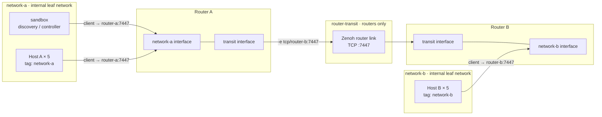
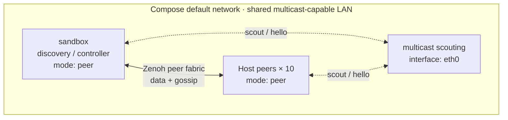

# Host discovery with Docker Compose

The two Compose files start 10 independent `dimos host serve` replicas and use
the repository source to build `dimos-host-discovery:compose` locally.

## With a Zenoh router

This scenario has two isolated leaf networks. Five Hosts connect only to
Router A on `network-a`, and five connect only to Router B on `network-b`.
The routers communicate over a separate `router-transit` network. Discovery,
remote execution, and the sandbox are attached only to `network-a`, so seeing
all 10 Hosts proves that Router A and Router B are routing across the network
boundary.



```bash
docker compose -f experimental/hosted/compose.router.yaml up -d --build
docker compose -f experimental/hosted/compose.router.yaml run --rm discovery
```

## Without a router (multicast scouting)

This scenario puts the sandbox and all 10 Hosts on one shared Compose network.
There is no Router or configured connect endpoint. Every process runs in peer
mode and uses multicast on `eth0` to discover the others; Zenoh traffic and
gossip then flow through the discovered peer fabric.



```bash
docker compose -f experimental/hosted/compose.multicast.yaml up -d --build
docker compose -f experimental/hosted/compose.multicast.yaml run --rm discovery
```

Each discovery command should return 10 available hosts with distinct
`host_id` values. The multicast scenario requires Docker networking and the
host environment to allow multicast traffic.

## Real remote execution

The remote-execution probe runs in a separate controller container. It selects
one available Host, sends a serialized Blueprint fragment, calls the deployed
module over Zenoh, and then stops the deployment. Run it against either
scenario:

```bash
docker compose -f experimental/hosted/compose.router.yaml run --rm remote-execution
docker compose -f experimental/hosted/compose.multicast.yaml run --rm remote-execution
```

A successful result shows different controller and remote hostnames, a remote
PID, `running` lifecycle states, and a final Host state of `available`.

This MVP transfers a Blueprint description with Python pickle. It assumes a
trusted Zenoh network and the same application code already installed on the
Host; it is not source-code distribution or a sandbox for untrusted code.

## Interactive sandbox

Each scenario starts a persistent sandbox using the same image, network, and
Zenoh configuration. Open a shell with:

```bash
docker compose -f experimental/hosted/compose.router.yaml exec sandbox bash
docker compose -f experimental/hosted/compose.multicast.yaml exec sandbox bash
```

For example, inside the shell:

```bash
dimos host list --timeout 5
python -m experimental.hosted.run_remote_execution
```

The sandbox is an interactive test container, not a security boundary for
untrusted code.

Stop both scenarios with:

```bash
docker compose -f experimental/hosted/compose.router.yaml down
docker compose -f experimental/hosted/compose.multicast.yaml down
```
