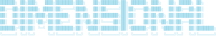

# Kora Social

<p align="center">
  
</p>

Kora Social is a dashboard for a Unitree Go2 robot that captures its own point of view, drafts X posts with OpenRouter vision models, and lets people ask the robot what it sees through X mentions.

<p align="center">
  <a href="https://www.dimensionalos.com">
    
  </a>
  &nbsp;&nbsp;
  <a href="https://www.unitree.com">
    
  </a>
  &nbsp;&nbsp;
  <a href="https://www.mad.builders">
    
  </a>
</p>

<p align="center">
  
</p>

Robots create a new kind of live activation: they are still novel enough to draw attention, but capable enough to become interactive hosts, camera operators, and social media characters. Kora turns that attention into shareable moments by walking around an event, capturing what it sees, and letting people interact with it through X.

## Submission Video

- [Watch the video on X](https://x.com/DimensionalKora/status/2059990722540081374)
- [Download the submission video](https://raw.githubusercontent.com/bartomolina/dimos/feat/kora-social/hackathon/kora_social/static/media/kora-social-submission.mp4)

The video shows the demo flow, the X profile, and example brand activation moments.

<p align="center">
  
  &nbsp;&nbsp;
  
</p>

## Links

- Kora on X: [@DimensionalKora](https://x.com/DimensionalKora)
- MadBuilders: [mad.builders](https://www.mad.builders), a Madrid home base for founders, builders, hackathons, meetups, and early-stage ideas, made possible by [Samplia](https://samplia.com/)

## What it does

- Go2 camera preview, with sample frames for robot-free testing
- Capture-to-draft workflow for X posts
- OpenRouter captions and visual Q&A
- Opt-in people tag suggestions
- Local mention queue with manual inject/poll/run controls
- Optional X posting through `xurl`
- Local stand/rest/stop/drive and Tiny Patrol controls

## Run

From the repo root:

```bash
.venv/bin/python -m uvicorn hackathon.kora_social.app:app --reload --host 127.0.0.1 --port 8787
```

Open `http://127.0.0.1:8787`.

To try the dashboard without a robot connected, start it with sample frames:

```bash
MOCK_ROBOT=1 .venv/bin/python -m uvicorn hackathon.kora_social.app:app --reload --host 127.0.0.1 --port 8787
```

## Configuration

Put local secrets in the repo `.env` file:

```bash
OPENROUTER_API_KEY=...
KORA_SOCIAL_OPENROUTER_MODEL=openai/gpt-4o-mini
```

Useful optional settings:

```bash
KORA_SOCIAL_X_MENTION_QUERY='@DimensionalKora -from:DimensionalKora'
KORA_SOCIAL_X_MENTION_MODE=search
```

`xurl` handles X auth outside the app. Posting is preview-only by default; set `KORA_SOCIAL_X_DRY_RUN=0` to send real posts.

## Mention Commands

```text
@DimensionalKora what do you see?
@DimensionalKora take a picture
```

Mention handling currently supports vision and capture actions. Speech and movement mentions are ignored. Unknown non-movement mentions can be classified through OpenRouter into `vision`, `capture`, or `ignored`.

## Runtime State

Runtime files are intentionally ignored by git:

- `hackathon/kora_social/captures/`
- `hackathon/kora_social/people_tags/`
- `hackathon/kora_social/kora_social.sqlite3`
