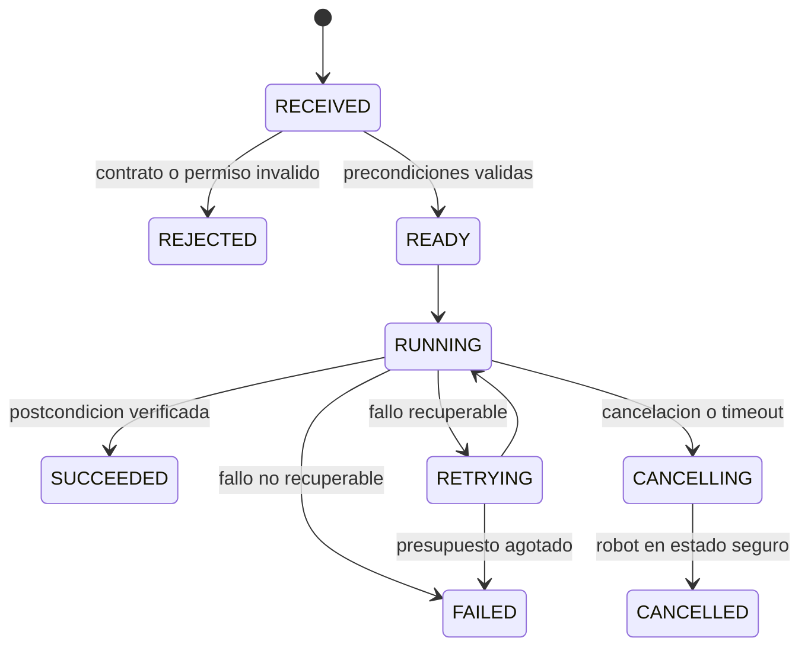
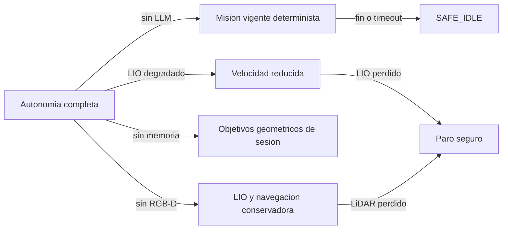

# Contratos, despliegue y manejo de fallos

Ultima modificacion: 2026-06-11 11:46:53 -05 -0500

## Objetivo

Definir interfaces que permitan reemplazar un detector, planificador o modelo
sin cambiar la semantica operacional del sistema. Los ejemplos son
**contratos propuestos**; no existen aun como tipos implementados en DimOS.

## Identidad y tiempo

Todo mensaje operativo debe incluir:

```text
message_id
mission_id
source
capture_time
publish_time
frame_id
schema_version
trace_id
```

Para sensores se conserva el tiempo de captura del dispositivo. El tiempo de
recepcion no lo sustituye. PTP es preferible cuando el hardware lo soporte; si
no, se registra offset y deriva estimados.

## Contrato de mision

```yaml
mission:
  id: uuid
  intent: navigate_to
  target:
    entity_id: place:kitchen
    pose_hint: null
  constraints:
    max_speed_mps: 0.35
    keep_distance_from_people_m: 1.0
    deadline_s: 120
  requester:
    principal: operator
    channel: voice
  confirmation:
    required: false
  idempotency_key: uuid
```

El agente puede producir este objeto. El orquestador es responsable de
resolverlo, autorizarlo y convertirlo a estados ejecutables.

## Contrato de skill

| Campo | Significado |
|---|---|
| Nombre y version | Identidad estable del contrato |
| Entrada tipada | Parametros validados, unidades y marcos |
| Precondiciones | Salud, permisos, localizacion y recursos |
| Progreso | Estado monotono y evidencia intermedia |
| Resultado | Postcondicion observada, no texto libre aislado |
| Cancelacion | Acuse y tiempo maximo para quedar seguro |
| Timeout | Limite de ejecucion |
| Idempotencia | Efecto de repetir el mismo `command_id` |
| Errores | Taxonomia recuperable/no recuperable |

Estados propuestos:



## Contratos de autonomia

### Localizacion

```text
LocalizationEstimate:
  pose_map_base
  pose_odom_base
  covariance
  status: INITIALIZING | TRACKING | DEGRADED | LOST
  map_id
  last_correction_time
```

La navegacion no debe inferir calidad solo por la existencia de una pose.

### Observacion y entidad

```text
Observation:
  observation_id
  sensor_id
  class_candidates[]
  embedding_ref
  bbox_or_mask
  pose_or_ray
  covariance
  confidence
  capture_time

Entity:
  entity_id
  entity_type
  labels[]
  pose_distribution
  first_seen
  last_seen
  lifecycle: TENTATIVE | CONFIRMED | STALE | RETIRED
  evidence_refs[]
```

Una observacion es inmutable. Una entidad es una hipotesis fusionada que puede
cambiar y conserva la procedencia de sus evidencias.

### Navegacion

```text
NavigationGoal:
  goal_id
  pose_or_region
  tolerance
  speed_profile
  social_constraints
  deadline

NavigationStatus:
  state
  current_pose
  distance_remaining
  localization_status
  blocked_reason
  active_plan_id
```

Este contrato resuelve la brecha observada entre
`NavigationSkillContainer`, que espera RPC, y el stack G1 real, que consume
streams de objetivo.

### Movimiento seguro

```text
MotionRequest:
  source
  linear_x
  linear_y
  angular_z
  valid_until
  priority
  navigation_goal_id

SafeMotionCommand:
  bounded_velocity
  reason_codes[]
  supervisor_state
  valid_until
```

Los comandos sin `valid_until` se rechazan. El adaptador Unitree solo acepta
`SafeMotionCommand`.

## Semantica de cancelacion

Cancelar no significa dejar de publicar. La secuencia propuesta es:

1. El orquestador marca la skill como `CANCELLING`.
2. El planificador deja de generar una trayectoria nueva.
3. El supervisor emite una rampa a cero.
4. El adaptador confirma velocidad ordenada cero.
5. El estado del robot confirma reposo o modo seguro.
6. La skill publica `CANCELLED`.

El plazo de cada paso se mide y un incumplimiento eleva el sistema a
`DEGRADED` o `ESTOP`.

## Modelo de permisos

| Operacion | Riesgo | Politica inicial |
|---|---|---|
| Consultar mapa o memoria | Bajo | Permitida |
| Hablar | Bajo | Permitida, con limite de tasa |
| Navegar a lugar conocido | Medio | Permitida con limites |
| Acercarse a una persona | Medio-alto | Distancia minima y confirmacion contextual |
| Cambiar modo del G1 | Alto | Confirmacion humana autenticada |
| Control articular | Critico | No expuesto al agente |
| Desactivar seguridad | Critico | No existe como skill |

Las credenciales de MCP no confieren automaticamente autoridad fisica. Cada
tool declara un alcance y el orquestador aplica la politica.

## Unidades de despliegue

| Unidad | Procesos | Dependencia de red externa | Reinicio |
|---|---|---|---|
| `g1-safety` | Supervisor, watchdog, arbitro y adaptador DDS | No | Manual/controlado |
| `g1-localization` | Driver Mid-360, LIO y TF | No | Automatico limitado |
| `g1-perception` | RGB-D, detector, tracker y fusion | No para nucleo | Automatico |
| `g1-autonomy` | Mapas, memoria activa y navegacion | No | Automatico con checkpoint |
| `g1-mission` | Orquestador, MCP y agente | Puede usar LLM remoto | Automatico |
| `g1-observability` | MCAP, trazas y panel | No | Automatico |

Los nombres son **propuestos** y no implican contenedores obligatorios. En el
MVP pueden coexistir en una sola computadora, pero conservan limites de fallo.

## Matriz de fallos

| Fallo detectado | Deteccion | Respuesta inmediata | Recuperacion | Evidencia |
|---|---|---|---|---|
| LLM o MCP inaccesible | Timeout y latido | Continuar skill vigente o cancelar segun politica; no iniciar otra | Reconectar sin duplicar comando | Traza, timeout |
| Camara perdida | Heartbeat/frame age | Desactivar percepcion visual; reducir velocidad | Reiniciar driver | Ultimo frame y edad |
| LiDAR perdido | Heartbeat/paquetes | Frenar navegacion | Reiniciar; relocalizar | Estado LIO |
| Localizacion degradada | Covarianza/residuo | Reducir velocidad, usar mapa local | Relocalizar | Serie de calidad |
| Localizacion perdida | Estado `LOST` | Velocidad cero | Teleop o procedimiento de recuperacion | Pose y causa |
| Persona demasiado cerca | Zona dinamica | Frenado preventivo | Esperar o replanificar | Track y distancia |
| Planificador bloqueado | Sin progreso | Frenar, limpiar solo capa local, replanificar | Pedir ayuda tras presupuesto | Planes y costes |
| Control sin latido | Watchdog | Orden cero/paro | Reconectar manualmente | Tiempo de ultimo comando |
| Base de memoria caida | Error de servicio | Navegar solo con objetivos ya resueltos | Cola local y reintento | Operaciones pendientes |
| Disco lleno | Umbral | Rotar grabacion; preservar eventos criticos | Descargar datos | Uso y politica |
| Temperatura/energia critica | Telemetria | Reducir o finalizar mision | Retorno o intervencion | Estado G1 |

## Degradacion por capacidades



## Versionado

- Los contratos publicos usan version semantica.
- Un consumidor acepta explicitamente un rango de versiones.
- Los eventos persistidos guardan la version exacta del esquema.
- Un cambio de unidad, marco o semantica es incompatible aunque el tipo
  superficial no cambie.
- Los modelos registran hash de pesos, configuracion y conjunto de prompts.

## Pruebas de contrato

1. Serializacion y deserializacion entre versiones.
2. Rechazo de valores fuera de unidad o rango.
3. Cancelacion en cada estado.
4. Repeticion del mismo `idempotency_key`.
5. Mensajes retrasados y fuera de orden.
6. Perdida de productor y recuperacion.
7. Inyeccion de una pose con covarianza alta.
8. Comando vencido antes de llegar al adaptador.

## Criterio de aceptacion

Ningun componente se integra al G1 real si puede producir movimiento sin pasar
por el contrato de movimiento seguro, si carece de cancelacion comprobada o si
su fallo no deja una causa observable.

