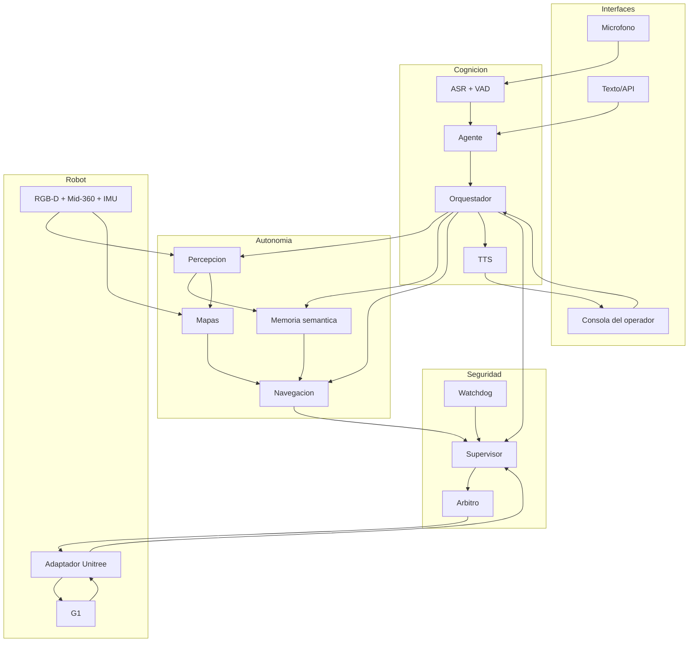
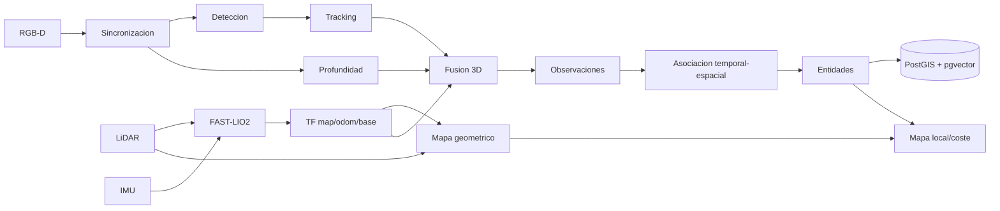
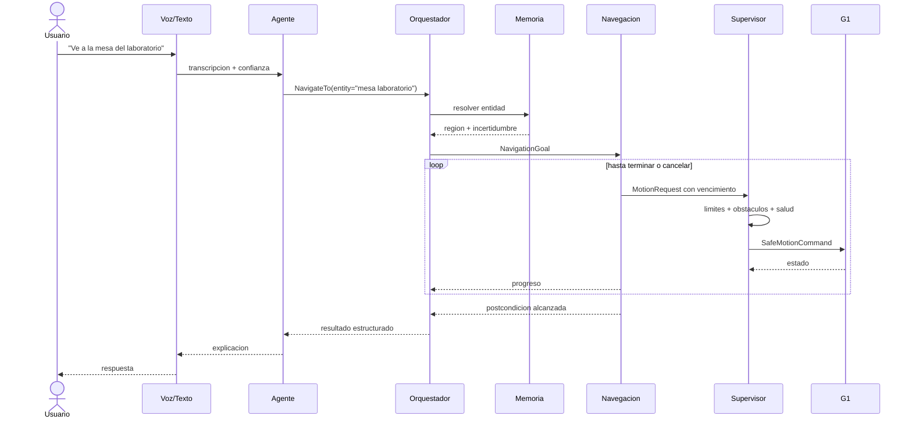
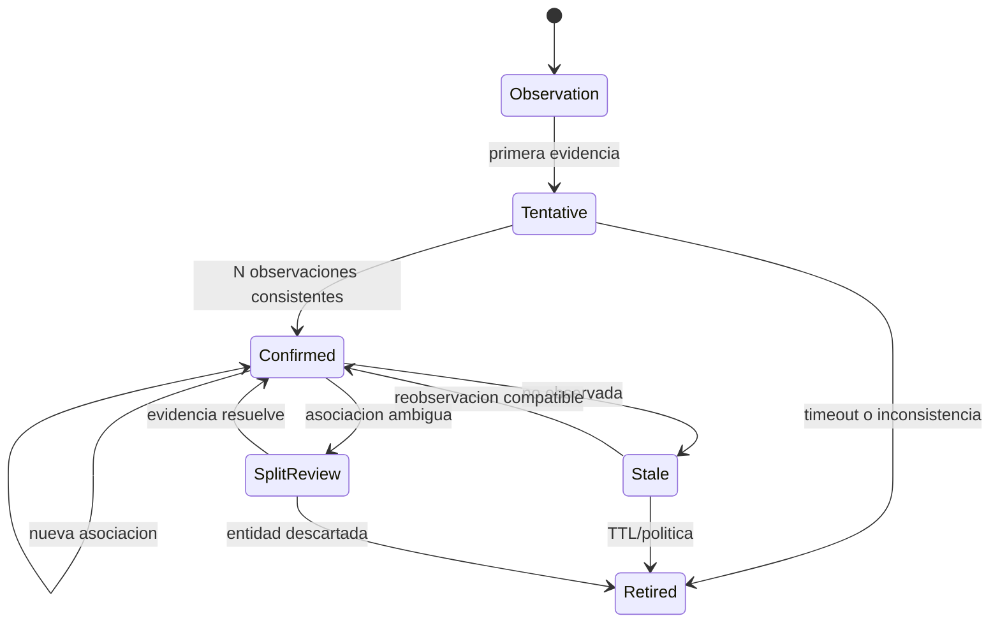
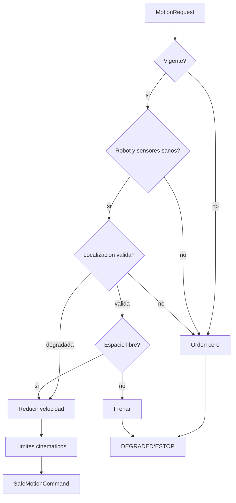
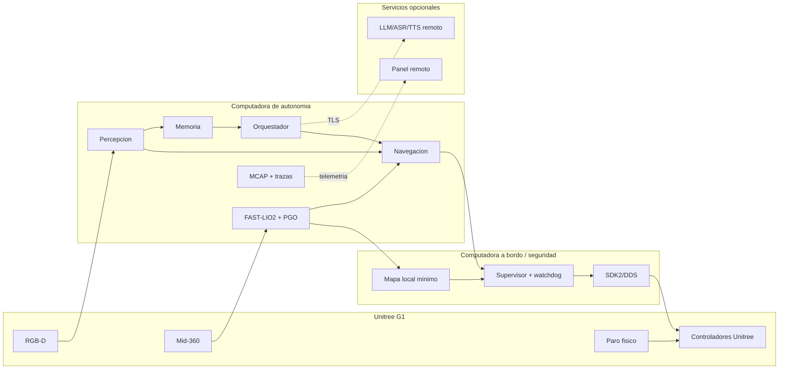
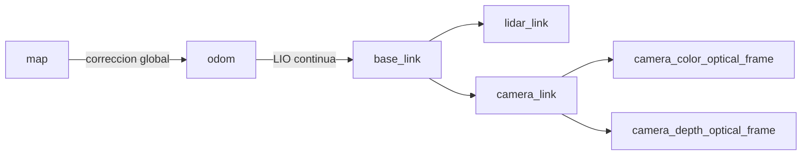
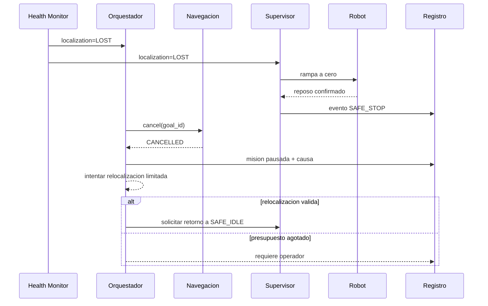
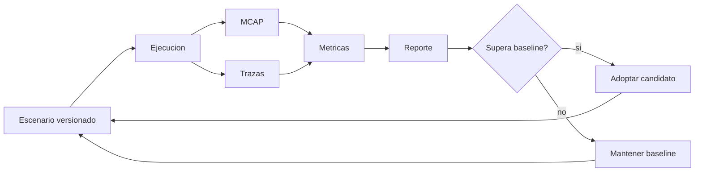

# Diagramas de arquitectura y secuencia

Ultima modificacion: 2026-06-11 12:04:30 -05 -0500

Los diagramas representan la **arquitectura propuesta**. No describen por si
solos el estado actual implementado en DimOS.

## 1. Arquitectura total

## 2. Sensor a mapa, percepcion y memoria

## 3. Instruccion a movimiento G1

## 4. Deteccion, identidad de entidad y persistencia

Regla: el nombre de una persona nunca se infiere solo por semejanza visual. La
identidad personal requiere consentimiento y una fuente autorizada.

## 5. Seguridad y paro

## 6. Despliegue fisico

## 7. Marcos de coordenadas

Las transformaciones estaticas se obtienen por calibracion y se versionan. La
pose `map -> odom` puede saltar por cierre de lazo; `odom -> base_link` debe
permanecer continua para control.

## 8. Recuperacion de fallo

## 9. Ciclo de evaluacion

Toda sustitucion tecnologica debe recorrer este ciclo con el mismo escenario,
semillas cuando apliquen y configuraciones versionadas.
