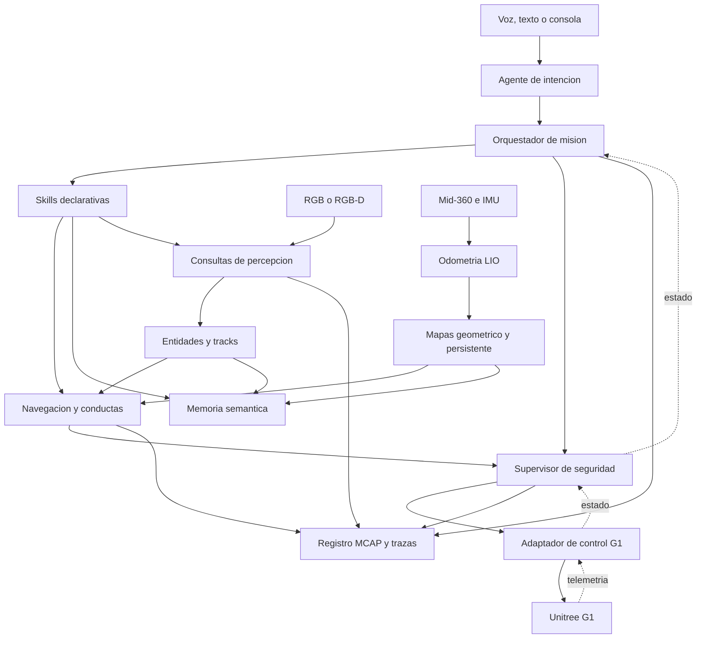

# Vision general de la arquitectura

Ultima modificacion: 2026-06-11 12:04:30 -05 -0500

## Proposito

Esta arquitectura propone un G1 agentico que recibe instrucciones por voz o
texto, construye y conserva una representacion espacial-semantica, navega en
entornos con personas y ejecuta acciones verificables sin entregar control
motor directo al modelo de lenguaje.

La propuesta no presupone que una biblioteca sea superior por popularidad. Se
parte del codigo actual de DimOS y se reemplaza una pieza solo cuando una
medicion del sistema demuestra una limitacion.

## Convenciones epistemicas

- **Hecho observado:** comportamiento comprobado en el codigo revisado.
- **Inferencia:** consecuencia tecnica razonable, pendiente de prueba integrada.
- **Propuesta:** decision de arquitectura propia.
- **Candidato:** tecnologia que debe superar un benchmark antes de adoptarse.

## Principios

1. El modelo de lenguaje expresa intencion; nunca publica velocidades ni
   comandos articulares.
2. La seguridad, el paro y los limites cinematicos permanecen activos aunque
   fallen el agente, la red o la computadora externa.
3. El mapa geometrico local, el mapa persistente y la memoria semantica tienen
   ciclos de vida distintos.
4. Cada orden produce evidencia: plan, herramientas invocadas, estado,
   telemetria, resultado y causa de fallo.
5. Toda capacidad admite cancelacion, plazo maximo e idempotencia cuando sea
   aplicable.
6. La voz es una interfaz; el contrato de mision no depende de ella.
7. Se reutilizan primero los componentes DimOS que ya resuelven transporte,
   despliegue, LIO, planificacion o visualizacion.

## Capas

| Capa | Responsabilidad | Frecuencia orientativa | Puede detener al robot |
|---|---|---:|---|
| Interaccion | Voz, texto, confirmaciones y explicacion | Por evento | Solicita cancelacion |
| Cognicion | Interpretar intencion, descomponer tarea y elegir skills | 0.1-2 Hz | No directamente |
| Mision | Validar precondiciones, secuenciar, reintentar y registrar | 1-10 Hz | Si |
| Autonomia | Localizacion, mapas, percepcion, memoria y navegacion | 5-30 Hz | Si |
| Seguridad | Supervisar salud, proximidad, limites y timeout | 50-200 Hz | Si, autoridad final |
| Control | Convertir referencia segura a interfaz Unitree | 50-500 Hz | Si |

Las frecuencias son **objetivos de diseno**, no mediciones del repositorio.
Deben ajustarse a la computadora, los sensores y el modo de locomocion reales.

## Arquitectura logica

## Zonas de autoridad

### Zona cognitiva

El agente puede:

- crear una especificacion de objetivo;
- consultar memoria, mapa y percepcion;
- escoger una skill autorizada;
- pedir aclaracion o confirmacion;
- cancelar una mision.

No puede:

- escribir `cmd_vel`;
- llamar directamente un metodo articular de Unitree;
- desactivar el supervisor;
- elevar sus propios limites;
- declarar exito sin evidencia del ejecutor.

### Zona determinista de mision

El orquestador traduce una orden aceptada a una maquina de estados. Conserva:

- `mission_id`, `command_id` y usuario de origen;
- precondiciones y postcondiciones;
- plazo, politica de reintento y compensacion;
- estado de cada skill;
- referencias a episodios y trazas.

### Zona de autonomia

La navegacion recibe metas espaciales, no frases. La percepcion publica
observaciones con incertidumbre y la memoria conserva entidades confirmadas,
no solo cajas detectadas en un fotograma.

### Zona de seguridad y control

El supervisor arbitra entre navegacion, teleoperacion y paro. La salida final
se limita por estado del robot, distancia a obstaculos, calidad de
localizacion, latido de procesos y restricciones de velocidad.

## Representaciones espaciales

| Representacion | Marco | Horizonte | Contenido | Consumidor |
|---|---|---|---|---|
| Odometria LIO | `odom` | Sesion | Pose local continua y covarianza | Control, mapa local |
| Mapa persistente | `map` | Entre sesiones | Nube/submapas y correccion global | Localizacion, auditoria |
| Mapa local de seguridad | `base_link`/`odom` | Segundos | Obstaculos, suelo y zonas no transitables | Supervisor, plan local |
| Mapa de coste | `map`/`odom` | Segundos-minutos | Inflacion, dinamicos, restricciones | Planificador |
| Grafo semantico | `map` | Entre sesiones | Lugares, objetos, personas y relaciones | Agente, memoria |
| Historial episodico | Tiempo + pose | Persistente | Sensores, eventos, skills y resultados | Evaluacion, depuracion |

No se fusionan indiscriminadamente objetos moviles en el mapa persistente. Las
personas viven como tracks con caducidad y, si existe consentimiento, como
entidades semanticas separadas.

## Despliegue propuesto

### En el robot o computadora de seguridad

- receptor de estado Unitree;
- supervisor de seguridad;
- arbitro de comandos;
- watchdog;
- adaptador DDS/WebRTC seleccionado;
- mapa local minimo para frenado;
- boton o canal de paro independiente.

### En la computadora de autonomia

- FAST-LIO2 y correccion global;
- percepcion RGB-D;
- mapas, memoria, planificacion y seguimiento;
- orquestador de mision;
- grabacion MCAP y visualizacion.

### En un servicio opcional

- LLM remoto;
- transcripcion o sintesis remota;
- analitica fuera de linea.

La perdida de este servicio no debe impedir frenar, cancelar ni teleoperar.

## Transporte

| Flujo | Transporte preferido | Justificacion |
|---|---|---|
| Estado y control G1 | DDS de Unitree | Interfaz soportada por el fabricante |
| Sensores de alta tasa en un host | Memoria compartida | Evita copias de imagen y nube |
| Percepcion, mapas y navegacion | Streams tipados DimOS o ROS 2/DDS | Depende del componente reutilizado |
| Skills del agente | MCP sobre HTTP local autenticado | Contrato de herramienta, no control duro |
| Telemetria persistente | MCAP + OpenTelemetry | Reproduccion y correlacion |

**Propuesta:** mantener un adaptador de frontera para que el nucleo no dependa
de un unico bus. MCP queda fuera del lazo de control.

## Flujo de una orden

1. La interfaz produce una transcripcion y su confianza.
2. El agente genera una intencion estructurada.
3. El orquestador valida permisos, ambiguedad y precondiciones.
4. Una skill resuelve referencias semanticas y solicita un objetivo.
5. Navegacion produce trayectoria y referencias locales.
6. El supervisor limita o rechaza la referencia.
7. El adaptador G1 ejecuta el comando permitido.
8. El ejecutor verifica la postcondicion.
9. El orquestador informa exito, fallo o cancelacion con evidencia.

## Modos operativos

| Modo | Capacidades | Entrada permitida |
|---|---|---|
| `SAFE_IDLE` | Estado, diagnostico, voz y memoria | Ningun movimiento |
| `TELEOP` | Control humano con limites | Fuente humana autorizada |
| `AUTONOMOUS` | Skills y navegacion | Orquestador |
| `DEGRADED` | Frenado, retorno limitado o espera | Politica determinista |
| `ESTOP` | Paro y recuperacion manual | Solo secuencia autorizada |

La transicion a `AUTONOMOUS` exige localizacion valida, sensores saludables,
canal de control activo y ausencia de paro.

## Presupuesto inicial de latencia

| Tramo | Objetivo inicial | Criterio |
|---|---:|---|
| Sensor a mapa local | p95 < 100 ms | Obstaculo util para control |
| Percepcion a track | p95 < 200 ms | Persona no obsoleta |
| Referencia a comando G1 | p95 < 40 ms | Lazo de movimiento estable |
| Watchdog sin latido | <= 250 ms | Entrada a velocidad cero |
| Voz final a intencion | p95 < 1.5 s | Interaccion aceptable |
| Intencion a inicio de skill | p95 < 500 ms | Sin incluir aclaracion |

Son **umbrales candidatos** para el MVP. El ensayo en G1 real debe confirmar o
reducirlos de acuerdo con distancia de frenado y velocidad autorizada.

## Resultado esperado

La contribucion no es ensamblar un LLM con un robot. Es demostrar una frontera
reproducible entre lenguaje probabilistico y autonomia fisica verificable,
manteniendo memoria persistente y comportamiento seguro en ambientes
dinamicos.
