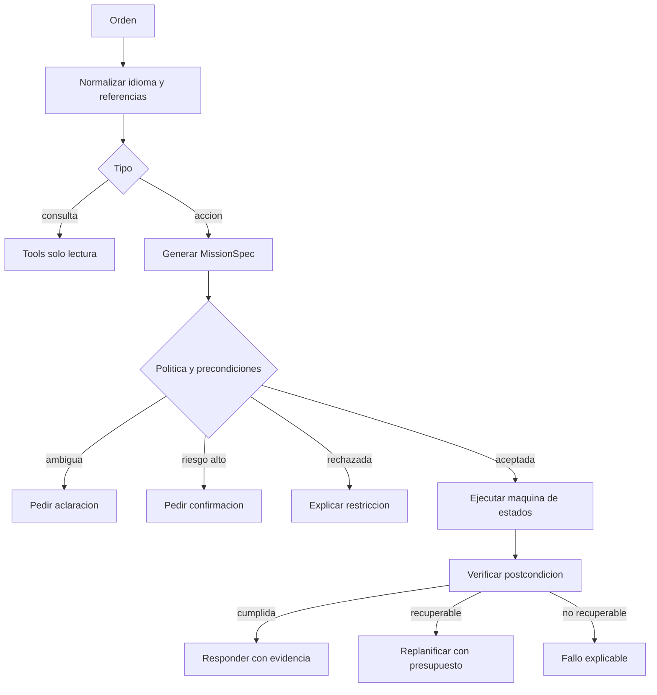
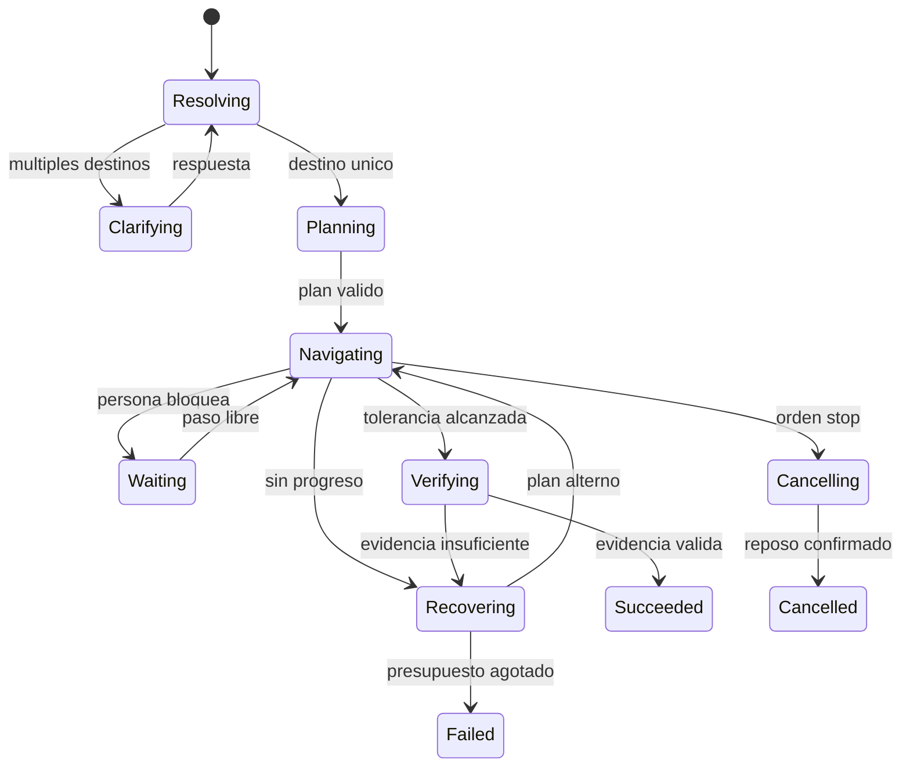

# Agente y orquestacion de misiones

Ultima modificacion: 2026-06-11 12:07:27 -05 -0500

## Estado de partida

**Hechos observados en DimOS:**

- `McpClient` obtiene tools por HTTP y usa un agente LangChain/LangGraph.
- El modelo por defecto es `gpt-4o`.
- El historial conversacional vive en memoria del proceso.
- `McpServer` expone metodos `@skill` y acepta CORS amplio.
- El prompt G1 pide al LLM estimar duraciones para movimiento directo.
- No se observo una pasarela de politica fisica entre tool y actuador.

Esto es suficiente para una demostracion, pero mezcla razonamiento,
orquestacion y ejecucion fisica.

## Propuesta

Separar cuatro responsabilidades:

| Componente | Funcion | Determinismo |
|---|---|---|
| Adaptador de modelo | Produce intencion o siguiente accion estructurada | Probabilistico |
| Orquestador | Maquina de estados, permisos, timeout y compensacion | Determinista |
| Catalogo de skills | Contratos versionados y descubrimiento | Determinista |
| Ejecutores | Navegacion, memoria, percepcion, habla y diagnostico | Determinista salvo modelo interno |

El agente no conserva el estado canonico de la mision en su ventana de
contexto. El orquestador lo persiste y entrega al modelo una vista minima.

## Planificacion jerarquica

La jerarquia propuesta tiene cuatro niveles:

1. **Objetivo humano:** resultado expresado en lenguaje.
2. **Mision:** `MissionSpec` con restricciones y postcondicion.
3. **Skills:** acciones cancelables como resolver, observar o navegar.
4. **Ejecutores:** planes geometricos y control acotado.

El LLM opera en los dos primeros niveles y selecciona skills autorizadas. No
descompone pasos motores. El orquestador puede replanificar entre skills; el
planificador de navegacion replantea trayectorias sin volver a consultar al
LLM. Esta separacion reduce latencia y evita que una perdida de conexion
interrumpa el lazo fisico.

## Flujo de razonamiento



## Intenciones permitidas en el MVP

```text
DescribeScene
FindEntity
RememberLocation
NavigateTo
Stop
ResumeMission
GetRobotStatus
Speak
```

No se incluyen control de articulaciones, locomocion por velocidad abierta,
manipulacion, seguimiento invasivo de personas ni modificacion de politicas.

## Tool design

Las tools se diseñan por resultado de tarea:

| Tool propuesta | Entrada principal | Resultado verificable |
|---|---|---|
| `resolve_entity` | Texto y contexto espacial | Entidad/region con incertidumbre |
| `observe_region` | Region y clases | Observaciones recientes |
| `navigate_to` | Entidad o region y restricciones | Objetivo alcanzado/cancelado |
| `remember_place` | Nombre, pose y evidencia | Entidad persistida |
| `get_mission_status` | `mission_id` | Estado estructurado |
| `cancel_mission` | `mission_id` | Reposo seguro confirmado |
| `speak` | Texto autorizado | Reproduccion finalizada |

**Decision:** no exponer `move(x, y, yaw, duration)` al LLM. Puede conservarse
para teleoperacion o pruebas bajo otra autoridad, pero no en el catalogo
agentico.

## Salida estructurada

```json
{
  "intent": "NavigateTo",
  "target": {
    "query": "mesa del laboratorio",
    "entity_id": null
  },
  "constraints": {
    "max_speed_mps": 0.35,
    "deadline_s": 120
  },
  "requires_confirmation": false,
  "reason": "El usuario solicito desplazamiento a un lugar"
}
```

El esquema se valida antes de consultar una tool. Texto fuera del JSON no
tiene efecto operativo.

## Maquinas de estado

Cada tipo de mision posee un grafo cerrado. Ejemplo de navegacion:



El LLM puede sugerir una transicion recuperativa, pero no crear estados o
omitir validaciones.

## Memoria conversacional

Se separan:

- historial de mensajes para experiencia de usuario;
- estado de mision, persistido estructuralmente;
- hechos espaciales, en memoria semantica;
- resumen conversacional, generado y marcado como derivado;
- datos sensibles, sujetos a retencion y acceso.

Una referencia como "alli" se resuelve usando turno, objetivo vigente, pose y
entidades visibles. Si hay mas de una interpretacion segura, se pregunta.

## Modelos candidatos

| Opcion | Uso | Ventaja esperada | Riesgo | Estado |
|---|---|---|---|---|
| API OpenAI compatible | Baseline de razonamiento/tool calling | Calidad y baja carga local | Red, coste, datos | Baseline a medir |
| Qwen3 local | Operacion privada/degradada | Pesos abiertos y tool calling | VRAM, latencia, validacion | Candidato |
| `llama.cpp` | Runtime local cuantizado | Portabilidad y control | Calidad dependiente del modelo | Candidato |
| Regla/gramatica | `stop`, estado y ordenes cerradas | Predecible y rapido | Cobertura limitada | Obligatorio para acciones criticas |

No se selecciona un modelo local por nombre. Debe evaluarse con el mismo
conjunto de instrucciones, idiomas, tools y errores.

## Benchmark del agente

Conjunto minimo de 200 instrucciones versionadas:

- español e ingles;
- referencias espaciales directas y anaforicas;
- instrucciones ambiguas;
- prompt injection dentro de nombres de objetos o memoria;
- tools fallidas o lentas;
- solicitudes fuera de permisos;
- cancelaciones durante ejecucion;
- ordenes compuestas.

Metricas:

| Metrica | Definicion |
|---|---|
| Exactitud de intencion | Intencion correcta / total |
| Argumentos validos | Calls que cumplen esquema / calls |
| Tool selection accuracy | Tool correcta / oportunidad |
| Unsafe action rate | Acciones no autorizadas aceptadas / intentos |
| Clarification precision | Aclaraciones necesarias y correctas |
| Task completion | Misiones con postcondicion / misiones validas |
| Recovery success | Fallos recuperables resueltos / intentos |
| Latencia | p50/p95 desde orden a MissionSpec |
| Coste | USD o joules por mision |

Objetivo del MVP: tasa de accion insegura observada igual a cero en el banco de
pruebas. Esto no prueba seguridad absoluta, pero es una puerta de integracion.

## Seguridad MCP

Controles propuestos:

- servidor enlazado a interfaz local o red de gestion;
- autenticacion mutua o token corto;
- allowlist de tools por principal;
- validacion de origen y proteccion CSRF;
- limites de tasa y tamaño;
- logs sin secretos;
- revision humana para scopes de alto riesgo;
- descripciones de tools tratadas como datos no confiables;
- sin tokens de terceros reenviados de forma implicita;
- version y hash del catalogo en cada mision.

La especificacion MCP facilita interoperabilidad, no sustituye la autorizacion
fisica. La guia de seguridad de MCP y la guia de NSA citadas en
[`fuentes.md`](../08_trazabilidad/fuentes.md) sustentan esta separacion.

## Prompt injection

Fuentes no confiables:

- texto reconocido en carteles;
- nombres y descripciones recuperadas de memoria;
- mensajes de red;
- respuestas de tools;
- transcripcion de terceros.

Estos valores nunca se concatenan como instrucciones del sistema. Se incluyen
en campos de datos delimitados, y la politica se evalua fuera del LLM.

## Persistencia y reanudacion

LangGraph ofrece checkpoints e interrupciones como candidato de
implementacion. La decision propia es mas general:

1. persistir antes de producir un efecto fisico;
2. guardar `command_id` antes de invocar;
3. reconciliar estado del ejecutor tras reinicio;
4. no repetir una accion si su postcondicion ya existe;
5. reanudar solo desde un estado declarado recuperable.

## Aporte propio

La contribucion propuesta es el contrato de autoridad y evidencia:

- lenguaje a `MissionSpec`;
- politica a maquina de estados;
- skill a postcondicion;
- movimiento a comando acotado;
- resultado a episodio reproducible.

Esto permite comparar modelos sin convertir cada cambio de LLM en un cambio de
control del robot.
