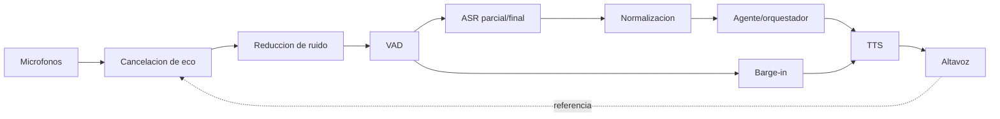
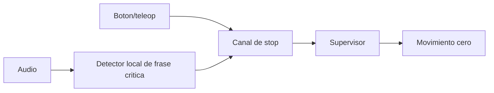
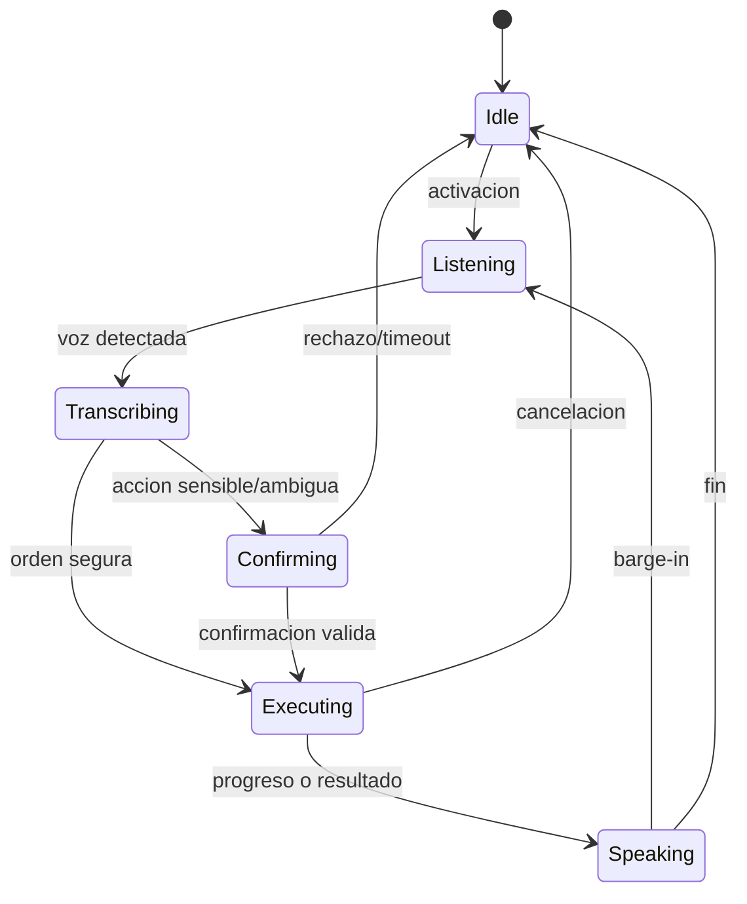

# Voz e interaccion multimodal

Ultima modificacion: 2026-06-11 11:46:53 -05 -0500

## Objetivo

Permitir interaccion natural en español e ingles, manteniendo siempre una ruta
de texto y una orden de paro local que no dependa del LLM ni de Internet.

## Estado actual

**Hechos observados:**

- DimOS contiene `WhisperNode`, `KeyRecorder` y pipelines de audio.
- El blueprint G1 agentico incluye `SpeakSkill`, pero no una entrada de voz
  integrada.
- `SpeakSkill` usa TTS de OpenAI y reproduce por `sounddevice`.
- `KeyRecorder` delimita audio con la tecla Enter.
- No se observo VAD, supresion de eco, barge-in ni una sesion duplex completa
  en el blueprint G1.

## Pipeline propuesto

La orden de paro usa una ruta paralela:

La voz nunca es el unico mecanismo de paro.

## Componentes candidatos

| Funcion | Baseline/candidato | Motivo | Riesgo |
|---|---|---|---|
| ASR local | `faster-whisper` | Ya es dependencia y permite cuantizacion | Carga CPU/GPU |
| ASR referencia | Whisper oficial | Modelo y licencia bien documentados | Runtime original mas pesado |
| VAD | Silero VAD | Ligero, multilenguaje, licencia MIT | Umbrales en ruido real |
| TTS remoto | OpenAI TTS existente | Integracion actual | Red y privacidad |
| TTS local | Piper actual | Baja latencia local | Repositorio actual GPL-3.0; revisar distribucion |
| TTS de reserva | Mensajes pregrabados | Determinista para estados criticos | Vocabulario cerrado |

Piper cambio de proyecto: el repositorio original `rhasspy/piper` esta
archivado y remite a `OHF-Voice/piper1-gpl`. La licencia actual debe revisarse
antes de integrarlo en un producto distribuido.

## Estados de sesion

## Activacion

Opciones a comparar:

1. Pulsar para hablar: baseline del laboratorio, minimiza activaciones falsas.
2. Palabra de activacion local: manos libres, requiere medir falsos positivos.
3. Escucha continua: no recomendada como valor por defecto por privacidad.

Para el MVP se usa pulsar para hablar o un boton del operador. La palabra de
activacion entra despues de contar con corpus de ruido del G1.

## Confirmaciones

Se exige confirmacion para:

- cambiar de modo;
- aproximarse a una persona por debajo de la distancia normal;
- abandonar una zona autorizada;
- reanudar tras un paro;
- una referencia ambigua con consecuencias fisicas;
- cualquier accion marcada de riesgo alto.

La confirmacion repite objetivo y efecto: "Confirmas navegar a la puerta norte
a velocidad reducida?". No se aceptan respuestas vagas si hay ruido o baja
confianza.

## Manejo de confianza

| Condicion | Accion |
|---|---|
| ASR alto + intencion unica | Continuar |
| ASR medio + accion solo lectura | Continuar y mostrar transcripcion |
| ASR medio + movimiento | Confirmar |
| ASR bajo | Pedir repeticion |
| Dos destinos plausibles | Enumerar opciones |
| Frase critica de stop | Detener primero, aclarar despues |

Los umbrales se calibran con datos del entorno y se almacenan por version.

## Duplex y barge-in

Cuando el usuario habla durante TTS:

1. VAD detecta voz no explicada por la referencia del altavoz.
2. Se atenúa o detiene TTS.
3. Una frase de stop se envia directamente al supervisor.
4. Otra frase se transcribe y se asocia a la mision vigente.
5. El orquestador decide si cancelar, pausar o responder.

Sin cancelacion de eco, el robot puede transcribir su propia voz. Por ello AEC
es requisito antes de habilitar escucha continua.

## Idiomas

- Idioma primario del experimento: español.
- Ingles como segundo conjunto de evaluacion.
- El idioma detectado no cambia permisos.
- Nombres propios y lugares conservan forma original y alias.
- Un cambio de idioma durante la frase se registra para analizar error.

## Privacidad

- Indicador visible/audible de grabacion.
- Audio crudo desactivado por defecto fuera de ensayos.
- Consentimiento para conservar voces o identidades.
- Retencion separada de transcripciones y audio.
- Redaccion de secretos antes de enviar a servicios remotos.
- Boton para borrar la sesion conversacional sin borrar mapas operativos.

## Operacion sin red

Capacidades minimas:

- detectar stop;
- transcribir ordenes cerradas;
- informar estado con mensajes pregrabados o TTS local;
- cancelar la mision;
- pasar a teleoperacion segura.

Una mision nueva de lenguaje abierto puede rechazarse con explicacion si el
modelo local no alcanza la confianza requerida.

## Evaluacion

Corpus propio:

- 20 hablantes como meta de investigacion, con consentimiento;
- 50 frases por categoria;
- robot quieto, caminando y con ventilacion;
- distancias de 0.5, 1.5 y 3 m;
- ruido de conversacion y laboratorio;
- español, ingles y mezcla;
- voz del robot reproduciendose.

Metricas:

| Metrica | Unidad |
|---|---|
| WER/CER | Porcentaje |
| False accept / false reject de activacion | Tasa por hora/frase |
| Latencia fin-de-habla a texto final | p50/p95 ms |
| Exactitud de frase `stop` | Precision/recall |
| Tiempo de voz de stop a velocidad cero | p50/p95 ms |
| Interrupcion TTS correcta | Tasa |
| Comprension de intencion | Exactitud |

El tiempo de stop por voz se reporta, pero no reemplaza la medicion del paro
fisico.

## Criterios MVP

- Ruta de texto funcional aunque falle audio.
- Stop local sin LLM.
- ASR final p95 menor a 1.5 s en frases de prueba.
- Recall de stop mayor a 99 % en el corpus, con falsos positivos reportados.
- Ningun movimiento por una transcripcion bajo el umbral de confianza.
- Audio y transcripciones ligados al `mission_id` solo cuando hay
  consentimiento de registro.

