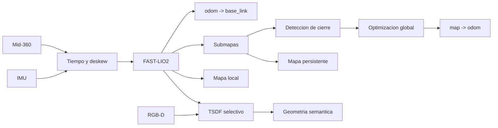

# LiDAR, SLAM y reconstruccion geometrica

Ultima modificacion: 2026-06-11 12:05:34 -05 -0500

## Objetivo

Mantener pose continua para control, corregir deriva a escala de edificio y
producir geometria apta para navegacion y memoria, sin imponer una
reconstruccion densa donde una representacion mas simple sea suficiente.

## Baseline DimOS

**Hechos observados:**

- el G1 onboard usa Mid-360 y FAST-LIO2 nativo;
- FAST-LIO2 publica LiDAR, odometria, mapa global y TF `odom -> body`;
- existe PGO con GTSAM iSAM2 y deteccion de cierre por ICP/PCL;
- el stack contiene analisis de terreno, extension de mapa y mapa local;
- el montaje G1 del Mid-360 usa una altura configurada de 1.2 m;
- ya existen dependencias Open3D y visualizacion Rerun.

**Decision:** FAST-LIO2 es el baseline. No se reemplaza sin demostrar una
limitacion medida.

## Pipeline propuesto

## Comparacion de odometria y SLAM

| Sistema | Modalidad | Fortaleza | Coste/riesgo | Rol |
|---|---|---|---|---|
| FAST-LIO2 actual | LiDAR + IMU | Baseline ya integrado y rapido | Cierre global externo | Baseline |
| FAST-LIVO2 | LiDAR + IMU + vision | Mas señales en zonas geometricamente pobres | Calibracion y computo mayores | Candidato |
| Point-LIO | LiDAR + IMU | Alta frecuencia punto a punto | Integracion nueva | Candidato si dinamica lo exige |
| LIO-SAM | LiDAR + IMU + grafo | Arquitectura de factores conocida | Pipeline ROS e integracion | Referencia |
| KISS-ICP | LiDAR | Simplicidad como odometria | No aprovecha IMU en su forma base | Baseline diagnostico |
| RTAB-Map | RGB-D/estereo/LiDAR | Memoria y cierres multimodales | Complejidad y duplicacion | Candidato para relocalizacion |

La comparacion usa fuentes oficiales listadas en
[`fuentes.md`](../08_trazabilidad/fuentes.md). "Fortaleza" es una orientacion
de diseño; el resultado depende de sensor, escena y configuracion.

## Marcos

- `map`: referencia persistente y discontinua por optimizacion.
- `odom`: referencia local continua.
- `base_link`: cuerpo del robot para autonomia.
- `lidar_link`: origen calibrado del Mid-360.
- `camera_link` y optical frames: camara RGB-D.

La correccion de cierre se publica como `map -> odom`; no se inyecta un salto
en el lazo de control.

## Sincronizacion

Mid-360 admite fuentes de sincronizacion especificadas por el fabricante. La
arquitectura registra:

- timestamp de hardware;
- dominio de reloj;
- offset al reloj del host;
- deriva;
- edad al publicar;
- secuencia perdida.

La camara y LiDAR se sincronizan por timestamp y pose interpolada. Un
`ApproximateTimeSynchronizer` es candidato para flujos ROS 2, con tolerancia
medida, no elegida por conveniencia.

## Calibracion

1. Intrinsecos RGB y profundidad.
2. Extrinsecos RGB-profundidad si no vienen calibrados.
3. `base_link -> lidar_link`.
4. `base_link -> camera_link`.
5. Offset temporal sensor-host.
6. Validacion dinamica tras golpes o mantenimiento.

Kalibr es candidato para camara-IMU y calibracion temporal. LiDAR-camara
requiere un procedimiento adicional con objetivos o alineacion geometrica.
Cada resultado guarda fecha, equipo, dataset, residuo y version.

## Representaciones geometricas

| Producto | Tecnologia base | Resolucion inicial | Uso |
|---|---|---:|---|
| Nube/submapa LIO | FAST-LIO2 | Nativa/voxelizada | Registro y cierres |
| Occupancy local | Voxel/celdas | 0.05-0.20 m a medir | Colision |
| Costmap 2D/2.5D | Capas | 0.10-0.20 m | Navegacion |
| TSDF local | Open3D/Voxblox/nvblox candidato | Segun GPU y distancia | Superficies y objetos |
| Malla | Derivada de TSDF | Fuera de linea o selectiva | Visualizacion/medicion |
| Surfels | Discos orientados con normal/confianza | A medir | Fusion y render de superficie |

No se necesita una malla fotorealista para navegar. TSDF se restringe a zonas
de interes o reconstruccion experimental.

Los surfels son una representacion candidata cuando interesa conservar
superficie, normal y confianza sin extraer una malla completa. No se incluyen
en el MVP porque el mapa voxel/coste ya cubre navegacion y debe medirse si la
calidad adicional compensa memoria y complejidad.

## Comparacion de reconstruccion

| Opcion | Hardware | Integracion | Ventaja | Riesgo | Estado |
|---|---|---|---|---|---|
| Open3D TSDF | CPU/GPU | Ya es dependencia | Flexible para prototipo | No es stack de seguridad | Baseline de investigacion |
| Voxblox | CPU | ROS/C++ | TSDF/ESDF incremental | Repositorio con menor actividad | Candidato |
| nvblox | NVIDIA GPU | CUDA/ROS 2 | Reconstruccion y ESDF aceleradas | Dependencia NVIDIA | Candidato si hardware coincide |
| Nube voxelizada | CPU | DimOS actual | Simple y suficiente para varias tareas | Menos superficie semantica | MVP |

## Entornos dinamicos

Los puntos asociados a personas o tracks moviles:

- entran en la capa local de obstaculos;
- tienen tiempo de vida corto;
- no se consolidan automaticamente en el mapa persistente;
- pueden conservarse en el episodio para evaluacion;
- se reintegran como estructura solo tras evidencia temporal de inmovilidad.

El mapa persistente no se "limpia" borrando geometria ante una sola
observacion contradictoria.

## Relocalizacion

Orden de recuperacion:

1. usar continuidad LIO;
2. alinear submapa local con mapa persistente;
3. buscar cierre de lazo;
4. usar firma visual/RGB-D como candidato;
5. solicitar teleoperacion si la hipotesis es ambigua.

El sistema no declara `TRACKING` hasta verificar residuo, covarianza y
consistencia temporal.

## Benchmark

Datasets:

- trayectorias repetidas en laboratorio;
- bucles cortos y largos;
- pasillos con geometria repetitiva;
- personas cruzando;
- inicio en ubicacion distinta;
- vibracion y cambios de velocidad;
- ground truth por sistema externo cuando este disponible.

Metricas:

| Categoria | Metrica |
|---|---|
| Trayectoria | ATE y RPE con `evo` |
| Continuidad | Saltos de pose y frames perdidos |
| Cierre | Precision/recall de loop closures |
| Mapa | Consistencia entre recorridos y distancia a referencia |
| Relocalizacion | Exito y tiempo |
| Tiempo real | p50/p95 por etapa, backlog |
| Recursos | CPU, GPU, RAM, VRAM, potencia |

## Ficha de subsistema

| Aspecto | Definicion |
|---|---|
| Objetivo | Pose continua y mapa geometricamente consistente |
| Entradas | LiDAR, IMU, RGB-D opcional y calibracion |
| Salidas | Odometria, TF, submapas, mapa y calidad |
| Responsabilidad | Estimacion y reconstruccion |
| Hardware | Mid-360, IMU, RGB-D, computo |
| Software | FAST-LIO2, PGO y reconstruccion selectiva |
| Integracion | Blueprint G1 onboard como baseline |
| Latencia | Sensor a odometria p95 < 50 ms, a validar |
| Sincronizacion | Hardware cuando sea posible |
| Marcos | `map`, `odom`, `base_link`, sensores |
| Persistencia | Submapas, grafo y calibraciones versionadas |
| Fallos | Paquetes, degeneracion, cierre falso, disco |
| Seguridad | Calidad explicita; `LOST` fuerza paro |
| Metricas | ATE, RPE, cierres, latencia y recursos |
| Criterio MVP | Recorrido repetible y relocalizacion controlada |

## Criterio de reemplazo

FAST-LIVO2 o Point-LIO solo avanzan si reducen significativamente deriva o
fallos de localizacion en escenarios donde FAST-LIO2 falla, sin incumplir el
presupuesto de control. KISS-ICP sirve como control experimental simple, no
como sustitucion asumida.
