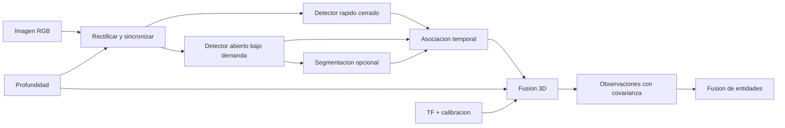

# Percepcion visual abierta y fusion RGB-D

Ultima modificacion: 2026-06-11 12:05:34 -05 -0500

## Objetivo y alcance

Detectar, segmentar y localizar objetos relevantes para una instruccion, sin
confundir una deteccion puntual con una entidad persistente. El MVP prioriza
personas, mobiliario, puertas, señales y objetos grandes; no promete
manipulacion fina.

## Estado actual de DimOS

**Hechos observados:**

- `Yolo2DDetector` usa YOLO11n de conjunto cerrado.
- `YoloPersonDetector` usa YOLO11n-pose y BoT-SORT.
- existe `Yoloe2DDetector` con prompts y LRPC;
- `Detection3DModule` proyecta detecciones a una nube usando calibracion y TF;
- `unitree-g1-detection` usa el detector de personas, no YOLOE;
- el blueprint G1 crea una webcam del host, no una RGB-D integrada del robot;
- `ObjectDBModule` usado por el blueprint tiene operaciones incompletas y no es
  la implementacion mas robusta disponible en el repositorio.

## Diseño propuesto



Dos niveles evitan ejecutar el modelo abierto mas costoso en cada frame:

1. detector rapido permanente para clases de seguridad;
2. detector abierto activado por consulta, incertidumbre o exploracion.

## Sensores

| Opcion | Rol | Ventaja | Limitacion | Decision |
|---|---|---|---|---|
| Intel RealSense D455/D455f | RGB-D cercano | Profundidad directa y global shutter | Sol y superficies dificiles | Candidato principal de MVP |
| Stereolabs ZED 2i | Estereo de mayor alcance | Carcasa robusta y ecosistema | Computo y dependencia de SDK | Candidato |
| Webcam actual | RGB de respaldo | Ya integrada | Sin profundidad, calibracion provisional | Solo desarrollo |
| Profundidad monocular | Prior/fallback | Usa una camara RGB | Escala e incertidumbre | No fuente primaria de seguridad |

La seleccion final exige medir vibracion, iluminacion, rango, FOV compartido
con LiDAR, consumo y soporte en la computadora real.

## Tecnologias de deteccion

| Tecnologia | Apertura de vocabulario | Segmentacion | Perfil esperado | Licencia a revisar | Uso propuesto |
|---|---|---|---|---|---|
| YOLOE | Texto, visual y vocabulario interno | Si | Tiempo real optimizado | Repositorio oficial | Primera candidata abierta |
| YOLO-World | Texto | No en detector base | Tiempo real | Codigo/pesos oficiales | Comparativa |
| Grounding DINO | Texto | No | Mayor coste, buen grounding | Apache-2.0 en repo | Referencia de calidad |
| OWLv2 | Texto/imagen | No | Transformer general | Apache-2.0/model card | Comparativa fuera de linea |
| RT-DETR | Cerrado | No | Detector en tiempo real | Apache-2.0 en repo oficial | Baseline cerrado alterno |
| YOLO11n actual | Cerrado | Segun variante | Ligero | Terminos Ultralytics | Baseline del repositorio |

El estado "perfil esperado" es una **inferencia a validar en el hardware**. No
se trasladan FPS publicados en otras GPU al G1.

### VLM como razonador, no detector de seguridad

Un modelo vision-lenguaje (VLM) puede describir una escena, verificar una
relacion o desambiguar una consulta. No sustituye el detector de personas ni
la geometria local porque su latencia, consistencia espacial y salida textual
no forman un lazo de seguridad. Se evalua fuera del camino critico con:

- exactitud de preguntas visuales del almacen;
- alucinacion de objetos ausentes;
- grounding correcto sobre detecciones verificables;
- latencia, VRAM y coste;
- capacidad local frente a remota;
- procedencia de la evidencia usada en la respuesta.

OWL-ViT se conserva como antecedente de OWLv2, no como candidato prioritario
si su sucesor esta disponible bajo condiciones comparables.

## Segmentacion

SAM 2 es candidato para:

- refinar profundidad dentro de una caja;
- separar dos objetos solapados;
- propagar una mascara durante una consulta;
- producir evidencia visual para etiquetado.

No se ejecuta por defecto en todo frame. Se adopta solo si mejora error 3D,
asociacion o navegacion en una cantidad superior a su coste de latencia y
memoria.

## Estimacion de profundidad

Orden de confianza:

1. profundidad RGB-D valida y filtrada;
2. interseccion con nube LiDAR temporalmente alineada;
3. triangulacion multivista con pose;
4. profundidad monocular calibrada como prior;
5. rayo sin rango, conservado como observacion incompleta.

Depth Anything V2 Small es candidato de fallback por licencia permisiva. Sus
modelos mayores tienen restricciones distintas; no se asume que todos sean
intercambiables. Metric3D se mantiene como candidato academico con revision de
licencia antes de uso comercial.

## Fusion 3D

Para una mascara o caja:

1. descartar profundidad fuera de rango o con baja confianza;
2. erosionar bordes para reducir mezcla fondo/objeto;
3. transformar puntos al frame de mapa en el tiempo de captura;
4. estimar centro robusto, extents y covarianza;
5. conservar la nube o estadisticos como referencia de evidencia;
6. publicar observacion, no entidad definitiva.

Un punto central de caja no basta para objetos parcialmente ocluidos.

## Tracking

| Tracker | Señal | Ventaja | Uso |
|---|---|---|---|
| ByteTrack | Movimiento + scores bajos | Baseline simple y fuerte | Comparacion |
| BoT-SORT | Movimiento, apariencia y compensacion de camara | Ya usado en DimOS | Baseline principal |
| SAM 2 video | Mascara temporal | Contorno consistente | Consulta puntual |
| Tracker 3D propio | Pose, covarianza y clase | Persistencia en mundo | Capa necesaria |

El identificador 2D del tracker es de sesion y camara. No se usa como
identificador persistente global.

## Prompts abiertos

Los prompts se forman desde un vocabulario controlado:

```text
canonical_label: fire_extinguisher
aliases: [extintor, extinguisher]
negative_context: [poster, reflection]
requested_by: mission_id
```

Una frase recuperada de memoria o leida en la escena no se convierte en prompt
operativo sin saneamiento. Se registran texto, version del detector y umbral.

## Benchmark propuesto

Conjunto propio capturado desde la altura y movimiento del G1:

- 1,500 imagenes anotadas como meta inicial;
- tres condiciones de iluminacion;
- distancias de 0.5 a 8 m;
- oclusion y motion blur;
- clases conocidas, clases abiertas y objetos ausentes;
- personas sin usar identidad biometrica;
- escenas con espejos y pantallas.

Tabla que debe completar el experimento:

| Modelo/configuracion | Resolucion | Precision | Recall | mAP50-95 | Error 3D mediano | p95 ms | VRAM pico | W |
|---|---:|---:|---:|---:|---:|---:|---:|---:|
| YOLO11n baseline | A medir | A medir | A medir | A medir | A medir | A medir | A medir | A medir |
| YOLOE | A medir | A medir | A medir | A medir | A medir | A medir | A medir | A medir |
| YOLO-World | A medir | A medir | A medir | A medir | A medir | A medir | A medir | A medir |
| Grounding DINO | A medir | A medir | A medir | A medir | A medir | A medir | A medir | A medir |
| OWLv2 | A medir | A medir | A medir | A medir | A medir | A medir | A medir | A medir |

Comparacion de integracion que tambien debe medirse:

| Familia | Open vocabulary | Tracking integrado | Entrenamiento propio necesario | Jetson | Laptop GPU | Integracion | Licencia/pesos | Utilidad en almacen |
|---|---|---|---|---|---|---|---|---|
| YOLO11n | No | Disponible en stack actual | No para baseline | Perfilar | Perfilar | Ya integrada | Revisar terminos Ultralytics | Personas/clases frecuentes |
| YOLOE | Si | Requiere tracker externo | No para prompts iniciales | Perfilar/optimizar | Perfilar | Adaptador DimOS existente | Revisar codigo y pesos | Objetos solicitados |
| YOLO-World | Si | Externo | No para vocabulario base | Perfilar/optimizar | Perfilar | Nueva | Revisar repo/pesos | Comparativa abierta |
| Grounding DINO | Si | Externo | No para baseline | Probable offload, a medir | Perfilar | Nueva | Apache-2.0 en repo; revisar pesos | Referencia de grounding |
| OWLv2/OWL-ViT | Si | Externo | No para baseline | Perfilar | Perfilar | Nueva | Model card/licencia | Referencia abierta |
| RT-DETR | No | Externo | Solo para clases propias | Perfilar | Perfilar | Nueva | Apache-2.0 en repo | Detector cerrado alterno |
| VLM | Consulta visual | No | Depende del modelo | Perfilar cuantizado | Perfilar | Tool no critica | Especifica del modelo | Desambiguacion/verificacion |

"Perfilar" evita prometer compatibilidad por el nombre del dispositivo. El
benchmark registra modelo exacto de Jetson o GPU de laptop, precision numerica,
runtime, resolucion, batch, potencia y throttling termico.

Para vocabulario abierto se añade:

- recall de clase solicitada;
- tasa de deteccion cuando la clase no esta presente;
- sensibilidad a sinonimos;
- estabilidad del nombre entre frames;
- latencia de cambio de prompt.

## Ficha de subsistema

| Aspecto | Definicion |
|---|---|
| Objetivo | Observaciones visuales 2D/3D con incertidumbre |
| Entradas | RGB, profundidad, TF, prompts y calibracion |
| Salidas | Detecciones, tracks y observaciones 3D |
| Responsabilidad | Inferencia y geometria de observacion |
| Hardware | RGB-D, GPU opcional |
| Software | Detector, tracker, segmentador y sincronizador |
| Integracion | Streams tipados; consulta por skill |
| Latencia | Objetivo p95 < 200 ms para personas |
| Sincronizacion | Timestamp de captura y aproximacion acotada |
| Marcos | Optical frame a `map` mediante TF |
| Persistencia | Evidencia referenciada; entidades en otra capa |
| Fallos | Frame viejo, profundidad invalida, modelo no disponible |
| Seguridad | Detector de personas rapido independiente de consulta LLM |
| Metricas | mAP, recall, error 3D, IDF1/HOTA, p95, VRAM |
| Criterio MVP | Persona/obstaculo dinamico y consulta abierta reproducibles |

## Criterio de adopcion

YOLOE es la primera candidata porque ya existe un adaptador en el repositorio,
pero solo reemplaza o complementa el baseline si mejora recall abierto dentro
del presupuesto de latencia. Grounding DINO y OWLv2 son referencias, no una
decision anticipada.
