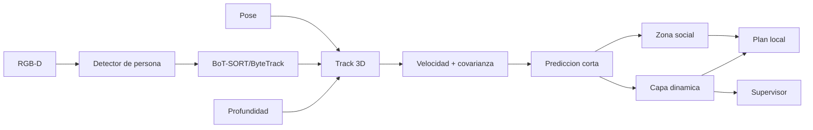

# Personas y entornos dinamicos

Ultima modificacion: 2026-06-11 11:46:53 -05 -0500

## Objetivo

Navegar cerca de personas de forma conservadora, predecible y respetuosa de
privacidad. La meta no es identificar individuos, sino estimar ocupacion,
movimiento e interaccion necesaria.

## Separacion de conceptos

| Concepto | Duracion | Identidad |
|---|---|---|
| Deteccion | Un frame | Ninguna |
| Track 2D | Segundos, una camara | ID efimero |
| Track 3D | Segundos-minutos, mundo local | ID de sesion |
| Persona semantica | Solo con consentimiento | ID autorizado |
| Zona social | Mientras exista contexto | Asociada al track, no a identidad |

Una etiqueta visual no autoriza reconocimiento facial. El MVP no incluye
biometria.

## Pipeline



## Modelo de track

```text
track_id
position_xy
velocity_xy
covariance
heading_if_observable
first_seen
last_seen
occlusion_state
source_observations
privacy_class
```

La prediccion se limita a un horizonte corto y aumenta incertidumbre con el
tiempo. No se extrapola una trayectoria humana a largo plazo como hecho.

## Zonas

| Zona | Funcion | Parametro inicial |
|---|---|---:|
| Colision | Nunca penetrar | Huella + margen dinamico |
| Personal | Evitar salvo interaccion confirmada | 1.0 m candidato |
| Frontal | Penalizar aproximacion de frente | Elipse dependiente de velocidad |
| Paso | No bloquear puertas/pasillos | Derivada del mapa semantico |
| Incertidumbre | Inflar track mal observado | Covarianza |

Los valores son **candidatos culturales y de seguridad**, no universales. Se
ajustan con protocolo de usuarios y distancia de frenado.

## Planificacion

Tres niveles:

1. Costmap dinamico con caducidad para obstaculos observados.
2. Costes sociales anisotropicos para comodidad.
3. Supervisor independiente para distancia minima y tiempo a colision.

ORCA es candidato para escenarios multiagente, pero no sustituye deteccion,
prediccion ni frenado. Un plugin social de Nav2 puede acelerar prototipos; se
compara con una capa propia antes de adoptarlo.

## Conductas

### Cruce de persona

- reducir velocidad;
- preservar distancia;
- ceder si la prediccion se intersecta;
- reanudar solo con ventana estable.

### Persona bloqueando un paso

- esperar un tiempo acotado;
- buscar ruta alternativa;
- pedir paso verbalmente solo si la politica lo permite;
- solicitar ayuda, nunca forzar el paso.

### Aproximacion solicitada

- confirmar objetivo si hay varias personas;
- elegir un punto de interaccion fuera de zona personal;
- aproximarse de frente visible y a velocidad reducida;
- anunciarse;
- detenerse si la persona se aleja o muestra conflicto de trayectoria.

### Perdida de track

- conservar una zona inflada durante TTL corto;
- reducir velocidad;
- no perseguir una posicion predicha indefinidamente;
- cancelar seguimiento al agotar el presupuesto.

## Personas y mapa persistente

Una persona no se integra como obstaculo estatico. Se guardan, segun politica:

- estadisticas anonimas de ocupacion agregada;
- eventos de bloqueo ligados al episodio;
- lugares de interaccion, no rutas individuales;
- identidad solo con consentimiento explicito y acceso restringido.

## Fallos peligrosos

| Fallo | Riesgo | Mitigacion |
|---|---|---|
| Falso negativo de persona | Colision | LiDAR/capa geometrica + velocidad conservadora |
| Falso positivo | Bloqueo innecesario | Confirmacion temporal |
| ID switch | Prediccion incorrecta | Asociacion 3D y covarianza |
| Profundidad contaminada | Posicion falsa | Estadistico robusto y mascara |
| Frame retrasado | Track obsoleto | Edad maxima |
| Oclusion | Reaparicion inesperada | Zona de incertidumbre |
| Espejo/pantalla | Persona no fisica | Consistencia 3D |
| Multitud | Plan local inestable | Espera, repliegue o teleop |

## Metricas

| Metrica | Motivo |
|---|---|
| Precision/recall de persona | Cobertura perceptual |
| HOTA, IDF1 e ID switches | Calidad de tracking |
| Error de posicion/velocidad 3D | Calidad geometrica |
| Minimum separation distance | Seguridad |
| Time-to-collision minimo | Riesgo dinamico |
| Intervenciones por hora | Robustez |
| Tiempo bloqueando paso | Comportamiento social |
| Exito de cruce | Utilidad |
| Confort percibido | Evaluacion con usuarios |

## Protocolo de evaluacion

1. Maniqui u obstaculo blando para validacion inicial.
2. Actor informado, robot a velocidad minima y operador con paro.
3. Cruce perpendicular y diagonal.
4. Persona quieta, caminando y cambiando direccion.
5. Dos y luego varias personas.
6. Oclusion tras una esquina.
7. Evaluacion subjetiva solo despues de superar limites objetivos.

## Criterios MVP

- Frenado independiente del clasificador visual.
- Tracks caducan y nunca contaminan el mapa estatico.
- Distancia minima sin violaciones en los ensayos definidos.
- Todo acercamiento intencional usa velocidad reducida.
- No se almacena identidad biometrica.
- Una multitud o incertidumbre alta produce espera o asistencia, no una
  conducta agresiva.

