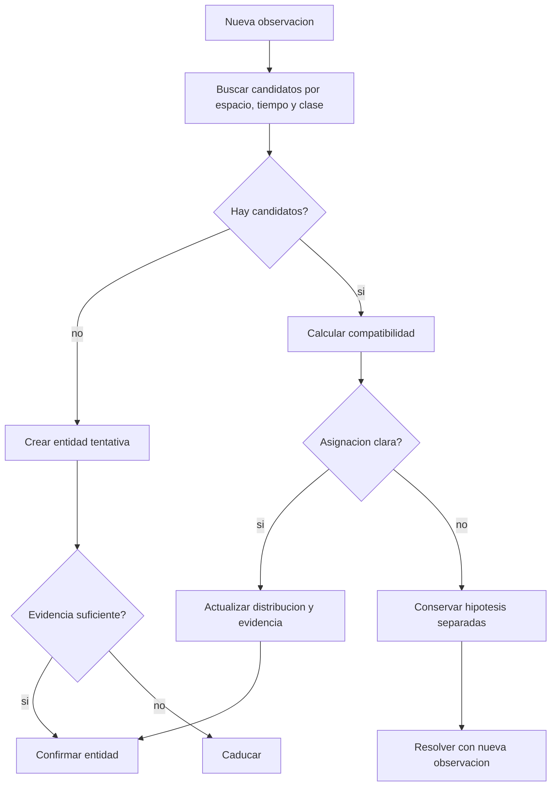

# Memoria semantica espacial

Ultima modificacion: 2026-06-11 12:05:34 -05 -0500

## Objetivo

Responder preguntas y resolver objetivos como "la mesa del laboratorio" usando
evidencia espacial persistente, sin convertir cada deteccion en un hecho ni
mezclar historial conversacional con estado del mundo.

## Estado actual

**Hechos observados:**

- `SpatialMemory` conserva frames, poses y embeddings CLIP;
- usa ChromaDB/VisualMemory y APIs marcadas como memoria anterior;
- `new_memory=True` puede iniciar una memoria nueva;
- los lugares nombrados se mantienen en una lista de proceso;
- la consulta combina texto, tags y pose;
- `ObjectDBModule` del blueprint de deteccion tiene metodos incompletos;
- existe otra implementacion `objectDB.py` con estados temporales y TTL, pero
  no es la usada por el blueprint.

La base demuestra recuperacion visual, pero no un modelo persistente,
transaccional y auditable de entidades espaciales.

## Capas de memoria

| Memoria | Contenido | Retencion | Fuente de verdad |
|---|---|---|---|
| Trabajo | Objetivo, referencias del turno, tracks | Segundos-minutos | Orquestador |
| Episodica | Sensores, skills, eventos y resultados | Politica de ensayo | MCAP/trazas |
| Semantica | Lugares, objetos, relaciones y alias | Persistente | Base espacial |
| Geometrica | Submapas, occupancy y malla selectiva | Persistente/versionada | SLAM |
| Conversacional | Mensajes y resumen | Sesion/politica | Almacen de agente |

No se usa el vector store como fuente unica de verdad.

## Modelo de datos propuesto

### Entidad

```text
entity_id: UUID
entity_type: PLACE | OBJECT | PERSON_CONSENTED | REGION
canonical_label
aliases[]
geometry
pose_mean
pose_covariance
bbox_2d_latest
bbox_3d_or_geometry
map_id
valid_from
valid_to
status
mobility: STATIC | MOVABLE | DYNAMIC | UNKNOWN
observation_count
attributes JSON
embedding
created_by
evidence_refs[]
schema_version
```

### Observacion

```text
observation_id
entity_id nullable
timestamp
sensor_id
pose/ray
covariance
labels + scores
embedding_ref
media_ref
model_version
mission_id
```

### Relacion

```text
subject_id
predicate: INSIDE | ON | NEAR | CONNECTED_TO | VISIBLE_FROM | IN_ROOM | IN_AISLE | ON_SHELF
object_id
confidence
valid_from
valid_to
evidence_refs[]
```

## Tecnologia

**Propuesta principal:** PostgreSQL + PostGIS + pgvector.

| Necesidad | Componente |
|---|---|
| Geometria, distancia e interseccion | PostGIS |
| Integridad, transacciones y versionado | PostgreSQL |
| Similitud de embeddings | pgvector |
| Datos flexibles de modelos | JSONB |
| Evidencia grande | Almacen de objetos/MCAP referenciado |

Alternativas:

| Opcion | Ventaja | Limitacion | Uso |
|---|---|---|---|
| SQLite + RTree | Despliegue simple y offline | Menor concurrencia/servicios espaciales | MVP de un host |
| Qdrant + base espacial | Busqueda vectorial especializada | Dos fuentes a reconciliar | Escala futura |
| Chroma actual | Ya existe | Modelo espacial e integridad limitados | Baseline de comparacion |

La primera implementacion puede usar SQLite si reduce riesgo del MVP, siempre
que respete el contrato y permita migracion. PostgreSQL es el destino de
referencia, no una condicion para mover el robot.

## Fusion de entidades



La similitud visual no basta. La asociacion combina:

- compatibilidad espacial con covarianza;
- tiempo y movilidad esperada;
- clase y atributos;
- embedding;
- topologia del lugar;
- evidencia negativa.

## Conflictos

Ejemplo: una silla fue observada en dos lugares.

1. Si es movil, cerrar vigencia de la pose anterior y abrir una nueva.
2. Si ambas observaciones pueden coexistir, crear entidades distintas.
3. Si la asociacion es ambigua, conservar hipotesis.
4. Nunca sobreescribir evidencia historica.
5. La respuesta al agente expresa incertidumbre.

## Consulta hibrida

```sql
-- Esquema conceptual, no implementacion final.
SELECT entity_id, canonical_label
FROM entities
WHERE ST_DWithin(geometry, :robot_pose, :radius)
  AND status = 'CONFIRMED'
ORDER BY embedding <=> :query_embedding,
         ST_Distance(geometry, :robot_pose);
```

El ranking combina filtros duros espaciales y temporales con similitud
semantica. Una busqueda vectorial no puede devolver una entidad retirada como
objetivo actual sin indicarlo.

## Lugares

Un lugar se representa como region o nodo topologico, no solo como una pose:

- poligono transitable;
- puntos de aproximacion;
- entradas y salidas;
- alias;
- restricciones;
- observaciones que justifican el nombre;
- relacion con el mapa y su version.

El objetivo de navegacion se elige dentro de la region y se valida contra el
costmap actual.

## Persistencia y mapas

Cada entidad referencia un `map_id`. Tras una nueva optimizacion global:

- las poses se transforman mediante la correccion conocida;
- se conserva la version anterior;
- entidades sin transformacion confiable quedan `STALE`;
- una relocalizacion no fusiona automaticamente dos mapas.

## Privacidad

- Personas anonimas usan tracks de sesion y no se persisten como identidad.
- Una persona nombrada exige consentimiento y finalidad documentada.
- Audio, imagen facial y embeddings sensibles tienen controles separados.
- Las consultas registran principal y motivo.
- Se soporta borrado de entidad y de sus indices derivados.

## API conceptual

```text
observe(observation) -> observation_id
resolve(query, spatial_context, time_context) -> ranked entities
remember_place(name, region, evidence) -> entity_id
get_entity(entity_id) -> entity + provenance
correct_entity(entity_id, patch, evidence) -> new version
retire_entity(entity_id, reason) -> status
```

Las escrituras no se exponen directamente al LLM. Una skill valida el cambio.

## Metricas

| Categoria | Metrica |
|---|---|
| Recuperacion | Recall@k, MRR y nDCG |
| Espacio | Error de pose y region |
| Asociacion | Precision/recall de merge, split incorrecto |
| Persistencia | Recuperacion tras reinicio |
| Frescura | Edad de entidad devuelta |
| Rendimiento | p50/p95 de lectura/escritura |
| Explicabilidad | Respuestas con evidencia valida |
| Privacidad | Accesos no autorizados aceptados |

## Ficha de subsistema

| Aspecto | Definicion |
|---|---|
| Objetivo | Resolver entidades y lugares con procedencia |
| Entradas | Observaciones, mapas, correcciones y nombres autorizados |
| Salidas | Entidades, relaciones y regiones rankeadas |
| Responsabilidad | Persistencia y fusion, no deteccion |
| Hardware | SSD suficiente y respaldo |
| Software | PostGIS/pgvector o SQLite/RTree inicial |
| Integracion | Skills de consulta y eventos de percepcion |
| Latencia | Consulta local p95 < 200 ms como objetivo |
| Sincronizacion | Tiempo de evidencia y version de mapa |
| Marcos | Geometrias ligadas a `map_id` |
| Persistencia | Transaccional, versionada, con migraciones |
| Fallos | Base caida, conflicto, disco, mapa incompatible |
| Seguridad | Control de acceso, retencion y borrado |
| Metricas | Recall@k, error espacial, fusiones y p95 |
| Criterio MVP | Recordar y reencontrar lugares tras reinicio |

## Aporte propio

La memoria propuesta une consulta semantica, geometria, vigencia y procedencia
en un contrato que puede evaluarse. Esto permite estudiar cuanto aporta cada
señal en vez de presentar una recuperacion visual aislada como "memoria".
