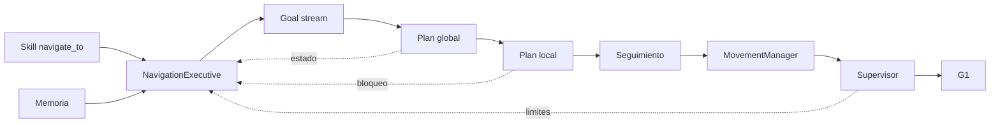
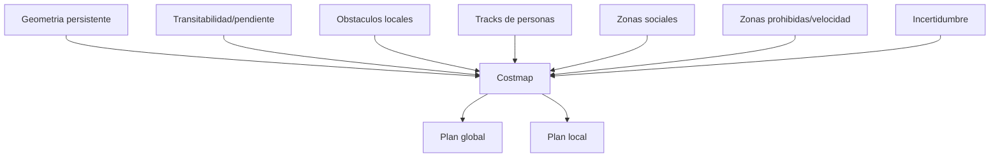

# Navegacion segura y semantica

Ultima modificacion: 2026-06-11 12:05:34 -05 -0500

## Objetivo

Convertir una entidad o region semantica en movimiento seguro, medible y
cancelable. La navegacion debe funcionar sin el LLM una vez aceptada la mision.

## Estado actual

**Hechos observados:**

- `unitree-g1-nav-onboard` integra FAST-LIO2, PGO, analisis de terreno,
  extension de mapa, planificador y seguidor;
- usa un planificador simple configurable, mapa de coste, replanning y
  `MovementManager`;
- el mapa local contiene parametros para decaimiento y limpieza dinamica;
- teleoperacion cancela el objetivo de navegacion;
- el blueprint agentico G1 completo no incorpora este stack;
- `NavigationSkillContainer` requiere `NavigationInterfaceSpec`;
- el stack onboard recibe objetivos por streams y no se observo el proveedor
  RPC correspondiente.

Esta brecha de interfaz impide asumir que la skill de navegacion funciona en el
G1 real agentico.

## Primer cambio arquitectonico

Crear un adaptador `NavigationExecutive` que:

- implemente el contrato esperado por la skill;
- publique objetivos al stack nativo;
- observe estado, progreso y calidad de localizacion;
- traduzca cancelacion a paro confirmado;
- exponga causas de fallo;
- no publique velocidades directamente.



## Planificacion global

Baseline: planificador DimOS simple sobre mapa de coste, porque ya esta
integrado. Comparar:

| Candidato | Representacion | Ventaja potencial | Riesgo | Activacion |
|---|---|---|---|---|
| DimOS simple | Grid/point map | Menor integracion | Conducta en dinamicos | Baseline |
| FarPlanner de DimOS | Topologia/terreno | Ya existe opcion en factory | Complejidad | Mapas extensos |
| Nav2 Smac/A* | Costmap 2D | Ecosistema y plugins | Puente ROS 2 | Si baseline limita |
| Hybrid A* | Estado continuo con primitivas | Respeta mejor cinematicas no holonomicas | Mas coste y modelo correcto | Si el modo G1 lo requiere |
| Grafo topologico | Nodos de lugares/conectividad | Planificacion de edificio y semantica | Construccion/mantenimiento del grafo | Escala multi-area |

A* sobre grid es suficiente como referencia geometrica; Hybrid A* solo aporta
si las restricciones de giro y desplazamiento lateral del modo G1 hacen
invalidas las rutas del grid. El grafo topologico no reemplaza el plan local:
elige corredores o regiones y delega la geometria fina.

No se migra todo el stack a Nav2 antes de medir tasa de exito y causas de
fallo del baseline.

## Planificacion local

| Opcion | Caracteristica | Estado propuesto |
|---|---|---|
| Seguidor DimOS actual | Ya conectado al G1 | Baseline |
| Nav2 MPPI | Control predictivo y criticos configurables | Primer candidato |
| DWB | Ventana dinamica y scoring | Referencia simple |
| DWA | Familia de ventana dinamica | Referencia conceptual; DWB es su implementacion extensible en Nav2 |
| TEB | Optimizacion temporal de trayectoria | Candidato si footprint/holonomia encajan |
| ORCA | Evitacion reciproca multiagente | Capa experimental para multitudes |

El G1 no se modela automaticamente como base diferencial. El modelo debe
reflejar velocidad lateral permitida, huella, oscilacion corporal y limites
del modo locomotor usado.

## Capas de coste



Las capas tienen propietario y TTL. Limpiar una capa dinamica no borra
geometria persistente.

## Resolucion semantica

Para "ve a la mesa":

1. memoria devuelve entidades candidatas;
2. el orquestador aclara si hay ambiguedad;
3. se obtiene una region de aproximacion;
4. se muestrean poses libres orientadas al objeto;
5. el planificador evalua alcanzabilidad;
6. se elige una pose y se conserva el vínculo con la entidad;
7. al final se verifica distancia y visibilidad, no solo coordenadas.

## Recuperaciones

Presupuesto cerrado:

| Causa | Recuperacion |
|---|---|
| Plan global imposible | Probar otra pose de aproximacion |
| Obstaculo temporal | Esperar y replanificar |
| Oscilacion local | Parar, ampliar contexto y cambiar trayectoria |
| Sin progreso | Retroceso corto solo si supervisor lo autoriza |
| Localizacion degradada | Reducir velocidad y relocalizar |
| Objetivo movido | Resolver entidad otra vez |
| Presupuesto agotado | Parar y pedir ayuda |

No se ejecutan ciclos ilimitados de limpiar mapa y reintentar.

## Arbitraje

Prioridad propuesta:

```text
ESTOP > seguridad reactiva > teleoperacion autorizada > cancelacion >
navegacion > conductas de demostracion
```

Cada fuente tiene latido, vencimiento y estado. Cambiar de fuente aplica una
rampa segura y queda registrado.

## Metricas

| Categoria | Metrica |
|---|---|
| Exito | Success rate y SPL |
| Eficiencia temporal | SCT |
| Trayectoria | Longitud, suavidad, oscilaciones |
| Seguridad | Colisiones, near misses, separacion minima |
| Dinamicos | Exito con cruces y bloqueos |
| Recuperacion | Exito por causa y reintentos |
| Semantica | Objetivo correcto y postcondicion |
| Operacion | Intervenciones por km/hora |
| Tiempo real | p95 de plan global/local y comandos vencidos |

SPL y SCT se reportan junto a seguridad; una ruta corta no compensa una
violacion de distancia.

## Escenarios

1. Objetivo geometrico visible.
2. Lugar recordado tras reinicio.
3. Dos entidades con el mismo nombre.
4. Pasillo bloqueado temporalmente.
5. Persona cruzando.
6. Objetivo movido.
7. Relocalizacion a mitad de mision.
8. Cancelacion por voz, texto y teleop.
9. Perdida de red del LLM.
10. Obstaculo fuera del campo visual de la camara pero visible en LiDAR.

## Ficha de subsistema

| Aspecto | Definicion |
|---|---|
| Objetivo | Alcanzar una region con movimiento seguro |
| Entradas | Goal, mapas, tracks, localizacion y politicas |
| Salidas | MotionRequest, progreso y resultado |
| Responsabilidad | Planificar/seguir, no autorizar movimiento final |
| Hardware | Computadora de autonomia y sensores |
| Software | Stack DimOS baseline; MPPI/Nav2 candidatos |
| Integracion | `NavigationExecutive` resuelve RPC-stream |
| Latencia | Plan local dentro del periodo configurado |
| Sincronizacion | Mapas y tracks por timestamp |
| Marcos | `map` para goal, `odom` para control continuo |
| Persistencia | Misiones/planes; no costmap local completo |
| Fallos | Sin plan, bloqueo, oscilacion, localizacion |
| Seguridad | Supervisor fuera del planificador |
| Metricas | SPL, SCT, exito, distancia e intervenciones |
| Criterio MVP | 90 % de exito en ruta estatica definida, sin colision |

El 90 % es un **umbral inicial de laboratorio**; el conjunto de escenarios y
numero de repeticiones deben publicarse junto al resultado.

## Decision de integracion

La ruta de menor riesgo es conectar el stack G1 onboard existente al contrato
agentico y medirlo. Nav2 MPPI se evalua como alternativa controlada, no como
reescritura previa a tener baseline.
