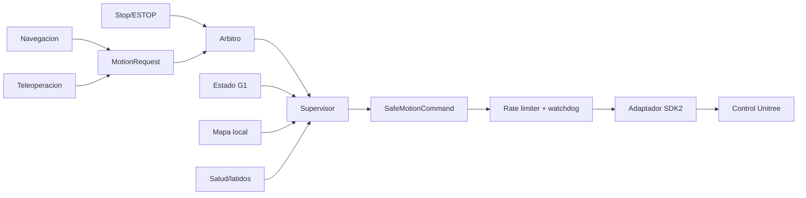
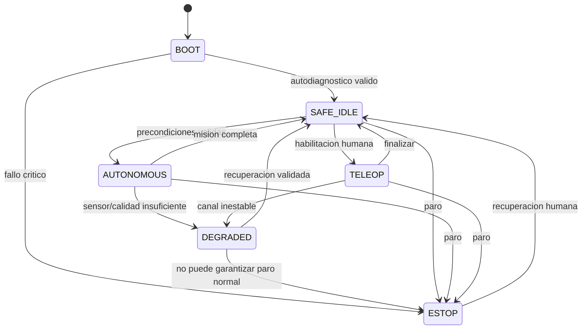

# Control del G1 y seguridad operacional

Ultima modificacion: 2026-06-11 12:05:34 -05 -0500

## Alcance

Definir la frontera entre autonomia y las interfaces Unitree. Este documento
no sustituye el manual del fabricante, un analisis formal de riesgos ni los
procedimientos del laboratorio.

## Interfaces encontradas

**Hechos observados en DimOS:**

- `G1Connection` usa una ruta WebRTC de alto nivel y recibe `cmd_vel`;
- `G1HighLevelDdsSdk` usa SDK2/DDS y `LocoClient`;
- la ruta DDS contiene un timeout corto cuando no se especifica duracion;
- `G1WholeBodyConnection` controla 29 motores a 500 Hz y libera sport mode;
- existe un coordinador de cuerpo completo separado;
- la skill G1 expone movimiento por velocidad/duracion y gestos;
- `MovementManager` arbitra teleop y navegacion, y teleop cancela el goal.

La coexistencia de rutas de alto y bajo nivel exige una politica explicita.

## Decision por nivel

| Nivel | Uso agentico | Politica |
|---|---|---|
| Alto nivel DDS/locomocion | Navegacion del MVP | Permitido mediante supervisor |
| Alto nivel WebRTC | Compatibilidad/teleop segun banco | Una sola ruta activa |
| Bajo nivel 29 motores/500 Hz | Investigacion locomotora especializada | Fuera del MVP agentico |
| Gestos predefinidos | Demostracion con robot inmovil | Allowlist y confirmacion |

No se ejecutan simultaneamente dos autoridades de locomocion. El modo activo
se valida contra el estado real del G1.

## Politicas aprendidas

Una politica aprendida puede mejorar locomocion, recuperacion o seguimiento de
trayectoria, pero pertenece debajo del supervisor y no al agente. Para el MVP:

- no se entrena online en el G1;
- no cambia limites ni modos;
- recibe observaciones acotadas y produce una referencia acotable;
- tiene un controlador baseline al que volver;
- se ensaya primero en simulacion y replay;
- se valida por distribuciones fuera de entrenamiento;
- registra pesos, entorno y normalizacion;
- un detector de salida fuera de distribucion fuerza fallback.

**Decision:** las politicas aprendidas de cuerpo completo quedan fuera del MVP.
Su futura comparacion debe medir estabilidad, tracking, energia, caidas,
transferencia sim-real y respuesta a perturbaciones, no solo recompensa.

## Cadena de control



## Supervisor

Entradas minimas:

- estado de modo y locomocion;
- pose/velocidad estimada;
- calidad de localizacion;
- distancias de obstaculo;
- tracks de personas;
- inclinacion y estado reportado;
- energia y temperatura disponibles;
- latidos de planificador, mapa y control;
- estado de paro;
- comando con fuente y vencimiento.

Salidas:

- comando acotado;
- estado operacional;
- razones de limitacion;
- evento de seguridad;
- solicitud de intervencion.

## Invariantes

1. Un comando vencido produce referencia cero.
2. `ESTOP` domina cualquier fuente.
3. Sin localizacion valida no hay navegacion global.
4. Sin mapa local fresco solo se permite paro o conducta aprobada de minima
   velocidad.
5. Ningun cambio de modo proviene directamente del LLM.
6. El adaptador rechaza una fuente no registrada.
7. Tras reinicio, el estado inicial es `SAFE_IDLE`.
8. La velocidad autorizada nunca supera el menor limite aplicable.
9. Un fallo de telemetria no se interpreta como espacio libre.
10. La recuperacion de paro exige una accion humana definida.

## Limites

```text
v_safe = min(
  v_mode,
  v_mission,
  v_localization,
  v_obstacle,
  v_person,
  v_compute_health
)
```

La distancia de frenado se obtiene experimentalmente por modo, superficie,
carga y velocidad. Los margenes del supervisor se derivan de esa medicion,
incluyendo latencia p95 y error de percepcion.

## Estados



## Paradas

| Tipo | Disparador | Efecto |
|---|---|---|
| Stop de mision | Usuario/orquestador | Rampa a cero y cancelacion |
| Stop protector | Supervisor | Frenado, mantiene sistema energizado |
| ESTOP | Boton/canal critico | Mecanismo definido con Unitree/laboratorio |
| Apagado | Procedimiento | Secuencia controlada, no accion LLM |

La semantica fisica de ESTOP debe validarse con la documentacion y hardware
Unitree disponible. No se equipara una llamada de software a un paro de
emergencia certificado.

## Watchdogs

| Señal | Timeout inicial | Respuesta |
|---|---:|---|
| MotionRequest | 200 ms | Rampa a cero |
| Estado G1 | 200 ms | Stop protector |
| Mapa local | 300 ms | Stop/reduccion segun velocidad |
| Localizacion | 300 ms | Stop de navegacion |
| Track de persona | Segun velocidad, <= 500 ms | Inflar incertidumbre y reducir |
| Orquestador | 2 s | Continuar skill determinista o cancelar |
| LLM | No participa en control | Ningun efecto directo |

Son valores de arranque para banco; se recalculan con la latencia medida.

## Gestos y postura

Un gesto se permite solo si:

- robot en area despejada;
- base detenida;
- modo confirmado;
- gesto en allowlist;
- volumen envolvente conocido;
- operador con paro;
- no hay persona dentro de la zona.

La skill devuelve estado real, no solo "gesto iniciado".

## Calificacion progresiva

1. Simulacion y replay.
2. Adaptador con salida desconectada.
3. G1 suspendido o banco autorizado.
4. Robot inmovil, solo estado y stop.
5. Velocidad minima en area cerrada.
6. Trayectorias estaticas.
7. Obstaculos y personas con protocolo.
8. Misiones agenticas completas.

Cada nivel tiene una lista de entrada y salida; fallar devuelve al nivel
anterior.

## Pruebas de seguridad

- comando vencido;
- proceso de navegacion congelado;
- paquete duplicado y fuera de orden;
- perdida de DDS/WebRTC;
- reinicio del adaptador;
- dos fuentes activas;
- obstaculo repentino;
- persona cruzando;
- localizacion con salto;
- mapa local atrasado;
- stop durante giro y traslacion;
- stop durante respuesta del LLM;
- agotamiento de CPU/GPU;
- modo Unitree inesperado.

## Metricas

| Metrica | Resultado requerido |
|---|---|
| Tiempo comando vencido a cero | Distribucion p50/p95/max |
| Distancia de parada | Por velocidad/superficie |
| Violaciones de limite | Cero en pruebas de aceptacion |
| Comandos rechazados | Conteo y razon |
| Near misses | Cero en MVP |
| Recuperaciones manuales | Tasa por hora |
| Disponibilidad de supervisor | Porcentaje |
| Cobertura de inyeccion de fallos | Casos ejecutados/definidos |

## Ficha de subsistema

| Aspecto | Definicion |
|---|---|
| Objetivo | Autorizar solo movimiento acotado y fresco |
| Entradas | Requests, estado, salud, mapa y tracks |
| Salidas | Comando seguro y eventos |
| Responsabilidad | Autoridad final de software |
| Hardware | Computadora segura, canal Unitree, paro |
| Software | Supervisor, arbitro, watchdog, SDK2 |
| Integracion | DDS preferido; una ruta activa |
| Latencia | Referencia a comando p95 < 40 ms candidato |
| Sincronizacion | Reloj monotono y timestamps |
| Marcos | Velocidad definida en frame documentado |
| Persistencia | Eventos y configuracion, no comandos reutilizables |
| Fallos | Red, estado, sensor, modo, sobrecarga |
| Seguridad | Invariantes, limites y recuperacion humana |
| Metricas | Parada, latencia, rechazos, near misses |
| Criterio MVP | Todos los fallos definidos terminan sin movimiento no autorizado |

## Limite de la afirmacion

Este diseño mejora la arquitectura de seguridad, pero no permite afirmar
"robot seguro" sin analisis de peligros, validacion del fabricante, hardware
de paro, procedimientos y ensayos independientes.
