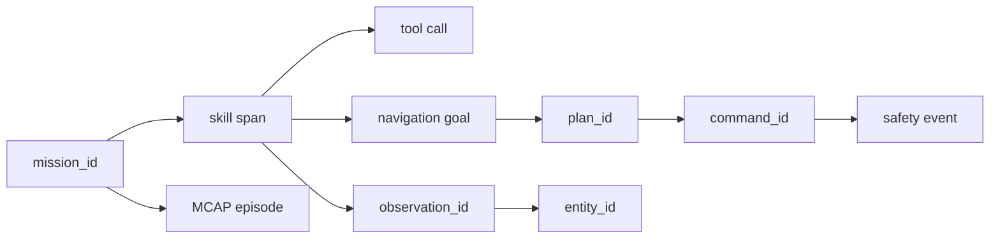

# Observabilidad, datos y reproducibilidad

Ultima modificacion: 2026-06-11 11:46:53 -05 -0500

## Objetivo

Poder responder despues de cada ensayo:

- que quiso hacer el sistema;
- que componentes y versiones participaron;
- que percibio;
- que ordeno;
- que limito el supervisor;
- por que termino;
- si el resultado puede reproducirse.

## Tres planos

| Plano | Contenido | Tecnologia candidata |
|---|---|---|
| Señales roboticas | Imagenes, nubes, TF, odometria, goals, comandos | MCAP |
| Eventos y trazas | Misiones, skills, modelos, DB, errores | OpenTelemetry |
| Visualizacion | Timeline, 3D, imagenes y estados | Rerun baseline; Foxglove candidato |

Rerun ya forma parte del repositorio y se mantiene como visualizador principal
del desarrollo. Foxglove se evalua si aporta inspeccion MCAP/ROS 2 que reduzca
tiempo de diagnostico.

## Correlacion



Todos los identificadores relevantes aparecen tanto en eventos como en el
indice del episodio. El video no es la unica fuente para explicar un fallo.

## Eventos minimos

```text
mission.received
mission.authorized
mission.state_changed
skill.started
skill.progress
skill.completed
perception.model_changed
entity.created
entity.associated
localization.quality_changed
navigation.plan_created
navigation.recovery
safety.command_limited
safety.stop
control.mode_changed
system.health_changed
```

Cada evento incluye tiempo, fuente, version de esquema, severidad y contexto
estructurado.

## Datos por episodio

```text
episodes/
  <episode_id>/
    manifest.yaml
    signals.mcap
    traces.jsonl
    metrics.json
    calibration_refs.yaml
    model_manifest.yaml
    report.md
```

Es una estructura conceptual. El almacenamiento real puede ser local y luego
sincronizado, preservando hashes.

## Manifiesto

```yaml
episode_id: uuid
scenario_id: dynamic-crossing-v1
start_time: RFC3339
git_commit: 06606d6f6ab767b659c597cc5bfe8e2a4eb56525
blueprint: proposed-g1-agentic
robot_id: pseudonym
map_id: uuid
calibrations:
  lidar_base: sha256
  camera_base: sha256
models:
  detector: name@hash
  llm: provider/model/version
privacy:
  raw_audio: false
  faces_retained: false
```

El commit corresponde a la base inspeccionada, no a una implementacion futura.

## Metricas de rendimiento

Para cada pipeline:

- tasa de entrada y salida;
- edad de dato;
- cola/backlog;
- p50, p95 y max de latencia;
- drops;
- CPU por proceso;
- RAM y VRAM;
- potencia/temperatura si existe sensor;
- reinicios y excepciones.

El promedio solo no es suficiente para control en tiempo real.

## Salud

Cada modulo publica:

```text
component
state: STARTING | HEALTHY | DEGRADED | FAILED | STOPPED
last_heartbeat
input_age
output_age
reason_codes[]
version
```

El supervisor consume solo las señales de salud necesarias para seguridad. Un
panel no es parte del lazo de paro.

## Registro de LLM y tools

Con proteccion de datos se conserva:

- modelo y parametros;
- hash del prompt de sistema;
- catalogo/version de tools;
- entrada saneada;
- salida estructurada;
- tool solicitada y autorizada;
- latencia y tokens;
- resultado y error;
- decision del orquestador.

Los secretos, audio sensible y contenido no necesario se redactan antes de
persistir o exportar.

## MCAP

MCAP se propone por su formato indexado para datos multimodales. Requisitos:

- esquemas y canales versionados;
- compresion medida;
- chunking que permita recuperacion tras caida;
- indice temporal;
- metadatos de calibracion;
- politica de rotacion;
- herramienta de replay que preserve timestamps originales y marque replay.

## Replay

Modos:

1. Reproduccion visual sin ejecutar control.
2. Reejecucion de percepcion con modelos nuevos.
3. Reejecucion de memoria/navegacion contra señales grabadas.
4. Hardware-in-the-loop con salida de motor bloqueada.

El replay nunca se conecta por defecto al adaptador real del G1.

## Rerun

Vistas propuestas:

- robot, TF y trayectoria;
- nube LiDAR y costmaps por capa;
- RGB/profundidad con detecciones;
- tracks, covarianzas y predicciones;
- entidades persistentes;
- plan global/local;
- comandos solicitados frente a autorizados;
- timeline de mision y eventos de seguridad.

## Alertas

| Condicion | Severidad |
|---|---|
| Localizacion `LOST` | Critica |
| Comando sin fuente/vencido | Critica |
| Paro activado | Critica |
| Sensor de seguridad atrasado | Alta |
| Backlog creciente | Alta |
| Memoria no disponible | Media |
| LLM no disponible | Media/baja durante mision determinista |
| Disco > 85 % | Alta |
| Cambio de modelo no registrado | Alta |

## Retencion

Clases:

- seguridad: conservar segun protocolo del laboratorio;
- investigacion: conservar mientras exista finalidad/consentimiento;
- audio/video personal: minimo necesario;
- mapas sin datos personales: politica independiente;
- trazas de LLM: redactadas y con acceso restringido.

Cada episodio tiene fecha de expiracion o fundamento para conservarlo.

## Reproducibilidad

Para publicar un resultado:

- escenario y mapa versionados;
- configuracion completa;
- commit y entorno;
- pesos/hash;
- semilla cuando aplique;
- numero de repeticiones;
- fallos incluidos, no solo exitos;
- script de metricas;
- intervalo de confianza;
- enlaces a datos publicables o descripcion de restricciones.

## Ficha de subsistema

| Aspecto | Definicion |
|---|---|
| Objetivo | Explicar y reproducir el comportamiento |
| Entradas | Señales, eventos, versiones y salud |
| Salidas | MCAP, trazas, paneles y metricas |
| Responsabilidad | Registro; no autoridad de control |
| Hardware | SSD, red de gestion y almacenamiento |
| Software | MCAP, OpenTelemetry, Rerun |
| Integracion | IDs comunes y reloj |
| Latencia | No bloquear pipelines criticos |
| Sincronizacion | Timestamps de captura + monotono |
| Marcos | TF completo y versionado |
| Persistencia | Rotacion, hashes y retencion |
| Fallos | Disco, reloj, exportador, volumen |
| Seguridad | Redaccion, acceso y replay aislado |
| Metricas | Completitud, drops y tiempo de diagnostico |
| Criterio MVP | Todo fallo de escenario tiene causa rastreable |

## Criterio de exito

Un evaluador debe poder reconstruir la secuencia de una mision sin acceder al
proceso vivo y distinguir entre error del agente, percepcion, mapa,
navegacion, supervisor o interfaz Unitree.

