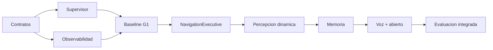

# MVP y roadmap de implementacion

Ultima modificacion: 2026-06-11 11:46:53 -05 -0500

## Definicion del MVP

El MVP demuestra una historia completa:

> El operador nombra un lugar, el G1 lo recuerda de forma persistente, recibe
> una orden por texto o voz, resuelve el lugar, navega con limites, evita una
> persona, puede ser cancelado y deja un episodio reproducible.

## Incluido

- una interfaz textual y ASR local;
- intenciones estructuradas;
- orquestador persistente;
- adaptador entre skills y navegacion G1 onboard;
- FAST-LIO2 + correccion global baseline;
- RGB-D y detector de personas;
- consulta abierta bajo demanda;
- memoria de lugares y objetos grandes;
- mapa dinamico de personas;
- supervisor, watchdog y arbitro;
- DDS/SDK2 de alto nivel;
- Rerun, MCAP y metricas;
- replay sin salida fisica.

## Excluido

- manipulacion;
- control de cuerpo completo;
- locomocion sobre escaleras o terreno extremo;
- reconocimiento facial;
- seguimiento persistente de individuos;
- conversaciones sociales prolongadas;
- aprendizaje online de politicas motoras;
- operacion publica no supervisada;
- afirmaciones de certificacion de seguridad.

## Fases

### Fase 0: contratos y banco seguro

Entregables:

- esquemas de mision, skill, estado y movimiento;
- simulador/fake del adaptador G1;
- supervisor con comandos vencibles;
- manifiesto de episodio;
- suite de inyeccion de fallos.

Puerta de salida:

- ningun test puede saltar el supervisor;
- cancelar siempre termina en estado seguro simulado;
- replay no alcanza hardware.

### Fase 1: baseline del repositorio

Entregables:

- ejecutar/reproducir G1 onboard sin agente;
- medir FAST-LIO2, mapa, planificador y follower;
- documentar calibracion;
- capturar escenarios estaticos;
- registrar causas de fallo.

Puerta de salida:

- baseline reproducible;
- no hay backlog sostenido;
- mapa y TF consistentes.

### Fase 2: navegacion agentica cerrada

Entregables:

- `NavigationExecutive`;
- `NavigateTo` por pose;
- estado, cancelacion y timeout;
- agente limitado a tools de lectura + navegacion;
- perdida de LLM durante skill.

Puerta de salida:

- >= 90 % de rutas estaticas definidas;
- stop y cancelacion aprobados;
- cero llamadas directas de movimiento desde LLM.

### Fase 3: RGB-D y dinamicos

Entregables:

- sensor calibrado;
- deteccion/tracking de personas;
- fusion 3D;
- capa dinamica con TTL;
- pruebas de cruces.

Puerta de salida:

- distancia minima cumplida;
- tracks no contaminan mapa persistente;
- frame atrasado fuerza degradacion.

### Fase 4: memoria semantica

Entregables:

- entidades, observaciones y lugares;
- persistencia tras reinicio;
- resolucion espacio-vector;
- correcciones y procedencia;
- skill `remember_place`.

Puerta de salida:

- Recall@1 objetivo en conjunto controlado;
- conflictos no destruyen evidencia;
- mapa versionado correctamente.

### Fase 5: vocabulario abierto y voz

Entregables:

- benchmark YOLOE y alternativas;
- consulta abierta bajo demanda;
- VAD, ASR, TTS y barge-in;
- stop local;
- suite adversarial del agente.

Puerta de salida:

- mejora semantica demostrada dentro de presupuesto;
- voz nunca mueve con baja confianza;
- stop local medido.

### Fase 6: estudio integrado

Entregables:

- escenarios completos;
- comparativas y ablaciones;
- dataset anonimo;
- analisis estadistico;
- borrador de paper.

Puerta de salida:

- resultados repetibles;
- fallos incluidos;
- afirmaciones limitadas a evidencia.

## Orden de dependencias

No se empieza por afinar el LLM: sin contratos, baseline y supervisor no hay
una medida fiable de progreso.

## Backlog priorizado

### P0

- eliminar tool de movimiento directo del catalogo agentico;
- cerrar interfaz de navegacion;
- elegir una sola ruta Unitree;
- implementar watchdog y estado seguro;
- sincronizar tiempos;
- registrar episodios.

### P1

- RGB-D y calibracion;
- tracks 3D;
- persistencia de lugares;
- modelo de salud;
- escenarios y metricas automatizadas.

### P2

- detector abierto;
- segmentacion selectiva;
- voz duplex;
- Nav2 MPPI comparativo;
- relocalizacion multimodal.

### P3

- reconstruccion TSDF acelerada;
- razonamiento topologico avanzado;
- interaccion social;
- extensiones de cuerpo completo separadas del agente.

## Recursos

| Recurso | Minimo | Deseable |
|---|---|---|
| G1 | Acceso supervisado | Unidad dedicada de investigacion |
| LiDAR | Mid-360 existente | Sincronizacion validada |
| Camara | RGB-D global shutter | Carcasa y montaje rigido |
| Computo | GPU capaz del detector elegido | GPU con margen para modelos comparativos |
| Red | LAN aislada | PTP y red de gestion |
| Seguridad | Paro y operador | Area instrumentada |
| Ground truth | Marcadores/medicion manual | Mocap o referencia equivalente |
| Almacenamiento | SSD local | Servidor de episodios |

No se fija una GPU antes del benchmark de latencia/VRAM/potencia.

## Riesgos de programa

| Riesgo | Probabilidad | Impacto | Mitigacion |
|---|---|---|---|
| Interfaz Unitree cambia por modo/firmware | Media | Alta | Matriz de versiones y adaptador |
| Calibracion se desplaza | Alta | Alta | Verificacion antes de ensayo |
| GPU insuficiente | Media | Media | Pipeline por niveles y cuantizacion |
| Mapa se contamina con dinamicos | Media | Alta | Capas/TTL y tests |
| LLM cambia en API remota | Media | Media | Version, suite y fallback |
| Datos con personas no publicables | Alta | Media | Consentimiento y dataset sintetico |
| Baseline no corre en hardware | Media | Alta | Resolver antes de candidatos |
| Integracion consume el proyecto | Alta | Alta | Contratos y puertas por fase |

## Definicion de terminado

Una fase no termina porque "se ve bien". Debe tener:

- contrato implementado;
- tests;
- metricas;
- escenario reproducible;
- fallos documentados;
- observabilidad;
- procedimiento de operacion;
- decision de continuar, corregir o descartar.

## Calendario orientativo

| Bloque | Semanas | Resultado |
|---|---:|---|
| F0 | 2-3 | Contratos, supervisor simulado |
| F1 | 3-4 | Baseline medido |
| F2 | 3-4 | Navegacion agentica cerrada |
| F3 | 4-6 | RGB-D y personas |
| F4 | 3-5 | Memoria persistente |
| F5 | 4-6 | Voz y vocabulario abierto |
| F6 | 6-8 | Estudio y paper |

Es una **estimacion de planificacion**, no un compromiso. Acceso a hardware y
fallos del baseline dominan la incertidumbre.

## Primer incremento implementable

Sin tocar aun el G1 real:

1. definir tipos de contrato;
2. crear fake de navegacion y adaptador;
3. implementar orquestador y supervisor;
4. reproducir datos existentes;
5. probar cancelacion, timeout y perdida de MCP;
6. generar manifiesto y reporte.

Solo despues se habilita la salida fisica en la secuencia de calificacion.

