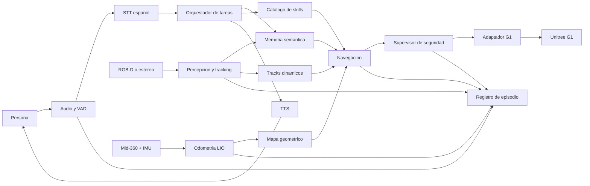

# Diseno propio de un G1 agentico

Ultima modificacion: 2026-06-11 12:04:30 -05 -0500

## Objetivo

Este directorio propone una arquitectura propia para un Unitree G1 capaz de escuchar,
ver, localizar, recordar, navegar, hablar y ejecutar instrucciones con limites de
seguridad verificables. La propuesta usa DimOS como caso de estudio y posible fuente
de componentes, no como plantilla que deba copiarse.

La investigacion se apoyo en:

- el codigo de DimOS en el commit `06606d6f6ab767b659c597cc5bfe8e2a4eb56525`;
- la documentacion previa en `../analisis_g1_real_dimos/`;
- papers, repositorios oficiales, documentacion de fabricantes y especificaciones
  consultadas el 2026-06-11.

No se ejecuto ningun blueprint ni comando de control del robot.

## Como leer las afirmaciones

Cada documento diferencia cuatro niveles:

- **Hecho confirmado:** comportamiento observado directamente en el codigo o en una
  fuente primaria.
- **Inferencia tecnica:** consecuencia razonable del diseno, que todavia debe
  verificarse en hardware.
- **Propuesta propia:** decision arquitectonica recomendada para el nuevo sistema.
- **Candidato experimental:** tecnologia que solo debe adoptarse si supera un
  benchmark definido.

## Resumen ejecutivo

DimOS ya contiene bloques valiosos: modulos con streams tipados, composicion por
blueprints, FAST-LIO2, optimizacion de grafo, analisis de terreno, planificacion,
MCP, skills, YOLO/YOLOE, memoria visual, control G1 por WebRTC y DDS, Rerun y una
base de audio. El problema principal no es que falten todos los algoritmos, sino que
las capacidades reales del G1 estan repartidas entre stacks que no forman un unico
camino operacional.

La arquitectura propuesta conserva las ideas de modularidad, contratos tipados,
reproduccion y adaptadores de hardware, pero cambia la organizacion:

1. Un **plano de datos de tiempo real** procesa sensores, localizacion, mapas,
   tracking, navegacion y control sin depender del LLM.
2. Un **plano cognitivo** interpreta instrucciones, consulta memoria y emite tareas
   de alto nivel. No publica velocidades ni comandos articulares.
3. Un **supervisor determinista de seguridad** es la unica puerta hacia el G1.
4. La geometria persistente, el costmap local, los tracks dinamicos y la memoria
   semantica se almacenan en capas distintas.
5. Cada episodio se graba con datos sincronizados, eventos, decisiones y recursos
   para poder reproducirlo y evaluarlo.

## Arquitectura propuesta

La comunicacion recomendada es hibrida:

- DDS/ROS 2 para sensores y control con QoS, interoperabilidad y herramientas;
- memoria compartida para imagenes en la misma computadora;
- Protobuf o mensajes ROS/IDL versionados para contratos;
- MCP solo en el limite entre el orquestador y tools de alto nivel;
- PostgreSQL + PostGIS + pgvector para entidades persistentes;
- MCAP para episodios y OpenTelemetry para trazas, metricas y logs correlacionados.

Esta seleccion no declara que ROS 2 sea universalmente superior a LCM. Se recomienda
para este proyecto porque el valor de Nav2, drivers, rosbag/MCAP, QoS y tooling supera
su costo de integracion. Un prototipo que reutilice muchos modulos DimOS puede mantener
LCM internamente detras de bridges.

## Mejoras principales

| Problema observado | Mejora propuesta | Evidencia de mejora |
|---|---|---|
| Agente, navegacion y deteccion G1 separados | Contrato unico `TaskGoal` y adaptadores independientes | tasa de tareas cerradas extremo a extremo |
| LLM puede invocar movimiento directo | Skills declarativas y supervisor de seguridad | cero comandos fuera de limites y menor intervencion humana |
| Memoria centrada en frames | Entidades con posicion, covarianza, historial y TTL | precision de consultas y error 3D |
| Personas pueden contaminar mapas | Capas persistente/local/dinamica separadas con decay y clearing | tiempo de desaparicion de rastros y falsas paredes |
| Observabilidad orientada a visualizacion | Registro causal completo por episodio | porcentaje de fallos reproducibles |
| Seleccion de modelos por popularidad | Benchmarks en hardware objetivo | latencia, recall, VRAM, energia y exito de tarea |

## Tecnologias recomendadas

La recomendacion inicial, sujeta a las puertas de evaluacion, es:

- **Localizacion:** mantener FAST-LIO2 como baseline; usar el PGO existente o evaluar
  RTAB-Map/FAST-LIVO2 solo si deriva, relocalizacion o degradacion visual lo justifican.
- **Mapa operacional:** voxel/altura local con decay para navegacion; mapa global
  separado; TSDF solo para reconstruccion o manipulacion futura.
- **Vision:** detector cerrado pequeno para personas y clases frecuentes; YOLOE como
  primer candidato open-vocabulary; Grounding DINO como baseline de mayor costo;
  SAM 2 solo cuando una mascara mejore de forma medible la proyeccion 3D.
- **Tracking:** ByteTrack para baseline ligero; BoT-SORT con ReID cuando las
  oclusiones e identidades sean importantes.
- **Profundidad:** RGB-D/estereo como fuente primaria; profundidad monocular como
  respaldo o prior, nunca como unica evidencia metrica de seguridad.
- **Navegacion:** probar primero el stack DimOS ya disponible; comparar con Nav2
  MPPI en el mismo G1 y escenarios, no migrar por reputacion.
- **Voz:** Silero VAD + faster-whisper configurado para espanol; TTS remoto como
  baseline de calidad y Piper local como modo degradado, revisando su licencia.
- **Agente:** LangGraph o una maquina de estados equivalente con estado durable;
  MCP para discovery/invocacion, mas un gateway propio de politicas.
- **Datos:** PostgreSQL/PostGIS/pgvector para memoria y MCAP para episodios.

## Componentes reutilizables

Se pueden reutilizar responsablemente, despues de aislar dependencias y verificar
licencias:

- mensajes, streams y contratos tipados de DimOS;
- wrapper FAST-LIO2 y configuracion Mid-360;
- PGO, terrain analysis y planificadores como baselines;
- adaptadores Unitree WebRTC/DDS y estados de control;
- MCP server/client como referencia de integracion;
- detectores y conversion 2D a 3D como punto de partida;
- Rerun para depuracion local.

No conviene reutilizar sin redisenar:

- el movimiento directo expuesto al LLM;
- la memoria de frames como memoria de entidades;
- nombres de streams como unico mecanismo de wiring;
- dos autoridades simultaneas de `cmd_vel`;
- supuestos de TF repartidos entre `world`, `map`, `body`, `base_link` y camara;
- estado del agente mantenido solo en memoria de proceso.

## Componentes propios

El aporte de ingenieria y posible aporte academico se concentra en:

- contratos versionados de tarea, evidencia, entidad y resultado;
- gateway de skills con precondiciones, permisos, timeout e idempotencia;
- supervisor de seguridad y arbitraje de autoridades;
- memoria semantica espaciotemporal con incertidumbre y fision/fusion de tracks;
- separacion formal de mapas persistentes, mapas locales y objetos dinamicos;
- grounding semantico que convierte lenguaje en un goal geometrico verificable;
- protocolo de evaluacion reproducible sim-real y registro causal del episodio.

## MVP

El MVP debe completar, en un almacen controlado:

1. detectar una frase en espanol;
2. transcribirla;
3. clasificar la intencion y pedir aclaracion si es ambigua;
4. consultar mapa y memoria;
5. resolver un objeto o lugar a una region alcanzable;
6. navegar con una unica autoridad de velocidad;
7. mantener distancia a personas;
8. verificar llegada o fallo;
9. responder por voz;
10. guardar el episodio completo.

Quedan fuera del MVP: manipulacion, locomocion-manipulacion, whole-body avanzado,
aprendizaje online que cambie control, y operacion autonoma en espacios publicos.

## Roadmap resumido

| Fase | Resultado verificable |
|---|---|
| 0. Instrumentacion | dataset de sensores, TF y latencias reproducible |
| 1. Base geometrica | LIO, mapa, relocalizacion y navegacion sin agente |
| 2. Dinamica humana | tracks, clearing, zonas y parada segura |
| 3. Memoria | entidades persistentes y consultas espacio-temporales |
| 4. Voz y agente | instruccion a tarea declarativa, sin control directo |
| 5. Integracion | MVP extremo a extremo y modo degradado sin red |
| 6. Paper | baselines, ablaciones, sim-real y analisis estadistico |

## Riesgos principales

- conflicto entre high-level y low-level control del G1;
- calibracion o sincronizacion insuficiente entre lidar, IMU y camara;
- falsa confianza en profundidad monocular o detecciones abiertas;
- latencia variable del LLM y de servicios remotos;
- identities switches en personas y objetos;
- loop closures incorrectos que mueven el mapa;
- licencias incompatibles con el uso previsto;
- benchmark pequeno que favorezca accidentalmente una tecnologia.

## Orden de lectura

1. [Alcance y metodologia](00_metodologia/alcance_y_metodologia.md)
2. [Glosario](00_metodologia/glosario.md)
3. [Arquitectura actual de DimOS](01_diagnostico_dimos/arquitectura_actual.md)
4. [Brechas y reutilizacion](01_diagnostico_dimos/brechas_y_reutilizacion.md)
5. [Vision general propuesta](02_arquitectura_propuesta/vision_general.md)
6. [Contratos, despliegue y fallos](02_arquitectura_propuesta/contratos_despliegue_y_fallos.md)
7. [Diagramas](02_arquitectura_propuesta/diagramas.md)
8. [Agente y orquestacion](03_agente_y_voz/agente_y_orquestacion.md)
9. [Voz e interaccion](03_agente_y_voz/voz_e_interaccion.md)
10. [Percepcion visual](04_percepcion_y_mapeo/percepcion_visual.md)
11. [Lidar, SLAM y reconstruccion](04_percepcion_y_mapeo/lidar_slam_y_reconstruccion.md)
12. [Personas y entornos dinamicos](04_percepcion_y_mapeo/personas_y_entornos_dinamicos.md)
13. [Memoria semantica](05_memoria_y_navegacion/memoria_semantica.md)
14. [Navegacion](05_memoria_y_navegacion/navegacion.md)
15. [Control y seguridad](06_control_y_observabilidad/control_g1_y_seguridad.md)
16. [Observabilidad y datos](06_control_y_observabilidad/observabilidad_y_datos.md)
17. [Evaluacion y paper](07_evaluacion_y_roadmap/evaluacion_y_paper.md)
18. [MVP y roadmap](07_evaluacion_y_roadmap/mvp_y_roadmap.md)
19. [Matrices centrales](08_trazabilidad/matrices.md)
20. [Decisiones tecnicas](08_trazabilidad/decisiones_tecnicas.md)
21. [Fuentes](08_trazabilidad/fuentes.md)

## Relacion con un futuro paper

La hipotesis publicable no debe ser "un LLM controla un humanoide". Una formulacion
mas defendible es: una arquitectura con memoria de entidades, grounding verificable,
capas dinamicas y arbitraje determinista mejora la finalizacion segura y reproducible
de tareas semanticas en un humanoide real frente a baselines sin esas capas.

Los documentos de [evaluacion](07_evaluacion_y_roadmap/evaluacion_y_paper.md) y
[trazabilidad](08_trazabilidad/matrices.md) convierten esa idea en experimentos,
metricas y ablaciones.
