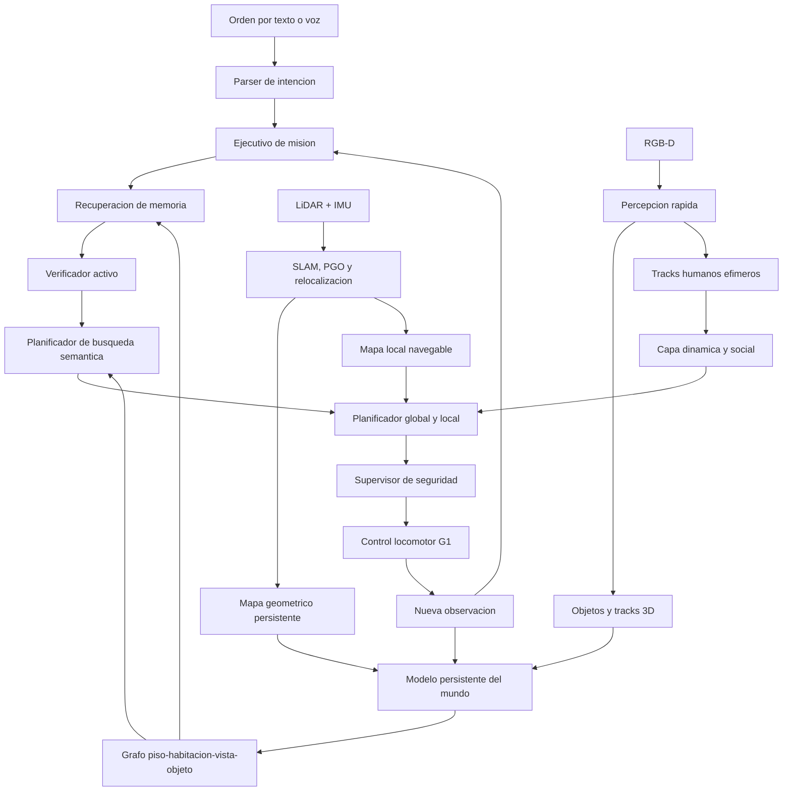

# Yanapaq: memoria semantica activa y navegacion persistente para Unitree G1

Ultima modificacion: 2026-06-12 16:23:07 -05 -0500

Estado: diseno tecnico y protocolo experimental. Las cifras de aceptacion
indicadas en este documento son metas de ingenieria y no resultados medidos.

## 1. Idea central

Yanapaq sera un sistema de navegacion semantica persistente para un humanoide
Unitree G1 que operara durante varias sesiones en oficinas y otros interiores
conocidos, pero cambiantes. Su tarea principal no sera solamente llegar a una
coordenada, sino comprender una instruccion, recuperar conocimiento previo,
comprobar si ese conocimiento sigue vigente, navegar de forma segura y
confirmar visualmente el resultado.

La pregunta que resolvera es:

> Como puede un G1 recordar habitaciones y objetos entre sesiones, aprovechar
> ese recuerdo cuando el entorno no cambio y corregirlo eficientemente cuando
> personas u objetos fueron movidos?

La contribucion propuesta es una **memoria semantica activa de varias escalas
temporales**. El robot no tratara todo lo observado de la misma forma:

- paredes, columnas y puertas estructurales seran conocimiento persistente;
- mesas y estantes seran elementos semiestaticos;
- sillas, cajas y loncheras seran objetos movibles con historial;
- las personas seran actores dinamicos efimeros, nunca paredes permanentes;
- una memoria antigua se verificara solo cuando pueda cambiar la mision o la
  ruta.

Esta ultima propiedad, la **verificacion condicionada por relevancia**, evita
dos extremos: confiar ciegamente en un mapa antiguo o volver a explorar todo el
edificio antes de cada tarea.

## 2. Caso de uso principal

El escenario objetivo es una oficina de varias habitaciones en la que el G1
recibe ordenes como:

- "Navega hasta encontrar la cocina y busca la lonchera azul".
- "Revisa si la lonchera azul sigue en la cocina".
- "Ve a la impresora que esta cerca de la sala de reuniones".
- "Busca una caja roja; ayer estaba en el almacen".
- "Llevame a una sala libre sin entrar al pasillo ocupado".

Durante la primera orden, el robot explora, identifica habitaciones y registra
la entidad encontrada. En sesiones posteriores consulta la memoria antes de
explorar. Si la evidencia sigue vigente, navega directamente. Si el objeto no
esta donde se esperaba, invalida solamente esa hipotesis y reanuda una busqueda
dirigida.

Yanapaq sera especialmente util en:

- inspeccion recurrente de oficinas, almacenes y laboratorios;
- busqueda de objetos que cambian de lugar;
- verificacion de inventario visual;
- guia de personas hacia lugares u objetos;
- patrullaje semantico con memoria entre turnos;
- asistencia en entornos donde muebles y personas alteran rutas habituales.

No se plantea inicialmente manipulacion, reconocimiento facial, escaleras,
multitud densa ni operacion publica sin supervision.

## 3. Principios de diseno

1. **La geometria local manda.** La memoria semantica sugiere donde buscar,
   pero el LiDAR y la percepcion actual deciden por donde se puede caminar.
2. **Una observacion no es una verdad eterna.** Cada afirmacion conserva
   tiempo, confianza, fuente y periodo de validez.
3. **Ausencia requiere visibilidad.** No detectar un objeto solo cuenta como
   evidencia negativa si su ubicacion esperada estuvo realmente visible y no
   ocluida.
4. **Personas y objetos no comparten ciclo de vida.** Una persona desaparece
   rapidamente del mapa navegable; una silla puede conservar una ultima
   posicion como hipotesis.
5. **Razonamiento lento bajo demanda.** Detectores, tracking y control operan
   continuamente; el VLM se invoca ante una consulta abierta, ambiguedad,
   cambio o verificacion final.
6. **El agente no controla articulaciones ni velocidad directamente.** Un
   ejecutivo determinista convierte la intencion en estados y habilidades
   permitidas.
7. **Toda mision tiene postcondicion.** Llegar a una pose no basta: se debe
   verificar la habitacion, el objeto o la condicion solicitada.
8. **El sistema puede decir "desconocido".** No se fuerza una etiqueta de
   habitacion ni una identidad de objeto cuando la evidencia es insuficiente.

## 4. Arquitectura general



La arquitectura se divide en dos ritmos:

- **Lazo rapido, 10-30 Hz:** localizacion, mapa local, tracking, planificacion,
  control, watchdog y seguridad.
- **Lazo semantico, por eventos:** consulta de memoria, clasificacion de
  habitaciones, deteccion abierta, VLM, verificacion e historial.

El robot puede seguir deteniendose y evitando obstaculos aunque el modelo de
lenguaje, la red o la memoria semantica dejen de responder.

## 5. Representacion del mundo

### 5.1 Capas geometricas

Yanapaq mantendra dos representaciones geometricas diferentes:

1. **Mapa global persistente:** estructura estable usada para localizacion,
   topologia y navegacion entre sesiones.
2. **Mapa local de navegacion:** ocupacion reciente alrededor del robot,
   actualizada mediante ray tracing y decaimiento temporal.

Una silla o persona puede aparecer de inmediato como obstaculo en el mapa
local. Cuando el sensor observa nuevamente el espacio libre, los rayos
eliminan el obstaculo transitorio. Por tanto, ningun actor dinamico queda
convertido indefinidamente en una pared.

La geometria global no se reescribe por una sola discrepancia. Los cambios
estructurales requieren observaciones repetidas desde varios puntos de vista.

### 5.2 Grafo semantico jerarquico

El conocimiento se organizara como:

```text
EDIFICIO
  -> PISO
     -> HABITACION
        -> VISTA
           -> OBJETO
```

Relaciones principales:

```text
CONNECTED_TO(room_a, room_b)
CONTAINS(room, object)
VISIBLE_FROM(object, viewpoint)
NEAR(object_a, object_b)
ON(object, support)
LAST_OBSERVED_AT(object, pose)
BLOCKS(entity, route_segment)
```

Las vistas son importantes porque una coordenada no garantiza observabilidad.
Para verificar una lonchera sobre una mesa se necesita recordar tambien desde
que posicion y orientacion fue visible.

### 5.3 Registro versionado de entidades

Cada entidad persistente tendra al menos:

```text
entity_id
semantic_label
attributes
embedding
mobility_class
mobility_probability
belief_state
pose_mean
pose_covariance
room_id
first_seen
last_seen
confidence
evidence_ids
pose_history
valid_from
valid_until
```

La identidad no dependera solo de la clase. Dos sillas azules deben conservar
identificadores diferentes mediante apariencia, geometria, contexto y
trayectoria.

### 5.4 Clases de movilidad

| Clase | Ejemplos | Tratamiento |
|---|---|---|
| `STATIC` | pared, columna | Persiste; cambio solo con evidencia fuerte |
| `SEMI_STATIC` | mesa, estante | Persiste, pero admite reubicacion poco frecuente |
| `MOVABLE` | silla, caja, lonchera | Conserva ultima pose, historial y caducidad |
| `DYNAMIC` | persona | Track local con velocidad, covarianza y TTL corto |

La clase inicial proviene de conocimiento semantico, pero se adapta con la
experiencia. Si una mesa cambia varias veces de posicion, su probabilidad de
movilidad aumenta y se verifica con mayor frecuencia.

### 5.5 Estados de creencia

| Estado | Significado |
|---|---|
| `HYPOTHESIS` | Observacion unica o ambigua |
| `CONFIRMED` | Evidencia consistente desde varias observaciones |
| `STALE` | La informacion puede haber caducado |
| `MOVED` | La entidad fue asociada a una nueva pose |
| `ABSENT` | La ubicacion anterior fue observada libre |
| `RETIRED` | Entidad no recuperada despues del protocolo de busqueda |

`ABSENT` no significa que el objeto dejo de existir: significa que ya no es
valida la relacion con su pose anterior. El objeto puede reaparecer en otra
habitacion y conservar su identidad e historial.

## 6. Como se actualiza la memoria

### 6.1 Evidencia positiva

Una deteccion actualiza una entidad cuando la asociacion combina:

- compatibilidad de clase y atributos;
- similitud visual;
- proximidad espacial esperada;
- coherencia de tamano y forma;
- continuidad temporal;
- relaciones con habitacion y objetos vecinos.

Si la similitud es insuficiente se crea una hipotesis nueva, sin fusionarla de
manera irreversible.

### 6.2 Evidencia negativa

Para afirmar que un objeto ya no esta en su posicion anterior se comprueba:

1. la pose esperada estaba dentro del campo visual;
2. la profundidad cubria esa distancia;
3. no habia una oclusion por persona, puerta u otro objeto;
4. el detector estaba configurado para la clase solicitada;
5. existieron varias observaciones o una exploracion corta del soporte.

Solo entonces se cierra el intervalo de validez de la pose anterior. Esta
regla evita borrar una lonchera porque quedo detras de una silla o fuera de la
imagen.

### 6.3 Discrepancias geometricas

El mapa local puede cambiar inmediatamente para navegar. La memoria persistente
se modifica con una politica mas conservadora:

- cambio aislado: se registra como posible discrepancia;
- cambio repetido: se eleva la confianza;
- cambio confirmado desde varias vistas: se actualiza la geometria o entidad;
- contradiccion posterior: se conserva el historial y se abre una nueva
  version.

### 6.4 Persistencia entre reinicios

Al iniciar una sesion, el G1:

1. carga el mapa global, grafo semantico y misiones incompletas;
2. se relocaliza contra la geometria persistente;
3. transforma las poses semanticas al marco vigente;
4. marca como inciertas las entidades afectadas por baja calidad de
   relocalizacion;
5. reanuda o cancela de forma segura la mision segun su politica.

La persistencia no consiste solo en abrir una base de datos. Se debe demostrar
que el mismo objeto y habitacion siguen siendo consultables despues de apagar
procesos, mover el robot y volver a localizarlo.

## 7. Clasificacion de habitaciones

La habitacion se infiere a partir de tres fuentes:

- **geometria y topologia:** limites, puertas, conectividad y superficie;
- **contenido:** escritorios, camas, refrigerador, lavadero, estantes;
- **vistas:** descripciones y embeddings de varias observaciones.

El clasificador acumula evidencia:

```text
P(tipo_de_habitacion | geometria, objetos, vistas, contexto)
```

No se decide por una sola imagen. Una mesa no convierte automaticamente un
espacio en comedor y un microondas aislado no garantiza que sea cocina.

Las salidas permitidas son:

- etiqueta principal con confianza;
- etiquetas mixtas, por ejemplo `cocina-comedor`;
- `desconocido`;
- revision posterior cuando aparezca nueva evidencia.

Las habitaciones se segmentan primero por conectividad y puertas. La semantica
se aplica despues; asi, dos oficinas contiguas no se fusionan solo porque
contengan objetos parecidos.

## 8. Verificacion activa

### 8.1 Cuando verificar

No se inspecciona cada objeto antiguo. Para una entidad `e` se estima:

```text
riesgo_obsolescencia(e) =
    probabilidad_movilidad
  x antiguedad_normalizada
  x incertidumbre_de_pose
  x relevancia_para_la_mision
```

La verificacion se activa cuando:

- el objeto es la meta;
- su ultima pose intersecta la ruta propuesta;
- su existencia determina una decision;
- la observacion es demasiado antigua para la clase de movilidad;
- existen contradicciones entre sensores o memoria.

Una silla vieja situada lejos de la ruta no provoca un desvio. La misma silla
en un pasillo estrecho si puede justificar una comprobacion.

### 8.2 Eleccion del punto de vista

Los puntos de verificacion se ordenan con:

```text
utilidad(v, e) =
    probabilidad_de_visibilidad(v, e)
  x ganancia_de_informacion(e)
  - costo_de_desplazamiento(v)
  - riesgo_de_navegacion(v)
```

Primero se intentan vistas conocidas y baratas. Si no son concluyentes se
generan nuevas vistas que reduzcan oclusion o aumenten cobertura.

### 8.3 Que aporta frente a una memoria dinamica convencional

Una memoria dinamica actualiza cuando encuentra un cambio. Yanapaq agregara
la decision de **que merece ser comprobado antes de actuar**. Esto busca
reducir:

- distancia recorrida por revisiones innecesarias;
- fallos por confiar en una pose obsoleta;
- exploracion completa cuando existe una buena hipotesis previa;
- costo de VLM y reconstruccion densa continua.

## 9. Busqueda semantica dirigida

Cuando una memoria falla, la busqueda sigue este orden:

1. ultima pose y mejores vistas conocidas;
2. otros soportes de la misma habitacion;
3. zonas no observadas de esa habitacion;
4. habitaciones semanticamente probables;
5. habitaciones adyacentes;
6. fronteras geometricas restantes.

Los candidatos se puntuan por:

```text
score(region) =
    afinidad_objeto_habitacion
  + relaciones_contextuales
  + probabilidad_historica
  + ganancia_de_informacion
  - costo_de_ruta
  - riesgo_social
  - penalizacion_por_revisita
```

Ejemplo: si una lonchera ya no esta en la cocina, comedor y sala de descanso
se inspeccionan antes que el bano. Si una caja de herramientas desaparece del
almacen, laboratorio y zona de mantenimiento reciben mayor prioridad.

El sistema usa busqueda geometrica por fronteras como respaldo, no como primera
opcion en cada consulta.

## 10. Personas y obstaculos dinamicos

Una persona se representa en el lazo rapido mediante:

```text
track_id_efimero
pose
velocidad
covarianza
ultima_observacion
trayectoria_corta
zona_personal
TTL
```

No se guarda rostro ni identidad persistente. Cuando la persona sale del campo
visual:

- el tracker predice brevemente su movimiento;
- la incertidumbre y zona de seguridad crecen;
- al vencer el TTL, el track desaparece;
- el ray tracing confirma el espacio libre;
- la persona no permanece como obstaculo global.

El planificador local considera distancia, tiempo a colision y direccion de
movimiento. El supervisor puede reducir velocidad, esperar, replanificar o
detenerse. Un VLM puede interpretar una situacion social compleja, pero nunca
es la unica barrera contra una colision.

## 11. Ejecutivo de misiones

Las redes neuronales se usaran donde aportan generalizacion: lenguaje,
deteccion, embeddings, clasificacion abierta y desambiguacion. La ejecucion
fisica se organizara con estados explicitos:

```text
RECEIVED
  -> GROUNDED
  -> RETRIEVING_MEMORY
  -> NAVIGATING
  -> VERIFYING
  -> SEARCHING
  -> SUCCEEDED
```

Estados terminales adicionales:

```text
FAILED
CANCELLED
SAFE_STOP
```

El ejecutivo registra:

- intencion estructurada;
- entidad o habitacion objetivo;
- evidencia usada;
- plan y alternativas;
- habilidad activa;
- timeout y politica de reintento;
- postcondicion;
- causa terminal.

Esto hace posible cancelar, reanudar, reproducir y explicar una mision. La
complejidad neuronal no sustituye estas garantias operativas.

## 12. Flujo completo de una instruccion

Para "revisa si la lonchera azul sigue en la cocina":

1. el parser produce `VERIFY(object=lonchera azul, room=cocina)`;
2. el grafo recupera candidatos y su historial;
3. si existe un candidato confirmado, se calcula su vigencia;
4. el planificador selecciona la mejor vista conocida;
5. el robot navega usando geometria actual, no la ocupacion historica;
6. el detector abierto busca la lonchera;
7. un verificador visual confirma atributos y contexto;
8. si aparece, se actualizan `last_seen`, pose y confianza;
9. si no aparece y la vista fue valida, la pose anterior pasa a `ABSENT`;
10. se exploran primero cocina, comedor y habitaciones relacionadas;
11. si aparece en la sala, se crea una nueva version de pose y relacion
    `CONTAINS`;
12. la mision termina solo al verificar el objeto o agotar el presupuesto.

Respuesta explicable:

> "La lonchera ya no estaba en la cocina. La encontre en la sala, sobre la
> mesa lateral, y actualice su ultima ubicacion."

## 13. Ejemplos de funcionamiento

### A. La lonchera no cambio

En la primera sesion el robot explora la cocina y registra la lonchera azul,
su mesa y dos vistas utiles. En la segunda sesion navega directamente a la
vista mas barata, verifica el objeto y termina. No explora el edificio.

### B. La lonchera fue movida

La pose antigua se observa libre. El sistema no borra la entidad: cierra la
pose anterior y busca dentro de la cocina. Luego prioriza sala de descanso y
comedor. Al encontrarla, conserva ambas ubicaciones como historial.

### C. Una silla bloqueaba el pasillo

Durante la ida, una silla ocupaba la ruta optima y el planificador eligio un
desvio. Horas despues la memoria conserva que la silla es movible. Si una
nueva mision necesita ese pasillo, el robot obtiene visibilidad del segmento.
Si esta libre, elimina el obstaculo local y usa la ruta corta. Si la ruta no
era relevante, no realiza una inspeccion especial.

### D. Una persona se aparta

Una persona cruza frente al G1. El mapa local la incorpora, el robot reduce
velocidad y espera. Cuando la persona sale y los sensores observan espacio
libre, el track vence y la ruta se reabre. No queda ningun rastro solido en el
mapa global.

### E. Una mesa cambia de lugar

La mesa es semiestatica, por lo que una sola deteccion contradictoria no
reescribe el edificio. Varias vistas confirman el movimiento; se actualiza su
pose, se revisan objetos asociados y se conserva la version anterior para
auditoria.

### F. Dos loncheras azules

El robot recupera dos candidatos. Usa tamano, etiquetas, soporte, apariencia y
habitacion. Si la instruccion sigue siendo ambigua, solicita una aclaracion o
presenta las alternativas en vez de elegir silenciosamente.

### G. Habitacion mixta

Un ambiente contiene refrigerador, mesa y escritorios. El sistema mantiene
`cocina-oficina` con confianza distribuida. Una orden "ve a la cocina" puede
resolverse por contenido y topologia sin forzar una etiqueta falsa.

### H. Reinicio entre sesiones

El robot se apaga en otro punto del edificio. Al volver, se relocaliza, carga
el grafo y transforma las entidades al marco vigente. La orden sobre la
lonchera usa la memoria anterior, pero aumenta la incertidumbre si la
relocalizacion fue debil.

### I. Falso negativo por oclusion

La lonchera esta detras de una caja. El detector no la encuentra, pero el
analisis de profundidad marca la zona como ocluida. La memoria queda `STALE`,
no `ABSENT`, y se selecciona una vista lateral.

### J. Puerta cerrada

La habitacion objetivo sigue siendo correcta, pero la ruta recordada esta
bloqueada por una puerta. El mapa local obliga a replanificar; el grafo busca
otra conexion. La semantica nunca obliga a atravesar geometria ocupada.

### K. Cambio irrelevante

Varias sillas fueron movidas en una sala que no pertenece a la mision ni
intersecta la ruta. Se registran al observarlas naturalmente, pero no generan
un recorrido de inspeccion.

### L. Perdida del servicio semantico

Si falla el VLM durante la marcha, el ejecutivo no improvisa comandos. El G1
completa una detencion controlada o continua solamente una habilidad ya
autorizada que mantenga sus postcondiciones y watchdog.

## 14. Decisiones frente al estado del arte

| Trabajo | Idea que se aprovecha | Cambio propuesto en Yanapaq |
|---|---|---|
| FSR-VLN | Jerarquia piso-habitacion-vista-objeto y razonamiento rapido-lento | Hacerla persistente, versionada y sensible a cambios |
| MIF | Actualizacion local disparada por discrepancias en G1 | Evitar depender de una representacion densa continua y evaluar reinicios, busqueda y personas |
| DynaMem y DovSG | Memoria que incorpora objetos movidos, agregados o retirados | Anadir vigencia, evidencia negativa, habitaciones y verificacion segun impacto |
| DREAM | Memoria acotada, relocalizacion y verificacion multimodal | Llevar el ciclo a un G1 y medir costo de revisiones innecesarias |
| MCNav | Revalidacion de metas y reexploracion de zonas conocidas | Extender de errores dentro de un episodio a cambios fisicos entre sesiones |
| Active Semantic Perception | Seleccion de vistas por ganancia de informacion | Condicionar la ganancia por antiguedad, movilidad, ruta y mision |
| SCOUT | Razonamiento relacional eficiente para busqueda | Incorporar relaciones a la busqueda real y al historial de ubicaciones |
| IntentNav | Seleccion semantica de fronteras con memoria espacial-visual | Usarla como opcion de ranking, manteniendo planificacion y seguridad explicitas |
| HA-VLN y HuNavSim 2.0 | Escenarios y metricas con multiples personas | Evaluar seguridad social separada de la memoria de objetos |

### Lo que no conviene copiar literalmente

- reconstruccion fotorealista continua si exige una GPU externa grande;
- VLM en cada frame o como controlador de velocidad;
- escena estatica preconstruida sin historial de cambios;
- objeto "permanente" que nunca caduca;
- borrado por una sola no-deteccion;
- persona elegida como la caja mas grande con profundidad asumida;
- exploracion completa ante toda consulta;
- una unica metrica de exito que mezcle grounding, navegacion y seguridad.

### Optimizacion propuesta

1. deteccion cerrada y tracking continuo para personas y clases frecuentes;
2. deteccion abierta solo por consulta o evento;
3. embeddings compactos para recuperacion inicial;
4. VLM solo para candidatos ambiguos y verificacion final;
5. grafo disperso para razonamiento y voxeles para colision;
6. historial resumido, conservando evidencia clave;
7. actualizaciones locales en lugar de reconstruir todo el mapa;
8. verificacion solo si el valor esperado supera su costo;
9. inferencia critica a bordo y servicios remotos opcionales;
10. degradacion segura si desaparece cualquier componente semantico.

## 15. Componentes del sistema

### Componentes que deben mantenerse simples y deterministas

- sincronizacion de sensores y transformaciones;
- SLAM LiDAR-inercial, cierre de lazo y relocalizacion;
- mapa voxelado con ray tracing;
- costmap, A*, replanning y control de trayectoria;
- arbitraje de movimiento;
- watchdog, cancelacion y parada;
- maquina de estados y persistencia transaccional;
- evaluacion de campo visual y oclusion geometrica.

### Componentes aprendidos

- detector de personas y objetos;
- segmentacion abierta;
- embeddings visuales y textuales;
- clasificacion multimodal de habitaciones;
- asociacion por apariencia;
- desambiguacion mediante VLM;
- ranking semantico de regiones o fronteras.

### Componentes nuevos de Yanapaq

```text
PersistentWorldModel
RoomGraphBuilder
EntityLifecycleManager
MobilityEstimator
EvidenceManager
ActiveVerifier
SemanticSearchPlanner
DynamicActorTracker
MissionExecutive
TaskPostconditionVerifier
```

La primera integracion debe unificar navegacion, percepcion y habilidades en
un solo flujo ejecutable. No sirve tener un stack que navega y otro que
comprende lenguaje si no comparten estados, marcos y postcondiciones.

## 16. Escenarios de evaluacion

| ID | Escenario | Cambio introducido | Comportamiento esperado |
|---|---|---|---|
| S1 | Objeto estable | Ninguno | Recuperacion directa y verificacion corta |
| S2 | Objeto reubicado | Misma habitacion | Cerrar pose anterior y encontrar nueva pose |
| S3 | Objeto reubicado | Otra habitacion | Busqueda jerarquica sin explorar todo |
| S4 | Objeto retirado | Fuera del entorno | Evidencia negativa y terminacion explicable |
| S5 | Objeto agregado | Nueva instancia | Crear entidad sin fusion incorrecta |
| S6 | Silla en ruta | Bloqueo temporal | Desvio y posterior reapertura |
| S7 | Silla fuera de ruta | Cambio irrelevante | No gastar verificacion activa |
| S8 | Persona cruzando | Movimiento transversal | Reducir velocidad o esperar sin dejar fantasma |
| S9 | Persona ocluida | Perdida temporal | Prediccion corta y aumento de incertidumbre |
| S10 | Habitacion ambigua | Uso mixto | Etiqueta mixta o desconocida |
| S11 | Objetos duplicados | Misma clase/color | Mantener identidades y pedir aclaracion |
| S12 | Reinicio | Nueva pose inicial | Relocalizar y recuperar memoria |
| S13 | Deriva corregida | Cambio del marco | Corregir entidades con el pose graph |
| S14 | Puerta cerrada | Conexion bloqueada | Replanificar por otra ruta |
| S15 | Oclusion de meta | Falso negativo potencial | Cambiar de vista antes de invalidar |
| S16 | Fallo del VLM | Servicio no disponible | Degradacion o parada segura |
| S17 | Perdida de localizacion | Pose no confiable | Detener, relocalizar y reanudar |
| S18 | Orden cancelada | Interrupcion humana | Detencion confirmada y estado `CANCELLED` |

Cada escenario debe ejecutarse con ordenes equivalentes pero no identicas para
evitar que el resultado dependa de una frase memorizada.

## 17. Protocolo experimental recomendado

### 17.1 Entorno real

- una oficina real de 4-8 habitaciones;
- pasillos, puertas estrechas y zonas compartidas;
- 8-12 objetos objetivo de distinta movilidad;
- 2-4 personas instruidas para cruces reproducibles;
- sesiones separadas por reinicio y cambios manuales;
- al menos 10 repeticiones por condicion principal;
- registro de exitos y fallos sin descartar episodios.

La prueba principal debe incluir tres momentos:

1. **mapeo inicial:** descubrimiento de habitaciones y objetos;
2. **cambio:** reubicacion, retiro, adicion o bloqueo;
3. **consulta posterior:** verificacion o busqueda tras reinicio.

### 17.2 Comparadores internos

1. mapa geometrico y recuperacion visual sin memoria de entidades;
2. memoria semantica estatica;
3. memoria dinamica sin verificacion activa;
4. sistema completo sin jerarquia de habitaciones;
5. sistema completo sin prior de movilidad;
6. Yanapaq completo.

Estas ablaciones permiten demostrar de donde proviene la mejora. Comparar solo
contra un baseline debil no seria suficiente.

### 17.3 Benchmarks externos

| Capacidad | Benchmark o protocolo | Uso |
|---|---|---|
| Navegacion persistente | GOAT-Bench | Memoria y multiples metas |
| Lenguaje jerarquico | LangMap | Piso, habitacion, objeto y atributos |
| ObjectNav | HM3D v1/v2 | Comparacion de busqueda y reexploracion |
| Razonamiento relacional | SymSearch | Seleccion de regiones y relaciones |
| Grafo 3D abierto | Clio/ASHiTA | Objetos, regiones y task grounding |
| Navegacion humanoide | VLN-PE | Efecto del embodiment |
| Personas dinamicas | HA-VLN | Exito con restricciones humanas |
| Navegacion social | HuNavSim 2.0 | Escenarios reproducibles y metricas |
| Comprension social | SocialNav-SUB | Razonamiento visual sobre personas |

Los resultados externos deben presentarse por capacidad. No se debe afirmar
que un porcentaje de retrieval, una tasa de reubicacion y un exito de
navegacion extremo a extremo son directamente equivalentes.

## 18. Metricas

### Mision completa

- `Task Success Rate`;
- `Grounded Success Rate`;
- `SPL` y `SCT`;
- tiempo y distancia total;
- porcentaje de postcondiciones verificadas;
- recuperaciones exitosas despues de fallo.

### Memoria dinamica

- `Recall@1` antes y despues de reinicio;
- exito de reubicacion, retiro y adicion;
- tasa de recuerdos obsoletos usados como verdad;
- precision de `ABSENT`;
- error de asociacion y duplicados;
- latencia de actualizacion;
- memoria RAM, VRAM y almacenamiento.

### Verificacion activa

- tasa de cambios relevantes detectados;
- distancia y tiempo de verificacion;
- revisiones innecesarias por mision;
- fallos evitados por revalidacion;
- costo de VLM por mision;
- ganancia frente a verificar todo y frente a no verificar.

### Habitaciones

- `Room-F1`;
- exactitud de limites y conectividad;
- calibracion de confianza;
- precision de rechazo `desconocido`;
- exito de objeto-en-habitacion.

### Navegacion con personas

- colisiones y near misses;
- distancia minima y percentil 5;
- tiempo a colision minimo;
- intrusiones de espacio personal;
- tiempo de espera;
- oscilaciones y bloqueos;
- exito en cruces y puertas.

### Operacion

- latencia p50/p95 de percepcion, consulta y plan;
- frecuencia efectiva del lazo rapido;
- consumo de CPU, GPU, VRAM y energia;
- latencia hasta comando cero;
- movimiento no autorizado;
- tasa de misiones recuperadas tras reinicio.

## 19. Metas de aceptacion iniciales

Estas son metas de desarrollo, no resultados:

| Capacidad | Meta inicial |
|---|---|
| Objeto sin cambios | >= 90% de verificacion correcta |
| Reubicacion | >= 80% de recuperacion |
| Eliminacion | >= 90% de poses antiguas invalidadas correctamente |
| Reinicio | >= 90% de entidades recuperables |
| Habitaciones | `Room-F1 >= 0.80` con clase desconocida |
| Fantasma dinamico | desaparicion del costmap <= 2 s tras espacio libre confirmado |
| Colisiones humanas | 0 en el protocolo controlado |
| Movimiento sin autoridad | 0 |
| Parada | p95 dentro del limite medido del laboratorio |

Las metas se ajustaran despues del baseline. No deben convertirse
retroactivamente en resultados ni ocultar intervalos de confianza.

## 20. Ablaciones esenciales para un short paper

Si el espacio del paper es limitado, las cuatro comparaciones de mayor valor
son:

1. memoria estatica contra memoria versionada;
2. memoria versionada sin verificacion activa contra Yanapaq completo;
3. busqueda plana contra jerarquia habitacion-vista-objeto;
4. mapa dinamico geometrico contra separacion objeto-persona con TTL.

La tabla principal puede usar:

```text
SR | SPL | Recall@1-restart | Relocation | Stale-use
Unnecessary-checks | Room-F1 | Min-distance | Stop-p95
```

La hipotesis principal sera:

> La verificacion selectiva de memoria movible reduce fallos por informacion
> obsoleta con menor distancia y costo que verificar todo el mapa, manteniendo
> seguridad ante personas en un G1 real.

## 21. Plan de implementacion

### Fase 0. Flujo seguro integrado

- contratos de mision y eventos;
- ejecutivo de estados;
- arbitro de movimiento y watchdog;
- navegacion por pose con cancelacion;
- replay sin salida fisica.

### Fase 1. Geometria persistente

- SLAM, cierre de lazo y mapa global;
- ray tracing y mapa local;
- relocalizacion tras reinicio;
- navegacion y exploracion por fronteras.

### Fase 2. Grafo de habitaciones y objetos

- deteccion 3D abierta;
- segmentacion de habitaciones;
- vistas y relaciones;
- persistencia de evidencia;
- consultas por texto.

### Fase 3. Ciclo de vida dinamico

- clases de movilidad;
- historial de poses;
- estados `STALE`, `MOVED`, `ABSENT`;
- evidencia negativa con oclusion;
- asociacion y desduplicacion.

### Fase 4. Verificacion y busqueda activa

- utilidad de puntos de vista;
- relevancia de ruta y mision;
- reexploracion jerarquica;
- verificacion final;
- explicacion del resultado.

### Fase 5. Personas y evaluacion

- tracking 3D multi-persona;
- prediccion corta y zonas sociales;
- escenarios HA-VLN/HuNavSim;
- benchmark real multisesion;
- ablaciones, perfiles y reporte de fallos.

## 22. Riesgos y mitigaciones

| Riesgo | Mitigacion |
|---|---|
| Deriva de localizacion corrompe objetos | Pose graph, covarianza y relocalizacion antes de consultar |
| Detecciones duplicadas | Asociacion multimodal e hipotesis reversibles |
| Borrado por falso negativo | Prueba de visibilidad y varias observaciones |
| Costo excesivo del VLM | Activacion por eventos y fast-to-slow |
| Persona persiste en mapa | Track efimero, TTL y ray tracing |
| Cambio real se elimina demasiado pronto | Separar costmap local de memoria persistente |
| Clasificacion errada de cuarto | Evidencia multivista y clase desconocida |
| Comparacion SOTA injusta | Protocolos comunes y resultados por componente |
| Fallo remoto durante movimiento | Supervisor local, watchdog y estado seguro |
| Arquitectura demasiado amplia | Priorizar busqueda persistente; manipulacion queda fuera |

## 23. Afirmacion cientifica defendible

Yanapaq no debe presentarse como otro sistema que "crea un mapa semantico":
esa capacidad ya existe. Tampoco basta con demostrar que una entidad movida se
actualiza.

La contribucion defendible es:

> Un sistema de navegacion semantica multisesion para Unitree G1 que representa
> por separado estructura, objetos movibles y personas; decide activamente que
> recuerdos verificar segun su impacto en la tarea y la ruta; y recupera la
> busqueda cuando la realidad contradice la memoria.

Su ventaja esperada no sera ganar todos los benchmarks de navegacion. Sera
mostrar, bajo el mismo protocolo, que:

- llega rapido cuando la memoria sigue correcta;
- no falla silenciosamente cuando la memoria quedo obsoleta;
- no revisa cambios irrelevantes;
- no conserva personas como paredes;
- reconoce habitaciones y relaciones utiles;
- sobrevive a reinicios y correcciones de pose;
- termina cada mision con evidencia verificable.

## 24. Referencias principales

[1] X. Zhou et al., ["FSR-VLN: Fast and Slow Reasoning for Vision-Language
Navigation with Hierarchical Multi-modal Scene
Graph"](https://arxiv.org/abs/2509.13733), 2025.

[2] P. Jiang et al., ["Learning to Evolve: Multi-modal Interactive Fields for
Robust Humanoid Navigation in Dynamic
Environments"](https://arxiv.org/abs/2605.21935), 2026.

[3] P. Liu et al., ["DynaMem: Online Dynamic Spatio-Semantic Memory for Open
World Mobile Manipulation"](https://arxiv.org/abs/2411.04999), ICRA 2025.

[4] Z. Yan et al., ["Dynamic Open-Vocabulary 3D Scene Graphs for Long-Term
Language-Guided Mobile
Manipulation"](https://arxiv.org/abs/2410.11989), RA-L 2025.

[5] Z. Yan et al., ["Dynamic Resilient Spatio-Semantic Memory with Hybrid
Localization for Mobile
Manipulation"](https://arxiv.org/abs/2606.00576), 2026.

[6] J. Li et al., ["MCNav: Memory-Aware Dynamic Cognitive Map for Zero-shot
Goal-oriented Navigation"](https://arxiv.org/abs/2605.19594), 2026.

[7] H. Tang and P. Chaudhari, ["Active Semantic
Perception"](https://arxiv.org/abs/2510.05430), 2025/2026.

[8] D. Maggio et al., ["FOUND-IT: Foundation-model-first Task-driven 3D Scene
Graphs with Granularity on Demand"](https://arxiv.org/abs/2605.25371), 2026.

[9] I. Mahdi et al., ["Relational Semantic Reasoning on 3D Scene Graphs for
Open-World Interactive Object Search"](https://arxiv.org/abs/2603.05642),
2026.

[10] Y. Dong et al., ["HA-VLN 2.0: An Open Benchmark and Leaderboard for
Human-Aware Navigation in Discrete and Continuous Environments with Dynamic
Multi-Human Interactions"](https://arxiv.org/abs/2503.14229), 2025.

[11] M. Escudero-Jimenez et al., ["HuNavSim 2.0: An Enhanced Human Navigation
Simulator for Human-Aware Robot Navigation"](https://arxiv.org/abs/2507.17317),
2025.

[12] M. J. Munje et al., ["SocialNav-SUB: Benchmarking VLMs for Scene
Understanding in Social Robot
Navigation"](https://arxiv.org/abs/2509.08757), 2025.

[13] M. Khanna et al., ["GOAT-Bench: A Benchmark for Multi-Modal Lifelong
Navigation"](https://openaccess.thecvf.com/content/CVPR2024/html/Khanna_GOAT-Bench_A_Benchmark_for_Multi-Modal_Lifelong_Navigation_CVPR_2024_paper.html),
CVPR 2024.

[14] B. Miao et al., ["LangMap: A Human-Verified Benchmark for Hierarchical
Open-Vocabulary Goal Navigation"](https://arxiv.org/abs/2602.02220), 2026.

[15] Y. Cai et al., ["IntentNav: Learning Spatial-Visual Object Navigation from
Human Demonstrations"](https://arxiv.org/abs/2606.08029), 2026.
